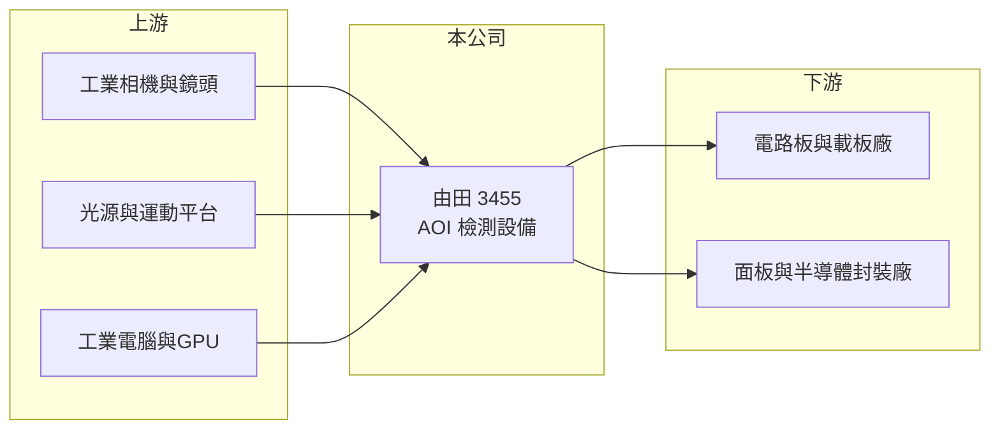

# 3455 由田

> 上櫃｜[[產業索引-光電業|光電業]]｜上市（櫃）日期 2007/12/27

# 第一章：企業模式與商業藍圖

> [!info] 撰寫說明
> 精簡版，由 Claude 依公開資料整理，架構比照 [[2330台積電]]，資料截至 2026-10-07。來源：nstock.tw 由田公司概況、winvest.tw 營收快訊。公開資料有限，營收比重與客戶未查到，應用領域屬推估。#待校對

由田是台灣老牌的自動光學檢測設備廠，毛利率高，但營收跟著客戶的設備投資週期起伏。

- **核心業務：** 由田成立於 1992 年，專門研發、製造與銷售[[AOI]]系統及設備，用相機與影像演算法取代人工目檢，找出產品的缺陷。
- **營收結構：** 本次未查到應用別比重；一般認為客戶以印刷電路板、IC 載板與面板廠為主，近年延伸到半導體與[[先進封裝]]檢測（推估）。
- **營運據點：** 生產與服務據點本次未查到；客戶多集中在台灣與中國的電子製造聚落（推估）。
- **長期方向：** AI伺服器帶動高階載板與先進封裝擴產，檢測精度要求提高，由田的成長取決於能否打進這些高階製程的檢測設備名單（推估）。

# 第二章：護城河深度與競爭優勢

由田的護城河來自[[機器視覺]]演算法與長年累積的缺陷資料庫，表現在接近六成的毛利率。

- **競爭優勢：** 檢測設備必須針對客戶的產品與製程客製化調校，導入後客戶通常沿用同一家設備以維持檢測標準一致，轉換成本較高。
- **主要對手：** 國際有以色列奧寶（Orbotech，KLA 旗下，[[KLAC科磊]]）等大廠，國內與中國也有多家 AOI 設備商以價格競爭。
- **觀察重點：** 2026 年累計營收年減兩成後，下半年接單能否回溫，以及半導體與先進封裝相關訂單的比重變化。

# 第三章：財務體質與盈利規模

資料日期：2026-10-07，以下數字是撰寫當時的快照；最新月營收、毛利率、累計 EPS 由自動排程寫在本筆記的屬性欄位（月營收、毛利率、累計EPS 等）。#待校對

由田 2025 年獲利不錯，2026 年前八月營收衰退，但毛利率仍維持高檔。

- **營收規模：** 2025 年全年營收 16.75 億元；2026 年 1 至 8 月累計 8.59 億元，年減 20.02%，8 月營收 2.06 億元，年增 22.43%，單月出現回升。
- **獲利：** 2025 年全年 EPS 2.67 元；2026 年第二季 EPS 0.38 元，[[毛利率]] 57.87%。
- **財務特色：** 資本額約 5.99 億元，市值約 154 億元，市場給予的評價明顯高於目前獲利水準，反映對高階檢測需求的期待（推估）。

# 第四章：總體風險與地緣政治

由田的風險在於設備產業的週期性與客戶投資時點。

- **產業週期：** 設備需求取決於電路板、載板與半導體廠的擴產計畫，客戶暫緩投資時營收會快速下滑。
- **營運風險：** 設備驗收認列時點不固定，單季營收與獲利波動大；研發人力成本相對固定。
- **其他風險：** 中國客戶與同業比重若高，會受地緣政治與中國設備國產化政策影響；匯率變動也會影響外銷報價。

# 專有名詞解析

## 半導體

- **[[AOI]]**：自動光學檢測，用相機拍攝產品並以影像演算法自動找出瑕疵，取代人工目檢。
- **[[先進封裝]]**：把多顆晶片以中介層、混合鍵合等方式高密度整合的封裝技術，例如 CoWoS、SoIC。

## 應用

- **[[機器視覺]]**：以相機與影像演算法讓機器辨識物體與檢測瑕疵，廣泛用於工廠自動化與檢測設備。

# 核心供應鏈

- 上游：工業相機與鏡頭、光源、精密運動平台、工業電腦與 GPU 等零組件供應商
- 下游／客戶：電路板、IC 載板、面板與半導體封裝廠（推估）
- 同業：奧寶（[[KLAC科磊]] 旗下）及國內外 AOI 設備商

## 最新新聞
<!-- news:start -->
<!-- news:end -->

## 相關連結
- [公開資訊觀測站](https://mopsov.twse.com.tw/mops/web/t05st03?step=1&firstin=1&co_id=3455)
- [Goodinfo](https://goodinfo.tw/tw/StockDetail.asp?STOCK_ID=3455)
- [Yahoo 股市](https://tw.stock.yahoo.com/quote/3455)
- [鉅亨網新聞](https://www.cnyes.com/twstock/3455/news)
