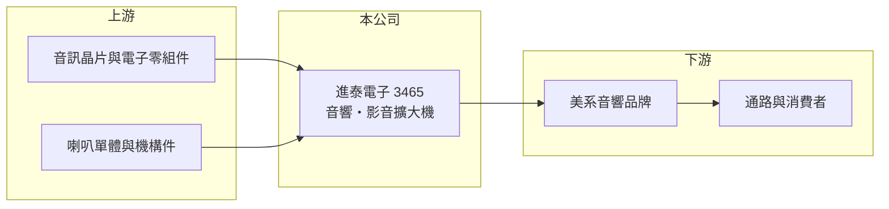

# 3465 進泰電子

> 上櫃｜[[產業索引-其他電子業|其他電子業]]｜上市（櫃）日期 2008/01/28

# 第一章：企業模式與商業藍圖

> [!info] 撰寫說明
> 精簡版，由 Claude 依公開資料整理，架構比照 [[2330台積電]]，資料截至 2026-10-07。來源：優分析進泰電子 2026 年第二季財報、月營收與現增報導。公開資料有限，產品比重與據點未查得。#待校對

進泰電子是音訊產品供應商，以美系品牌客戶的音響與影音擴大機為主。

- **核心業務：** 設計與製造音響產品，近年新增影音擴大機（[[AVR]]）產品線，屬消費性電子的[[ODM]]／代工模式（推估）。
- **營收結構：** 本次未查得產品別比重；報導指出主要拉貨動能來自美系客戶的新系列音響產品。
- **營運據點：** 本次未查得生產據點資料。
- **長期方向：** 新音響系列已進入量產，AVR 產品預計 2026 年下半年量產出貨，公司預期下半年營運優於上半年。

# 第二章：護城河深度與競爭優勢

進泰的競爭力取決於與品牌客戶的合作深度與新品導入速度。

- **競爭優勢：** 長期替美系品牌開發音訊產品，具備音響與擴大機的設計整合能力（推估）。
- **主要對手：** 國內外音響代工廠，台灣與中國的音訊 ODM 廠（推估，未查得公司自述對手）。
- **觀察重點：** AVR 新品量產進度、毛利率能否回到前一年水準，以及現增後財務體質改善情形。

# 第三章：財務體質與盈利規模

資料日期：2026-10-07，表格是撰寫當時的快照；最新月營收、毛利率、累計 EPS 由自動排程寫在本筆記的屬性欄位（月營收、毛利率、累計EPS 等）。#待校對

進泰 2026 年第二季轉盈，但上半年仍為虧損。

- **營收規模：** 2026 年上半年 9.54 億元，第二季 6.17 億元；7 月 1.45 億元，8 月 2.04 億元呈月增與年增。
- **獲利：** 2026 年第二季 EPS 0.19 元、[[毛利率]] 15.8%（季增 9.88 個百分點）；上半年 EPS 負 0.73 元、毛利率 12.31%、年減 9.21 個百分點。
- **財務特色：** 完成[[現金增資]] 2.1 億元，用於償還銀行借款，降低利息負擔；營收受客戶拉貨時點影響，部分營收會在月份間遞延。

# 第四章：總體風險與地緣政治

進泰的風險在於客戶集中與消費性需求波動。

- **產業週期：** 音響屬消費性電子，終端需求轉弱或品牌庫存調整時，訂單會快速下滑。
- **營運風險：** 營收依賴少數美系客戶，新品量產初期良率與成本控制會影響毛利率。
- **其他風險：** 美國關稅政策、美元匯率與電子零組件價格波動。

# 專有名詞解析

## 應用

- **[[AVR]]**：影音擴大機，負責接收多種影音訊號、解碼環繞音效並推動喇叭，是家庭劇院的核心設備。

## 金融

- **[[現金增資]]**：公司發行新股向股東或市場募集資金，常用於擴產或償還借款，會稀釋每股盈餘。
- **[[毛利率]]**：營業毛利占營收的比例，反映產品定價能力與成本結構。

## 產業

- **[[ODM]]**：原始設計製造，替品牌客戶設計並生產產品，品牌掛客戶名稱。

# 核心供應鏈

- 上游：音訊晶片、電子零組件、喇叭單體與機構件供應商（推估）
- 下游／客戶：美系音響品牌，客戶名稱未揭露
- 同業：音響 ODM 與代工廠，具體名單未查得

## 最新新聞
<!-- news:start -->
<!-- news:end -->

## 相關連結
- [公開資訊觀測站](https://mopsov.twse.com.tw/mops/web/t05st03?step=1&firstin=1&co_id=3465)
- [Goodinfo](https://goodinfo.tw/tw/StockDetail.asp?STOCK_ID=3465)
- [Yahoo 股市](https://tw.stock.yahoo.com/quote/3465)
- [鉅亨網新聞](https://www.cnyes.com/twstock/3465/news)
