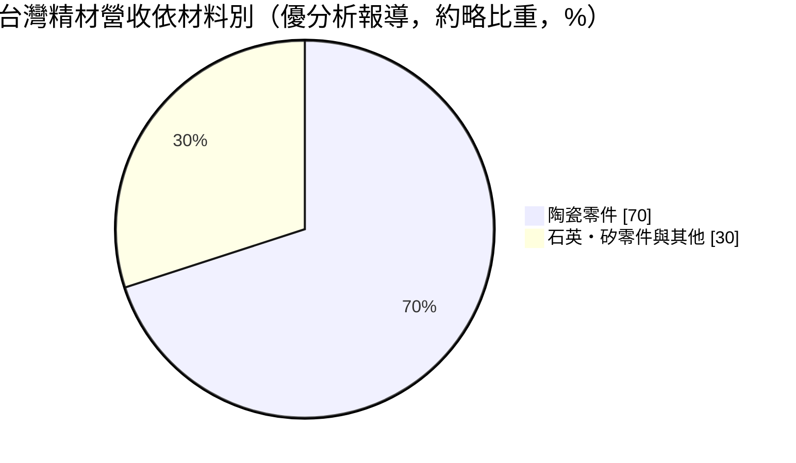
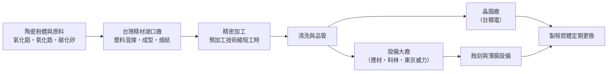
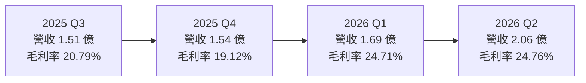
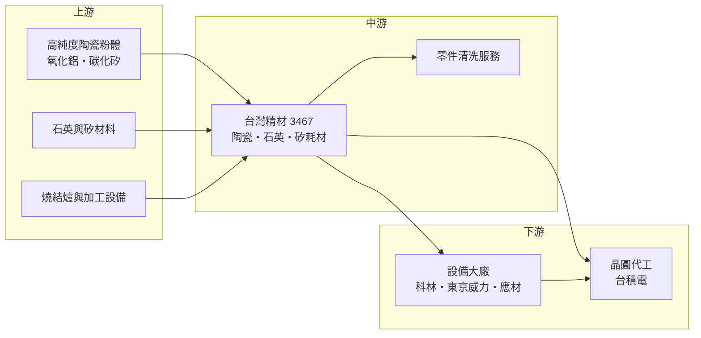

# 3467 台灣精材

> 上櫃｜[[產業索引-半導體業|半導體業]]｜上市（櫃）日期 2025/03/25

# 第一章：企業模式與商業藍圖

> [!info] 撰寫說明
> 本文由 Claude 依公開資料整理，架構比照 [[2330台積電]] 的四章研究，資料截至 2026-10-07。財務數字來源：聚財網（stock.wearn.com）季度損益表、nstock 公司資料頁、優分析、科技新報財經（2025 年 2 月上櫃前報導）、數位時代、旺得富公司基本資料頁；產業描述為整理性內容，尚未逐條比對原始文件。#待校對

在評估單一個股的長期投資價值時，首要步驟是拆解企業的底層獲利邏輯。本章針對台灣精材（股票代號：3467）的商業模式進行定性分析，說明這家從陶瓷碗盤起家的公司，如何轉型成半導體蝕刻與薄膜設備的高純度耗材供應商，以及它的成長取決於哪些條件。

## 一、核心定位：半導體設備裡的高純度陶瓷耗材

台灣精材成立於 1997 年，前身為半導體耗材代理商「啟成實業」，2005 年在新竹湖口自建工廠，英文名 Taiwan Forcera，2025 年 3 月 25 日上櫃，資本額約 3.11 億元。

依數位時代報導，2009 年前光洋科總經理馬堅勇收購啟成後改名台灣精材。公司一度面臨「3 個月發不出薪水」的困境，2011 年營收不到 2 億元；經營團隊裁員 25%、結束太陽能與面板業務、專注半導體耗材，2013 年取得第一份客戶認證並轉虧為盈，2014 年通過全球最大半導體設備廠認證。

台灣精材的產品是半導體設備裡的高純度[[耗材零組件]]，材料包括氧化鋁、氧化鋯、氮化矽、碳化矽等[[精密陶瓷]]，以及石英與矽材料，主要用於[[蝕刻]]與[[薄膜沉積]]機台，功能是在高腐蝕性氣體與[[電漿]]環境中保護設備、承載晶圓。這個定位有兩個商業意義：

* **耗材隨晶圓產量消耗：** 蝕刻腔體內的陶瓷零件會被電漿逐漸侵蝕，需要定期更換。只要晶圓廠持續生產，就會持續產生更換需求，營收不像設備銷售那樣隨資本支出大起大落。
* **認證門檻高：** 耗材直接影響晶圓的微粒汙染與[[良率]]，設備廠與晶圓廠的認證流程長，一旦通過，客戶黏著度高。

## 二、終端應用／產品板塊

依優分析報導，陶瓷產品約占營收七成，其餘為石英、矽材料零件與清洗等服務（細項比重未查得）。

* **陶瓷零件：** 蝕刻與薄膜設備內的環、蓋板、噴頭等零件，是公司的主力產品。
* **石英與矽零件：** 同樣用於製程腔體，材料特性不同，對應不同製程。
* **零件清洗：** 新清洗線預計 2026 年 10 月完成認證，屬於新增業務，可把服務延伸到耗材的再生與維護。
* **地區：** 依旺得富資料，外銷比重約 78.72%，與主要客戶為國際設備大廠相符。

## 三、資本轉化邏輯（營運模式）：一條龍陶瓷製程

* **一條龍製造：** 從漿料混煉、成型、燒結、精密加工到清洗都自行完成，有利於品質控管與成本。
* **製程改善帶動毛利：** 公司開發預加工技術，把零件加工時間從約 30 小時縮短到 10 小時，毛利率從早年約 10% 提升到 18% 左右（數位時代報導）。依優分析，毛利率由 2023 年的 16.35% 升到 2025 年的 19.51%，反映先進製程產品占比提升。
* **雙重客戶管道：** 一方面賣給設備大廠作為新機台的原廠零件，另一方面直接賣給晶圓廠作為更換耗材。

## 四、企業長期藍圖

上櫃前公司提出五個發展方向：新陶瓷材料研發、擴大先進製程產品、切入後段封裝、建立零件清洗產線、參與國內半導體供應鏈在地化。

* **先進製程耗材：** 自 2018 年起與晶圓代工龍頭合作開發先進製程設備用耗材，涵蓋 7 奈米至 2 奈米。
* **清洗線：** 預計 2026 年 10 月完成認證，可提高服務附加價值。
* **新廠：** 依優分析報導，新廠認證延後到 2028 年中，產能擴張時程仍有變數。

# 第二章：護城河深度與競爭優勢

「護城河」指企業抵禦競爭、維持超額利潤的保護機制。本章分析台灣精材在半導體陶瓷耗材市場的護城河、主要競爭對手，以及它與國際大廠的差距。

## 一、台灣精材護城河的核心組成要素

* **1. 設備大廠與晶圓廠的雙重認證：** 2014 年取得全球最大半導體設備廠認證，客戶涵蓋 Lam Research、東京威力科創、應用材料及台積電（優分析報導）。耗材認證週期長，一旦導入，客戶很少更換。
* **2. 材料與燒結技術：** 高純度陶瓷的配方、燒結與加工參數需要長期累積，台灣具備這種能力的廠商不多。
* **3. 在地供應優勢：** 晶圓廠推動供應鏈在地化，台灣本土的耗材供應商在交期、溝通與客製開發上比日美廠商更有彈性。

## 二、全球主要競爭對手格局

| 對手 | 定位 | 對台灣精材的威脅 |
|---|---|---|
| 京瓷（Kyocera） | 日本精密陶瓷龍頭 | 材料技術與產能規模全面領先 |
| CoorsTek | 美國技術陶瓷大廠 | 設備大廠的長期主要供應商 |
| 日本特殊陶業、TOTO 等日系廠 | 半導體陶瓷零件 | 在靜電吸盤等高階零件具優勢 |
| [[3680家登]]、[[6667信紘科]] 等台灣同業 | 半導體設備零組件與耗材 | 爭取同一批在地化訂單（產業參考） |
| [[1560中砂]] | 鑽石碟與再生晶圓 | 同屬晶圓廠耗材供應鏈，產品不完全重疊 |

## 三、優勢轉化：守得住／守不住／觀察重點

* **守得住：** 已通過認證的蝕刻與薄膜設備耗材，以及晶圓代工龍頭先進製程的在地化需求。
* **守不住：** 最高階的陶瓷零件（例如[[靜電吸盤]]）仍由日美大廠主導，台灣精材目前規模約 6 億元營收，與國際龍頭差距很大。
* **觀察重點：** 毛利率能否從 2025 年的 19.51% 持續提升到 25% 以上（2026 年第二季為 24.76%）；清洗線 2026 年 10 月能否如期認證；新廠 2028 年中的認證時程；對最大設備廠客戶（曾占營收逾五成）的集中度變化。

# 第三章：財務體質與盈利規模

資料日期：2026-10-07。數字取自聚財網季度損益表、nstock 公司資料頁與優分析報導，表格是撰寫當時的快照；最新月營收、毛利率、累計 EPS 由自動排程寫在本筆記的屬性欄位（月營收、毛利率、累計EPS 等）。#待校對

財務報表是檢驗護城河是否真實存在的最終標準。本章用三率、ROE、現金流與資本報酬，檢視台灣精材上櫃後的獲利品質。

## 一、獲利能力的基石：三率

| 期間 | 營收（新台幣） | [[毛利率]] | [[營業利益率]] | EPS（元） |
|---|---|---|---|---|
| 2025 全年 | 6.14 億 | 19.51% | 約 3.1%（依季度推算） | 0.58 |
| 2025 Q1 | 1.53 億 | 18.66% | 3.14% | 0.21 |
| 2025 Q2 | 1.55 億 | 19.48% | 5.10% | 0.03 |
| 2025 Q3 | 1.51 億 | 20.79% | 3.36% | 0.20 |
| 2025 Q4 | 1.54 億 | 19.12% | 0.61% | 0.14 |
| 2026 Q1 | 1.69 億 | 24.71% | 5.73% | 0.30 |
| 2026 Q2 | 2.06 億 | 24.76% | 9.41% | 0.50 |

* **[[毛利率]]：** 2025 年各季在 19% 至 21% 之間，2026 年上半年跳升到約 24.7%，主要是營收放大後固定成本攤提改善，加上先進製程產品比重提升。
* **[[營業利益率]]：** 2025 年第四季僅 0.61%，2026 年第二季升到 9.41%。營收規模小，費用比重高，營收每增加一點，營業利益率就明顯改善。
* **[[淨利率]]：** 2025 年第二季稅後淨利率 0.54%、EPS 0.03 元，明顯低於營業利益率，推估受新台幣升值的匯兌損失影響（外銷比重近八成，具體原因未查得）。
* **營收動能：** 2026 年 1 至 8 月累計營收 5.19 億元，年增 26.48%；8 月營收 7,592.9 萬元，年增 49.81%，創單月新高。上半年累計 EPS 0.80 元，已超過 2025 全年的 0.58 元。

## 二、[[ROE]]：資本效率

以 2025 年 EPS 0.58 元計算，ROE 偏低，估計在個位數（推估，每股淨值未查得）。上櫃時辦理現金增資，股本由約 2.82 億元增加到約 3.11 億元，淨值擴大也會壓低 ROE。2026 年獲利成長後，ROE 可望改善。

## 三、資本支出與自由現金流

* **[[CapEx]]：** 清洗線建置與新廠規劃需要資本支出（具體金額未查得）。新廠認證延後到 2028 年中，代表投入資本要較長時間才能產生營收。
* **[[自由現金流]]：** 耗材業務的營業現金流相對穩定，但擴產期的資本支出可能使自由現金流偏低（推估）。
* **股利：** 2025 年度現金股利 0.5 元（nstock 另列 0.82 元，資料不一致，待校對），除息日為 2026 年 7 月 10 日。

## 四、[[ROIC]] 與 [[WACC]]：價值創造利差

2025 年營業利益率約 3%，ROIC 很可能低於資金成本（推估）。2026 年第二季營業利益率升到 9.41%，若能維持在這個水準以上，ROIC 才可能高於資金成本。耗材業務的特性是一旦認證、需求穩定，只要毛利率持續提升，資本報酬會穩定改善。

# 第四章：總體風險與地緣政治

任何企業都無法脫離宏觀環境獨立存在。本章分析台灣精材必須面對的地緣政治、產業週期、營運與技術風險。

## 一、地緣政治風險

* **供應鏈在地化是順風：** 地緣政治升溫使晶圓廠與設備廠重視台灣在地供應，對台灣精材有利。
* **跟隨客戶海外布局：** 台積電在美國、日本、德國設廠，耗材供應商若要跟隨，需要在當地建立產能或物流，對小型公司是資金與管理的挑戰。
* **原料來源：** 高純度陶瓷粉體多由日本等國供應，若供應中斷或漲價，會影響成本（推估）。

## 二、產業週期與市場結構

* **晶圓廠稼動率：** 耗材需求與晶圓產量連動，晶圓廠稼動率下滑時，耗材更換頻率會降低。
* **設備資本支出：** 賣給設備大廠的原廠零件，受晶圓廠擴產週期影響較大。
* **匯率：** 外銷比重約 79%，新台幣升值會壓縮營收與毛利。

## 三、營運環境的隱性風險

* **客戶集中：** 全球最大設備廠曾占營收超過五成，客戶策略改變或另尋供應商，影響重大。
* **新廠延後：** 新廠認證延後到 2028 年中，若訂單成長快於產能，可能錯失訂單。
* **規模小：** 營收約 6 億元，研發與擴產資源有限，與國際陶瓷大廠的資源差距大。

## 四、科技或法規演進

* **製程演進帶來規格升級：** 2 奈米以下製程與[[GAA]]結構使用更多蝕刻與沉積步驟，對耐電漿、低微粒的耗材需求增加，是機會。
* **新材料門檻：** 先進製程可能需要新的陶瓷配方或塗層，若研發跟不上，高階產品市場會被國際大廠拿走。
* **環保法規：** 陶瓷燒結耗能高，碳排與用電成本上升會增加營運成本。

# 專有名詞解析

## 半導體

- **[[蝕刻]]**：用電漿或化學藥劑把晶圓上不需要的材料移除，形成電路圖形的製程步驟。
- **[[薄膜沉積]]**：在晶圓表面沉積一層極薄的材料，包括 CVD、PVD、ALD 等方法。
- **[[電漿]]**：氣體被高能量游離後的狀態，蝕刻與沉積機台利用電漿處理晶圓，也會侵蝕腔體零件。
- **[[靜電吸盤]]**：以靜電力固定晶圓的陶瓷載台，是蝕刻與沉積設備內單價最高的陶瓷零件之一。
- **[[良率]]**：一片晶圓上合格晶片的比例，耗材產生的微粒汙染會直接影響良率。
- **[[GAA]]**：環繞式閘極電晶體，閘極從四面包住通道，是 2 奈米以下製程的主流結構。

## 金融

- **[[毛利率]]**：營業毛利除以營收，反映產品本身的獲利空間。
- **[[ROE]]**：股東權益報酬率，稅後淨利除以股東權益，衡量公司運用股東資金的獲利能力。

## 產業

- **[[耗材零組件]]**：設備運轉中會逐漸損耗、需要定期更換的零件，需求隨晶圓產量持續發生。
- **[[精密陶瓷]]**：以高純度氧化鋁、氧化鋯、碳化矽等材料燒結成型的工業陶瓷，耐高溫、耐腐蝕、絕緣性佳。

# 核心供應鏈

## 1. 上游：原料與設備
- 高純度陶瓷粉體、石英與矽材料供應商（公司未公開名稱，未查得）

## 2. 中游：台灣精材與同業
- 國際競爭者：京瓷、CoorsTek
- 台灣半導體耗材與零組件同業：[[3680家登]]、[[6667信紘科]]、[[1560中砂]]（產業參考）

## 3. 下游：設備大廠
- [[LRCX科林研發]]、[[8035東京威力科創]]、[[AMAT應用材料]]

## 4. 下游：晶圓廠
- [[2330台積電]]（先進製程耗材自 2018 年起合作開發）

延伸閱讀：[[台積電供應鏈]]

## 最新新聞
<!-- news:start -->
<!-- news:end -->

## 相關連結
- [公開資訊觀測站](https://mopsov.twse.com.tw/mops/web/t05st03?step=1&firstin=1&co_id=3467)
- [Goodinfo](https://goodinfo.tw/tw/StockDetail.asp?STOCK_ID=3467)
- [Yahoo 股市](https://tw.stock.yahoo.com/quote/3467)
- [鉅亨網新聞](https://www.cnyes.com/twstock/3467/news)
