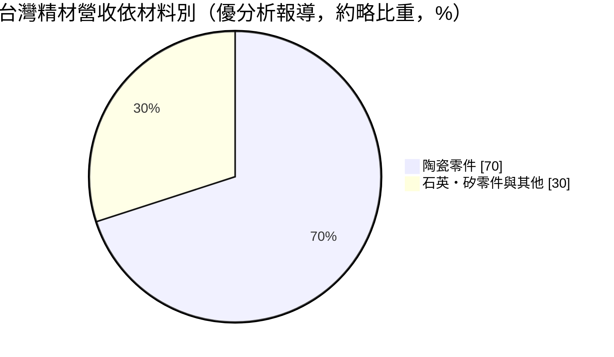
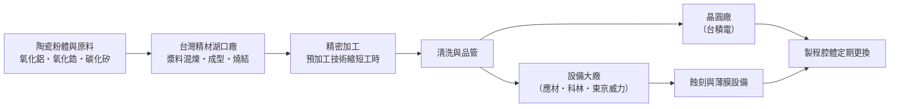
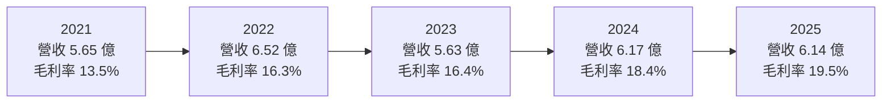
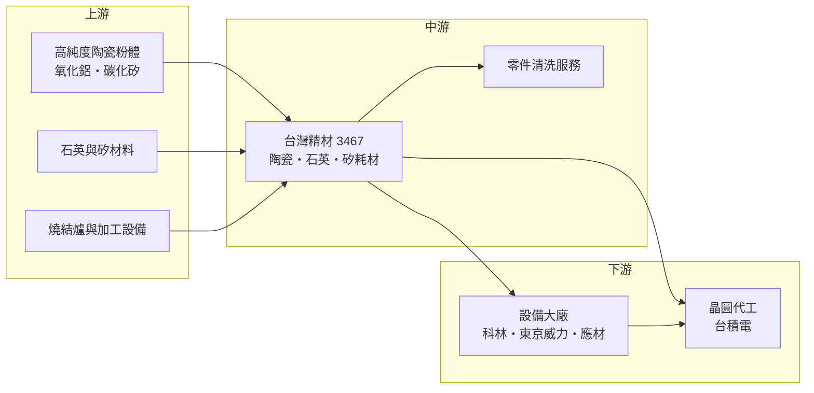

# 3467 台灣精材

> 上櫃｜[[產業索引-半導體業|半導體業]]｜上市（櫃）日期 2025/03/25

# 第一章：企業模式與商業藍圖

> [!info] 撰寫說明
> 本文由 Claude 依公開資料整理，架構比照 [[2330台積電]] 的四章研究，資料截至 2026-10-08。財務數字來源：Goodinfo 年度獲利指標、資產負債結構與股利政策頁、聚財網季度損益表、nstock 公司資料頁、優分析、科技新報財經（2025 年 2 月上櫃前報導）、數位時代；產業描述為整理性內容，尚未逐條比對原始文件。#待校對

在評估單一個股的長期投資價值時，首要步驟是拆解企業的底層獲利邏輯。本章針對台灣精材（股票代號：3467）的商業模式進行定性分析，說明這家從耗材代理商起家的公司，如何轉型成半導體蝕刻與薄膜設備的高純度耗材供應商，以及它的長期成長取決於哪些條件。

## 一、核心定位：半導體設備裡的高純度陶瓷耗材

台灣精材成立於 1997 年，前身為半導體耗材代理商「啟成實業」，2005 年在新竹湖口自建工廠，英文名 Taiwan Forcera，2025 年 3 月上櫃，資本額約 3.11 億元。

公司的轉型故事很能說明它的經營文化。依數位時代報導，2009 年前光洋科總經理馬堅勇收購啟成後改名為台灣精材。當時公司一度面臨「3 個月發不出薪水」的困境，2011 年營收不到 2 億元。經營團隊裁員約 25%，結束太陽能與面板業務，集中資源做半導體耗材，2013 年取得第一份客戶認證並轉虧為盈，2014 年通過全球最大半導體設備廠的認證，2018 年起與晶圓代工龍頭合作開發先進製程用的耗材。這段歷程顯示公司的競爭力來自「長期專注、逐步取得認證」，而不是一次性的技術突破。

台灣精材的產品是半導體設備內的高純度[[耗材零組件]]。材料包括氧化鋁、氧化鋯、氮化矽、碳化矽等[[精密陶瓷]]，以及石英與矽材料，主要用於[[蝕刻]]與[[薄膜沉積]]機台。這些零件的功能是在高腐蝕性氣體與[[電漿]]環境中保護設備、承載或包圍晶圓，同時不能釋放微粒污染晶圓。

這個定位有兩個長期意義。第一，耗材會隨晶圓產量持續消耗。蝕刻腔體內的陶瓷零件會被電漿逐漸侵蝕，需要定期更換，只要晶圓廠持續生產，就會持續產生更換需求，營收不像設備銷售那樣隨資本支出大起大落。第二，認證門檻高。耗材直接影響晶圓的微粒污染與[[良率]]，設備廠與晶圓廠的認證流程長，一旦通過，客戶黏著度高。

## 二、終端應用／產品板塊

依優分析報導，陶瓷產品約占營收七成，其餘為石英、矽材料零件與清洗等服務（細項比重未查得）。

陶瓷零件是主力產品，包括蝕刻與薄膜設備內的環、蓋板、噴頭等零件。石英與矽零件同樣用於製程腔體，不同材料對應不同的製程化學環境。零件清洗是新增的服務，公司建置清洗產線，把業務從「賣新零件」延伸到「耗材的再生與維護」，可以提高每片晶圓產出的服務價值。

客戶方面，依優分析報導，認證客戶涵蓋 Lam Research、東京威力科創、應用材料等國際設備大廠，以及台積電。數位時代則報導，全球最大設備廠曾占營收超過五成。依旺得富資料，外銷比重約 79%，與主要客戶為國際設備大廠一致。

## 三、資本轉化邏輯（營運模式）：一條龍陶瓷製程

台灣精材的製程是一條龍的，從漿料混煉、成型、燒結、精密加工到清洗都自行完成。這種垂直整合有利於品質控管，也讓公司能從製程改善中直接降低成本。數位時代報導，公司開發預加工技術，把零件加工時間從約 30 小時縮短到 10 小時，毛利率從早年約 10% 提升到 18% 左右。Goodinfo 的年度資料也顯示同樣的趨勢：毛利率從 2021 年的 13.5% 逐年升到 2025 年的 19.5%，反映製程改善與先進製程產品比重的提升。

銷售管道有兩條。一條是賣給設備大廠，作為新機台的原廠零件，這部分受晶圓廠擴產週期影響；另一條是直接賣給晶圓廠，作為定期更換的耗材，這部分跟著晶圓產量走，相對穩定。

## 四、企業長期藍圖

上櫃前，公司提出五個發展方向：新陶瓷材料研發、擴大先進製程產品、切入後段封裝、建立零件清洗產線，以及參與國內半導體供應鏈在地化。其中最關鍵的是先進製程耗材。2 奈米以下的製程與 [[GAA]] 電晶體結構需要更多蝕刻與沉積步驟，對耐電漿、低微粒的耗材要求更高，若能持續通過先進製程的認證，產品單價與毛利率都有提升空間。

產能方面，依優分析報導，新清洗線在 2026 年完成認證，新廠的認證則延後到 2028 年中。新廠的時程決定了公司 2028 年以後的成長天花板，是長期需要追蹤的重點。

# 第二章：護城河深度與競爭優勢

「護城河」指企業抵禦競爭、維持超額利潤的保護機制。本章分析台灣精材在半導體陶瓷耗材市場的護城河、主要競爭對手，以及它與國際大廠的差距。

## 一、台灣精材護城河的核心組成要素

台灣精材的護城河主要由三個要素組成。第一是設備大廠與晶圓廠的雙重認證。2014 年取得全球最大半導體設備廠認證，客戶涵蓋國際主要設備商與台積電。耗材的認證週期長，客戶需要投入工程資源驗證微粒、壽命與製程穩定度，一旦導入就很少更換，這是最核心的轉換成本。

第二是材料與燒結技術。高純度陶瓷的配方、燒結溫度曲線與加工參數需要長期累積，台灣具備這種能力的廠商不多，這是公司能從代理商轉型為製造商的技術基礎。

第三是在地供應優勢。晶圓廠在地緣政治升溫後更重視供應鏈在地化，台灣本土的耗材供應商在交期、溝通與客製開發上，比日美廠商更有彈性，能和晶圓廠工程團隊密切配合開發新製程的耗材。

## 二、全球主要競爭對手格局

| 對手 | 定位 | 對台灣精材的威脅 |
|---|---|---|
| 京瓷（Kyocera） | 日本精密陶瓷龍頭 | 材料技術與產能規模全面領先 |
| CoorsTek | 美國技術陶瓷大廠 | 設備大廠的長期主要供應商 |
| 日本特殊陶業、TOTO 等日系廠 | 半導體陶瓷零件 | 在靜電吸盤等高階零件具優勢 |
| [[3680家登]]、[[6667信紘科]] 等台灣同業 | 半導體設備零組件與耗材 | 爭取同一批在地化訂單（產業參考） |
| [[1560中砂]] | 鑽石碟與再生晶圓 | 同屬晶圓廠耗材供應鏈，產品不完全重疊 |

## 三、優勢轉化：守得住／守不住／觀察重點

台灣精材守得住的，是已通過認證的蝕刻與薄膜設備耗材，以及晶圓代工龍頭先進製程的在地化需求。這些訂單有長期的更換週期，需求可預測性高。

守不住的，是最高階的陶瓷零件，例如[[靜電吸盤]]。這類零件技術門檻與單價最高，目前仍由日美大廠主導。台灣精材年營收約 6 億元，與國際龍頭的資源差距很大，短期內難以在最高階市場正面競爭。

長期觀察重點有三個：毛利率能否從 2025 年的 19.5% 持續提升到 25% 以上；新廠能否在 2028 年如期完成認證；以及對最大設備廠客戶的集中度能否隨客戶增加而下降。

# 第三章：財務體質與盈利規模

資料日期：2026-10-08。數字取自 Goodinfo 年度財務資料、聚財網季度損益表與優分析報導，表格是撰寫當時的快照；最新月營收、毛利率、累計 EPS 由自動排程寫在本筆記的屬性欄位（月營收、毛利率、累計EPS 等）。#待校對

財務報表是檢驗護城河是否真實存在的最終標準。本章用五年的三率、ROE、現金流與資本報酬，檢視台灣精材的獲利品質。

## 一、獲利能力的基石：三率

| 年度 | 營收（新台幣） | [[毛利率]] | [[營業利益率]] | EPS（元） | [[ROE]] |
|---|---|---|---|---|---|
| 2021 | 5.65 億 | 13.5% | 3.27% | 0.66 | 4.48% |
| 2022 | 6.52 億 | 16.3% | 5.23% | 2.01 | 12.7% |
| 2023 | 5.63 億 | 16.4% | 3.34% | 0.80 | 5.29% |
| 2024 | 6.17 億 | 18.4% | 4.18% | 1.02 | 6.44% |
| 2025 | 6.14 億 | 19.5% | 3.06% | 0.58 | 3.39% |

五年數字有兩個重點。第一，毛利率呈穩定上升的趨勢，從 13.5% 一路升到 19.5%，這是製程改善與產品升級累積的結果，也是公司護城河逐步加深的證據。第二，營收規模停滯，五年都在 5.6 億至 6.5 億元之間，年複合成長率約 2.1%（推算），營業利益率始終在 3% 至 5% 之間，費用吃掉了大部分毛利。

[[淨利率]]的波動主要來自業外與匯率。外銷比重近八成，新台幣升值會產生匯兌損失，推估 2025 年 EPS 降到 0.58 元與此有關（細節未查得）。從季度資料看，2026 年上半年營收放大後，毛利率升到約 25%、營業利益率升到約 9%，顯示營收規模一旦突破，營運槓桿會讓獲利明顯改善。

## 二、[[ROE]]：資本效率

近五年平均 ROE 約 6.5%（推算），偏低。ROE 最高的 2022 年為 12.7%，其餘年份多在 3% 至 6% 之間。2025 年上櫃時辦理現金增資，股本由約 2.8 億元增加到約 3.11 億元，每股淨值由 16.09 元升到 19.11 元，淨值擴大但獲利沒有同步成長，使 ROE 降到 3.39%。

## 三、資本支出與自由現金流

清洗線與新廠需要資本支出（具體金額未查得）。新廠認證延後到 2028 年中，代表這部分投入資本要較長時間才能產生營收，期間的[[自由現金流]]可能偏低（推估）。依 Goodinfo，2025 年股東權益約占總資產 71%，長期負債約占 9%，財務結構穩健。

股利方面，依 Goodinfo，2023 至 2025 年度現金股利分別為 0.6、0.816、0.5 元（2021 與 2022 年度未查得），2025 年度配息率約 86%（推算），公司傾向把大部分盈餘發給股東。

## 四、[[ROIC]] 與 [[WACC]]：價值創造利差

**ROIC 推算：** 2025 年營業利益約 0.188 億元（6.14 億 × 3.06%），扣除 20% 稅率後的稅後營業利益約 0.15 億元。股東權益約 5.94 億元（每股淨值 19.11 元 × 約 0.311 億股），有息負債以 Goodinfo 資產結構中長期負債占總資產 8.68% 估算約 0.73 億元，投入資本約 6.67 億元，ROIC 約 2.3%（推算）。以同樣方法回推 2022 年，稅後營業利益約 0.27 億元、股東權益約 4.0 億元，ROIC 約 6.9%（推算）。

**WACC 推算：** 股東權益成本用 CAPM 估計，假設台灣 10 年期公債殖利率 1.75%、市場風險溢酬 6%、β 取半導體材料同業常見值 1.2，股東權益成本約 8.95%。負債成本假設 2.5%，稅後約 2.0%。資本結構以權益約 89%、負債約 11% 計算，WACC 約 8.2%（推算）。

**結論：** 過去五年台灣精材的 ROIC 約在 2% 至 7% 之間，低於約 8.2% 的 WACC，代表公司雖然毛利率持續改善，但營收規模不足，尚未為股東創造超過資金成本的報酬。這也是它的長期投資關鍵：耗材生意的護城河正在加深，但必須等營收規模放大、營業利益率突破約 10%，ROIC 才可能高於 WACC。

# 第四章：總體風險與地緣政治

任何企業都無法脫離宏觀環境獨立存在。本章分析台灣精材長期必須面對的地緣政治、產業週期、營運與技術風險。

## 一、地緣政治

地緣政治對台灣精材是順風也是挑戰。順風在於，晶圓廠與設備廠在地緣政治升溫後重視供應鏈在地化，台灣本土耗材供應商更容易取得導入機會。挑戰在於，台積電在美國、日本、德國設廠，耗材供應商若要跟隨，需要在當地建立產能或物流，對一家年營收約 6 億元的公司是很大的資金與管理負擔。此外，高純度陶瓷粉體多由日本等國供應，若供應中斷或大幅漲價，會影響成本（推估）。

## 二、產業週期與市場結構

耗材需求與晶圓產量連動，晶圓廠稼動率下滑時，耗材更換頻率會降低。賣給設備大廠的原廠零件則受晶圓廠擴產週期影響，波動較大。匯率也是長期變數，外銷比重約 79%，新台幣升值會壓縮營收與毛利。

## 三、營運環境的隱性風險

客戶集中是首要風險，全球最大設備廠曾占營收超過五成，客戶的採購策略改變或另尋第二供應商，影響都會很大。其次是產能時程，新廠認證延後到 2028 年中，若訂單成長快於產能，可能錯失訂單。最後是規模小，研發與擴產資源有限，與國際陶瓷大廠的資源差距短期難以拉近。

## 四、科技演進

製程演進總體上是機會。2 奈米以下製程與 GAA 結構使用更多蝕刻與沉積步驟，對耐電漿、低微粒的耗材需求增加。但新製程也可能需要新的陶瓷配方或表面塗層，若研發跟不上，高階產品市場會被國際大廠拿走。環保法規也是長期因素，陶瓷燒結耗能高，碳排與用電成本上升會增加營運成本。

# 專有名詞解析

## 半導體

- **[[蝕刻]]**：用電漿或化學藥劑把晶圓上不需要的材料移除，形成電路圖形的製程步驟。
- **[[薄膜沉積]]**：在晶圓表面沉積一層極薄的材料，包括 CVD、PVD、ALD 等方法。
- **[[電漿]]**：氣體被高能量游離後的狀態，蝕刻與沉積機台利用電漿處理晶圓，也會侵蝕腔體零件。
- **[[靜電吸盤]]**：以靜電力固定晶圓的陶瓷載台，是蝕刻與沉積設備內單價最高的陶瓷零件之一。
- **[[良率]]**：一片晶圓上合格晶片的比例，耗材產生的微粒污染會直接影響良率。
- **[[GAA]]**：環繞式閘極電晶體，閘極從四面包住通道，是 2 奈米以下製程的主流結構。

## 金融

- **[[ROE]]**：股東權益報酬率，稅後淨利除以股東權益，衡量公司運用股東資金的獲利能力。
- **[[ROIC]]**：投入資本報酬率，稅後營業利益除以股東權益加有息負債，衡量本業運用資本的效率。
- **[[WACC]]**：加權平均資金成本，股東與債權人要求報酬的加權平均，ROIC 高於它才代表創造價值。

## 產業

- **[[耗材零組件]]**：設備運轉中會逐漸損耗、需要定期更換的零件，需求隨晶圓產量持續發生。
- **[[精密陶瓷]]**：以高純度氧化鋁、氧化鋯、碳化矽等材料燒結成型的工業陶瓷，耐高溫、耐腐蝕、絕緣性佳。

# 核心供應鏈

## 1. 上游：原料與設備
- 高純度陶瓷粉體、石英與矽材料供應商（公司未公開名稱，未查得）

## 2. 中游：台灣精材與同業
- 國際競爭者：京瓷、CoorsTek
- 台灣半導體耗材與零組件同業：[[3680家登]]、[[6667信紘科]]、[[1560中砂]]（產業參考）

## 3. 下游：設備大廠
- [[LRCX科林研發]]、[[8035東京威力科創]]、[[AMAT應用材料]]

## 4. 下游：晶圓廠
- [[2330台積電]]（先進製程耗材自 2018 年起合作開發）

延伸閱讀：[[台積電供應鏈]]

## 最新新聞
<!-- news:start -->
<!-- news:end -->

## 相關連結
- [公開資訊觀測站](https://mopsov.twse.com.tw/mops/web/t05st03?step=1&firstin=1&co_id=3467)
- [Goodinfo](https://goodinfo.tw/tw/StockDetail.asp?STOCK_ID=3467)
- [Yahoo 股市](https://tw.stock.yahoo.com/quote/3467)
- [鉅亨網新聞](https://www.cnyes.com/twstock/3467/news)
