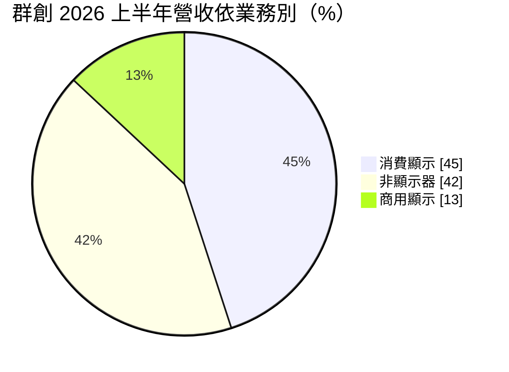
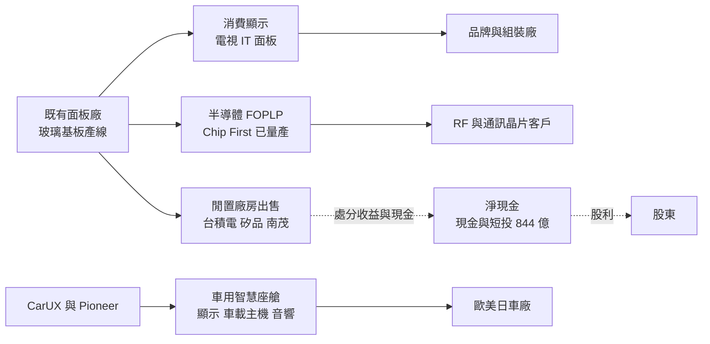
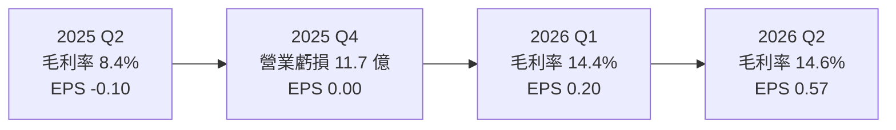
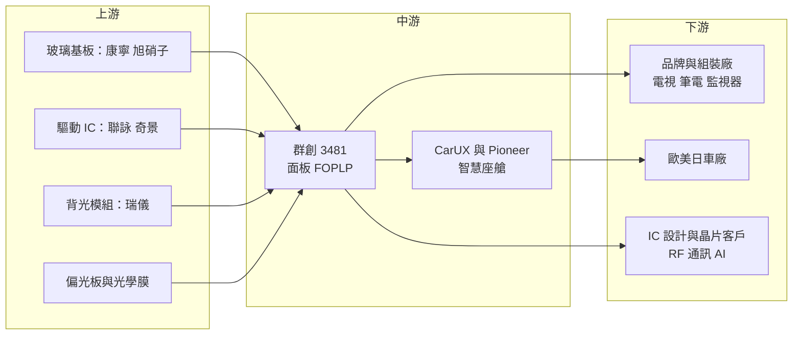

# 3481 群創

> 上市｜[[產業索引-光電業|光電業]]｜上市（櫃）日期 2006/10/24

# 第一章：企業模式與商業藍圖

> [!info] 撰寫說明
> 本文由 Claude 依公開資料整理，架構比照 [[2330台積電]] 的四章研究，資料截至 2026-10-07。財務數字來源：聯合新聞網（群創 2025 年財報報導）、優分析（2026 年第二季財報報導）、Poorstock（2026 年 8 月法說會整理）、Stockfeel 股感（2025 年第四季法說會整理）；產業描述為整理性內容，尚未逐條比對原始文件。#待校對

在評估單一個股的長期投資價值時，首要步驟是拆解企業的底層獲利邏輯。本章針對群創光電（股票代號：3481，以下簡稱群創）的商業模式進行定性分析，說明這家鴻海集團旗下的面板廠，如何以「輕資產」策略活化舊廠，並把面板產線轉作半導體[[面板級扇出型封裝]]與車用智慧座艙。

## 一、核心定位：從面板製造商轉型為科技解決方案供應商

群創成立於 2003 年，屬於鴻海集團，2010 年合併奇美電子與統寶光電後，成為台灣規模最大的面板廠之一。和 [[2409友達]] 一樣，群創面對中國面板廠大舉擴產、面板報價長期低迷的局面，因此提出從「面板製造商」轉型為「科技解決方案提供者」。

群創的轉型路線和友達不同，有兩個特色：

* **把面板廠變成封裝廠：** 群創利用面板廠的大面積玻璃基板、黃光與鍍膜設備，切入半導體 [[FOPLP]]（面板級扇出型封裝），這是台灣面板廠中少見的半導體跨界。
* **大舉活化與出售廠房：** 2024 年把南科四廠以約 171 億元出售給 [[2330台積電]]，2026 年 3 月再把廠房售予矽品與 [[8150南茂]]，把閒置產能變現，降低折舊負擔。

## 二、終端應用與產品板塊：非顯示器業務快速成長

2026 年上半年營收依業務類別如下（群創法說會分類）：

* **消費顯示：** 電視、監視器與筆電面板，占比從 2024 年上半年的 68% 降到 45%，毛利率僅約 6% 至 10%。
* **非顯示器：** 包括車用智慧座艙系統（CarUX 與 Pioneer）、半導體封裝等，占比從 24% 升到 42%，毛利率約 11% 至 15%。
* **商用顯示：** 工業、醫療與專業顯示，占比約 13%，毛利率最高，約 16% 至 20%。

若依應用別看，2026 年第二季車用占 39%、電視 27%、手機及商用 16%、可攜式電腦 15%、桌上型螢幕 3%，車用已是第一大應用。

## 三、資本轉化邏輯：舊產線換新用途

* **輕資產策略：** 公司以精實資本支出為原則，2026 年資本預算約 130 億元，上半年資本支出 23.49 億元、年減 27.8%。舊廠能改作封裝就改，不能改就出售。
* **車用整合：** 2025 年 12 月完成併購日本車用音響與多媒體大廠 Pioneer，與旗下智慧座艙品牌 CarUX 整合，從車用顯示延伸到車載主機與娛樂系統。CarUX 主要客戶為歐美車廠，Pioneer 在日本車廠有優勢。
* **財務體質：** 2026 年第二季現金及短期投資約 844.08 億元，淨負債比為 -10%，處於淨現金狀態。

## 四、企業長期藍圖：玻璃基板封裝

FOPLP 分三階段發展：

* **Chip First：** 已量產，應用於射頻與通訊晶片。
* **RDL First：** 客戶認證中，鎖定 AI 與 [[HPC]] 的 [[Chiplet]] 封裝。
* **[[TGV]]：** 開發中，在玻璃基板上打出穿孔做垂直導通，鎖定 AI 與資料中心高效能晶片。

公司引用的市場預估指出，玻璃基板相關封裝市場到 2030 年規模可達 80 億美元，年複合成長率 52%，AI 與 HPC 將占 45.6%。群創自我定位為「FOPLP 玻璃解決方案供應商」。此外也布局工業與醫療顯示、裸眼 3D 等利基產品。

# 第二章：護城河深度與競爭優勢

在長期價值投資中，「護城河」指企業抵禦競爭、維持超額利潤的保護機制。本章分析群創的護城河構成、主要競爭對手，以及轉型業務能否建立新的護城河。

## 一、群創護城河的核心組成要素

傳統面板業護城河很窄，群創的護城河主要來自轉型後的業務：

* **1. 大面積玻璃製程的跨界能力：** 面板廠擅長在大片玻璃上做精細線路與控制翹曲，這正是面板級封裝需要的能力。群創宣稱在散熱效率與翹曲控制上具優勢，加上現成廠房，切入成本低於從零建廠。
* **2. 車用座艙的完整方案：** 結合 CarUX 顯示與 Pioneer 車載主機、音響，可提供整套智慧座艙，車廠的開發與認證週期長，轉換成本高。
* **3. 淨現金與鴻海集團資源：** 帳上淨現金充足，加上鴻海集團在電動車、伺服器與半導體的布局，有機會帶來訂單與合作。

## 二、全球主要競爭對手格局

| 對手 | 定位 | 對群創的威脅 |
|---|---|---|
| 京東方（BOE）、華星光電 | 中國大型面板廠 | 掌握電視與 IT 面板價格主導權 |
| [[2409友達]] | 台灣面板同業，轉型車用與垂直場域 | 在車用與 IT 面板直接競爭 |
| 天馬（中國） | 中小尺寸與車用面板 | 車用面板市占快速提升 |
| [[3711日月光投控]]、[[6239力成]] | 半導體封測廠，也布局面板級封裝 | 在 FOPLP 有封裝客戶與技術基礎 |
| [[2330台積電]] | CoPoS 等面板級封裝技術 | 若大規模量產，將主導高階 AI 封裝規格 |

## 三、優勢轉化：哪些市場守得住、哪些守不住

* **守得住：** 車用顯示與座艙系統、商用與工業顯示。這些產品利潤較穩定，且需要長期認證。
* **守不住：** 電視與一般 IT 面板。中國面板廠的產能與成本優勢明顯，消費顯示毛利率僅約 6% 至 10%。
* **觀察重點：** RDL First 能否通過客戶認證並量產、TGV 能否在 AI 晶片封裝中取得訂單、Pioneer 整合的費用與綜效，以及非顯示器業務占比能否持續提升。

# 第三章：財務體質與盈利規模

資料日期：2026-10-07。數字取自財經媒體與法說會整理，表格是撰寫當時的快照；最新月營收、毛利率、累計 EPS 由自動排程寫在本筆記的屬性欄位（月營收、毛利率、累計EPS 等）。#待校對

財務報表是檢驗護城河是否真實存在的最終標準。本章用三率、ROE、現金流與資本報酬，檢視群創在轉型期間的獲利品質。

## 一、獲利能力的基石：三率

| 項目 | 2025 全年 | 2025 Q2 | 2025 Q4 | 2026 Q1 | 2026 Q2 |
|---|---|---|---|---|---|
| 營收（新台幣） | 2,267 億 | 562 億 | 567 億 | 666 億 | 637 億 |
| [[毛利率]] | 未查得 | 8.4% | 未查得 | 14.4% | 14.6% |
| [[營業利益率]] | 約 -1.8%（推算） | -1.4% | 約 -2.1%（推算） | 2.2% | 2.6% |
| 稅後淨利 | 6.7 億 | 未查得 | 0.7 億 | 約 16.3 億（推算） | 45.3 億 |
| EPS（元） | 0.03 | -0.10 | 0.00 | 0.20 | 0.57 |

* **[[毛利率]]：** 2026 年第二季 14.6%，比前一年同期提升 6.2 個百分點，主因是非顯示器與商用顯示比重提高，而不是面板報價大漲。
* **[[營業利益率]]：** 2026 年上半年 2.4%，2025 年全年則有約 41.6 億元營業虧損。轉型讓本業轉正，但利潤率仍偏低。
* **[[淨利率]]與業外：** 2026 年第二季營業利益約 16.3 億元，稅後淨利 45.3 億元，業外收益占比很高，推估包括廠房處分利益與投資收益。評估本業時應以營業利益為準。

## 二、[[ROE]]：資本效率

2026 年第二季每股淨值約 28.17 元，以上半年 EPS 0.77 元年化推算，ROE 約 5%（推算）；2025 年 EPS 僅 0.03 元，ROE 接近零。資本效率偏低，主因是大量面板資產報酬不佳。

## 三、資本支出與自由現金流

* **[[CapEx]]：** 2026 年資本預算約 130 億元，用於技術升級與維持營運；上半年實際支出 23.49 億元，年減 27.8%。2025 年第四季單季折舊攤提約 76 億元，遠高於資本支出，代表公司正在讓資產規模自然縮小。
* **[[自由現金流]]：** 折舊遠大於資本支出，加上廠房出售收入，現金部位持續增加，從 2025 年底約 528 億元升到 2026 年第二季約 844 億元（後者含短期投資，推估包含廠房出售價款）。
* **股利政策：** 2025 年度每股配 1 元，其中盈餘配發 0.5 元、資本公積配發 0.5 元。在獲利偏低時以資本公積維持配息，不代表本業獲利足以支撐。

## 四、[[ROIC]] 與 [[WACC]]：價值創造利差

以目前營業利益率約 2% 至 3% 推估，群創本業 ROIC 仍低於資金成本（推估，具體數值未查得）。輕資產策略的邏輯是縮小投入資本、提高資產周轉，若 FOPLP 與車用業務放量，ROIC 才有機會結構性改善。

# 第四章：總體風險與地緣政治

任何企業都無法脫離宏觀環境獨立存在。本章分析群創未來必須面對的地緣政治、產業週期與營運風險。

## 一、地緣政治風險

* **中國面板產業政策：** 中國持續支持高世代面板線，群創在電視與 IT 面板上的價格競爭壓力不會消失。
* **美國關稅：** 面板多經由組裝廠出口到美國，關稅政策影響客戶拉貨節奏。2026 年上半年筆電品牌提前備貨，可能壓抑下半年需求。
* **日本與歐洲業務：** 併購 Pioneer 後，日本車市與匯率變化成為新的影響因素。

## 二、產業週期與市場結構風險

* **面板報價循環：** 消費顯示仍占營收約 45%，面板報價下跌時毛利率仍會受影響，具有明顯的[[長鞭效應]]。
* **零組件成本上揚：** 法說會提到零組件成本上揚，對消費顯示的毛利率形成壓力。
* **車市週期：** 車用已是第一大應用，全球車市放緩會直接影響營收。

## 三、營運環境的隱性風險

* **業外收益依賴：** 近期獲利大量來自業外，廠房處分屬一次性收益，不可持續。
* **併購整合：** Pioneer 規模不小，整合費用與文化磨合可能先於綜效出現。
* **封裝客戶集中：** FOPLP 仍在早期，客戶數量少，單一客戶的決策變化影響很大。

## 四、科技演進風險

* **封裝技術路線競爭：** 玻璃基板、矽中介層（[[Interposer]]）與有機載板等封裝路線仍在競爭，若主流 AI 晶片採用其他路線，群創的投資可能無法回收。
* **OLED 滲透：** 筆電、平板與車用面板逐步導入 [[OLED]]，對 LCD 為主的群創形成壓力。
* **對手跨足：** 封測大廠與晶圓代工廠也在發展面板級封裝，群創需要證明面板廠出身的技術能達到半導體級的良率與規格。

# 專有名詞解析

## 半導體

- **[[FOPLP]]**：面板級扇出型封裝，在大型方形面板上同時封裝大量晶片，面積利用率比圓形晶圓高。
- **[[面板級扇出型封裝]]**：即 FOPLP，以方形面板取代圓形晶圓作為封裝載體，降低單位封裝成本。
- **[[TGV]]**：玻璃通孔，在玻璃基板上打出微小穿孔並填入導電材料，做為晶片上下層的垂直連接。
- **[[Chiplet]]**：小晶片，把一顆大晶片拆成多顆功能晶片再封裝在一起，提高良率並降低成本。
- **[[Interposer]]**：中介層，放在晶片與載板之間、內含細微線路的矽片，用來連接並排的多顆晶片。
- **[[HPC]]**：高效能運算，指資料中心、AI 訓練等需要大量運算能力的應用。

## 金融

- **[[毛利率]]**：毛利除以營收，反映產品售價扣除直接生產成本後的獲利空間。
- **[[ROIC]]**：投入資本報酬率，衡量公司投入營運的資本能賺回多少報酬。

## 產業

- **[[OLED]]**：有機發光二極體顯示器，每個像素自行發光、不需背光，主要由韓國與中國廠商量產。
- **[[長鞭效應]]**：終端需求的小幅變動沿供應鏈往上游傳遞時被逐級放大，造成面板報價與庫存劇烈波動。

# 核心供應鏈

## 1. 上游：材料與零組件
- 驅動 IC：[[3034聯詠]]、[[3592瑞鼎]]、奇景光電
- 背光模組：[[6176瑞儀]]
- 玻璃基板：康寧、旭硝子

## 2. 中游：群創本身與集團
- 面板、FOPLP 封裝、CarUX 與 Pioneer 智慧座艙
- 母集團：[[2317鴻海]]

## 3. 下游：主要客戶
- 電視、筆電、監視器品牌與組裝廠
- 歐美與日本車廠
- RF、通訊與 AI 晶片客戶

## 4. 廠房買方與封裝同業
- 廠房買方：[[2330台積電]]、矽品、[[8150南茂]]
- 封裝同業：[[3711日月光投控]]、[[6239力成]]
- 面板同業：[[2409友達]]、京東方、華星光電

延伸閱讀：[[台積電供應鏈]]

## 最新新聞
<!-- news:start（自動產生，請勿手動編輯此範圍） -->
- 2026-10-05 📰 媒體 18:00｜勤凱(4760)漲停348.5元！TGV盲孔填膏完成驗證，玻璃基板商機不只友達、群創｜[鉅亨網](https://news.cnyes.com/news/id/6621853)
- 2026-10-05 📰 媒體 08:10｜鉅亨速報 - Factset 最新調查：群創(3481-TW)目標價調降至60元，幅度約7.69%｜[鉅亨網](https://news.cnyes.com/news/id/6621403)

完整紀錄：[[3481群創 新聞]]
<!-- news:end -->

## 相關連結
- [公開資訊觀測站](https://mopsov.twse.com.tw/mops/web/t05st03?step=1&firstin=1&co_id=3481)
- [Goodinfo](https://goodinfo.tw/tw/StockDetail.asp?STOCK_ID=3481)
- [Yahoo 股市](https://tw.stock.yahoo.com/quote/3481)
- [鉅亨網新聞](https://www.cnyes.com/twstock/3481/news)
