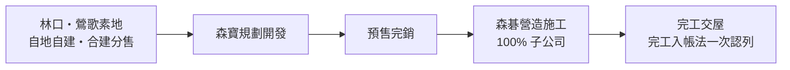
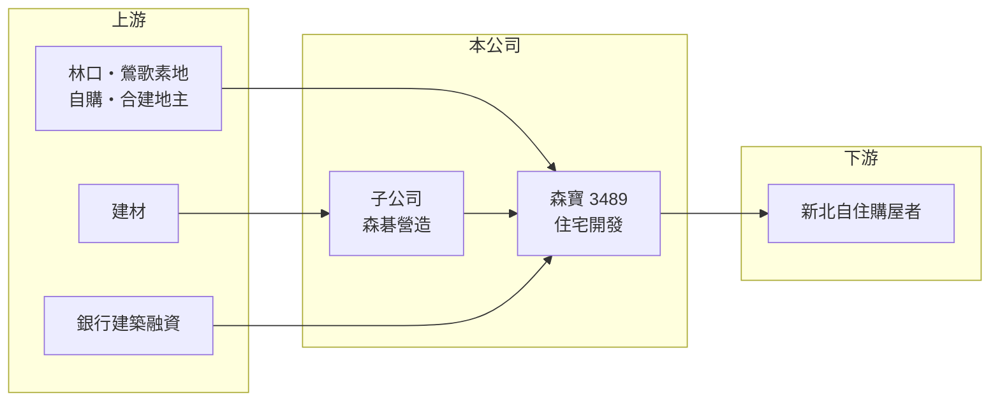

# 3489 森寶

> 上櫃｜[[產業索引-建材營造業|建材營造業]]｜上市（櫃）日期 2007/09/29

# 第一章：企業模式與商業藍圖

> [!info] 撰寫說明
> 本文由 Claude 依公開資料整理，架構比照 [[2330台積電]] 的四章研究，資料截至 2026-10-08。財務數字來源：Goodinfo 年度經營績效頁、富果研究 2025 年 9 月法說會整理；公開資料有限，公司沿革與營收結構未查得，產業描述為整理性內容，尚未逐條比對原始文件。#待校對

在評估單一個股的長期投資價值時，首要步驟是拆解企業的底層獲利邏輯。本章說明森寶開發（股票代號：3489，以下簡稱森寶）如何以新北林口與鶯歌的自住型住宅為核心，經營小規模、開發與營造一條龍的建設業務。

## 一、核心定位：新北西區的自住型建商

森寶的核心業務是住宅大樓開發與銷售，客群以自住為主，推案集中在新北市林口與鶯歌。已完工建案包括林口「美麗莊園」「快樂莊園」「森JIA」與鶯歌「森朵」「森睦」；在建的林口「森越」（100% 自建，總銷約 35 億元、226 戶）與「森治」（50% 合建，總銷約 32 億元、226 戶）已全數完銷，預計 2026 年下半年完工。

公司目前只做素地的自地自建與[[合建分售]]，暫不參與都更或危老重建。這個選擇的好處是時程較可控，不需整合大量地主；代價是必須在土地市場直接購地，土地成本與取得難度較高。

## 二、資本轉化邏輯：開發加營造一條龍

森寶持有 100% 的森碁營造（實收資本 1.1 億元），自行負責施工，可掌握工程品質與部分營建成本。公司採[[完工入帳法]]，建案完工交屋前財報通常呈現虧損，完工後一次認列營收與獲利，因此財報會在虧損年與豐收年之間大幅擺盪。

## 三、長期方向

經營層形容 2026 年兩案完工是「大豐收」，但也坦言未來 3 至 5 年的營收動能取決於土地取得，目前沒有確定的購地計畫，只表示持續關注北部土地。對股本約 9 億元的小型建商而言，每一次購地決策都會決定未來數年的營運。

# 第二章：護城河深度與競爭優勢

「護城河」指企業抵禦競爭、維持超額利潤的保護機制。小型建商通常沒有明顯護城河，本章說明森寶的相對優勢與限制。

## 一、相對優勢

森寶的優勢在於區域深耕與一條龍架構。在林口、鶯歌連續推案，熟悉當地自住客群的需求與價格帶，兩個在建案都能在完工前完銷，顯示產品定位符合市場。自有營造子公司則讓公司能以結構優化、輕量化設計與低碳建材控制成本。

## 二、主要競爭對手

| 對手 | 定位 | 對森寶的威脅 |
|---|---|---|
| [[2542興富發]] | 全台大量推案，新北為重點 | 以量能與價格競爭 |
| [[2501國建]] | 全台品牌型住宅 | 品牌型建商爭取換屋客 |
| 林口與鶯歌在地建商 | 區域型推案 | 爭取同一批土地與自住客 |

## 三、守得住／守不住／觀察重點

守得住的是林口、鶯歌的在地經驗與自住客群；守不住的是規模，案量少使營收高度集中，兩案交屋完後若沒有新土地，就會出現長期空窗。長期觀察重點是購地進度與價格、新案推出時間，以及高負債結構能否在交屋後明顯改善。

# 第三章：財務體質與盈利規模

資料日期：2026-10-08。數字取自 Goodinfo 年度經營績效與富果研究法說會整理，表格是撰寫當時的快照；最新月營收、毛利率、累計 EPS 由自動排程寫在本筆記的屬性欄位（月營收、毛利率、累計EPS 等）。#待校對

財務報表是檢驗護城河是否真實存在的最終標準。本章用五年的三率、ROE 與資本報酬檢視森寶的獲利品質。

## 一、多年度經營績效

| 年度 | 營收（新台幣） | [[毛利率]] | [[營業利益率]] | EPS（元） | [[ROE]] |
|---|---|---|---|---|---|
| 2021 | 19.1 億 | 9.56% | 3.51% | 0.57 | 3.65% |
| 2022 | 9.23 億 | 7.80% | 1.62% | 0.29 | 1.86% |
| 2023 | 7.42 億 | 6.16% | -1.23% | 0.12 | 0.73% |
| 2024 | 23.8 億 | 3.45% | -2.14% | -0.89 | -6.08% |
| 2025 | 7.19 億 | 6.54% | 1.35% | -0.09 | -0.69% |

2021 至 2025 年森寶的毛利率只有 3% 至 10%，明顯低於一般建商的 20% 以上，推估這段期間營收含有低毛利的其他業務或營造收入（推估，營收結構未查得）。平均 ROE 約 -0.1%（推算），本業在大案完工前幾乎沒有獲利。Goodinfo 統計歷年平均現金股利約 0.64 元，公司表示維持穩定發放，但近年獲利不足以支撐。

## 二、營建業指標

在建兩案合計總銷約 67 億元且已完銷，依投資比例推算歸屬森寶約 51 億元（35 億元加 32 億元的一半，推算），約為 2025 年營收的七倍，2026 年下半年完工後將集中認列。財務面，總資產約 39 億元、總負債約 27 億元、股東權益約 12 億元，負債比約 70%，屬於高槓桿。

## 三、[[ROIC]] 與 [[WACC]]：價值創造利差

**ROIC 推算：** 2025 年營業利益約 0.1 億元（7.19 億 × 1.35%），稅後不到 0.1 億元。股東權益約 12 億元（每股淨值 13.32 元 × 約 0.905 億股），假設有息負債約 20 億元（推估，約負債的四分之三），投入資本約 32 億元，ROIC 約 0.2%（推算）。

**WACC 推算：** 台灣 10 年期公債 1.75%、市場風險溢酬 6%、β 取營建同業常見值 0.9，股東權益成本約 7.2%；負債成本 3%、稅後 2.4%；權益占投入資本約 37%，WACC 約 4.2%（推算）。

**結論：** 過去五年森寶 ROIC 遠低於 WACC，主因是採完工入帳法、兩個大案的獲利尚未認列。2026 年完工後單年 ROIC 可能大幅跳升，但要判斷是否長期創造價值，需看後續能否以合理成本持續取得土地。

# 第四章：總體風險與地緣政治

任何企業都無法脫離宏觀環境獨立存在。本章分析森寶長期必須面對的風險。

## 一、案源斷層

兩案交屋後，未來 3 至 5 年的營收完全取決於購地進度。小型建商若無法連續推案，營收與獲利會出現多年空窗，股利也難以維持。

## 二、房市週期與政策

央行[[信用管制]]可能影響買方貸款；公司表示預售客戶目前正常繳款，未出現因核貸困難而解約的情況，但交屋期若遇到房市轉弱，仍有解約或延遲交屋的風險。林口與鶯歌屬於新北外圍，房價對景氣的敏感度通常高於市中心。

## 三、財務與成本

負債比約 70%，升息會增加利息成本，公司表示會把部分利息轉嫁到售價。營建成本方面，碳費對建築成本的影響約 0.9%，缺工與建材上漲則是全產業的長期壓力。

# 專有名詞解析

## 金融

- **[[信用管制]]**：央行限制購屋與建商貸款成數的政策，會影響房市成交與建商資金。
- **[[ROIC]]**：投入資本報酬率，稅後營業利益除以股東權益加有息負債，衡量本業運用資本的效率。
- **[[WACC]]**：加權平均資金成本，股東與債權人要求報酬率的加權平均，是 ROIC 要超越的門檻。

## 產業

- **[[完工入帳法]]**：建案完工交屋時才一次認列營收與成本的會計方法，使建商財報在交屋年度大幅跳升。
- **[[合建分售]]**：地主出地、建商出資興建，完工後雙方依比例各自出售房地的合作模式。
- **[[建案交屋]]**：建商在房屋完工並交付買方時才認列營收，因此營建公司的營收常集中在交屋年度。

# 核心供應鏈

## 1. 上游：土地、建材與資金
- 土地：林口、鶯歌素地與合建地主
- 建材：[[1101台泥]]、[[2002中鋼]] 等
- 資金：銀行建築融資

## 2. 中游：森寶與營造子公司
- 子公司：森碁營造（100%）
- 同業：[[2542興富發]]、[[2501國建]]

## 3. 下游：客戶
- 新北林口、鶯歌自住購屋者

## 最新新聞
<!-- news:start -->
<!-- news:end -->

## 相關連結
- [公開資訊觀測站](https://mopsov.twse.com.tw/mops/web/t05st03?step=1&firstin=1&co_id=3489)
- [Goodinfo](https://goodinfo.tw/tw/StockDetail.asp?STOCK_ID=3489)
- [Yahoo 股市](https://tw.stock.yahoo.com/quote/3489)
- [鉅亨網新聞](https://www.cnyes.com/twstock/3489/news)
