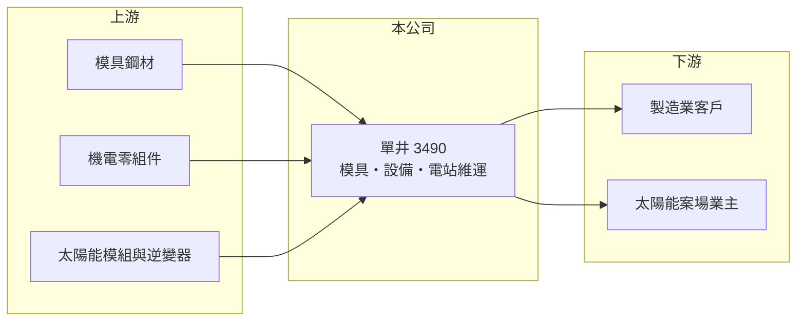

# 3490 單井

> 上櫃｜[[產業索引-光電業|光電業]]｜上市（櫃）日期 2007/10/15

# 第一章：企業模式與商業藍圖

> [!info] 撰寫說明
> 精簡版，由 Claude 依公開資料整理，架構比照 [[2330台積電]]，資料截至 2026-10-07。來源：winvest.tw 單井營收快訊與公司概況。公開資料有限，營收比重、客戶與 2026 年獲利大增的原因未查到。#待校對

單井是小型的模具與設備製造商，另經營太陽能電站維運，營收規模每月約兩三千萬元。

- **核心業務：** 單井工業成立於 1989 年，2007 年掛牌，營運範圍包括模具製造、機器設備製造與太陽能電站維運。
- **營收結構：** 本次未查到各業務比重；模具與設備屬接案型收入，[[案場維運]]則屬較穩定的經常性收入（推估）。
- **營運據點：** 營運與生產據點本次未查到，本文不推測。
- **長期方向：** 從設備製造延伸到綠能案場服務，可降低單靠設備訂單的波動；未來發展取決於設備接單與綠能業務能否擴大。

# 第二章：護城河深度與競爭優勢

單井規模小，護城河有限，主要靠[[精密模具]]與設備的客製化能力。

- **競爭優勢：** 模具與設備需配合客戶產品客製設計，長期合作的客戶較少輕易更換供應商（推估）。
- **主要對手：** 國內眾多中小型模具與自動化設備廠，以及太陽能案場維運業者。
- **觀察重點：** 2026 年上半年獲利大增的來源是否為一次性項目，以及本業營收能否持續成長。

# 第三章：財務體質與盈利規模

資料日期：2026-10-07，以下數字是撰寫當時的快照；最新月營收、毛利率、累計 EPS 由自動排程寫在本筆記的屬性欄位（月營收、毛利率、累計EPS 等）。#待校對

單井 2026 年營收小幅成長，但上半年 EPS 遠高於營收規模所能支撐的水準，可能含有一次性收益。

- **營收規模：** 2026 年 1 至 8 月累計營收 1.75 億元，年增 6.43%；8 月營收 2,410.5 萬元，年減 5.31%。
- **獲利：** 2025 年全年 EPS 0.05 元；2026 年第二季 EPS 4.08 元、上半年累計 6.15 元。以每月兩三千萬元的營收規模，這樣的獲利推估主要來自[[一次性收益]]（例如資產處分或業外收益），本次未查到確切原因。[[毛利率]]本次未查到。
- **財務特色：** 資本額約 5.50 億元，市值約 24 億元；若獲利來自一次性項目，不宜直接以上半年 EPS 推算全年本業獲利。

# 第四章：總體風險與地緣政治

單井的風險在於本業規模小與獲利來源不穩定。

- **產業週期：** 模具與設備需求跟著下游製造業的擴產與新產品開發起伏。
- **營運風險：** 營收規模小，少數訂單的有無就會造成大幅波動；一次性收益消失後，獲利可能回到接近損益兩平。
- **其他風險：** 太陽能案場的發電量受天候影響；躉購電價、綠能法規變動會影響案場收益。

# 專有名詞解析

## 金融

- **[[一次性收益]]**：非經常性的收益，例如處分資產或土地的利益，會讓當期 EPS 暫時偏高、不代表本業獲利能力。

## 產業

- **[[精密模具]]**：用來大量複製塑膠或金屬零件的模具，精度與耐用度決定零件品質與生產成本。
- **[[案場維運]]**：替太陽能等發電案場做巡檢、清洗、維修與監控，以維持發電效率的服務。

# 核心供應鏈

- 上游：模具鋼材、機電零組件、太陽能模組與逆變器供應商
- 下游／客戶：需要模具與設備的製造業客戶、太陽能案場業主（推估）
- 同業：國內中小型模具與自動化設備廠、太陽能案場維運業者

## 最新新聞
<!-- news:start -->
<!-- news:end -->

## 相關連結
- [公開資訊觀測站](https://mopsov.twse.com.tw/mops/web/t05st03?step=1&firstin=1&co_id=3490)
- [Goodinfo](https://goodinfo.tw/tw/StockDetail.asp?STOCK_ID=3490)
- [Yahoo 股市](https://tw.stock.yahoo.com/quote/3490)
- [鉅亨網新聞](https://www.cnyes.com/twstock/3490/news)
