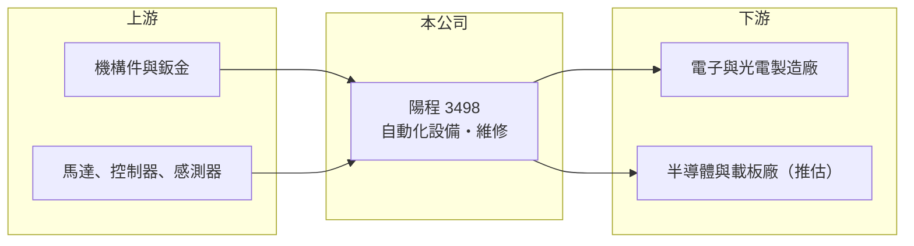

# 3498 陽程

> 上櫃｜[[產業索引-其他電子業|其他電子業]]｜上市（櫃）日期 2007/09/11

# 第一章：企業模式與商業藍圖

> [!info] 撰寫說明
> 精簡版，由 Claude 依公開資料整理，架構比照 [[2330台積電]]，資料截至 2026-10-07。來源：nstock.tw 陽程公司概況、winvest.tw 營收快訊。公開資料有限，產品比重、客戶與 2026 年成長來源未查得。#待校對

陽程是自動化設備製造商，2026 年營收與獲利大幅跳升。

- **核心業務：** 設計、生產[[自動化設備]]並提供維修服務，設備用於電子與光電產業的製程搬運與組裝（推估，依公司歷年業務描述）。
- **營收結構：** 本次未查得產品別或客戶產業別比重；設備營收以專案出貨與驗收認列，單月波動大。
- **營運據點：** 1996 年上櫃，資本額 6.13 億元。
- **長期方向：** 2026 年營收較前一年成長逾一倍，成長來源未在本次資料中說明，需追蹤公司法說會或年報確認。

# 第二章：護城河深度與競爭優勢

自動化設備業的競爭力來自客製化能力與客戶驗證實績。

- **競爭優勢：** 2026 年第二季[[毛利率]]達 46.45%，顯示現階段接到的設備附加價值高；長期服務客戶產線，具備維修與改機收入（推估）。
- **主要對手：** 國內自動化與製程設備廠，具體名單未查得。
- **觀察重點：** 高成長能否延續到 2027 年、新訂單的產業來源，以及毛利率能否維持在四成以上。

# 第三章：財務體質與盈利規模

資料日期：2026-10-07，表格是撰寫當時的快照；最新月營收、毛利率、累計 EPS 由自動排程寫在本筆記的屬性欄位（月營收、毛利率、累計EPS 等）。#待校對

陽程 2026 年上半年 EPS 已遠超 2025 年全年。

- **營收規模：** 2025 年全年營收 13.37 億元；2026 年 1 至 8 月累計 18.61 億元、年增 154.8%，8 月營收 3.59 億元、年增 326.05%。
- **獲利：** 2026 年上半年 EPS 3.26 元，2025 年全年 EPS 0.48 元；2026 年第二季毛利率 46.45%、[[營業利益率]] 29.37%、淨利率 25.65%。
- **財務特色：** 設備出貨認列時點集中，4 月營收月增 351%、6 月月增 103%，單月營收起伏劇烈；近五年平均現金股利 0.4 元。

# 第四章：總體風險與地緣政治

陽程的風險在於訂單集中與設備業的高波動。

- **產業週期：** 設備訂單取決於客戶的[[CapEx]]，客戶擴產結束後營收可能快速回落，2025 年 EPS 僅 0.48 元即為前例。
- **營運風險：** 專案型營收的驗收延遲會造成單季獲利大幅波動；客戶集中度可能偏高（推估）。
- **其他風險：** 股價已從近一年均價約 99 元漲至 230 元，評價反映高成長預期；匯率與零組件成本亦有影響。

# 專有名詞解析

## 金融

- **[[毛利率]]**：營業毛利占營收的比例，反映產品定價能力與成本結構。
- **[[營業利益率]]**：營業利益占營收的比例，反映扣除營業費用後本業的獲利能力。
- **[[CapEx]]**：資本支出，企業購置廠房、機器設備等長期資產的支出。

## 產業

- **[[自動化設備]]**：以機械、感測與控制系統取代人工完成搬運、組裝或檢測的機台。

# 核心供應鏈

- 上游：機構件、馬達、控制器與感測器供應商（推估）
- 下游／客戶：電子、光電相關製造廠，客戶名稱未揭露
- 同業：國內自動化設備廠，具體名單未查得

## 最新新聞
<!-- news:start -->
<!-- news:end -->

## 相關連結
- [公開資訊觀測站](https://mopsov.twse.com.tw/mops/web/t05st03?step=1&firstin=1&co_id=3498)
- [Goodinfo](https://goodinfo.tw/tw/StockDetail.asp?STOCK_ID=3498)
- [Yahoo 股市](https://tw.stock.yahoo.com/quote/3498)
- [鉅亨網新聞](https://www.cnyes.com/twstock/3498/news)
