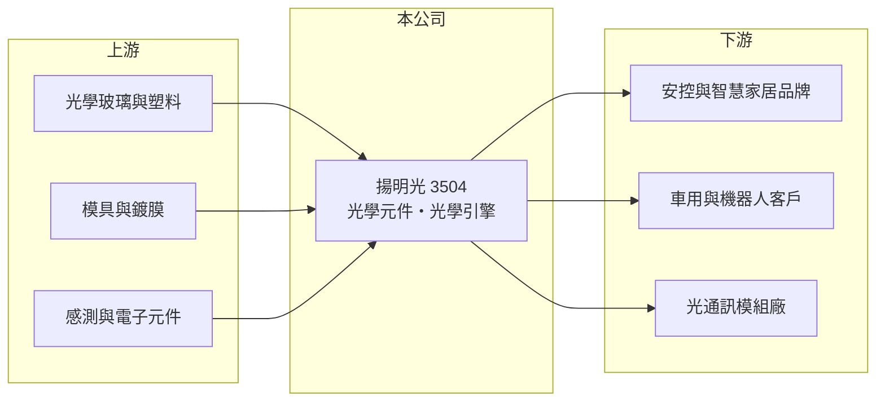

# 3504 揚明光

> 上市｜[[產業索引-光電業|光電業]]｜上市（櫃）日期 2007/01/26

# 第一章：企業模式與商業藍圖

> [!info] 撰寫說明
> 精簡版，由 Claude 依公開資料整理，架構比照 [[2330台積電]]，資料截至 2026-10-07。來源：nstock.tw 揚明光公司概況、Yahoo 股市轉載 2025 年第一季報導。營收比重未查到；集團關係為市場普遍說法，屬推估。#待校對

揚明光是光學元件與光學引擎廠，獲利長期在損益兩平附近，近年試圖以機器人視覺與矽光子尋找新成長。

- **核心業務：** 揚明光成立於 2002 年，業務為光學元件、光學引擎及其關鍵組件的研發、設計、製造與銷售，產品分為取像光學（安控、智慧家居鏡頭）、光學元件與車用產品。
- **營收結構：** 本次未查到比重；依 2025 年報導，取像光學受智慧家居與傳統安控鏡頭帶動成長，光學元件與車用產品出貨持平。
- **營運據點：** 生產據點本次未查到；市場普遍將揚明光歸為投影機大廠 [[5371中光電]] 的關係企業（推估），實際股權關係本次未查證。
- **長期方向：** 與北美客戶合作[[機器視覺]]領域的機器人雷達鏡頭，並研發以[[模造玻璃]]技術製作的 [[CPO]] 光連接產品，切入[[矽光子]]供應鏈。

# 第二章：護城河深度與競爭優勢

揚明光的優勢在於光學設計與模造玻璃技術，但產品多屬成熟市場，毛利率偏低。

- **競爭優勢：** 同時具備鏡頭、光學元件與光學引擎的設計能力，能把技術延伸到機器人與光通訊等新應用。
- **主要對手：** 國內有 [[3441聯一光]]、[[3362先進光]]、[[3406玉晶光]] 等光學廠，中國則有舜宇光學等大廠。
- **觀察重點：** 機器人視覺與 CPO 相關產品能否從開發進入量產，並帶動毛利率脫離目前一成多的水準。

# 第三章：財務體質與盈利規模

資料日期：2026-10-07，以下數字是撰寫當時的快照；最新月營收、毛利率、累計 EPS 由自動排程寫在本筆記的屬性欄位（月營收、毛利率、累計EPS 等）。#待校對

揚明光 2026 年營收小幅成長，獲利在損益兩平附近。

- **營收規模：** 2025 年全年營收 26.89 億元；2026 年 1 至 8 月累計 19.33 億元，年增 8.98%，8 月營收 2.43 億元。
- **獲利：** 2025 年全年 EPS -0.08 元；2026 年第二季 EPS 0.05 元，[[毛利率]] 16.44%。
- **財務特色：** 資本額約 11.41 億元，市值約 91 億元；近五年未配發現金股利，市場評價主要反映新應用的題材而非目前獲利。

# 第四章：總體風險與地緣政治

揚明光的風險在於低毛利與新事業的不確定性。

- **產業週期：** 安控、智慧家居與車用鏡頭需求跟著消費性電子與車市景氣起伏，公司自己也表示訂單存在不確定因素。
- **營運風險：** 毛利率只有一成多，營收小幅下滑就可能轉為虧損；新產品研發費用會先於營收發生。
- **其他風險：** 中國光學廠的價格競爭；矽光子與機器人市場的發展速度若不如預期，題材可能難以轉為實際營收。

# 專有名詞解析

## 半導體

- **[[矽光子]]**：在矽晶片上製作光學元件，以光取代電傳輸資料，可降低 AI 資料中心的傳輸耗電。
- **[[CPO]]**：共同封裝光學，把光收發元件與交換器或運算晶片封裝在一起，縮短電訊號距離、降低功耗。

## 應用

- **[[機器視覺]]**：以相機與影像演算法讓機器辨識物體與檢測瑕疵，廣泛用於工廠自動化與檢測設備。

## 產業

- **[[模造玻璃]]**：把玻璃加熱軟化後以精密模具壓製成鏡片的製程，可大量生產非球面玻璃鏡片。

# 核心供應鏈

- 上游：光學玻璃與塑料、模具與鍍膜、感測與電子元件供應商
- 下游／客戶：安控與智慧家居品牌、車用與機器人客戶（含北美合作客戶）、光通訊模組廠
- 同業：[[3441聯一光]]、[[3362先進光]]、[[3406玉晶光]]、舜宇光學

## 最新新聞
<!-- news:start -->
<!-- news:end -->

## 相關連結
- [公開資訊觀測站](https://mopsov.twse.com.tw/mops/web/t05st03?step=1&firstin=1&co_id=3504)
- [Goodinfo](https://goodinfo.tw/tw/StockDetail.asp?STOCK_ID=3504)
- [Yahoo 股市](https://tw.stock.yahoo.com/quote/3504)
- [鉅亨網新聞](https://www.cnyes.com/twstock/3504/news)
