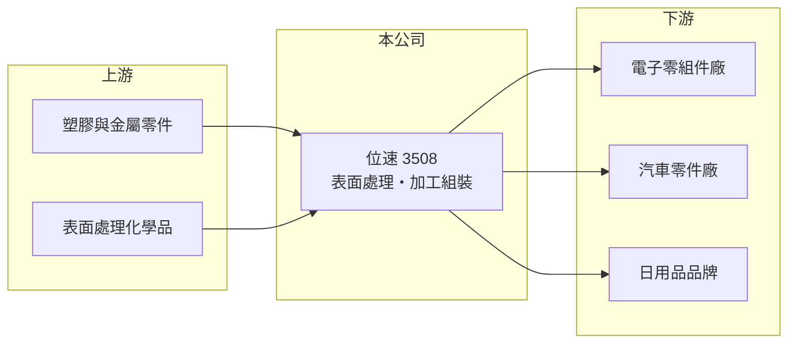

# 3508 位速

> 上櫃｜[[產業索引-其他電子業|其他電子業]]｜上市（櫃）日期 2007/10/17

# 第一章：企業模式與商業藍圖

> [!info] 撰寫說明
> 精簡版，由 Claude 依公開資料整理，架構比照 [[2330台積電]]，資料截至 2026-10-07。來源：winvest.tw 位速營收快訊與公司簡介。公開資料有限，產品比重、客戶與據點未查得。#待校對

位速從事塑膠日用品、電子零組件與汽車零件的表面處理與加工組裝。

- **核心業務：** 依公司登記業務，承接各式塑膠日用品、電子零組件、汽車及其零件的[[表面處理]]，並提供加工組裝服務。
- **營收結構：** 本次未查得產品或客戶產業比重；2026 年營收成長主要來自加工組裝需求增加。
- **營運據點：** 2001 年成立、2007 年上市，資本額 10.89 億元；生產據點未查得。
- **長期方向：** 擴大加工組裝業務以提高產能利用率，力求轉虧為盈（推估）。

# 第二章：護城河深度與競爭優勢

位速屬於代工加工型業務，議價能力有限。

- **競爭優勢：** 具備多種材質的表面處理與組裝整合能力，可提供客戶一站式加工（推估）。
- **主要對手：** 國內外表面處理與機構件加工廠，具體對手名單未查得。
- **觀察重點：** 加工組裝訂單能否持續、營收成長是否帶動虧損收斂。

# 第三章：財務體質與盈利規模

資料日期：2026-10-07，表格是撰寫當時的快照；最新月營收、毛利率、累計 EPS 由自動排程寫在本筆記的屬性欄位（月營收、毛利率、累計EPS 等）。#待校對

位速營收回升，但仍處於虧損。

- **營收規模：** 2026 年 1 至 8 月累計 6.42 億元、年增 7.67%；8 月營收 9,809 萬元、年增 67.19%，4 月營收曾年減 18.99%。
- **獲利：** 2026 年第二季 EPS 負 0.24 元，上半年累計負 0.34 元；2025 年全年 EPS 負 1.51 元。
- **財務特色：** 市值約 23 億元，連續虧損會侵蝕股東權益，需留意[[營運槓桿]]在營收回升時能否發揮。

# 第四章：總體風險與地緣政治

位速的風險在於虧損延續與代工訂單不穩定。

- **產業週期：** 電子與汽車零件需求隨消費性電子與車市景氣變動，代工訂單能見度短。
- **營運風險：** 加工代工毛利偏低，營收規模不足以攤提固定成本時難以獲利。
- **其他風險：** 表面處理涉及化學品與廢水，環保法規趨嚴會增加成本；匯率與原物料價格波動。

# 專有名詞解析

## 金融

- **[[營運槓桿]]**：固定成本占比高時，營收小幅變動會帶來獲利大幅變動的現象。

## 產業

- **[[表面處理]]**：在金屬或塑膠零件表面電鍍、陽極處理或塗裝，以提升外觀、耐磨與抗腐蝕性。

# 核心供應鏈

- 上游：塑膠與金屬零件、表面處理化學品供應商（推估）
- 下游／客戶：電子零組件、汽車零件與日用品客戶，客戶名稱未揭露
- 同業：表面處理與加工組裝廠，具體名單未查得

## 最新新聞
<!-- news:start（自動產生，請勿手動編輯此範圍） -->
- 2026-10-08 📰 媒體 17:23｜營收速報 - 位速(3508)9月營收9,025萬元年增率高達92.63％｜[鉅亨網](https://news.cnyes.com/news/id/6625013)

完整紀錄：[[3508位速 新聞]]
<!-- news:end -->

## 相關連結
- [公開資訊觀測站](https://mopsov.twse.com.tw/mops/web/t05st03?step=1&firstin=1&co_id=3508)
- [Goodinfo](https://goodinfo.tw/tw/StockDetail.asp?STOCK_ID=3508)
- [Yahoo 股市](https://tw.stock.yahoo.com/quote/3508)
- [鉅亨網新聞](https://www.cnyes.com/twstock/3508/news)
