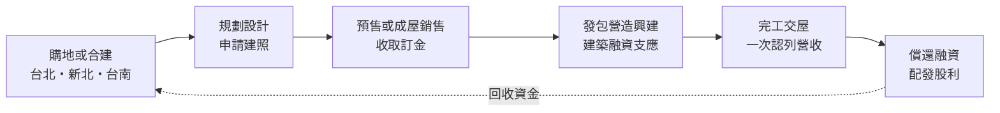
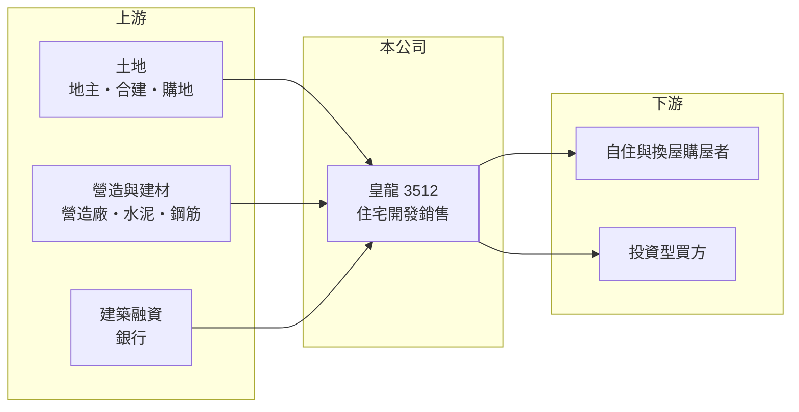

# 3512 皇龍

> 上櫃｜[[產業索引-建材營造業|建材營造業]]｜上市（櫃）日期 2007/07/25

# 第一章：企業模式與商業藍圖

> [!info] 撰寫說明
> 本文由 Claude 依公開資料整理，架構比照 [[2330台積電]] 的四章研究，資料截至 2026-10-08。財務數字來源：MoneyDJ 理財網年度財務比率與損益表、櫃買中心開放資料（基本資料、2026 年第二季財報、本益比殖利率）；業務描述參考經濟日報、富果研究法說會頁面的新聞標題。公開資料有限，個別建案內容未逐案查證。#待校對

在評估一家建商的長期價值時，第一步是看懂它怎麼取得土地、怎麼把土地變成房子賣出、以及獲利何時入帳。本章針對皇龍開發（股票代號：3512，以下簡稱皇龍）的商業模式進行定性分析，說明一家以台北為基地的中小型建商，如何靠少量但精選的建案經營。

## 一、核心定位：以台北為基地的中小型住宅建商

皇龍成立於 1992 年，2007 年在櫃買中心掛牌，總部位於台北市信義區，董事長為陳文宏，實收資本額約 11.3 億元。公司的本業是住宅與商用不動產的開發銷售，自己找地、規劃設計，再發包給營造廠興建，完工後把房屋交給買方。

* **少案量、高單價的經營方式：** 皇龍每年營收多在 9 億至 30 億元之間，代表手上同時進行的建案只有少數幾個。單一建案的銷售與交屋進度，就足以決定一整年的營收與獲利，這是中小型建商最主要的特徵。
* **營收在交屋時才認列：** 台灣建商採[[建案交屋]]認列營收，預售期間收到的訂金與工程款先列為負債，等房屋完工、過戶交屋後才一次入帳。因此皇龍的營收常出現一年大增、隔年大減的情形，例如 2024 年營收年減約 70%，2025 年又年增約 63%。

## 二、資本轉化邏輯：土地、融資、預售、交屋

* **資金週轉的核心是土地：** 建商的錢大部分壓在土地與在建工程上，從買地到交屋常要三至五年。皇龍 2026 年第二季底總資產約 63.3 億元，其中流動資產約 62.6 億元，主要就是土地與在建房地等存貨。
* **財務槓桿：** 土地與工程款大多以銀行建築融資支應，皇龍的負債比率在 2019 年約 76%，之後逐步降到 2025 年的 52%，財務結構比多數同業保守。

## 三、長期方向：跨出台北、補充土地庫存

* **布局南部：** 依經濟日報報導，皇龍斥資約 7.68 億元購入台南永康區約 1,471 坪土地。台北土地取得成本高、可開發土地少，往房價較低、需求穩定的南部城市補地，是中小型建商延續推案的常見做法。
* **穩定配息：** 依櫃買中心資料，最近一次現金股利為每股 1.8 元，相對 2025 年 EPS 2.44 元，配發率約七成四（推算），顯示公司傾向把交屋獲利回饋股東，而不是大量保留擴張。

# 第二章：護城河深度與競爭優勢

護城河是企業抵禦競爭、長期維持超額利潤的機制。對建商而言，護城河通常很淺，本章說明皇龍可以依靠的是什麼、會面對誰，以及這些優勢能守住多少。

## 一、皇龍護城河的核心組成要素

* **1. 精選土地與產品定位：** 建商的利潤在買地那一刻就決定了大半。皇龍案量少，可以把資源集中在少數地段，2025 年[[毛利率]]約 35%，2026 年上半年約 41%，高於許多以量取勝的同業，反映選地與定價能力。
* **2. 保守的財務結構：** 負債比率由七成以上降到五成左右，代表在房市轉冷時比較不會被迫降價求售。對建商來說，撐得住的資金能力本身就是一種防禦。
* **3. 長期經營的地方口碑：** 公司在台北經營超過三十年，地主合建與購屋者都會參考建商過去的交屋品質。這種信任不容易量化，但影響土地取得與銷售速度。

## 二、主要競爭對手格局

| 對手 | 定位 | 對皇龍的威脅 |
|---|---|---|
| [[2542興富發]] | 全台大型建商，案量大 | 搶同區土地，規模帶來較低的融資與營造成本 |
| [[2520冠德]] | 台北老牌建商，品牌知名度高 | 在台北中高價住宅直接競爭 |
| [[5534長虹]] | 台北都會區住宅與商辦 | 同樣以台北精華區為主要市場 |
| 台南在地建商 | 熟悉南部市場與地主關係 | 皇龍跨區進入台南須面對地方型建商 |

## 三、優勢轉化：哪些守得住、哪些守不住

* **守得住：** 在房市穩定時，皇龍憑選地與財務彈性，可以維持三成以上的毛利率，並以少量建案創造不錯的 ROE。
* **守不住：** 案量少讓營收高度不穩定，只要一個建案延後交屋或銷售不順，全年獲利就可能大幅下滑，2024 年 EPS 僅 0.58 元就是例子。
* **觀察重點：** 第一，台南永康土地的推案時程與銷售成績，這是公司能否跨出台北的試金石；第二，[[已售未入帳]]金額是否足以支撐未來兩三年的交屋；第三，[[信用管制]]是否長期壓抑中高價住宅的成交量。

# 第三章：財務體質與盈利規模

資料日期：2026-10-08。數字取自 MoneyDJ 理財網年度財務資料與櫃買中心開放資料，表格是撰寫當時的快照；最新月營收、毛利率、累計 EPS 由自動排程寫在本筆記的屬性欄位（月營收、毛利率、累計EPS 等）。#待校對

財務報表是檢驗護城河是否真實存在的最終標準。本章用五年的三率、ROE、營建業指標與資本報酬，檢視皇龍在房市週期中的獲利品質。

## 一、獲利能力的基石：三率

| 年度 | 營收（新台幣） | [[毛利率]] | [[營業利益率]] | EPS（元） | [[ROE]] |
|---|---|---|---|---|---|
| 2021 | 22.1 億 | 25.9% | 16.2% | 3.79 | 19.9% |
| 2022 | 22.4 億 | 26.3% | 16.9% | 3.88 | 18.7% |
| 2023 | 29.6 億 | 20.8% | 12.9% | 5.45 | 24.3% |
| 2024 | 8.8 億 | 25.8% | 9.95% | 0.58 | 2.68% |
| 2025 | 14.3 億 | 35.0% | 23.2% | 2.44 | 11.3% |

資料來源：MoneyDJ 理財網年度損益表與財務比率。2026 年上半年（櫃買中心資料）營收約 2.73 億元、毛利率約 40.6%、營業利益率約 21.9%、EPS 0.45 元。

皇龍的毛利率在 2021 至 2024 年大致落在 21% 至 26%，2025 年跳升到 35%，代表近年交屋的建案土地成本較低或售價較好。2021 至 2025 年營收年複合成長率約負 10%（推算），但建商營收依交屋時點認列，單一年度變動大，用多年平均觀察較有意義。往前看 2018 至 2019 年，皇龍曾經營業虧損或接近損益兩平，2020 年起才進入穩定獲利期。

## 二、營建業指標：推案量、已售未入帳與存貨

公司未公開完整的已售未入帳金額與未來推案總銷（未查得）。從資產負債表看，2026 年第二季底流動資產約 62.6 億元，約為 2025 年營收的四倍，代表手上的土地與在建房地足以支撐數年的交屋，但也表示資金回收期長。負債總計約 38.3 億元，負債比率約 60%（官方資料推算），高於 2025 年底 MoneyDJ 的 52%，可能與新購土地的融資有關（推估）。

## 三、[[ROE]] 與股利

2021 至 2025 年平均 ROE 約 15.4%（推算），在建商中屬於中上水準，但年度之間落差很大，2023 年 24% 而 2024 年不到 3%。最近一次現金股利每股 1.8 元，配發率約七成以上（推算），股利隨交屋獲利起伏。建商的自由現金流與交屋時點高度相關，買地的年度常為負、交屋的年度轉正，長期是否為正須看多年合計（未查得完整現金流量資料）。

## 四、[[ROIC]] 與 [[WACC]]：價值創造利差

**ROIC 推算：** 2025 年營業利益約 3.32 億元，稅後約 2.66 億元。官方資料只揭露負債總計約 38.3 億元，未區分有息負債；假設其中六成為建築融資等有息負債，約 23.0 億元（推估），加上股東權益約 25.0 億元，投入資本約 48.0 億元，ROIC 約 5.5%（推算）。以 2021 至 2025 年平均營業利益計算，ROIC 約 5.1%（推算）。

**WACC 推算：** 台灣 10 年期公債殖利率取 1.75%、市場風險溢酬 6%、β 取營建同業常見值 0.9（未查得公司實際 β），股東權益成本約 7.2%。負債成本假設 3%，稅率 20%，稅後約 2.4%。權益約占投入資本 52%，WACC 約 4.9%（推算）。

**結論：** 皇龍的 ROIC 與 WACC 大致相當、略高一些，代表過去五年整體上剛好賺回資金成本並小幅創造價值。建商的 ROIC 受買地時點影響很大，若台南等新土地能以三成以上毛利率完成交屋，利差有機會擴大；若推案延後、土地長期閒置，ROIC 就會落到 WACC 之下。

# 第四章：總體風險與地緣政治

任何企業都無法脫離宏觀環境獨立存在。本章分析皇龍長期必須面對的房市週期、政策、營運與財務風險。

## 一、產業週期與政策風險

* **房市週期：** 住宅需求跟利率、薪資成長與人口結構高度相關。房市熱絡時建商可以預售順利、提高售價；房市冷卻時預售去化變慢，完工後餘屋要背負利息。
* **[[信用管制]]：** 央行多次調整購屋與建商融資的貸款成數，2024 年第七波選擇性信用管制後，全台房市交易量明顯下滑。管制會同時影響買方貸款與建商的土地融資，對中小型建商的衝擊通常較大。
* **稅制與法規：** 房地合一稅、囤房稅與預售屋轉售限制等政策，會壓抑投資型買盤，使高價住宅的去化時間拉長。

## 二、營運環境的隱性風險

* **案量集中：** 皇龍同時進行的建案少，任何一個建案的工期延誤、銷售不佳或交屋糾紛，都會直接反映在全年獲利。
* **營造成本：** 缺工與建材價格上漲會推高營造成本，若預售時已鎖定售價，成本上升就會侵蝕毛利。
* **跨區經營：** 台南市場的地主關係、銷售通路與價格帶都與台北不同，新市場的學習成本是跨區布局的隱性風險。

## 三、財務與其他風險

* **利率：** 建築融資多為浮動利率，利率上升會增加持有土地的成本。
* **公司治理：** 依公開資訊公告標題，皇龍曾有向關係人出售建案房地與車位、對關係人捐贈等事項。這些交易本身合法，但投資人宜留意定價是否公允。
* **流動性：** 股本約 11.3 億元，屬小型股，交易量有限，股價波動可能大於基本面。

# 專有名詞解析

## 金融

- **[[信用管制]]**：央行限制購屋與建商貸款成數的政策，會影響房市成交與建商資金。
- **[[ROIC]]**：投入資本報酬率，稅後營業利益除以股東權益加有息負債，衡量本業運用資本的效率。
- **[[WACC]]**：加權平均資金成本，股東與債權人要求報酬率的加權平均，是 ROIC 要超越的門檻。

## 產業

- **[[建案交屋]]**：建商在房屋完工並交付買方時才認列營收，因此營建公司的營收常集中在交屋年度。
- **[[已售未入帳]]**：已經賣出、但尚未完工交屋而未認列營收的建案金額，是建商未來營收的主要能見度指標。
- **[[預售屋]]**：房屋在興建完成前就先銷售，買方分期繳款，建商可藉此降低資金與銷售風險。

# 核心供應鏈

## 1. 上游：土地、營造與資金
- 土地來源：台北、新北自購與合建，近年補進台南永康土地
- 營造：外部發包營造廠（合作對象未查得）；建材如 [[1101台泥]]、[[2002中鋼]]
- 資金：銀行建築融資

## 2. 中游：皇龍與同業
- 同業：[[2542興富發]]、[[2520冠德]]、[[5534長虹]]

## 3. 下游：客戶
- 台北與台南的自住、換屋與投資型購屋者

## 最新新聞
<!-- news:start（自動產生，請勿手動編輯此範圍） -->
- 2026-10-07 📰 媒體 18:53｜營收速報 - 皇龍(3512)9月營收1,450萬元年增率高達47.39％｜[鉅亨網](https://news.cnyes.com/news/id/6623863)

完整紀錄：[[3512皇龍 新聞]]
<!-- news:end -->

## 相關連結
- [公開資訊觀測站](https://mopsov.twse.com.tw/mops/web/t05st03?step=1&firstin=1&co_id=3512)
- [Goodinfo](https://goodinfo.tw/tw/StockDetail.asp?STOCK_ID=3512)
- [Yahoo 股市](https://tw.stock.yahoo.com/quote/3512)
- [鉅亨網新聞](https://www.cnyes.com/twstock/3512/news)
