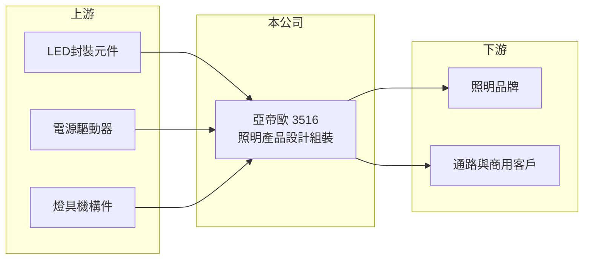

# 3516 亞帝歐

> 上櫃｜[[產業索引-光電業|光電業]]｜上市（櫃）日期 2007/11/29

# 第一章：企業模式與商業藍圖

> [!info] 撰寫說明
> 精簡版，由 Claude 依公開資料整理，架構比照 [[2330台積電]]，資料截至 2026-10-07。來源：winvest.tw 亞帝歐營收快訊與公司概況。公開資料有限，營收比重、客戶與營運據點未查到。#待校對

亞帝歐是小型照明產品公司，2026 年營收成長，但獲利仍很薄。

- **核心業務：** 亞帝歐光電成立於 1991 年，2007 年掛牌，主要從事照明產品的設計與組裝，屬 [[LED照明]]成品廠（推估）。
- **營收結構：** 本次未查到產品或地區比重。
- **營運據點：** 營運與生產據點本次未查到，本文不推測。
- **長期方向：** 照明產業已高度成熟，成長機會在商用與專業照明、[[智慧照明]]等較高單價的利基市場（推估）。

# 第二章：護城河深度與競爭優勢

亞帝歐規模小，在照明成品市場缺乏明顯護城河。

- **競爭優勢：** 具設計與組裝能力，可替客戶做客製化或 [[ODM]] 產品，接單彈性較高（推估）。
- **主要對手：** 國內外眾多照明成品廠，中國大型照明廠以規模與低價競爭。
- **觀察重點：** 2026 年營收成長能否轉化為較高的獲利，以及毛利率變化。

# 第三章：財務體質與盈利規模

資料日期：2026-10-07，以下數字是撰寫當時的快照；最新月營收、毛利率、累計 EPS 由自動排程寫在本筆記的屬性欄位（月營收、毛利率、累計EPS 等）。#待校對

亞帝歐 2026 年前七月營收年增兩成多，但 EPS 仍低。

- **營收規模：** 2026 年 1 至 7 月累計營收 6.51 億元，年增 23.55%；7 月營收 8,268.9 萬元，年減 2.68%；6 月營收 9,510.6 萬元，年增 18.49%。
- **獲利：** 2025 年全年 EPS 0.27 元；2026 年第一季 EPS 0.08 元。[[毛利率]]本次未查到。
- **財務特色：** 資本額約 5.96 億元，市值約 16 億元，屬小型股。

# 第四章：總體風險與地緣政治

亞帝歐的風險在於照明產業的低毛利與價格競爭。

- **產業週期：** 照明需求跟著商用建案、零售通路與消費景氣起伏。
- **營運風險：** 營收成長若來自低毛利訂單，獲利可能無法同步提升；固定費用攤提壓力大。
- **其他風險：** LED 元件與金屬、塑膠等原物料價格波動，以及美國關稅與匯率變化，都會影響成本與報價。

# 專有名詞解析

## 產業

- **[[LED照明]]**：以 LED 作為光源的燈具與照明系統，耗電低、壽命長，已取代大部分傳統燈泡與燈管。
- **[[ODM]]**：原廠委託設計製造，由代工廠負責設計與生產，再以客戶品牌出貨。
- **[[智慧照明]]**：可透過網路或感測器調整亮度、色溫與開關的照明系統，常結合節能控制與建築管理。

# 核心供應鏈

- 上游：LED封裝元件（如 [[2393億光]]）、電源驅動器、燈具機構件供應商
- 下游／客戶：照明品牌、通路與商用客戶（推估）
- 同業：國內外照明成品廠

## 最新新聞
<!-- news:start -->
<!-- news:end -->

## 相關連結
- [公開資訊觀測站](https://mopsov.twse.com.tw/mops/web/t05st03?step=1&firstin=1&co_id=3516)
- [Goodinfo](https://goodinfo.tw/tw/StockDetail.asp?STOCK_ID=3516)
- [Yahoo 股市](https://tw.stock.yahoo.com/quote/3516)
- [鉅亨網新聞](https://www.cnyes.com/twstock/3516/news)
