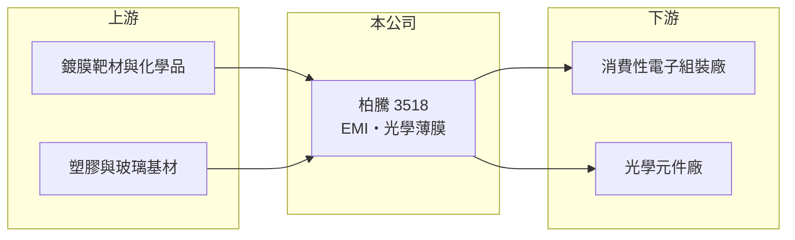

# 3518 柏騰

> 上市｜[[產業索引-其他電子業|其他電子業]]｜上市（櫃）日期 2007/11/28

# 第一章：企業模式與商業藍圖

> [!info] 撰寫說明
> 精簡版，由 Claude 依公開資料整理，架構比照 [[2330台積電]]，資料截至 2026-10-07。來源：nstock.tw 柏騰公司概況、winvest.tw 營收快訊。公開資料有限，產品比重、客戶與據點未查得。#待校對

柏騰從事 EMI 防護、光電與光學薄膜的加工製造，營收規模小且近年虧損。

- **核心業務：** 依公司登記業務，從事 [[EMI]] 防護、光電與[[光學鍍膜]]薄膜製作，以及機械設備與零組件的研發、製造與買賣。
- **營收結構：** 本次未查得產品或客戶產業比重。
- **營運據點：** 1995 年成立，2007 年在證交所上市，資本額 10.24 億元；生產據點未查得。
- **長期方向：** 營收連續衰退，公司需要新產品或新應用來恢復成長（推估）。

# 第二章：護城河深度與競爭優勢

柏騰的鍍膜技術屬加工型服務，競爭激烈。

- **競爭優勢：** 具備真空鍍膜與 EMI 防護加工經驗，可應用於電子產品外殼與光學元件（推估）。
- **主要對手：** 國內外鍍膜與 EMI 加工廠，具體對手名單未查得。
- **觀察重點：** 營收何時止跌、虧損能否收斂；股價由近一年均價約 26 元漲至 50 元，需確認是否有新業務支撐。

# 第三章：財務體質與盈利規模

資料日期：2026-10-07，表格是撰寫當時的快照；最新月營收、毛利率、累計 EPS 由自動排程寫在本筆記的屬性欄位（月營收、毛利率、累計EPS 等）。#待校對

柏騰營收持續衰退，2025 年虧損擴大。

- **營收規模：** 2025 年全年營收 3.2 億元；2026 年 1 至 8 月累計 1.6 億元、年減 25.06%，6 月營收 1,597 萬元、年減 42.36%。
- **獲利：** 2026 年第二季 EPS 負 0.04 元；2025 年全年 EPS 負 1.56 元。
- **財務特色：** 2025 年度未配發現金股利，近五年平均現金股利 0.3 元；市值約 51.5 億元，相對營收規模偏高。

# 第四章：總體風險與地緣政治

柏騰的風險在於營收萎縮與評價偏高。

- **產業週期：** 鍍膜與 EMI 加工需求隨手機、筆電等消費性電子出貨變動。
- **營運風險：** 營收規模持續縮小，固定成本難以攤提，虧損可能延續。
- **其他風險：** 股價大幅上漲但基本面尚未改善，評價波動風險高；鍍膜製程的環保與能源成本。

# 專有名詞解析

## 應用

- **[[光學鍍膜]]**：在鏡片或玻璃表面鍍上多層薄膜，用來增加透光、過濾特定波長或降低反射。

## 產業

- **[[EMI]]**：電磁干擾，電子產品需以鍍膜或屏蔽材料抑制對外輻射與外部干擾，才能通過法規認證。

# 核心供應鏈

- 上游：鍍膜靶材、化學品與基材供應商（推估）
- 下游／客戶：消費性電子與光學元件廠，客戶名稱未揭露
- 同業：鍍膜與 EMI 加工廠，具體名單未查得

## 最新新聞
<!-- news:start（自動產生，請勿手動編輯此範圍） -->
- 2026-10-06 🏛️ 重訊 14:47｜公告本公司及子公司達公開發行公司資金貸與及背書保證 處理準則第二十二條第一項第二款｜[觀測站](https://mops.twse.com.tw/mops/#/web/t05st01)

完整紀錄：[[3518柏騰 新聞]]
<!-- news:end -->

## 相關連結
- [公開資訊觀測站](https://mopsov.twse.com.tw/mops/web/t05st03?step=1&firstin=1&co_id=3518)
- [Goodinfo](https://goodinfo.tw/tw/StockDetail.asp?STOCK_ID=3518)
- [Yahoo 股市](https://tw.stock.yahoo.com/quote/3518)
- [鉅亨網新聞](https://www.cnyes.com/twstock/3518/news)
