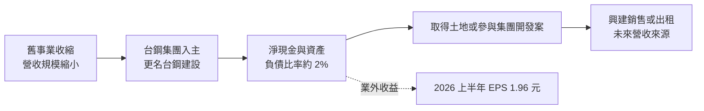
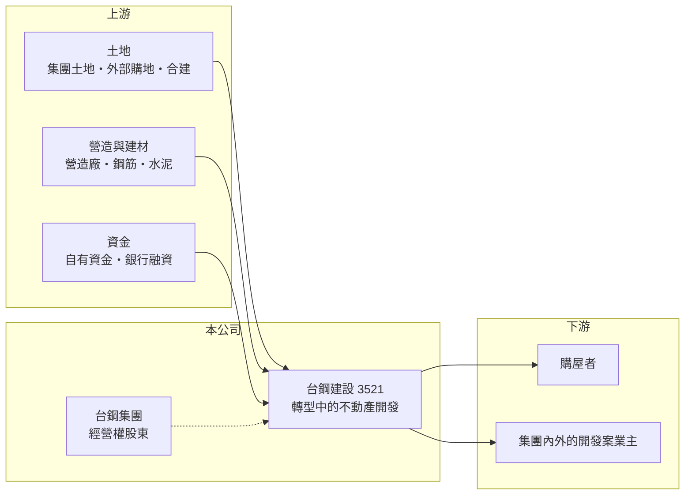

# 3521 台鋼建設

> 上櫃｜[[產業索引-建材營造業|建材營造業]]｜上市（櫃）日期 2025/06/02

# 第一章：企業模式與商業藍圖

> [!info] 撰寫說明
> 本文由 Claude 依公開資料整理，架構比照 [[2330台積電]] 的四章研究，資料截至 2026-10-08。財務數字來源：MoneyDJ 理財網年度財務比率與損益表、櫃買中心開放資料（基本資料、2026 年第二季財報）；更名與集團背景參考 Yahoo 股市公告標題、nStock 與科技新報公司資料頁標題。公開資料有限，轉型後的業務內容與建案未能逐一查證。#待校對

在評估一家公司的長期價值時，第一步是看懂它現在靠什麼賺錢、未來打算靠什麼賺錢。本章針對台鋼建設事業（股票代號：3521，以下簡稱台鋼建設）進行定性分析。這家公司的特殊之處在於它是一家轉型中的公司：原本的名稱是鴻翊國際，在台鋼集團取得經營權後更名，準備以營建與不動產開發作為新的主業。

## 一、核心定位：由舊事業轉向營建的集團旗下公司

台鋼建設成立於 1986 年，2007 年在櫃買中心掛牌，目前登記於高雄市三民區，董事長為林郁昌，實收資本額約 18.6 億元，櫃買中心產業別歸在建材營造。依公開資訊觀測站公告標題，公司名稱由「鴻翊國際股份有限公司」更名為「台鋼建設事業股份有限公司」，公司官網網址仍沿用舊有的 datavan 網域，顯示舊事業的痕跡尚未完全消失。

* **轉型型公司的特徵：** 這類公司在轉型初期營收規模很小，2025 年營收僅約 2.5 億元，2026 年上半年更只有約 0.12 億元。財報數字反映的是過渡期，而不是新事業的成熟樣貌。
* **集團資源是主要變數：** 台鋼集團以高雄為基地，旗下有鋼鐵、能源、運動等多項事業。集團願意把哪些土地、建案或工程交給台鋼建設，是判斷公司長期價值的關鍵，但目前公開資料不多（未查得）。

## 二、資本轉化邏輯：以淨現金與土地為基礎重新起步

* **幾乎沒有負債：** 2026 年第二季底總資產約 23.0 億元，負債只有約 0.49 億元，股東權益約 22.5 億元。對準備開發不動產的公司來說，這代表還有很大的舉債空間，但也表示目前資產尚未投入能產生營收的專案。
* **獲利來自業外：** 2026 年上半年營業虧損約 0.43 億元，但業外收入約 3.37 億元，使稅後淨利約 3.07 億元、EPS 1.96 元。業外收益的性質（處分資產或投資收益）未查得，屬於[[一次性收益]]的可能性高，不能視為本業獲利能力。

## 三、長期方向：成為集團的不動產開發平台

依公司更名與產業別判斷，台鋼建設的長期方向是成為台鋼集團在營建與不動產開發的上市櫃平台（推估）。集團在高雄與南部擁有土地與產業據點，若能以[[合建]]、自地自建或承接集團內的開發案起步，公司就有機會建立穩定的案源。實際推案計畫與時程未查得，建議以後續法說會與年報為準。

# 第二章：護城河深度與競爭優勢

護城河是企業抵禦競爭、長期維持超額利潤的機制。對一家剛轉型的建設公司來說，護城河還在建立中，本章說明它可能依靠什麼、會面對誰。

## 一、台鋼建設潛在的競爭優勢

* **1. 集團背書與土地來源：** 營建業最大的門檻是取得好土地與資金。隸屬台鋼集團，可望在土地資訊、融資條件與商譽上得到支援，這是一般新進建商沒有的起點。
* **2. 乾淨的資產負債表：** 負債比率由 2018 年的 80% 降到 2025 年的 18%，2026 年第二季更只有約 2%。在房市轉冷時，有能力以較好的條件買進土地，是週期型產業的重要優勢。
* **3. 南部市場的地緣：** 高雄近年因半導體投資與重大建設帶動人口與房價，集團在地經營有助於掌握在地需求。

## 二、主要競爭對手格局

| 對手 | 定位 | 對台鋼建設的威脅 |
|---|---|---|
| [[5508永信建]] | 高雄老牌建商，毛利率高 | 熟悉高雄土地與客群，品牌累積深 |
| [[4113聯上]] | 高雄住宅建商 | 同區域搶地與搶客 |
| [[2542興富發]] | 全台大型建商，南部案量大 | 規模與融資成本優勢 |
| [[2597潤弘]] 等營造廠 | 承攬大型工程 | 若台鋼建設跨入營造，將面對專業營造廠競爭 |

## 三、優勢轉化：哪些守得住、哪些守不住

* **守得住：** 財務體質健全、背後有集團支持，短期內沒有資金壓力。
* **守不住：** 本業尚未成形，2018 至 2025 年的八年中有七年營業虧損，營運能力仍待證明。業外收益可以美化單年 EPS，但無法取代本業。
* **觀察重點：** 第一，公司何時公布具體的推案或開發計畫；第二，與集團之間的土地或工程交易是否以公允價格進行；第三，營收能否在三年內擺脫目前的極小規模。

# 第三章：財務體質與盈利規模

資料日期：2026-10-08。數字取自 MoneyDJ 理財網年度財務資料與櫃買中心開放資料，表格是撰寫當時的快照；最新月營收、毛利率、累計 EPS 由自動排程寫在本筆記的屬性欄位（月營收、毛利率、累計EPS 等）。#待校對

財務報表是檢驗護城河是否真實存在的最終標準。本章用多年度數據檢視台鋼建設在轉型前後的財務樣貌。

## 一、獲利能力的基石：三率

| 年度 | 營收（新台幣） | [[毛利率]] | [[營業利益率]] | EPS（元） | [[ROE]] |
|---|---|---|---|---|---|
| 2021 | 3.64 億 | 12.3% | -14.2% | -1.68 | -18.4% |
| 2022 | 2.55 億 | 13.9% | -25.1% | -1.70 | -18.9% |
| 2023 | 2.76 億 | 11.4% | -42.7% | -2.76 | -34.2% |
| 2024 | 1.56 億 | -11.9% | -99.7% | -1.05 | -8.60% |
| 2025 | 2.47 億 | 19.1% | -12.7% | -0.07 | -0.67% |

資料來源：MoneyDJ 理財網年度損益表與財務比率。2026 年上半年（櫃買中心資料）營收約 0.12 億元、營業虧損約 0.43 億元、業外收入約 3.37 億元、EPS 1.96 元。

2021 至 2025 年公司連續五年營業虧損，營業利益率在負 13% 至負 100% 之間，反映舊事業規模太小，無法支撐固定費用。2025 年虧損大幅收斂，2026 年上半年靠業外收益轉為獲利。再往前看，2019 年曾有營收 14.3 億元、EPS 2.6 元的高峰，可見公司過去的獲利也高度依賴個別年度的大案或一次性項目。

## 二、營建業指標：推案量、已售未入帳與存貨

轉型後的推案量與[[已售未入帳]]金額未查得。2026 年第二季底流動資產約 17.9 億元，占總資產約 78%，但組成（現金、土地或待售房地）未查得。若其中多數為現金，代表公司還在等待投入專案；若為土地，則要觀察何時開發。

## 三、[[ROE]] 與股利

2021 至 2025 年平均 ROE 約負 16%（推算），過去五年沒有創造股東報酬。依櫃買中心資料，目前未配發現金股利。2026 年第二季底保留盈餘約 2.9 億元，轉為正數主要來自上半年的業外收益。

## 四、[[ROIC]] 與 [[WACC]]：價值創造利差

**ROIC 推算：** 2025 年營業利益約負 0.31 億元，稅後約負 0.25 億元。公司幾乎沒有有息負債（負債總計僅約 0.49 億元），投入資本以股東權益約 22.5 億元計算，ROIC 約負 1.1%（推算）；2021 至 2025 年平均約負 3.0%（推算）。

**WACC 推算：** 台灣 10 年期公債殖利率取 1.75%、市場風險溢酬 6%、β 取營建同業常見值 0.9（未查得公司實際 β），股東權益成本約 7.2%。因為幾乎全為權益資金，WACC 約 7.2%（推算）。

**結論：** 目前 ROIC 明顯低於 WACC，公司在本業上仍在消耗價值。轉型能否成功，要看集團資源注入後本業能否轉為穩定獲利；在那之前，這是一家以資產與轉型題材為主、而非以經營績效為主的公司。

# 第四章：總體風險與地緣政治

任何企業都無法脫離宏觀環境獨立存在。本章分析台鋼建設長期必須面對的轉型、產業週期與治理風險。

## 一、轉型執行風險

* **新事業從零開始：** 營建需要土地、團隊、營造協力廠與銷售通路，任何一項不足都會拖慢推案。轉型公司常見的問題是計畫宣布多年卻遲遲沒有實際營收。
* **舊事業的處理：** 原有業務的收尾、資產處分與人員調整，可能在過渡期帶來一次性損益，使財報難以解讀。

## 二、產業週期與政策風險

* **房市週期與[[信用管制]]：** 若公司進入住宅開發，就會直接暴露在房市景氣、央行信用管制與房地合一稅等政策之下。
* **營造成本：** 缺工與建材價格上漲，會壓縮新進建商的毛利，而新進者通常缺乏議價規模。

## 三、治理與其他風險

* **關係人交易：** 集團內的土地買賣、工程發包或資金往來若頻繁，定價是否公允是小股東最需要關注的事項。
* **業外收益的品質：** 2026 年上半年的獲利主要來自業外，若投資人以此計算本益比，可能高估公司的常態獲利能力。
* **資訊揭露有限：** 公司規模小、轉型初期資訊少，基本面判斷的不確定性高。

# 專有名詞解析

## 金融

- **[[一次性收益]]**：處分資產、土地或投資等不會每年重複的收益，會讓單期 EPS 偏離本業實力。
- **[[信用管制]]**：央行限制購屋與建商貸款成數的政策，會影響房市成交與建商資金。
- **[[ROIC]]**：投入資本報酬率，稅後營業利益除以股東權益加有息負債，衡量本業運用資本的效率。
- **[[WACC]]**：加權平均資金成本，股東與債權人要求報酬率的加權平均，是 ROIC 要超越的門檻。

## 產業

- **[[合建]]**：地主提供土地、建商負責出資興建，完工後雙方依約定比例分配房屋或銷售收入的開發模式。
- **[[已售未入帳]]**：已經賣出、但尚未完工交屋而未認列營收的建案金額，是建商未來營收的主要能見度指標。

# 核心供應鏈

## 1. 上游：土地、營造與資金
- 土地來源：集團與外部土地（具體標的未查得）
- 建材：鋼筋與鋼材可望來自集團內鋼鐵事業（推估）；水泥如 [[1101台泥]]
- 資金：目前以自有資金為主

## 2. 中游：台鋼建設與同業
- 南部建商：[[5508永信建]]、[[4113聯上]]、[[2542興富發]]

## 3. 下游：客戶
- 南部購屋者、集團相關開發案（推估）

## 最新新聞
<!-- news:start -->
<!-- news:end -->

## 相關連結
- [公開資訊觀測站](https://mopsov.twse.com.tw/mops/web/t05st03?step=1&firstin=1&co_id=3521)
- [Goodinfo](https://goodinfo.tw/tw/StockDetail.asp?STOCK_ID=3521)
- [Yahoo 股市](https://tw.stock.yahoo.com/quote/3521)
- [鉅亨網新聞](https://www.cnyes.com/twstock/3521/news)
