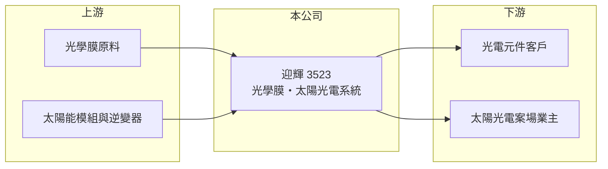

# 3523 迎輝

> 上櫃｜[[產業索引-光電業|光電業]]｜上市（櫃）日期 2007/11/16

# 第一章：企業模式與商業藍圖

> [!info] 撰寫說明
> 精簡版，由 Claude 依公開資料整理，架構比照 [[2330台積電]]，資料截至 2026-10-07。來源：nstock.tw 迎輝公司概況、winvest.tw 營收快訊。公開資料有限，營收比重、客戶與營運據點未查到。#待校對

迎輝是營收規模極小的光學膜與太陽光電公司，近年持續虧損。

- **核心業務：** 迎輝成立於 1998 年，業務為[[光學膜]]與電子光學元件，以及[[太陽光電]]發電系統建置。
- **營收結構：** 本次未查到各業務比重；以目前每月數百萬到一千多萬元的營收規模，單一案場或訂單的認列就會改變營收組成（推估）。
- **營運據點：** 營運與生產據點本次未查到，本文不推測。
- **長期方向：** 公司需要找到能穩定貢獻營收的產品或案場，才能擺脫虧損，目前公開資訊不足以判斷具體方向。

# 第二章：護城河深度與競爭優勢

迎輝規模極小，目前看不到明顯的護城河。

- **競爭優勢：** 同時具備光學膜材與太陽光電系統建置經驗，可承接小型案場（推估）。
- **主要對手：** 光學膜有日本、韓國與中國大廠，太陽光電系統建置則有眾多國內系統商。
- **觀察重點：** 月營收能否穩定、毛利率能否回到正數，以及是否有增資、減資或業務調整。

# 第三章：財務體質與盈利規模

資料日期：2026-10-07，以下數字是撰寫當時的快照；最新月營收、毛利率、累計 EPS 由自動排程寫在本筆記的屬性欄位（月營收、毛利率、累計EPS 等）。#待校對

迎輝 2026 年營收大幅衰退，毛利為負，持續虧損。

- **營收規模：** 2025 年全年營收 1.07 億元；2026 年 1 至 8 月累計 0.53 億元，年減 41.9%；8 月營收 357.9 萬元，年減 90.7%，6 月則為 1,314.1 萬元，單月波動極大。
- **獲利：** 2025 年全年 EPS -1.45 元；2026 年第二季 EPS -0.44 元，[[毛利率]] -29.84%，代表營收不足以支應生產成本。
- **財務特色：** 資本額約 6.43 億元，市值約 8.8 億元；營收規模遠小於股本，連續虧損會持續侵蝕淨值，固定成本形成的[[營運槓桿]]也讓營收萎縮時虧損擴大。

# 第四章：總體風險與地緣政治

迎輝的風險在於營收規模過小與持續虧損。

- **產業週期：** 光學膜需求跟著面板與消費性電子起伏；太陽光電建置受政策與案場開發進度影響。
- **營運風險：** 營收過小、毛利為負，若無法改善，可能需要籌資或調整業務，對股東權益有稀釋風險。
- **其他風險：** 綠能補助與躉購費率等法規變動、原物料價格與匯率波動。

# 專有名詞解析

## 金融

- **[[營運槓桿]]**：固定成本占比高時，營收小幅變動就會讓獲利大幅增減；營收萎縮時虧損也會被放大。

## 產業

- **[[光學膜]]**：貼附在面板或光學元件上，用來增亮、擴散、反射或保護的功能性薄膜。
- **[[太陽光電]]**：以太陽能板把光能轉成電能的發電方式，系統建置包含模組、逆變器、支架與併網工程。

# 核心供應鏈

- 上游：光學膜原料、太陽能模組與逆變器供應商
- 下游／客戶：光電元件客戶、太陽光電案場業主（推估）
- 同業：國內外光學膜廠、太陽光電系統商

## 最新新聞
<!-- news:start -->
<!-- news:end -->

## 相關連結
- [公開資訊觀測站](https://mopsov.twse.com.tw/mops/web/t05st03?step=1&firstin=1&co_id=3523)
- [Goodinfo](https://goodinfo.tw/tw/StockDetail.asp?STOCK_ID=3523)
- [Yahoo 股市](https://tw.stock.yahoo.com/quote/3523)
- [鉅亨網新聞](https://www.cnyes.com/twstock/3523/news)
