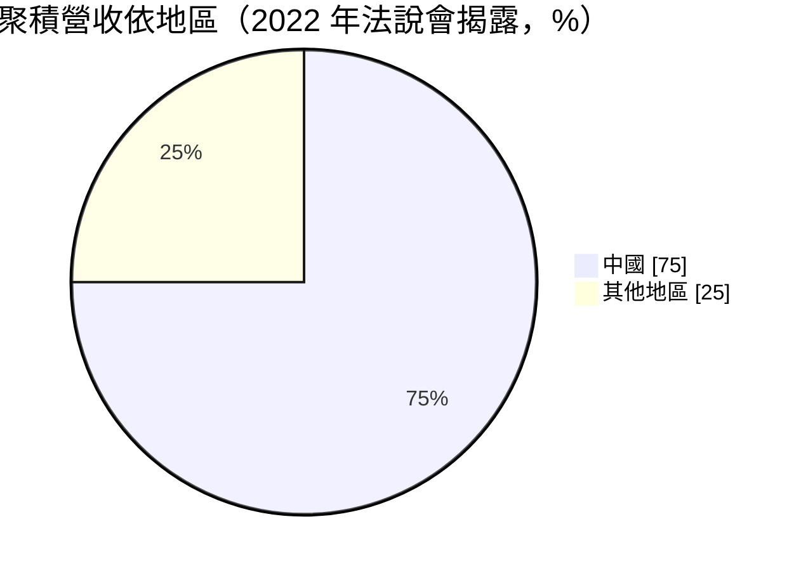
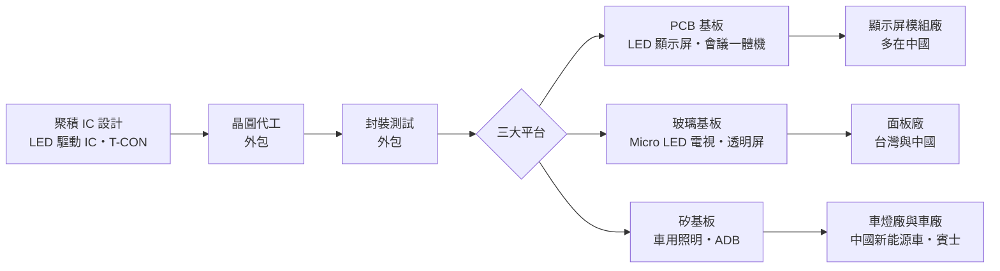
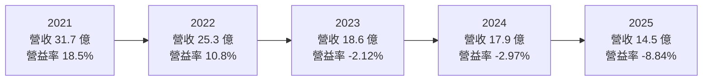
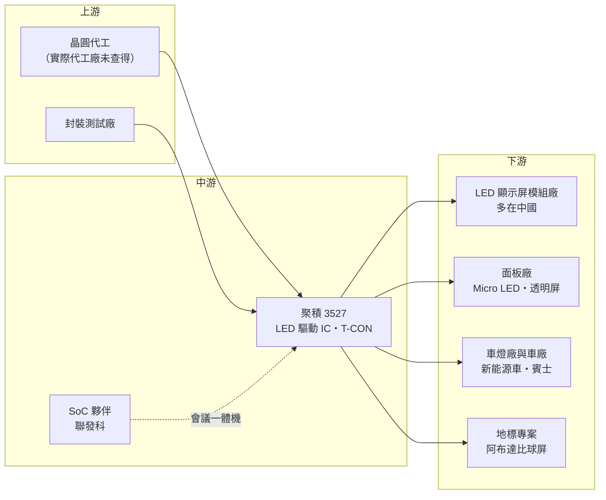

# 3527 聚積

> 上櫃｜[[產業索引-半導體業|半導體業]]｜上市（櫃）日期 2007/10/29

# 第一章：企業模式與商業藍圖

> [!info] 撰寫說明
> 本文由 Claude 依公開資料整理，架構比照 [[2330台積電]] 的四章研究，資料截至 2026-10-08。財務數字來源：Goodinfo 年度獲利指標、資產負債結構與股利政策頁、聚財網季度損益表、nstock 公司資料頁、富果研究 2026 年 8 月法說會整理、Yahoo 股市公司基本資料、鉅亨網 2022 年法說報導、LINE TODAY 財報整理；產業描述為整理性內容，尚未逐條比對原始文件。#待校對

在評估單一個股的長期投資價值時，首要步驟是拆解企業的底層獲利邏輯。本章針對聚積科技（股票代號：3527，以下簡稱聚積）的商業模式進行定性分析，說明這家 LED 驅動 IC 設計公司為什麼毛利率高達四成、近年本業卻連續虧損，以及它如何把業務從 LED 顯示屏延伸到 Micro LED 與車用照明。

## 一、核心定位：高階 LED 顯示屏驅動 IC 設計公司

聚積成立於 1999 年，總部位於新竹市，英文簡稱 MBI（Macroblock），2007 年 10 月上櫃，資本額約 4.44 億元，董事長楊立昌、總經理林益勝。公司是 [[Fabless]] IC 設計公司，主要產品是 [[LED驅動IC]]，2023 年以吸收合併方式合併子公司錦鑫光電。

LED 顯示屏由成千上萬顆 LED 組成，每一顆 LED 的亮度與色彩都要由驅動 IC 精準控制電流。畫面要細緻、不閃爍、在攝影機前不出現掃描紋，靠的就是驅動 IC 的刷新率、灰階與一致性。聚積的強項在高階[[小間距LED]]顯示屏的驅動 IC，應用於戶外大型看板、體育場、會議室大屏，以及以 LED 牆取代綠幕的虛擬攝影棚與 [[XR]] 場景。

這個定位有兩個長期意義。第一，高毛利來自技術規格。高階顯示屏對驅動 IC 的要求很高，設計難度大，聚積過去五年的毛利率在 38% 至 46% 之間，遠高於一般元件型 IC。第二，營收規模受限於利基市場。高階 LED 顯示屏的市場規模有限，又是商業與公共工程支出驅動的需求，景氣好時營收可以衝高，景氣差時則明顯萎縮；而研發投入卻必須持續，這使得聚積的獲利波動很大。

## 二、終端應用／產品板塊

聚積未公開最新的產品別營收比重。可查得的地區結構是 2022 年法說會揭露的資料：來自中國的營收占比約 75%，原因是 LED 顯示屏的模組與整機製造高度集中在中國，但這些中國客戶的終端應用多在海外。

依 2026 年 8 月法說會，公司把業務分成三種基板平台，這也是理解它長期策略的框架。[[PCB]] 基板是傳統 LED 顯示屏與會議一體機的主戰場，也是目前主要的營收來源，但面臨中國同業的價格競爭。玻璃基板對應 [[Micro LED]] 電視與透明顯示屏，屬於下一代顯示技術，公司預期 2027 年貢獻約 5% 至 10% 營收。矽基板則對應車用照明，包括車內外照明與 [[ADB]] 智慧遠光燈，公司預期 2027 至 2028 年比重升到 20% 至 30%。

## 三、資本轉化邏輯（營運模式）：從賣驅動 IC 到賣整合方案

聚積的獲利結構是「高毛利、高研發」。毛利率約 40%，但研發費用占營收比重很高，依 LINE TODAY 整理的 2025 年第三季財報，該季研發費用約占營收 28%，營業費用率約 42%，高於毛利率，因此出現營業虧損。這種結構在營收達到 25 億元以上時能賺大錢（2021 年營業利益率 18.5%），營收降到 15 億元左右時就會虧損。

為了提高每個客戶的產值，聚積正從單純的驅動 IC 供應商，轉型為「[[T-CON]]＋驅動 IC」的整合方案提供者。T-CON 是顯示器的時序控制器，負責把影像訊號轉換成驅動 IC 能處理的資料。把兩者一起賣，客戶的轉換成本更高，聚積在系統中的話語權也更大。此外，公司承接地標型專案，例如阿布達比的巨型球屏，這類專案量不大，但能展示技術能力，建立高階市場的品牌。

## 四、企業長期藍圖：Micro LED、會議一體機與車用

聚積的長期藍圖由三條新產品線構成。第一是 Micro LED 玻璃基板的 T-CON，公司與台灣面板廠合作已七年，與中國三大面板廠的合作也進入第二年，規劃 2027 年商業化。第二是會議一體機，T-CON 整合 [[2454聯發科]] 的 SoC，瞄準 135 至 200 吋的商用大屏市場。第三是車用，公司已打入中國前十大新能源車廠，合作品牌包括吉利、本田與華為體系，賓士專案也已進入量產；ADB 光學模組則規劃 2028 年量產。

這三條路線的共同點是驗證期長、量產時間落在 2027 至 2028 年。若成功，聚積的營收會從高度依賴中國 LED 顯示屏市場，轉為顯示、車用並重的結構，對中國價格競爭的抵抗力會提高。

# 第二章：護城河深度與競爭優勢

「護城河」指企業抵禦競爭、維持超額利潤的保護機制。本章分析聚積的護城河、主要競爭對手，以及它在中國同業的價格競爭中能守住多少。

## 一、聚積護城河的核心組成要素

聚積的護城河由三個要素組成。第一是高階顯示驅動技術。小間距、高刷新率的 LED 顯示屏需要精密的電流控制與演算法，聚積在高階市場累積了長期的技術與品牌口碑。毛利率長期維持在 38% 以上，即使在虧損年度也沒有崩跌，就是技術溢價仍然存在的證據。

第二是客製化與系統整合能力。公司曾為韓國廠商等特定客戶開發客製化晶片，並延伸到 T-CON 整合方案。客製化晶片一旦導入，客戶在產品生命週期內很難更換，這提高了轉換成本。

第三是車用認證的先行優勢。已進入中國新能源車廠與賓士供應鏈，車用產品的認證期長，一旦量產，訂單通常可以延續數年，競爭者要追上需要同樣漫長的驗證時間。

## 二、全球主要競爭對手格局

| 對手 | 定位 | 對聚積的威脅 |
|---|---|---|
| 集創北方等中國 LED 驅動 IC 公司 | 中國最大 LED 顯示驅動 IC 供應商 | 以低價與在地服務搶中國顯示屏模組廠 |
| 明微電子等中國 IC 公司 | LED 驅動與照明 IC | 在中低階顯示屏競爭 |
| 德州儀器、ams OSRAM 等國際大廠 | 車用照明驅動 IC | 在車用 LED 驅動的認證與客戶關係領先 |
| [[3034聯詠]]、[[4961天鈺]] | 面板驅動與 T-CON | Micro LED 時代可能跨入 LED 顯示驅動 |

## 三、優勢轉化：守得住／守不住／觀察重點

聚積守得住的，是高階小間距顯示屏、地標型專案與客製化晶片。這類產品重視規格與穩定度，價格敏感度較低，中國同業短期內不容易在技術上全面追上。

守不住的，是一般 PCB 基板 LED 顯示屏的驅動 IC。中國同業在政策扶植與本土客戶支持下，以價格搶占中低階市場，聚積的營收從 2021 年的 31.7 億元一路降到 2025 年的 14.5 億元，減少超過一半，主因就是這個市場的價格競爭與需求下滑。

長期觀察重點有三個：Micro LED 能否真正商業化，並讓 T-CON 成為新的營收支柱；車用產品能否在 2027 至 2028 年達到公司預期的 20% 至 30% 營收比重；以及營收回升後，研發費用率能否下降，使營業利益穩定轉正。

# 第三章：財務體質與盈利規模

資料日期：2026-10-08。數字取自 Goodinfo 年度財務資料、聚財網季度損益表與富果研究法說會整理，表格是撰寫當時的快照；最新月營收、毛利率、累計 EPS 由自動排程寫在本筆記的屬性欄位（月營收、毛利率、累計EPS 等）。#待校對

財務報表是檢驗護城河是否真實存在的最終標準。本章用五年的三率、ROE、現金流與資本報酬，檢視聚積的獲利品質。

## 一、獲利能力的基石：三率

| 年度 | 營收（新台幣） | [[毛利率]] | [[營業利益率]] | EPS（元） | [[ROE]] |
|---|---|---|---|---|---|
| 2021 | 31.7 億 | 46.2% | 18.5% | 12.69 | 22.4% |
| 2022 | 25.3 億 | 45.7% | 10.8% | 6.44 | 10.5% |
| 2023 | 18.6 億 | 40.7% | -2.12% | -0.28 | -0.48% |
| 2024 | 17.9 億 | 38.1% | -2.97% | 0.28 | 0.51% |
| 2025 | 14.5 億 | 38.8% | -8.84% | -1.84 | -3.5% |

五年數字呈現持續下滑的趨勢。營收從 2021 年的 31.7 億元降到 2025 年的 14.5 億元，年複合成長率約 -17.8%（推算）。毛利率從 46% 降到約 39%，降幅不大；真正的問題在營業利益率，從 18.5% 一路降到 -8.84%。這說明聚積的產品仍有定價能力，但營收規模縮水後，研發與營業費用無法同比例縮減，固定費用壓垮了本業獲利。

2025 年第四季單季營業利益率約 -23%，明顯偏離其他季度，推估有一次性費用（原因未查得，需查閱年報）。從季度資料看，2026 年上半年營業利益率已回到小幅正值，虧損正在收斂。

## 二、[[ROE]]：資本效率

近五年平均 ROE 約 5.9%（推算），但這個平均主要由 2021 年的 22.4% 撐起，2023 至 2025 年 ROE 都在零上下或為負。每股淨值從 2021 年的 61.84 元降到 2025 年的 50.76 元，一部分是虧損，一部分是高配息。聚積幾乎沒有負債，依 Goodinfo，2025 年股東權益占總資產約 88%、現金約占 47%，財務非常保守，ROE 完全由本業獲利決定。

## 三、資本支出與自由現金流

Fabless 模式不需建廠，資本支出低（具體金額未查得），主要支出是研發人力。營業虧損期間，營業現金流可能偏弱（推估），但帳上現金充裕，短期沒有資金壓力。

股利方面，依 Goodinfo，2021 至 2025 年度現金股利分別為 8、4、2、2、1 元，五年合計 17 元。股利隨獲利逐年下調，但即使在 2023 與 2025 年虧損，公司仍維持配息，動用的是過去累積的盈餘。這顯示經營層重視股東回饋，但也意味著現金部位會逐步減少，長期必須靠本業轉盈來支撐。

## 四、[[ROIC]] 與 [[WACC]]：價值創造利差

**ROIC 推算：** 2025 年營業利益約 -1.28 億元（14.5 億 × -8.84%），營業虧損不計稅。股東權益約 22.5 億元（每股淨值 50.76 元 × 約 0.444 億股），Goodinfo 顯示沒有長期負債，以股東權益作為投入資本，ROIC 約 -5.7%（推算）；若扣除約占總資產 47% 的現金（約 12 億元，推算），以營運資本計算則約 -12%。以同樣方法回推 2021 年，稅後營業利益約 4.69 億元（31.7 億 × 18.5% × 0.8），股東權益約 27.5 億元，ROIC 約 17%（推算）。

**WACC 推算：** 股東權益成本用 CAPM 估計，假設台灣 10 年期公債殖利率 1.75%、市場風險溢酬 6%、β 取 IC 設計同業常見值 1.1，股東權益成本約 8.35%。公司沒有有息負債，WACC 約 8.35%（推算）。

**結論：** 2021 至 2022 年聚積的 ROIC 高於 WACC，創造了可觀的經濟價值；2023 年以後 ROIC 轉為零或負值，明顯低於資金成本，代表本業近年在毀損經濟價值。聚積的投資邏輯是「新產品能否把仍然很高的毛利率轉回營業獲利」：只要 Micro LED、會議一體機與車用新品帶動營收回到 25 億元以上，研發費用率下降，ROIC 就有機會重新高於 WACC；若新品持續延後，高研發費用會繼續侵蝕淨值。

# 第四章：總體風險與地緣政治

任何企業都無法脫離宏觀環境獨立存在。本章分析聚積長期必須面對的地緣政治、產業週期、營運與技術風險。

## 一、地緣政治

聚積高度依賴中國市場，2022 年中國營收占比約 75%，LED 顯示屏模組廠與新能源車客戶多在中國。中國推動晶片國產化，中國客戶可能優先採用本土驅動 IC，這正是聚積營收持續下滑的重要背景之一。若美國擴大對中國的晶片管制，或中國對台灣晶片採取限制，聚積的主要市場都會受到衝擊。賓士等國際車廠專案與 Micro LED 面板合作，有助於降低對中國市場的依賴。

## 二、產業週期與市場結構

大型 LED 顯示屏的需求受商業廣告、體育賽事與公共工程預算影響，景氣轉弱時客戶會延後採購。模組廠的庫存調整又會透過[[長鞭效應]]放大反映在驅動 IC 訂單上。結構面上，中國同業持續擴產，一般顯示屏驅動 IC 的價格長期承壓，這不是短期景氣問題，而是市場結構的改變。

## 三、營運環境的隱性風險

費用結構僵化是最直接的風險，研發費用約占營收三成，營收下滑時虧損擴大得很快。新產品時程也是風險，Micro LED、會議一體機、ADB 都在 2027 至 2028 年才量產，任何延後都會拖累轉盈。匯率則是長期變數，產品主要以美元計價，新台幣升值時會產生匯兌損失。

## 四、科技或法規演進

Micro LED 已發展多年，成本仍高，量產時程一再延後。若商業化不如預期，聚積在玻璃基板的投入回收期會拉長。車用方面，ADB 智慧遠光燈需要符合各國車燈法規，各地法規開放的進度會影響市場規模；車用產品也必須通過嚴格的[[車規驗證]]，時間長、成本高，對獲利有限的公司是持續的負擔。

# 專有名詞解析

## 半導體

- **[[LED驅動IC]]**：控制 LED 電流以調整亮度與色彩的晶片，顯示屏的畫質高度取決於驅動 IC 的精度。
- **[[T-CON]]**：時序控制器，負責把影像訊號轉換成驅動 IC 能處理的時序與資料，是顯示器的指揮中心。
- **[[Fabless]]**：只做晶片設計、把製造外包給晶圓代工廠的商業模式。

## 應用

- **[[小間距LED]]**：像素間距小於 2.5 毫米的 LED 顯示屏，畫面細緻，可用於室內大屏、會議室與虛擬攝影棚。
- **[[Micro LED]]**：把 LED 縮小到數十微米以下、每顆直接當作像素的顯示技術，亮度高、壽命長，但量產成本仍高。
- **[[PCB]]**：印刷電路板，傳統 LED 顯示屏模組把 LED 與驅動 IC 焊在 PCB 上。
- **[[ADB]]**：自適應遠光燈，可依路況自動遮蔽對向來車區域，維持遠光照明又不造成眩光。
- **[[車規驗證]]**：車用晶片須通過 AEC-Q100 等可靠度測試與車廠認證，流程常需 2 至 3 年，因此轉換成本高。
- **[[XR]]**：延展實境，AR、VR、MR 的統稱，虛擬攝影棚以 LED 牆取代綠幕即屬此類應用。

## 金融

- **[[ROIC]]**：投入資本報酬率，稅後營業利益除以股東權益加有息負債，衡量本業運用資本的效率。
- **[[WACC]]**：加權平均資金成本，股東與債權人要求報酬的加權平均，ROIC 高於它才代表創造價值。

## 產業

- **[[長鞭效應]]**：終端需求的小幅變動，沿供應鏈往上游傳遞時被逐級放大，造成上游庫存與訂單劇烈波動。

# 核心供應鏈

## 1. 上游：晶圓代工與封測
- 驅動 IC 常用的成熟製程代工：[[2330台積電]]、[[2303聯電]]、[[5347世界先進]]（產業參考，聚積實際代工廠未查得）

## 2. 中游：合作夥伴與同業
- 會議一體機 SoC 合作：[[2454聯發科]]
- 顯示驅動相關同業：[[3034聯詠]]、[[4961天鈺]]；中國同業集創北方、明微電子

## 3. 下游：顯示與面板
- LED 顯示屏模組與整機廠（多在中國，公司未公開名稱）
- 面板廠：與台灣面板廠合作七年，如 [[3481群創]]、[[2409友達]]（未確認為哪一家）；中國三大面板廠

## 4. 下游：車用
- 中國前十大新能源車廠、吉利、本田、華為體系、賓士

延伸閱讀：[[聯發科供應鏈]]

## 最新新聞
<!-- news:start -->
<!-- news:end -->

## 相關連結
- [公開資訊觀測站](https://mopsov.twse.com.tw/mops/web/t05st03?step=1&firstin=1&co_id=3527)
- [Goodinfo](https://goodinfo.tw/tw/StockDetail.asp?STOCK_ID=3527)
- [Yahoo 股市](https://tw.stock.yahoo.com/quote/3527)
- [鉅亨網新聞](https://www.cnyes.com/twstock/3527/news)
