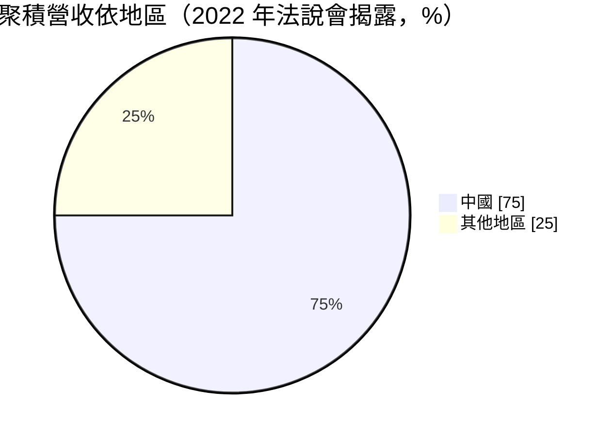
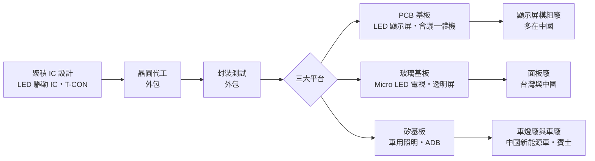
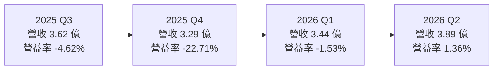
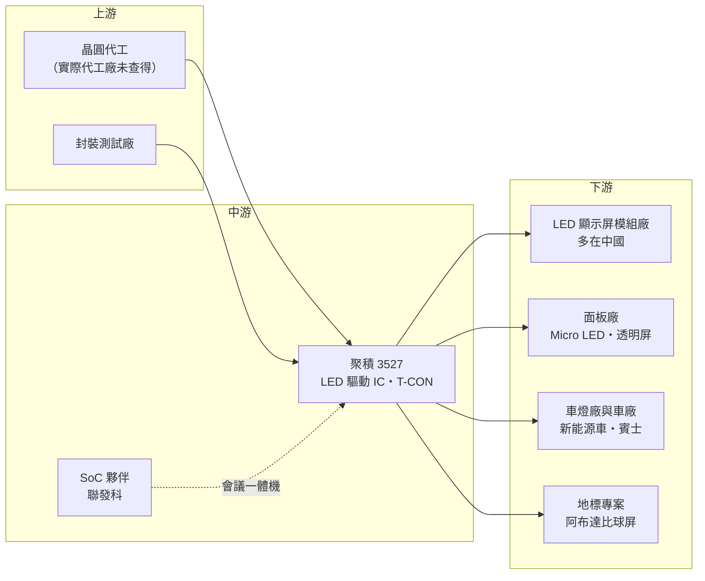

# 3527 聚積

> 上櫃｜[[產業索引-半導體業|半導體業]]｜上市（櫃）日期 2007/10/29

# 第一章：企業模式與商業藍圖

> [!info] 撰寫說明
> 本文由 Claude 依公開資料整理，架構比照 [[2330台積電]] 的四章研究，資料截至 2026-10-07。財務數字來源：聚財網（stock.wearn.com）季度損益表、nstock 公司資料頁、富果研究 2026 年 8 月法說會整理、Yahoo 股市公司基本資料、鉅亨網 2022 年法說報導、LINE TODAY 財報整理；產業描述為整理性內容，尚未逐條比對原始文件。#待校對

在評估單一個股的長期投資價值時，首要步驟是拆解企業的底層獲利邏輯。本章針對聚積科技（股票代號：3527，以下簡稱聚積）的商業模式進行定性分析，說明這家 LED 驅動 IC 設計公司為何毛利率高達四成、本業卻連年虧損，以及它如何把業務從 LED 顯示屏延伸到 Micro LED 與車用照明。

## 一、核心定位：高階 LED 顯示屏驅動 IC 設計公司

聚積成立於 1999 年，總部位於新竹市，英文簡稱 MBI（Macroblock），2007 年 10 月上櫃，資本額約 4.44 億元，董事長楊立昌、總經理林益勝。公司為 [[Fabless]] IC 設計公司，主要產品是[[LED驅動IC]]，2023 年 9 月以吸收合併方式合併子公司錦鑫光電。

LED 顯示屏由成千上萬顆 LED 組成，每顆 LED 的亮度與色彩都要由驅動 IC 精準控制。聚積的強項在高階[[小間距LED]]顯示屏的驅動 IC，用於戶外大型看板、體育場、虛擬攝影棚與 XR 場景。這個定位有兩個商業意義：

* **高毛利來自技術規格：** 高階顯示屏需要高刷新率、高灰階、低殘影，驅動 IC 的設計難度高，聚積毛利率長期維持在 37% 至 40% 之間，遠高於一般元件型 IC。
* **營收規模受限於利基市場：** 高階 LED 顯示屏市場規模有限，年營收約 14 至 15 億元，但研發投入大，費用率高，本業容易虧損。

## 二、終端應用／產品板塊

聚積未公開最新的產品別營收比重。可查得的地區結構是 2022 年法說會揭露的資料：來自中國的營收占比高達 75%，主因顯示屏的模組與整機製造集中在中國，但中國客戶的終端應用主要在海外。

依 2026 年 8 月法說會，公司把業務分成三種基板平台：

* **[[PCB]] 基板：** 傳統 LED 顯示屏與會議一體機，是目前主要營收來源，面臨中國同業的價格競爭。
* **玻璃基板：** [[Micro LED]] 電視與透明屏，公司預期 2027 年貢獻 5% 至 10% 營收。
* **矽基板（車用）：** 車內外照明與 [[ADB]] 智慧遠光燈，公司預期 2027 至 2028 年比重升到 20% 至 30%。

## 三、資本轉化邏輯（營運模式）：從賣驅動 IC 到賣整合方案

* **高毛利、高研發：** 毛利率約 40%，但研發費用占營收比重很高。依 LINE TODAY 整理的 2025 年第三季財報，該季研發費用約 1.01 億元，占營收 28%，營業費用率約 41.86%，高於毛利率，因此出現營業虧損。
* **轉型為整合方案：** 公司正從單純的驅動 IC 供應商，轉型為「[[T-CON]]＋驅動 IC」的整合方案提供者。把時序控制器與驅動 IC 一起賣，可以提高單一客戶的產值，也提高轉換成本。
* **地標型專案：** 依法說會，阿布達比第二座巨型球屏確定承接，2026 至 2027 年貢獻約 6,000 萬元營收。這類專案量不大，但能展示技術能力。

## 四、企業長期藍圖：Micro LED、會議一體機與車用

* **Micro LED 玻璃基板 T-CON：** 公司規劃 2026 年第四季進入量產、2027 年商業化。與台灣面板廠合作已七年，與中國三大面板廠合作進入第二年。
* **會議一體機：** T-CON 整合 [[2454聯發科]] 的 SoC，目標 2027 年第一季量產，瞄準 135 至 200 吋的商用大屏市場。
* **車用：** 已打入中國前十大新能源車廠，合作品牌包括吉利、本田與華為體系；賓士專案進入量產，2026 年第四季開始貢獻營收。ADB 光學模組規劃 2027 年第二季交樣、2028 年第二季量產，每套售價約 100 美元。

# 第二章：護城河深度與競爭優勢

「護城河」指企業抵禦競爭、維持超額利潤的保護機制。本章分析聚積的護城河、主要競爭對手，以及它在中國同業的價格戰中能守住多少。

## 一、聚積護城河的核心組成要素

* **1. 高階顯示驅動技術：** 小間距、高刷新率的 LED 顯示屏需要精密的電流控制與演算法，聚積在高階市場累積了長期的技術與品牌口碑，毛利率約 40% 就是技術溢價的證據。
* **2. 客製化與系統整合能力：** 公司曾為韓國廠商等特定客戶開發客製化晶片，並延伸到 T-CON 整合方案，提高客戶轉換成本。
* **3. 車用認證的先行者優勢：** 已進入中國新能源車廠與賓士供應鏈，車用產品認證期長，一旦量產，訂單可延續數年。

## 二、全球主要競爭對手格局

| 對手 | 定位 | 對聚積的威脅 |
|---|---|---|
| 集創北方等中國 LED 驅動 IC 公司 | 中國最大 LED 顯示驅動 IC 供應商 | 以低價與在地服務搶中國顯示屏模組廠 |
| 明微電子等中國 IC 公司 | LED 驅動與照明 IC | 在中低階顯示屏競爭 |
| 德州儀器、ams OSRAM 等國際大廠 | 車用照明驅動 IC | 在車用 LED 驅動的認證與客戶關係領先 |
| [[3034聯詠]]、[[4961天鈺]] | 面板驅動與 T-CON | Micro LED 時代可能跨入 LED 顯示驅動 |

## 三、優勢轉化：守得住／守不住／觀察重點

* **守得住：** 高階小間距顯示屏、地標型專案與客製化晶片，這類產品重視規格與穩定度，價格敏感度較低。
* **守不住：** 一般 PCB 基板 LED 顯示屏的驅動 IC，中國同業價格競爭激烈。營收從 2024 年下半年每季約 4 億元，降到 2025 年第四季約 3.29 億元，2025 年前三季累計營收年減 19.57%。
* **觀察重點：** Micro LED T-CON 能否在 2026 年第四季如期量產；賓士車用專案 2026 年第四季開始的營收貢獻；研發費用率能否隨營收成長而下降，使營業利益穩定轉正。

# 第三章：財務體質與盈利規模

資料日期：2026-10-07。數字取自聚財網季度損益表、nstock 公司資料頁與富果研究法說會整理，表格是撰寫當時的快照；最新月營收、毛利率、累計 EPS 由自動排程寫在本筆記的屬性欄位（月營收、毛利率、累計EPS 等）。#待校對

財務報表是檢驗護城河是否真實存在的最終標準。本章用三率、ROE、現金流與資本報酬，檢視聚積的獲利品質。

## 一、獲利能力的基石：三率

| 期間 | 營收（新台幣） | [[毛利率]] | [[營業利益率]] | EPS（元） |
|---|---|---|---|---|
| 2025 全年 | 14.49 億 | 約 38.8%（依季度推算） | 約 -8.8%（依季度推算） | -1.84 |
| 2025 Q1 | 3.86 億 | 40.34% | -2.49% | 0.06 |
| 2025 Q2 | 3.72 億 | 37.92% | -7.29% | -0.96 |
| 2025 Q3 | 3.62 億 | 37.24% | -4.62% | -0.15 |
| 2025 Q4 | 3.29 億 | 39.78% | -22.71% | -0.78 |
| 2026 Q1 | 3.44 億 | 39.59% | -1.53% | 0.01 |
| 2026 Q2 | 3.89 億 | 40.26% | 1.36% | 0.14 |

* **[[毛利率]]：** 長期穩定在 37% 至 40%，2026 年第二季 40.26%。毛利率穩定，代表產品定價能力仍在，問題不在毛利。
* **[[營業利益率]]：** 研發與營業費用高，營業利益率多數季度為負。2025 年第四季營業利益率 -22.71%，明顯偏離其他季度，可能有一次性費用（原因未查得，需查閱年報）。2026 年第二季營業利益率轉正為 1.36%。
* **[[淨利率]]：** 2025 年第二季營業利益率 -7.29%、稅後淨利率 -11.50%，推估業外有匯兌損失（原因未查得）。
* **營收動能：** 2026 年上半年營收 7.3 億元，年減 3%，稅後淨利約 670 萬元、EPS 0.15 元；1 至 8 月累計 9.35 億元，年減 5.77%，8 月營收約 1 億元，年減 16.39%。

## 二、[[ROE]]：資本效率

2025 年 EPS -1.84 元，ROE 為負；2026 年上半年 EPS 0.15 元，勉強轉正。聚積過去曾有高獲利期（2022 年第一季毛利率達 50.4%），近五年平均現金股利約 3.4 元，但 2024 至 2025 年獲利大幅下滑，資本效率明顯變差。

## 三、資本支出與自由現金流

* **[[CapEx]]：** Fabless 模式不需建廠，資本支出低（具體金額未查得）。
* **[[自由現金流]]：** 主要支出是研發人力。營業虧損期間，營業現金流可能偏弱（推估）。
* **股利：** 2024 年度現金股利 2 元、2025 年度 1 元。2025 年在每股虧損 1.84 元的情況下仍配發 1 元，代表動用過去累積的盈餘。

## 四、[[ROIC]] 與 [[WACC]]：價值創造利差

連續多季營業虧損，ROIC 為負，低於資金成本。聚積的投資邏輯是「新產品能否把高毛利轉為營業獲利」：只要 Micro LED、會議一體機與車用新品帶動營收成長，研發費用率下降，營業利益就有機會明顯改善。反之，若新品延後，高研發費用會持續侵蝕獲利。

# 第四章：總體風險與地緣政治

任何企業都無法脫離宏觀環境獨立存在。本章分析聚積必須面對的地緣政治、產業週期、營運與技術風險。

## 一、地緣政治風險

* **高度依賴中國市場：** 2022 年中國營收占比約 75%，LED 顯示屏模組廠與新能源車客戶多在中國。中國推動晶片國產化，中國客戶可能優先採用本土驅動 IC。
* **美中科技管制：** 若美國擴大對中國的晶片管制，或中國對台灣晶片採取限制，聚積的主要市場會受影響。
* **車用客戶的分散：** 賓士等國際車廠專案，有助降低對中國市場的依賴。

## 二、產業週期與市場結構

* **LED 顯示屏需求週期：** 大型顯示屏需求受商業廣告、體育賽事與公共工程預算影響，景氣轉弱時客戶延後採購。
* **價格競爭：** 中國同業擴產，一般顯示屏驅動 IC 的價格持續下滑。
* **[[長鞭效應]]：** 模組廠庫存調整會放大反映在驅動 IC 訂單上。

## 三、營運環境的隱性風險

* **費用結構僵化：** 研發費用占營收約三成，營收下滑時虧損擴大很快。
* **新產品時程：** Micro LED、會議一體機、ADB 都在 2026 至 2028 年才量產，任何延後都會拖累轉盈。
* **匯率：** 主要以美元計價，新台幣升值時產生匯兌損失。

## 四、科技或法規演進

* **Micro LED 商業化不確定：** Micro LED 已發展多年，成本仍高，量產時程一再延後。若商業化不如預期，聚積在玻璃基板的投入回收期會拉長。
* **車用法規：** ADB 智慧遠光燈需要符合各國車燈法規，美國等地的法規開放進度會影響市場規模。
* **[[車規驗證]]：** 車用產品需要通過嚴格的可靠度認證，時間長、成本高。

# 專有名詞解析

## 半導體

- **[[LED驅動IC]]**：控制 LED 電流以調整亮度與色彩的晶片，顯示屏的畫質高度取決於驅動 IC 的精度。
- **[[T-CON]]**：時序控制器，負責把影像訊號轉換成驅動 IC 能處理的時序與資料，是顯示器的「指揮中心」。
- **[[Fabless]]**：只做晶片設計、把製造外包給晶圓代工廠的商業模式。

## 應用

- **[[小間距LED]]**：像素間距小於 2.5 毫米的 LED 顯示屏，畫面細緻，可用於室內大屏、會議室與虛擬攝影棚。
- **[[Micro LED]]**：把 LED 縮小到數十微米以下、每顆直接當作像素的顯示技術，亮度高、壽命長，但量產成本仍高。
- **[[PCB]]**：印刷電路板，傳統 LED 顯示屏模組把 LED 與驅動 IC 焊在 PCB 上。
- **[[ADB]]**：自適應遠光燈，可依路況自動遮蔽對向來車區域，維持遠光照明又不造成眩光。
- **[[車規驗證]]**：車用晶片須通過 AEC-Q100 等可靠度測試與車廠認證，流程常需 2 至 3 年，因此轉換成本高。
- **[[XR]]**：延展實境，AR、VR、MR 的統稱，虛擬攝影棚以 LED 牆取代綠幕即屬此類應用。

## 金融

- **[[營業利益率]]**：營業利益除以營收，扣除研發、銷售與管理費用後的本業獲利能力。

## 產業

- **[[長鞭效應]]**：終端需求的小幅變動，沿供應鏈往上游傳遞時被逐級放大，造成上游庫存與訂單劇烈波動。

# 核心供應鏈

## 1. 上游：晶圓代工與封測
- 驅動 IC 常用的成熟製程代工：[[2330台積電]]、[[2303聯電]]、[[5347世界先進]]（產業參考，聚積實際代工廠未查得）

## 2. 中游：合作夥伴與同業
- 會議一體機 SoC 合作：[[2454聯發科]]
- 顯示驅動相關同業：[[3034聯詠]]、[[4961天鈺]]；中國同業集創北方、明微電子

## 3. 下游：顯示與面板
- LED 顯示屏模組與整機廠（多在中國，公司未公開名稱）
- 面板廠：台灣面板廠合作七年，如 [[3481群創]]、[[2409友達]]（未確認為哪一家）；中國三大面板廠

## 4. 下游：車用
- 中國前十大新能源車廠、吉利、本田、華為體系、賓士

延伸閱讀：[[聯發科供應鏈]]

## 最新新聞
<!-- news:start -->
<!-- news:end -->

## 相關連結
- [公開資訊觀測站](https://mopsov.twse.com.tw/mops/web/t05st03?step=1&firstin=1&co_id=3527)
- [Goodinfo](https://goodinfo.tw/tw/StockDetail.asp?STOCK_ID=3527)
- [Yahoo 股市](https://tw.stock.yahoo.com/quote/3527)
- [鉅亨網新聞](https://www.cnyes.com/twstock/3527/news)
