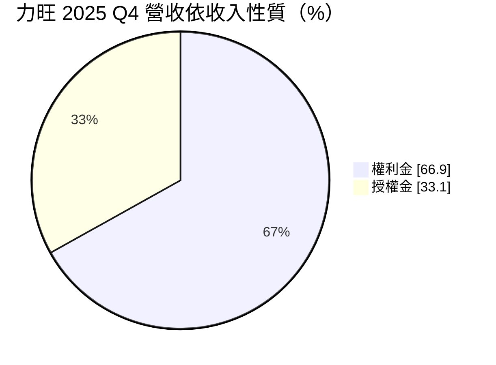
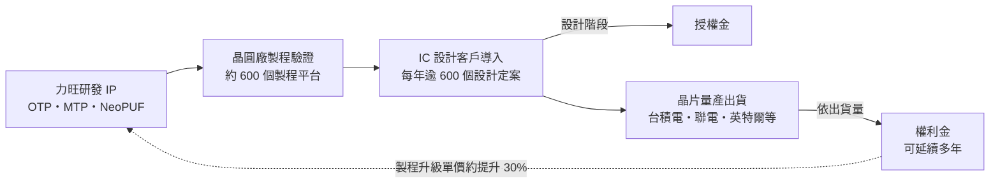
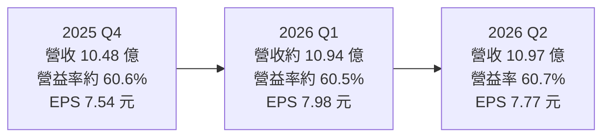
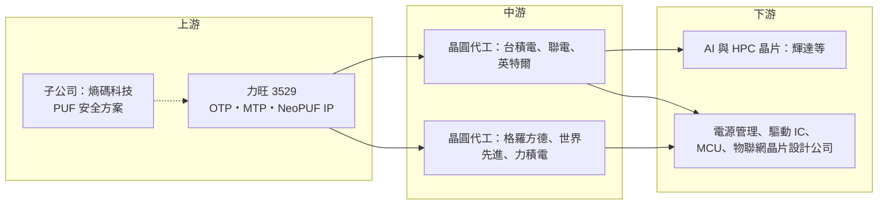

# 3529 力旺

> 上櫃｜[[產業索引-半導體業|半導體業]]｜上市（櫃）日期 2011/01/24

# 第一章：企業模式與商業藍圖

> [!info] 撰寫說明
> 本文由 Claude 依公開資料整理，架構比照 [[2330台積電]] 的四章研究，資料截至 2026-10-07。財務數字來源：力旺 2025 年第四季財報報導（旺得富／中時新聞網）、2026 年第二季財報報導（經濟日報）、理財周刊、富果研究法說整理、優分析法說報導、nstock 公司概況、科技新報月營收報導；產業描述為整理性內容，尚未逐條比對原始文件。#待校對

在評估單一個股的長期投資價值時，首要步驟是拆解企業的底層獲利邏輯。本章針對力旺電子（股票代號：3529，以下簡稱力旺）的商業模式進行定性分析，說明一家不製造、也不設計完整晶片的公司，如何靠一小塊嵌入式記憶體電路，從全球晶圓出貨中長期抽取權利金。

## 一、核心定位：嵌入式非揮發性記憶體 IP 的全球領導者

力旺於 2000 年 9 月在新竹市設立，2011 年 1 月上櫃。力旺不製造晶片，也不設計完整的晶片，而是開發可以嵌入在各種晶片裡的嵌入式非揮發性記憶體（[[eNVM]]）[[IP]]，授權給晶圓代工廠與 IC 設計公司使用。非揮發性記憶體指的是斷電後資料不會消失的記憶單元，在晶片中常被用來存放開機碼、校正參數、加密金鑰、序號，或在 SRAM 出現瑕疵時記錄修復資訊。

力旺的核心優勢在於，這些記憶單元可以用標準邏輯製程做出來，不需要額外光罩或特殊製程步驟，因此晶片設計公司幾乎不用增加成本就能在晶片裡放入可程式化的記憶體。這個定位有兩個商業意義：

* **以小面積換取廣覆蓋：** 一塊 eNVM 電路只占晶片很小的面積，但幾乎每一顆晶片都需要，因此能跨越手機、電源管理、AI 晶片等各種應用。
* **以權利金分享晶圓成長：** 力旺不承擔製造風險，只要導入其 IP 的晶片持續出貨，就能長期收取權利金。

## 二、產品板塊：OTP、MTP 與 PUF 安全

依富果研究整理的法說內容，力旺的營收來自三大技術類別：

* **[[OTP]]（一次性可程式化）：** 以 NeoBit、NeoFuse 為代表，是公司的基礎收入來源，應用在幾乎所有製程節點，從[[成熟製程]]到 3 奈米以下先進製程，提供長期穩定的權利金。
* **[[MTP]]（多次可程式化）：** 隨 DDR5 世代普及，MTP 技術被應用在電源管理晶片，權利金費率約為 OTP 的兩倍，是新興成長動能。
* **安全解決方案：** 以 NeoPUF 技術為基礎，衍生 PUFrt、PUFcc、PUFse 等產品，由子公司熵碼科技推動。[[PUF]]（物理不可複製功能）利用製程中氧化層的微小隨機差異，為每顆晶片產生獨一無二的「原生指紋」，作為[[硬體信任根]]，防止偽造、竄改與走私。

依旺得富報導，力旺董事長在 2025 年第四季法說表示，PUFrt 已導入 [[NVDA輝達]] 架構，PUF 相關權利金也已進入量產階段。富果研究整理指出，力旺在台積電 3 奈米取得美國國防部 18 個產品設計合約，NeoPUF 技術也導入 [[INTC英特爾]] 18A 製程。

依收入性質，2025 年第四季的營收結構如下：

* **[[授權金]]：** 客戶在設計階段導入 IP 時一次性支付，2025 年第四季占營收 33.1%。
* **[[權利金]]：** 晶片量產後依晶圓或晶片出貨量持續收取，2025 年第四季占營收 66.9%，是力旺商業模式的核心。

## 三、資本轉化邏輯：製程驗證與權利金飛輪

* **製程驗證：** 力旺的 IP 必須先在各晶圓廠的製程上完成驗證，客戶才能使用。富果研究整理指出，力旺過去 25 年累積了約 600 個製程平台的驗證經驗，合作夥伴涵蓋 [[2330台積電]]、[[2303聯電]]、[[INTC英特爾]]、格羅方德等主要晶圓代工廠。
* **設計定案：** 優分析報導的法說內容提到，力旺每年有超過 600 個設計定案（[[Tape-out]]），其中一半來自既有客戶升級製程、一半是新客戶導入。
* **單價隨製程提升：** 依理財周刊，單顆晶片收取的權利金會隨製程進階而提高，且一個產品的權利金可能延續多年；每升級一個製程世代，IP 平均單價約可提升 30%。
* **零製造成本：** 力旺沒有工廠與存貨，毛利率 100%，營業利益率約六成，新增營收大部分直接轉為營業利益。

## 四、企業長期藍圖：先進製程、滲透率與 PUF 收割

* **先進製程與 AI：** 依優分析，力旺在 3 至 7 奈米的開案已超過 55 件，涵蓋 AI SoC 與軍用專案。OTP 技術被廣泛用在 AI 晶片的 SRAM 修復、[[HBM]] 基礎裸晶，以及新一代 CPU／GPU 傳輸介面。
* **提高滲透率：** 公司表示目前在台積電 12 吋晶圓的滲透率約 1.2%，若提升到 5%，單一客戶營收就有數倍的成長空間。
* **PUF 安全收割期：** 公司形容布局 PUF 已十年、正進入收割期。傳統 OTP 權利金費率約 1.5%，加入 PUF 後可提升到 2% 至 3%，延伸到系統端與資安應用可達單價 10%（公司說法）。
* **經營層交接：** 經濟日報報導，執行長何明洲於 2026 年 8 月 31 日退休，仍留任董事，繼任人選依程序另行公布。

# 第二章：護城河深度與競爭優勢

在長期價值投資中，「護城河」指企業抵禦競爭、維持超額利潤的保護機制。本章分析力旺的護城河構成、全球主要競爭對手，以及這些優勢面對晶圓廠自有方案與大型 IP 商打包銷售時能守住多少。

## 一、力旺護城河的核心組成要素

力旺的護城河屬於「寬護城河」，主要來自以下幾點：

* **1. 製程驗證生態系：** 每一個製程節點、每一家晶圓廠都要重新驗證 IP，累積約 600 個製程平台的驗證經驗需要二十多年時間。公司在法說中表示，新進者即便有資金，也難以在短時間內複製這個生態系。
* **2. 權利金的長尾效應：** 一旦 IP 被寫進某顆晶片，只要該晶片持續量產，力旺就持續收取權利金，客戶在產品生命週期中幾乎不會更換。
* **3. 晶圓廠的預設選項：** 力旺的 OTP 已成為主要晶圓廠製程設計套件中常見的選項，客戶導入門檻低，等於借用晶圓廠的通路銷售。
* **4. 專利與硬體安全的先發優勢：** NeoPUF 技術在美國國防與 AI 晶片資安需求上取得實績，安全 IP 一旦被認證，轉換成本更高。
* **5. 極高的資本效率：** 毛利率 100%，不需要廠房與設備。

## 二、全球主要競爭對手格局

| 對手 | 定位 | 對力旺的威脅 |
|---|---|---|
| [[SNPS新思科技]] | 全球最大 IP 供應商之一，併購 Kilopass 取得 OTP NVM IP | 可與介面、處理器 IP 打包銷售，是最主要的國際競爭者 |
| 晶圓廠自有方案 | 晶圓代工廠自行開發 eFuse 或 OTP | 降低對外部 IP 的依賴，壓縮力旺在個別製程的空間 |
| [[ARM安謀]] 與其他安全 IP 業者 | 安全子系統與 PUF 新創 | 在硬體安全領域競爭 |
| eFlash 與新興記憶體 | 晶圓廠的 eFlash、[[MRAM]]、RRAM 方案 | 在 MCU 等應用成為替代選項 |

## 三、優勢轉化：哪些市場守得住、哪些守不住

* **守得住：** 已在主要晶圓廠完成驗證並大量導入的 OTP 業務，以及先進製程的 SRAM 修復與金鑰儲存需求，客戶轉換意願低。
* **守不住：** 單一晶圓廠若決定在某些製程大量推自有方案，或大型 IP 業者用打包折扣搶單，力旺在個別專案的定價空間會受影響。
* **觀察重點：** PUF 權利金能否在 AI 與國防晶片上放量、3 奈米與 2 奈米權利金的實際貢獻，以及執行長交接後經營策略是否延續。

# 第三章：財務體質與盈利規模

資料日期：2026-10-07。數字取自力旺財報公告的媒體報導（經濟日報、旺得富、理財周刊、nstock、科技新報），表格是撰寫當時的快照；最新月營收、毛利率、累計 EPS 由自動排程寫在本筆記的屬性欄位（月營收、毛利率、累計EPS 等）。#待校對

財務報表是檢驗護城河是否真實存在的最終標準。本章用三率、ROE、資本支出與資本報酬，檢視力旺這種純授權模式的獲利品質。

## 一、獲利能力的基石：三率

| 項目 | 2025 全年 | 2025 Q4 | 2026 Q1 | 2026 Q2 |
|---|---|---|---|---|
| 營收（新台幣） | 約 38.5 億（推算） | 10.48 億 | 約 10.94 億（推算） | 10.97 億 |
| [[毛利率]] | 100% | 100% | 100% | 100% |
| [[營業利益率]] | 未查得 | 約 60.6% | 約 60.5% | 60.7% |
| EPS（元） | 25.60 | 7.54 | 7.98 | 7.77 |

* **推算說明：** 2025 全年營收是以科技新報報導的前 10 月累計 34.23 億元，加上第四季 10.48 億元扣除 10 月 6.23 億元推算而得；2026 年第一季營收由上半年 21.91 億元減第二季推算。2025 年第四季營業利益率由營業淨利 6.35 億元除以營收換算。
* **2026 年上半年：** 營收 21.91 億元，年增 18.5%；營業利益率 60.6%，年增 2.8 個百分點；稅後淨利 11.76 億元，年增 36.5%；EPS 15.75 元。依理財周刊，2026 年第二季稅後[[淨利率]] 54.27%。
* **月營收：** 2026 年 7 月營收 6.76 億元創單月新高，前 9 月累計營收 34.01 億元，年增 21.43%。力旺營收常在季初月份因權利金入帳而跳高，單月營收波動大，應以季度或累計數字觀察。
* **獲利結構：** 毛利率固定 100%，獲利變化完全取決於營收規模與研發、管理費用。營收成長時營業利益率擴張，是純授權模式的營運槓桿。

## 二、[[ROE]]：資本效率

力旺是典型的輕資產 IP 公司，幾乎沒有存貨與大額固定資產。ROE 的具體數值本次未查得，但在高配息政策下，股東權益不會快速膨脹，推估 ROE 長期維持在相當高的水準。

## 三、資本支出與自由現金流

* **[[CapEx]]：** 力旺的主要支出是研發人員薪資與專利，資本支出相對營收極低。
* **[[自由現金流]]：** 營業現金流大致等同於淨利，絕大部分可用於配息。
* **股利政策：** 依 nstock 整理，力旺近五年平均現金股利約 18.9 元，2025 年配發現金股利 20.5 元，歷年填息速度快。公司以高比例配發盈餘為一貫政策。

## 四、[[ROIC]] 與 [[WACC]]：價值創造利差

企業創造價值的條件是投入資本報酬率高於資金成本。力旺的營業資產極少，投入資本主要是研發人力累積出的無形資產與營運資金，在帳上的資本基數很小，因此 ROIC 理論上遠高於 WACC（推估，具體數值未查得）。對這類公司而言，真正的「投入」是研發費用：只要每年 600 多個設計定案持續轉為權利金，研發投入就能維持高報酬；需要觀察的是先進製程驗證成本上升後，研發費用率是否明顯提高。

# 第四章：總體風險與地緣政治

任何企業都無法脫離宏觀環境獨立存在。本章分析力旺未來必須面對的地緣政治、產業週期、營運與技術風險。

## 一、地緣政治風險

* **晶圓廠集中在台灣：** 力旺的權利金主要來自台積電、聯電等台灣晶圓廠的出貨，台灣若發生供應中斷，權利金收入會直接受影響。
* **美國國防與出口管制：** 取得美國國防部相關合約是加分，但也意味著業務會受美國出口管制與安全審查規範約束；中國客戶在美中管制升高時，導入意願或可承接的製程可能受限。
* **中國晶圓廠：** 力旺的 IP 也授權給中國晶圓廠，若出口管制擴大到 IP 授權，部分收入可能受影響。

## 二、產業週期與市場結構風險

* **晶圓出貨量：** 權利金隨晶圓出貨量浮動，半導體景氣下行、晶圓廠[[產能利用率]]下滑時，權利金會跟著減少。
* **消費性電子比重：** 許多導入力旺 IP 的晶片用在消費性、通訊產品，終端需求波動會反映在權利金上。

## 三、營運環境的隱性風險

* **客戶與晶圓廠集中：** 權利金大量來自少數晶圓廠，與主要晶圓廠的合作條件變化影響重大。
* **經營層交接：** 執行長何明洲退休，新任執行長能否延續先進製程與 PUF 策略需要觀察。
* **股價波動：** 理財周刊報導，力旺股價在 2026 年 5 月高點後一度回落約五成，市場對其成長預期的波動相當劇烈。

## 四、科技演進風險

先進製程每一代都需要重新開發與驗證 IP，研發投入持續增加。若新興記憶體（如 MRAM、RRAM）在先進製程普及，或晶圓廠在 2 奈米以下製程改採自有方案，力旺的 OTP 權利金成長可能放緩。PUF 安全 IP 雖具前景，但市場標準與認證仍在建立中，商業化速度存在不確定性。

# 專有名詞解析

## 半導體

- **[[IP]]**：矽智財，可重複授權使用的電路設計模組，例如處理器核心、記憶體介面與高速傳輸介面。
- **[[eNVM]]**：嵌入式非揮發性記憶體，把斷電後仍能保存資料的記憶體做進同一顆晶片，常見於 MCU 與智慧卡。
- **[[OTP]]**：一次性可程式化記憶體，寫入後無法更改，用於存放開機碼、校正參數、金鑰或 SRAM 修復資訊。
- **[[MTP]]**：多次可程式化記憶體，可重複寫入有限次數，常用於電源管理晶片的參數調校。
- **[[PUF]]**：物理不可複製功能，利用製程中無法控制的微小差異，為每顆晶片產生獨一無二的識別碼與金鑰。
- **[[硬體信任根]]**：晶片內最先啟動、無法被軟體竄改的安全元件，用來驗證後續韌體與金鑰是否可信。
- **[[Tape-out]]**：設計定案，晶片設計完成並交付晶圓廠製作光罩的里程碑。
- **[[MRAM]]**：磁阻式隨機存取記憶體，以磁性狀態儲存資料的新興非揮發性記憶體，被視為嵌入式快閃記憶體的替代方案。
- **[[成熟製程]]**：一般指 28 奈米及更大線寬的製程，技術成熟、設備多已折舊，主要用於電源、驅動、車用與物聯網晶片。
- **[[HBM]]**：高頻寬記憶體，把多層 DRAM 垂直堆疊並以寬匯流排連接處理器，是 AI 加速器的關鍵記憶體。

## 金融

- **[[授權金]]**：客戶在設計階段導入 IP 時一次支付的費用，金額隨新專案數量波動。
- **[[權利金]]**：晶片量產後依出貨量持續收取的費用，只要晶片持續生產就能長期入帳。
- **[[產能利用率]]**：實際投片量占總產能的比例，晶圓廠利用率下滑時，依出貨量計算的權利金也會減少。
- **[[自由現金流]]**：營業活動現金流減去資本支出，代表企業可自由用於配息、還債或併購的現金。

# 核心供應鏈

## 1. 上游：力旺本身
- 嵌入式非揮發性記憶體 IP（NeoBit、NeoFuse、MTP）與 NeoPUF 安全 IP
- 子公司：熵碼科技（PUF 安全方案）

## 2. 中游：晶圓代工合作夥伴（IP 驗證與權利金來源）
- [[2330台積電]]、[[2303聯電]]、[[INTC英特爾]]、格羅方德、[[5347世界先進]]、[[6770力積電]]

## 3. 下游：IC 設計客戶
- AI 與高效能運算晶片：[[NVDA輝達]]（PUFrt 導入其架構）
- 電源管理、驅動 IC、MCU、物聯網與消費性晶片設計公司

## 4. 同業與競爭者
- [[SNPS新思科技]]、[[ARM安謀]]
- 同為矽智財業者：[[3443創意]]、[[3661世芯-KY]]、[[3035智原]]（以設計服務為主，非直接競爭）

延伸閱讀：[[台積電供應鏈]]

## 最新新聞
<!-- news:start -->
<!-- news:end -->

## 相關連結
- [公開資訊觀測站](https://mopsov.twse.com.tw/mops/web/t05st03?step=1&firstin=1&co_id=3529)
- [Goodinfo](https://goodinfo.tw/tw/StockDetail.asp?STOCK_ID=3529)
- [Yahoo 股市](https://tw.stock.yahoo.com/quote/3529)
- [鉅亨網新聞](https://www.cnyes.com/twstock/3529/news)
