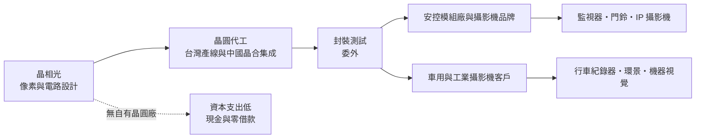
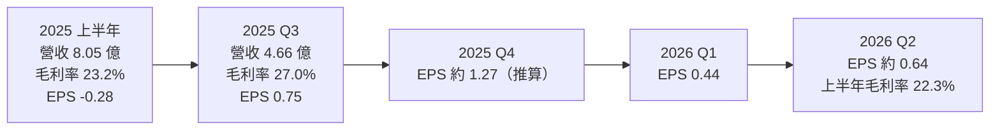
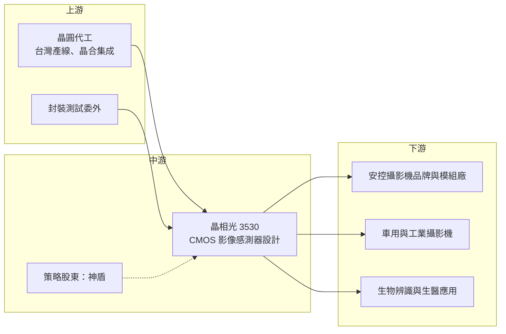

# 3530 晶相光

> 上市｜[[產業索引-半導體業|半導體業]]｜上市（櫃）日期 2018/07/16

# 第一章：企業模式與商業藍圖

> [!info] 撰寫說明
> 本文由 Claude 依公開資料整理，架構比照 [[2330台積電]] 的四章研究，資料截至 2026-10-07。財務數字來源：富果研究法說會整理（2025 年 8 月、12 月）、科技新報月營收報導、Yahoo 股市與 poorstock 各季 EPS、Dcard 個股介紹、CMoney 投資快訊、證交所開放資料（本筆記 _data 快照：2026 上半年綜合損益、資產負債、股利、本益比）；產業描述為整理性內容，尚未逐條比對原始文件。#待校對

在評估單一個股的長期投資價值時，首要步驟是拆解企業的底層獲利邏輯。本章針對晶相光電（股票代號：3530，以下簡稱晶相光）的商業模式進行定性分析，說明一家規模不大的 [[CIS]] 設計公司，如何在 Sony、三星與中國大廠環伺的影像感測器市場中，靠利基應用存活並維持獲利。

## 一、核心定位：專攻利基型應用的 CMOS 影像感測器設計公司

晶相光成立於 2004 年，依 Dcard 個股介紹，公司當初由力晶與 OmniVision（豪威）合資設立，專門設計 CMOS [[影像感測器]]（[[CIS]]）。2018 年在證交所上市，實收資本額約 7.75 億元。2022 年 [[6462神盾]] 以每股 123 元、總額約 15.5 億元取得 16.11% 股權，成為第二大股東。

晶相光屬於 [[Fabless]] 模式，自己負責感測器像素與電路設計，晶圓製造與後段封測委外。它和手機鏡頭大廠的最大差別在於市場選擇：

* **不追手機高畫素競賽：** 手機 CIS 由 Sony、三星與豪威主導，需要龐大研發與先進製程。晶相光把資源放在安控監視、車用影像、生物辨識等出貨量較小、但規格要求特殊的市場。
* **以感光特性取代畫素數字：** 安控與車用重視低照度、近紅外光靈敏度與低功耗，晶相光的產品重點是背照式（[[BSI]]）與近紅外感測技術，而不是單純提高畫素。

## 二、終端應用／產品板塊：安控為主，車用與工業逐步擴大

依富果研究整理的法說內容，晶相光的應用分成專業安防、消費性安防、車用影像與 [[IP攝影機]] 四大領域，另有指紋與生物辨識、生醫（基因定序晶片）等新應用。公司近年未公布精確的應用別營收比重，因此本文不畫圓餅圖；依 Dcard 個股介紹引述的 2022 年資料，CMOS 晶片占產品營收 98%，安防監控約占八至九成，銷售地區以亞洲為主。

* **專業安防：** 監視攝影機、網路錄影系統用感測器，是晶相光的基本盤。早期主要客戶為中國安控大廠海康威視。
* **消費性安防：** 家用監視器、門鈴攝影機、電池或太陽能供電的戶外攝影機，強調超低功耗。
* **車用影像：** 行車紀錄器、環景影像與車艙監控。2023 年底公司表示已取得 [[AEC-Q100]] 車規認證。
* **工業與新應用：** [[全域快門]]（Global Shutter）感測器用於機器視覺與車用，另有與 Illumina 合作的基因定序晶片。

技術路線上，依 2025 年 12 月法說，BSI 背照式 2K 與 500 萬畫素產品出貨成長，1/1.8 吋大尺寸感光元件逐步出貨，全域快門則被公司視為長期穩定需求。

## 三、資本轉化邏輯（營運模式）：雙供應鏈的輕資產設計公司

* **雙供應鏈：** 依 2025 年 8 月法說，晶相光同時使用台灣產能，以及與中國合肥晶合集成的合作產能，讓客戶依成本與地緣政治考量選擇生產地。這在美中科技脫鉤下成為接單工具，公司估計供應鏈重組需要 2 到 3 年。
* **輕資產：** 不擁有晶圓廠，主要成本是晶圓採購與研發人力。2025 年第三季底銀行借款為零，現金與有價金融資產超過 10 億元，總負債占資產約 9.4%。
* **存貨是主要變數：** 2025 年第三季底存貨 9.28 億元，低於前一年同期的 13.46 億元。CIS 設計公司若庫存過高，會在景氣反轉時提列跌價損失，這正是 2023 至 2024 年毛利率一度跌到個位數的原因。

## 四、企業長期藍圖：脫鉤轉單、低功耗與全域快門

* **非中國供應鏈轉單：** 部分歐美與印度客戶希望採用非中國品牌的感測器，晶相光以台灣公司身分爭取這類轉單，同時仍保留中國市場參與，以維持成本與技術競爭力。
* **超低功耗產品：** 鎖定電池與太陽能供電的戶外攝影機，這類產品對待機功耗要求嚴格，是規格導向而非價格導向的市場。
* **全域快門與車用：** 全域快門感測器可避免高速移動物體的畫面變形，適合車用駕駛監控與工廠自動化，是晶相光從消費安控走向工業與車用的關鍵產品線。
* **與神盾的策略關係：** 神盾在指紋辨識與安全晶片的布局，與晶相光的生物辨識、影像感測技術有互補空間，但具體合作成果未查得。

# 第二章：護城河深度與競爭優勢

在長期價值投資中，「護城河」指企業抵禦競爭、維持超額利潤的保護機制。本章分析晶相光在影像感測器市場的護城河構成、主要競爭對手，以及這些優勢能否抵擋中國同業的價格壓力。

## 一、護城河的核心組成要素

晶相光規模小，護城河屬於「窄護城河」，主要來自以下三點：

* **1. 利基規格的設計經驗：** 安控與車用感測器需要在低照度、近紅外光、寬動態範圍等條件下穩定成像，需要長期累積像素設計與調校經驗。客戶的影像處理晶片（[[ISP]]）與感測器需要一起調校，導入後轉換有一定成本。
* **2. 車規與工業認證：** 取得 AEC-Q100 等認證需要時間，車用與工業客戶的驗證期長，一旦導入通常可以穩定供貨數年。
* **3. 非中國供應來源：** 在美中脫鉤下，「台灣設計、可選擇台灣製造」本身就是部分國際客戶的採購條件，這是中國同業難以複製的優勢。

## 二、全球主要競爭對手格局

| 對手 | 定位 | 對晶相光的威脅 |
|---|---|---|
| [[SONY索尼]] | 全球 CIS 龍頭，高階安控與車用皆強 | 在高階安控與車用技術領先 |
| 豪威（OmniVision，韋爾股份旗下） | 手機、車用、安控全面布局 | 規模與產品線遠大於晶相光，車用市占高 |
| 思特威、格科微 | 中國 CIS 廠，安控與中低階市場積極 | 在中國安控市場以價格與在地服務搶單 |
| [[005930三星電子]] | 手機高畫素為主，兼做其他應用 | 主要在手機，對利基市場威脅較間接 |
| [[3227原相]] | 台灣光學感測 IC 設計公司 | 在部分感測應用重疊 |

## 三、優勢轉化：哪些市場守得住、哪些守不住

* **守得住：** 需要非中國供應鏈的國際安控客戶、低功耗戶外攝影機、取得車規認證後的車用專案。這些市場看重規格、認證與供應穩定度。
* **守不住：** 中國本土安控市場的中低階感測器。思特威等中國廠商有規模與本土政策支持，價格競爭激烈，晶相光很難以價格取勝。
* **觀察重點：** 依證交所資料，2026 年 1 至 8 月營收年增 36.6%，但上半年 [[毛利率]] 只有 22.3%，低於 2025 年第三季的 27.0%。觀察重點包括：毛利率能否回到 25% 以上、全域快門與車用產品的出貨占比、以及 2025 年 12 月法說提到的記憶體缺貨漲價是否壓抑中低階攝影機需求。

# 第三章：財務體質與盈利規模

資料日期：2026-10-07。數字取自富果研究法說整理、科技新報月營收報導、Yahoo 股市與 poorstock 各季 EPS，以及證交所開放資料快照，表格是撰寫當時的快照；最新月營收、毛利率、累計 EPS 由自動排程寫在本筆記的屬性欄位（月營收、毛利率、累計EPS 等）。#待校對

財務報表是檢驗護城河是否真實存在的最終標準。本章用三率、ROE、現金流與資本報酬，檢視晶相光在影像感測器景氣循環中的獲利品質。

## 一、獲利能力的基石：三率

| 項目 | 2025 全年 | 2025 Q3 | 2026 Q1 | 2026 Q2 | 2026 上半年 |
|---|---|---|---|---|---|
| 營收（新台幣） | 18.45 億 | 4.66 億 | 未查得 | 未查得 | 11.40 億 |
| [[毛利率]] | 前三季 24.6% | 27.0% | 未查得 | 未查得 | 22.3% |
| [[營業利益率]] | 未查得 | 約 8.2%（推算） | 未查得 | 未查得 | 6.8% |
| EPS（元） | 1.74 | 0.75 | 0.44 | 0.64（推算） | 1.08 |

註：2025 全年 EPS 由股利公告的本期淨利 1.35 億元與股數推算，與 poorstock 列示一致；2026 Q2 EPS 由上半年 1.08 元減第一季 0.44 元推算。

* **毛利率：** 2024 年上半年毛利率僅 8.3%，主因是庫存跌價；2025 年上半年回到 23.2%、第三季升到 27.0%，代表庫存回到正常水位後，產品本身的毛利率大約落在 20% 中段。2026 年上半年營收大增但毛利率反而下滑到 22.3%，可能與產品組合或晶圓成本上漲有關（推估）。
* **營業利益率：** 研發與管理費用相對固定，2026 年上半年營業費用約 1.77 億元，營業利益 0.77 億元，營業利益率 6.8%。營收規模放大時有[[營運槓桿]]，但毛利率是否守住才是關鍵。
* **[[業外收益]]與匯率：** 2025 年上半年營業利益為正，卻因新台幣升值的匯兌損失而出現稅後虧損，顯示美元計價的 CIS 設計公司對匯率相當敏感。2026 年上半年業外收入約 0.23 億元，對獲利有正面貢獻。

## 二、[[ROE]]：資本效率

依證交所資料，2026 年第二季底股東權益約 24.78 億元，上半年稅後淨利 0.84 億元，年化 ROE 約 6.8%（推估）；以 2025 年淨利 1.35 億元計算，ROE 約在 5% 至 6% 之間（推估）。晶相光沒有借款、帳上現金多，ROE 偏低主要是獲利率不高，而不是資本結構問題。每股淨值約 32 元，股價淨值比約 1.87 倍。

## 三、資本支出與自由現金流

* **[[CapEx]]：** 作為 Fabless 公司，資本支出以研發設備、光罩與測試設備為主，金額不大，具體數字未查得。
* **[[自由現金流]]：** 存貨由 13.46 億元降到 9.28 億元的過程釋放了營運現金，是 2025 年現金部位維持在 10 億元以上的原因之一。2026 年營收成長若伴隨備貨，存貨可能再度上升，需要觀察營運現金流。
* **股利：** 2025 年度配發現金股利 0.8 元，以 EPS 1.74 元計算，[[配發率]]約 46%，殖利率約 1.3%。

## 四、[[ROIC]] 與 [[WACC]]：價值創造利差

晶相光投入資本以營運資金（存貨、應收帳款）為主。2023 至 2024 年庫存跌價期間，ROIC 明顯低於資金成本；2025 年起獲利回升，但以約 6% 的 ROE 推算，ROIC 仍可能低於一般股權資金成本（推估，具體數值未查得）。要讓利差轉正，需要毛利率穩定在 25% 以上，並把車用與全域快門等高單價產品占比拉高。

# 第四章：總體風險與地緣政治

任何企業都無法脫離宏觀環境獨立存在。本章分析晶相光未來必須面對的地緣政治、產業週期與營運風險。

## 一、地緣政治

* **美中脫鉤的雙面刃：** 美國與部分國家限制採用中國安控品牌，讓非中國 CIS 供應商有轉單機會；但晶相光早期客戶集中在中國安控廠，中國市場的本土化政策會讓它在中國的份額被本土 CIS 廠擠壓。
* **中國代工產能：** 與合肥晶合集成的合作降低成本，但若美國擴大對中國製晶片的限制或關稅，這部分產能的出貨可能受限。
* **美國半導體關稅：** 2025 年法說已把美國半導體關稅政策列為主要不確定因素。

## 二、產業週期與市場結構

* **CIS 庫存循環：** 2023 年營收衰退約 18%，2024 年上半年毛利率跌到 8.3%，顯示 CIS 設計公司在庫存調整時的獲利波動極大，屬於典型[[長鞭效應]]。
* **規模劣勢：** Sony、豪威、思特威的營收規模是晶相光的數十倍以上，在晶圓採購議價、研發投入上都有優勢。
* **記憶體排擠：** 2025 年 12 月法說提到 AI 需求排擠消費性記憶體，可能造成記憶體缺貨與漲價，墊高中低階攝影機的物料成本並壓抑需求。

## 三、營運環境的隱性風險

* **客戶集中：** 安控為主要營收來源，若主要安控客戶轉單或砍單，對營收衝擊大。
* **匯率：** 營收以美元計價，新台幣升值會造成匯兌損失，2025 年上半年即因此由營業獲利轉為稅後虧損。
* **晶圓成本上漲：** 2026 年成熟製程代工價格有上漲壓力，若無法轉嫁，毛利率會被壓縮。

## 四、科技或法規演進

* **堆疊式與 AI 感測器：** 大廠推出內建 AI 運算的[[堆疊式感測器]]，若安控攝影機轉向感測器端的 [[Edge AI]]，晶相光需要跟上相應的設計與製程能力。
* **資安法規：** 歐美對聯網攝影機的資安與原產地規範趨嚴，對非中國供應商有利，但也提高產品認證成本。

# 專有名詞解析

## 半導體

- **[[CIS]]**：CMOS 影像感測器，把光訊號轉成電子訊號的晶片，是攝影機與手機鏡頭的核心元件。
- **[[BSI]]**：背照式感測器，把線路層放到感光層背面，讓光線直接照到感光區，提高低照度下的靈敏度。
- **[[全域快門]]**：所有像素同時曝光的感測方式，可避免拍攝高速移動物體時的畫面變形，常用於工業與車用。
- **[[ISP]]**：影像訊號處理器，負責把感測器輸出的原始資料做降噪、色彩與曝光調整，再輸出成影像。
- **[[堆疊式感測器]]**：把感光層與邏輯運算層分別製造後上下堆疊的感測器，可在感測器內加入更多運算功能。
- **[[Edge AI]]**：在終端裝置上直接執行 AI 運算，而不把資料傳回雲端，可降低延遲與頻寬需求。
- **[[Fabless]]**：只做晶片設計、不擁有晶圓廠的 IC 設計公司，製造委託晶圓代工廠。

## 應用

- **[[影像感測器]]**：負責把鏡頭收到的光轉成數位影像資料的感測元件，依應用分為手機、安控、車用與工業等規格。
- **[[AEC-Q100]]**：汽車電子協會制定的積體電路可靠度測試標準，晶片要用於車上通常必須先通過。
- **[[IP攝影機]]**：透過網路傳輸影像的監視攝影機，可直接連到雲端或網路錄影機。

## 金融

- **[[營運槓桿]]**：費用固定比例高時，營收小幅變動會造成獲利大幅變動的現象。
- **[[業外收益]]**：本業以外的收入，例如利息、匯兌利益、投資收益，不代表本業競爭力。
- **[[配發率]]**：現金股利占每股盈餘的比例，用來衡量公司把多少獲利發給股東。
- **[[長鞭效應]]**：終端需求的小幅變動，沿供應鏈往上游傳遞時被逐級放大，造成上游庫存與訂單劇烈波動。

# 核心供應鏈

## 1. 上游：晶圓代工與封測
- 晶圓代工：台灣產線（早期與力晶體系淵源深，具體合作對象待校對）、中國合肥晶合集成
- 封裝測試：委外，具體廠商未查得

## 2. 中游：晶相光本身與策略股東
- 第二大股東（持股約 16.11%）：[[6462神盾]]
- 早期合資方：力晶、豪威（OmniVision）

## 3. 下游：主要客戶
- 安控攝影機：海康威視等中國安控大廠（早期主要客戶），以及非中國安控品牌
- 車用：行車紀錄器、環景與車艙監控系統廠
- 生醫：Illumina（基因定序晶片合作）

## 4. 同業
- 國際：[[SONY索尼]]、豪威（OmniVision）、[[005930三星電子]]
- 中國：思特威、格科微
- 台灣：[[3227原相]]

## 最新新聞
<!-- news:start -->
<!-- news:end -->

## 相關連結
- [公開資訊觀測站](https://mopsov.twse.com.tw/mops/web/t05st03?step=1&firstin=1&co_id=3530)
- [Goodinfo](https://goodinfo.tw/tw/StockDetail.asp?STOCK_ID=3530)
- [Yahoo 股市](https://tw.stock.yahoo.com/quote/3530)
- [鉅亨網新聞](https://www.cnyes.com/twstock/3530/news)
