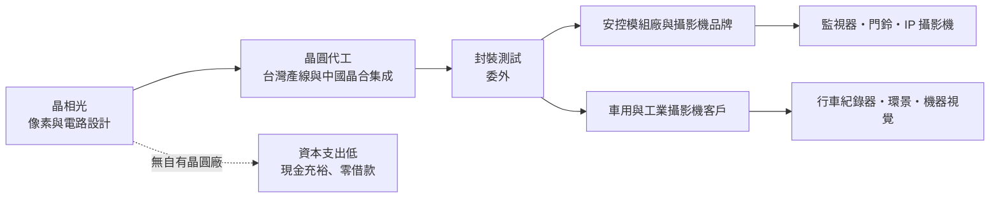
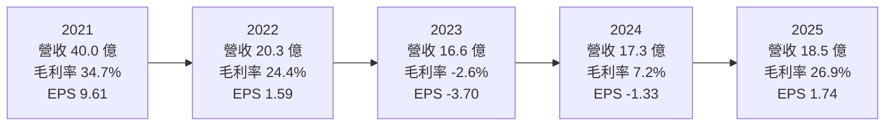
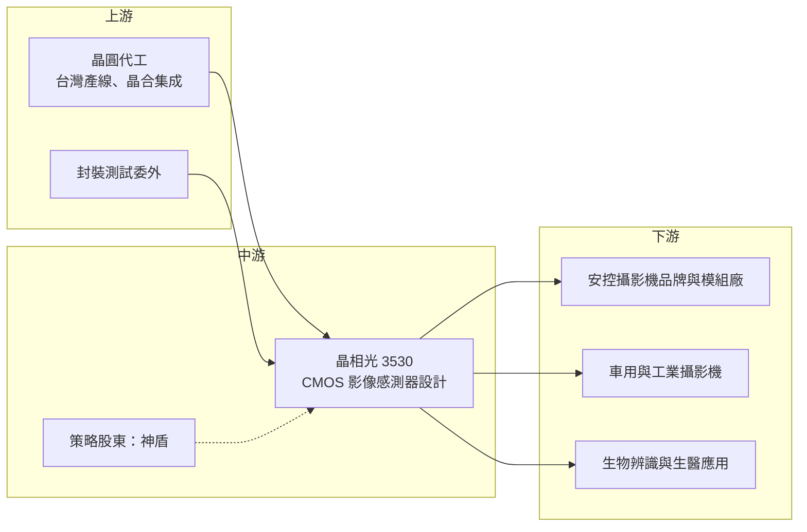

# 3530 晶相光

> 上市｜[[產業索引-半導體業|半導體業]]｜上市（櫃）日期 2018/07/16

# 第一章：企業模式與商業藍圖

> [!info] 撰寫說明
> 本文由 Claude 依公開資料整理，架構比照 [[2330台積電]] 的四章研究，資料截至 2026-10-08。財務數字來源：Goodinfo 台灣股市資訊網年度經營績效與股利政策、富果研究法說會整理（2025 年 8 月、12 月）、Dcard 個股介紹、CMoney 投資快訊、證交所開放資料（本筆記 _data 快照）；產業描述為整理性內容，尚未逐條比對原始文件。#待校對

在評估單一個股的長期投資價值時，首要步驟是拆解企業的底層獲利邏輯。本章針對晶相光電（股票代號：3530，以下簡稱晶相光）的商業模式進行定性分析，說明一家規模不大的 [[CIS]] 設計公司，如何在 Sony、三星與中國大廠主導的影像感測器市場中，靠利基應用維持生存空間，以及這種定位的長處與天花板。

## 一、核心定位：專攻利基應用的 CMOS 影像感測器設計公司

晶相光成立於 2004 年，依 Dcard 個股介紹，公司當初由力晶與 OmniVision（豪威）合資設立，專門設計 CMOS [[影像感測器]]，2018 年在證交所上市。2022 年 [[6462神盾]] 以約 15.5 億元取得 16.11% 股權，成為第二大股東，讓晶相光多了一個在指紋與安全晶片領域有技術互補的策略股東。

晶相光採 [[Fabless]] 模式，自己負責像素結構與讀取電路的設計，晶圓製造與封裝測試則委外。影像感測器是一個高度集中的市場，手機用的高畫素感測器由 Sony、三星與豪威主導，需要龐大研發預算與先進製程配合。晶相光很早就選擇不走這條路，而是把資源放在安控監視、車用影像、生物辨識等出貨量較小、但對感光特性有特殊要求的市場。

這個定位決定了晶相光的競爭方式：它比的不是畫素數字，而是低照度成像、近紅外光靈敏度、低功耗這些安控與車用客戶真正在意的規格。也因為市場規模有限，它的營收長期維持在十幾億到四十億元之間，屬於典型的利基型 IC 設計公司。

## 二、終端應用／產品板塊：安控為基本盤，車用與工業是延伸

公司近年未公布精確的應用別營收比重，因此本文不畫圓餅圖。依 Dcard 個股介紹引述的 2022 年資料，CMOS 晶片占產品營收 98%，安防監控約占八至九成，銷售地區以亞洲為主；富果研究整理的法說內容則把應用分成專業安防、消費性安防、車用影像與 [[IP攝影機]] 四大領域。

* **專業安防：** 這是晶相光的基本盤，產品用於企業與城市監視系統的攝影機。專業安防客戶重視夜間成像品質與長期供貨，一款攝影機設計定案後通常會量產數年，因此訂單相對穩定。早期主要客戶為中國安控大廠，這既帶來規模，也埋下客戶集中的風險。
* **消費性安防與 IP 攝影機：** 家用監視器、門鈴攝影機、以電池或太陽能供電的戶外攝影機，是近年成長最快的應用。這類產品最在意待機功耗，因為功耗決定電池能撐多久，晶相光因此把超低功耗設計列為長期重點。
* **車用影像：** 包括行車紀錄器、環景影像與車艙監控。車用感測器需要通過 [[AEC-Q100]] 等可靠度認證，晶相光在 2023 年底取得車規認證，車用的驗證期長，但一旦導入可以穩定供貨多年。
* **工業與新應用：** [[全域快門]]感測器可避免拍攝高速移動物體時的畫面變形，適合機器視覺與車用駕駛監控；另有與 Illumina 合作的基因定序晶片。這些應用量不大，但代表公司把影像技術延伸到生醫與工業的能力。

技術上，晶相光近年的主軸是背照式（[[BSI]]）感測器與近紅外光增強技術，並逐步推出大尺寸感光元件，讓產品從入門安控往中高階移動。

## 三、資本轉化邏輯（營運模式）：雙供應鏈的輕資產設計公司

晶相光的錢是這樣賺來的：先投入研發設計出感測器，再向晶圓代工廠購買晶圓、委外封測，最後把晶片賣給攝影機模組廠或品牌。因為沒有晶圓廠，資本支出很低，主要的資金需求是研發人力與存貨。

* **雙供應鏈：** 依 2025 年 8 月法說，晶相光同時使用台灣產能與中國合肥晶合集成的合作產能。這讓客戶可以依成本與地緣政治考量選擇生產地：需要「非中國製造」的國際客戶用台灣產能，在意成本的中國客戶用中國產能。在美中科技脫鉤的長期趨勢下，這種彈性本身就是接單工具。
* **存貨是獲利的關鍵變數：** CIS 設計公司需要提前向晶圓廠下單，若需求突然轉弱，庫存就會變成跌價損失。2023 年晶相光毛利率跌到負值，2024 年也只有 7.2%，主因就是 2021 年缺貨時期備下的庫存在需求轉弱後被迫認列跌價。這說明這門生意的獲利波動，很大一部分來自庫存管理而不是技術。
* **保守的財務結構：** 依 2025 年 12 月法說，公司銀行借款為零，現金與有價金融資產超過 10 億元，總負債占資產約一成。保守的資產負債表讓公司能撐過 2023 至 2024 年的虧損期。

## 四、企業長期藍圖：脫鉤轉單、低功耗與全域快門

晶相光的長期方向可以歸納成三條線，每一條都和「避開與大廠正面競爭」的定位一致。

* **非中國供應鏈：** 公司在法說中估計，安控供應鏈因地緣政治重組大約需要 2 到 3 年。歐美與印度等市場逐步限制中國安控品牌，對非中國的感測器供應商是結構性機會，晶相光以台灣公司身分爭取這類客戶，同時保留中國市場，以維持成本與技術競爭力。
* **超低功耗產品：** 鎖定電池與太陽能供電的戶外攝影機。這是規格導向而不是價格導向的市場，適合技術型的小公司經營。
* **全域快門與車用：** 全域快門感測器是從消費安控走向工業與車用的關鍵產品線。車用與工業的產品週期長、認證門檻高，若能站穩，可以降低公司對安控景氣的依賴。

# 第二章：護城河深度與競爭優勢

在長期價值投資中，「護城河」指企業抵禦競爭、維持超額利潤的保護機制。本章分析晶相光在影像感測器市場的護城河構成、主要競爭對手，以及這些優勢能否抵擋大廠與中國同業的競爭。

## 一、護城河的核心組成要素

晶相光規模小，護城河屬於「窄護城河」：它在特定應用有優勢，但無法阻止大廠進入。

* **1. 利基規格的設計經驗：** 安控與車用感測器需要在低照度、近紅外光、強逆光等條件下穩定成像，這需要多年累積的像素設計與調校經驗。感測器還要和客戶的影像處理晶片（[[ISP]]）一起調校，客戶一旦完成整機設計，換感測器就要重新調校影像品質，因此有一定的轉換成本。
* **2. 車規與工業認證：** 取得車規認證需要時間與完整的品質系統，車廠與工業客戶的驗證期常以年計。這個門檻讓新進者難以快速搶單，也讓已導入的供應商可以穩定供貨多年。
* **3. 非中國供應來源：** 在美中脫鉤下，「台灣設計、可選擇台灣製造」本身就是部分國際客戶的採購條件。這是中國同業無論價格多低都難以複製的優勢，也是晶相光未來十年最重要的差異化來源。

## 二、全球主要競爭對手格局

| 對手 | 定位 | 對晶相光的威脅 |
|---|---|---|
| [[SONY索尼]] | 全球 CIS 龍頭，高階安控與車用皆強 | 在高階安控與車用技術領先 |
| 豪威（OmniVision，韋爾股份旗下） | 手機、車用、安控全面布局 | 規模與產品線遠大於晶相光，車用市占高 |
| 思特威、格科微 | 中國 CIS 廠，安控與中低階市場積極 | 在中國安控市場以價格與在地服務搶單 |
| [[005930三星電子]] | 手機高畫素為主，兼做其他應用 | 主要在手機，對利基市場威脅較間接 |
| [[3227原相]] | 台灣光學感測 IC 設計公司 | 在部分感測應用重疊 |

## 三、優勢轉化：守得住／守不住／觀察重點

* **守得住：** 需要非中國供應鏈的國際安控客戶、低功耗戶外攝影機，以及取得車規認證後的車用專案。這些市場看重規格、認證與供應穩定度，價格不是唯一考量，是晶相光能維持合理毛利率的地方。
* **守不住：** 中國本土安控市場的中低階感測器。思特威等中國廠商有規模優勢與本土政策支持，價格競爭激烈，晶相光很難以價格取勝。從 2022 年起營收大幅萎縮、2023 至 2024 年連續虧損，部分原因就是中國市場份額流失。
* **觀察重點：** 長期來看，有三個指標可以判斷晶相光的定位是否成功：一是毛利率能否穩定在 25% 以上，而不是隨庫存循環大起大落；二是非中國客戶與車用、工業應用占營收的比重是否持續提高；三是全域快門與大尺寸感測器等中高階產品能否成為主力。

# 第三章：財務體質與盈利規模

資料日期：2026-10-08。數字取自 Goodinfo 年度經營績效與股利政策、富果研究法說整理與證交所開放資料快照，表格是撰寫當時的快照；最新月營收、毛利率、累計 EPS 由自動排程寫在本筆記的屬性欄位（月營收、毛利率、累計EPS 等）。#待校對

財務報表是檢驗護城河是否真實存在的最終標準。本章用多年度的三率、ROE、現金流與資本報酬，檢視晶相光在影像感測器景氣循環中的獲利品質。

## 一、獲利能力的基石：三率

| 年度 | 營收（新台幣） | [[毛利率]] | [[營業利益率]] | EPS（元） | [[ROE]] | 現金股利（元） |
|---|---|---|---|---|---|---|
| 2019 | 22.9 億 | 19.9% | 6.8% | 2.01 | 7.3% | 2.00 |
| 2020 | 33.3 億 | 20.2% | 9.7% | 3.65 | 13.1% | 2.80 |
| 2021 | 40.0 億 | 34.7% | 22.1% | 9.61 | 30.0% | 3.50 |
| 2022 | 20.3 億 | 24.4% | 6.8% | 1.59 | 4.6% | 0 |
| 2023 | 16.6 億 | -2.6% | -22.3% | -3.70 | -11.4% | 0 |
| 2024 | 17.3 億 | 7.2% | -11.2% | -1.33 | -4.4% | 0 |
| 2025 | 18.5 億 | 26.9% | 7.4% | 1.74 | 5.7% | 0.80 |

這張表最重要的訊息是「波動」。2021 年全球晶片缺貨，安控需求旺盛，晶相光營收衝到 40 億元、EPS 9.61 元，ROE 達 30%；但隔年營收腰斬，2023 年毛利率甚至轉為負值。毛利率在短短兩年內從 34.7% 掉到 -2.6%，主因不是產品突然失去競爭力，而是缺貨期間備下的高價庫存在需求反轉後必須認列跌價。2025 年庫存回到正常水位後，毛利率回到 26.9%，大約就是這門生意在正常年度的水準。

* **[[毛利率]]：** 排除 2021 年缺貨高峰與 2023 至 2024 年庫存跌價期，晶相光的正常毛利率大約落在 20% 至 27% 之間。這個水準低於多數 IC 設計公司，反映 CIS 晶圓成本高、安控市場價格競爭激烈。
* **[[營業利益率]]：** 研發與管理費用相對固定，營收在 17 億至 20 億元時，營業利益率只有個位數；營收放大到 30 億元以上時，[[營運槓桿]]才會明顯發揮。因此營收規模是決定獲利的第二個關鍵。
* **長期指標：** 2016 至 2025 年營收從 14.1 億元成長到 18.5 億元，年複合成長率約 3%（推算）。2021 至 2025 年五年平均 ROE 約 4.9%（推算），明顯被 2023 至 2024 年的虧損拉低。現金股利在 2016 至 2021 年每年都有發放（1.5 元至 3.5 元），2022 至 2024 年因獲利不足停發三年，2025 年恢復配發 0.8 元，配息穩定度中等偏低。

## 二、[[ROE]]：資本效率

晶相光沒有銀行借款、帳上現金多，ROE 幾乎完全由獲利率決定，而不是靠財務槓桿放大。景氣好的年度（2020、2021 年）ROE 可達 13% 至 30%，正常年度落在 5% 至 10%，庫存調整年度則為負值。對長期投資人來說，這代表晶相光是一家「週期型」的小型 IC 設計公司：持有它的報酬，很大程度取決於買在庫存循環的哪個位置。

## 三、資本支出與自由現金流

* **[[CapEx]]：** 作為 Fabless 公司，資本支出以研發設備、光罩與測試設備為主，金額相對營收很小，具體數字未查得。
* **[[自由現金流]]：** 自由現金流主要受存貨變化影響。依 2025 年 12 月法說，2025 年第三季底存貨 9.28 億元，低於前一年同期的 13.46 億元，存貨下降釋放的現金是公司在虧損期仍維持 10 億元以上現金部位的原因。長期而言，晶相光在獲利年度的自由現金流多為正值，但在備貨期會被存貨占用（推估，逐年現金流數字未查得）。

## 四、[[ROIC]] 與 [[WACC]]：價值創造利差

晶相光沒有有息負債，投入資本可以用股東權益近似。以 2025 年為例，營業利益約 1.37 億元（營收 18.5 億元 × 營業利益率 7.4%），扣除 20% 稅率後的稅後營業利益約 1.10 億元；股東權益約 24 億元（依 2025 年 ROE 5.7% 與淨利 1.35 億元回推），ROIC 約 4.6%（推算）。2021 年高峰期的 ROIC 則與 ROE 相近，約在 30% 上下（推算）。

WACC 以資本資產定價模型（CAPM）推估：台灣 10 年期公債殖利率約 1.5% 至 2%，市場風險溢酬約 6%，β 未查得個股數值，採台灣中小型 IC 設計股常見的 1.1 至 1.3（假設），股東權益成本約 8.4% 至 9.6%。由於沒有有息負債，WACC 約等於股東權益成本，約 8.5% 至 9.5%（推算）。

比較兩者，晶相光只有在 2020 至 2021 年的景氣高峰期 ROIC 明顯高於 WACC，2022 至 2025 年多數時間低於資金成本。這代表過去十年整體來看，公司創造的價值並不穩定。要讓 ROIC 長期高於 9% 左右的資金成本，需要毛利率穩定在 25% 以上、營收規模回到 25 億元以上，並避免再出現大規模的庫存跌價。

# 第四章：總體風險與地緣政治

任何企業都無法脫離宏觀環境獨立存在。本章分析晶相光長期必須面對的地緣政治、產業週期與營運風險。

## 一、地緣政治

* **美中脫鉤的雙面刃：** 美國與部分國家限制採用中國安控品牌，讓非中國的 CIS 供應商有轉單機會；但晶相光過去的大客戶集中在中國安控廠，中國推動晶片國產化後，本土 CIS 廠會優先取得訂單。換句話說，晶相光同時面對「國際市場的機會」與「中國市場的流失」，淨效果取決於前者能否補上後者。
* **中國代工產能的政策風險：** 與合肥晶合集成的合作可以降低成本，但若美國擴大對中國製晶片的關稅或採購限制，這部分產能生產的晶片可能無法賣給國際客戶，公司需要隨時調整兩邊產能的分配。

## 二、產業週期與市場結構

* **CIS 庫存循環：** 2021 至 2024 年的資料清楚顯示，CIS 設計公司的獲利會隨庫存循環劇烈擺盪。終端需求的小變動沿供應鏈往上游放大，形成[[長鞭效應]]，小型公司因為議價力弱，往往承受最大的跌價損失。
* **規模劣勢：** Sony、豪威、思特威的營收規模是晶相光的數十倍以上，在晶圓採購議價、研發投入與產品線完整度上都有優勢。這是晶相光必須長期堅守利基市場、避免正面競爭的根本原因。

## 三、營運環境的隱性風險

* **客戶集中：** 安控長期是主要營收來源，若主要安控客戶轉單或大幅調整庫存，對營收衝擊很大。分散到車用與工業是降低這項風險的方法，但需要時間。
* **匯率：** 營收以美元計價，新台幣升值會造成匯兌損失。2025 年上半年公司營業利益為正，卻因匯損而出現稅後虧損，顯示匯率對小型設計公司的獲利影響不容忽視。
* **晶圓成本：** CIS 晶圓占成本比重高，若成熟製程代工價格上漲而無法轉嫁，毛利率會被壓縮。

## 四、科技或法規演進

* **堆疊式與 AI 感測器：** 大廠已推出內建 AI 運算的[[堆疊式感測器]]，若安控攝影機轉向在感測器端執行 [[Edge AI]]，晶相光需要相應的設計與製程能力，否則可能在高階市場落後。
* **資安與原產地法規：** 歐美對聯網攝影機的資安與原產地規範趨嚴，長期對非中國供應商有利，但也提高產品認證成本，對小公司是一筆不小的負擔。

# 專有名詞解析

## 半導體

- **[[CIS]]**：CMOS 影像感測器，把光訊號轉成電子訊號的晶片，是攝影機與手機鏡頭的核心元件。
- **[[BSI]]**：背照式感測器，把線路層放到感光層背面，讓光線直接照到感光區，提高低照度下的靈敏度。
- **[[全域快門]]**：所有像素同時曝光的感測方式，可避免拍攝高速移動物體時的畫面變形，常用於工業與車用。
- **[[ISP]]**：影像訊號處理器，負責把感測器輸出的原始資料做降噪、色彩與曝光調整，再輸出成影像。
- **[[堆疊式感測器]]**：把感光層與邏輯運算層分別製造後上下堆疊的感測器，可在感測器內加入更多運算功能。
- **[[Edge AI]]**：在終端裝置上直接執行 AI 運算，而不把資料傳回雲端，可降低延遲與頻寬需求。
- **[[Fabless]]**：只做晶片設計、不擁有晶圓廠的 IC 設計公司，製造委託晶圓代工廠。

## 應用

- **[[影像感測器]]**：負責把鏡頭收到的光轉成數位影像資料的感測元件，依應用分為手機、安控、車用與工業等規格。
- **[[AEC-Q100]]**：汽車電子協會制定的積體電路可靠度測試標準，晶片要用於車上通常必須先通過。
- **[[IP攝影機]]**：透過網路傳輸影像的監視攝影機，可直接連到雲端或網路錄影機。

## 金融

- **[[營運槓桿]]**：費用固定比例高時，營收小幅變動會造成獲利大幅變動的現象。
- **[[ROIC]]**：投入資本報酬率，稅後營業利益除以投入資本，衡量本業運用資金創造報酬的能力。
- **[[WACC]]**：加權平均資金成本，股東與債權人要求報酬率的加權平均，是 ROIC 要超過的門檻。
- **[[長鞭效應]]**：終端需求的小幅變動，沿供應鏈往上游傳遞時被逐級放大，造成上游庫存與訂單劇烈波動。

# 核心供應鏈

## 1. 上游：晶圓代工與封測
- 晶圓代工：台灣產線（具體合作對象待校對）、中國合肥晶合集成
- 封裝測試：委外，具體廠商未查得

## 2. 中游：晶相光本身與策略股東
- 第二大股東（持股約 16.11%）：[[6462神盾]]
- 早期合資方：力晶、豪威（OmniVision）

## 3. 下游：主要客戶
- 安控攝影機：中國安控大廠（早期主要客戶）與非中國安控品牌
- 車用：行車紀錄器、環景與車艙監控系統廠
- 生醫：Illumina（基因定序晶片合作）

## 4. 同業
- 國際：[[SONY索尼]]、豪威（OmniVision）、[[005930三星電子]]
- 中國：思特威、格科微
- 台灣：[[3227原相]]

## 最新新聞
<!-- news:start -->
<!-- news:end -->

## 相關連結
- [公開資訊觀測站](https://mopsov.twse.com.tw/mops/web/t05st03?step=1&firstin=1&co_id=3530)
- [Goodinfo](https://goodinfo.tw/tw/StockDetail.asp?STOCK_ID=3530)
- [Yahoo 股市](https://tw.stock.yahoo.com/quote/3530)
- [鉅亨網新聞](https://www.cnyes.com/twstock/3530/news)
