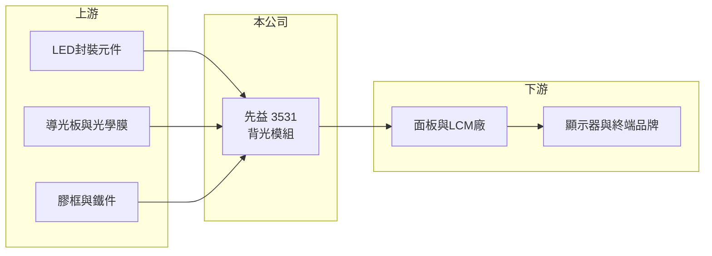

# 3531 先益

> 上櫃｜[[產業索引-光電業|光電業]]｜上市（櫃）日期 2008/04/08

# 第一章：企業模式與商業藍圖

> [!info] 撰寫說明
> 精簡版，由 Claude 依公開資料整理，架構比照 [[2330台積電]]，資料截至 2026-10-07。來源：nstock.tw 先益公司概況、winvest.tw 營收快訊。公開資料有限，營收比重、客戶與營運據點未查到。#待校對

先益是老牌背光模組廠，2026 年營收衰退兩成多，第二季轉為虧損。

- **核心業務：** 先益成立於 1979 年，主要業務為[[背光模組]]的製造與銷售，背光模組是液晶面板的光源，提供給面板廠或 [[LCM]] 組裝廠。
- **營收結構：** 本次未查到應用別比重；中小型背光模組常見於工控、車用、醫療與消費性顯示器（推估）。
- **營運據點：** 生產據點本次未查到，本文不推測。
- **長期方向：** 背光模組市場面臨 OLED 等自發光顯示技術的替代，先益的機會在於中小尺寸、少量多樣的利基應用（推估）。

# 第二章：護城河深度與競爭優勢

先益在背光模組產業屬小型廠商，護城河有限。

- **競爭優勢：** 長年經營背光模組，具中小尺寸客製化設計能力，較能承接大廠不願接的少量多樣訂單（推估）。
- **主要對手：** 國內有 [[5243乙盛-KY]] 等背光與機構件廠，中國有大量背光模組廠以低價競爭。
- **觀察重點：** 營收衰退何時止穩、毛利率能否守住一成五左右，以及第二季虧損是否延續。

# 第三章：財務體質與盈利規模

資料日期：2026-10-07，以下數字是撰寫當時的快照；最新月營收、毛利率、累計 EPS 由自動排程寫在本筆記的屬性欄位（月營收、毛利率、累計EPS 等）。#待校對

先益 2026 年前八月營收年減兩成多，獲利由盈轉虧。

- **營收規模：** 2025 年全年營收 12.98 億元；2026 年 1 至 8 月累計 6.86 億元，年減 25.7%；8 月營收 8,602.2 萬元，年減 6.58%。
- **獲利：** 2025 年全年 EPS 0.30 元；2026 年第二季 EPS -0.17 元，[[毛利率]] 14.34%。
- **財務特色：** 資本額約 6.12 億元，市值約 13 億元；毛利率偏低，營收下滑時[[營運槓桿]]會放大虧損。

# 第四章：總體風險與地緣政治

先益的風險在於背光模組產業的成熟與價格競爭。

- **產業週期：** 需求跟著面板與終端顯示器出貨起伏，客戶庫存調整時訂單會快速減少。
- **營運風險：** 營收規模持續縮小時，固定費用難以攤提；客戶集中度若高，單一客戶轉單影響大（推估）。
- **其他風險：** OLED 與 Mini LED 等技術替代；LED、光學膜與塑膠料價格，以及匯率波動。

# 專有名詞解析

## 應用

- **[[LCM]]**：液晶顯示模組，把液晶面板、背光模組與驅動電路組裝在一起的完整顯示元件。

## 金融

- **[[營運槓桿]]**：固定成本占比高時，營收小幅變動就會讓獲利大幅增減；營收萎縮時虧損也會被放大。

## 產業

- **[[背光模組]]**：液晶面板本身不發光，背光模組以 LED 光源加上導光板與光學膜，提供面板均勻的背光。

# 核心供應鏈

- 上游：LED封裝元件、導光板與光學膜、膠框與鐵件供應商
- 下游／客戶：面板與 LCM 組裝廠、顯示器與終端品牌（推估）
- 同業：[[5243乙盛-KY]] 與中國背光模組廠

## 最新新聞
<!-- news:start（自動產生，請勿手動編輯此範圍） -->
- 2026-10-08 🏛️ 重訊 13:36｜本公司受邀參加永豐金證券舉辦之法人說明會｜[觀測站](https://mops.twse.com.tw/mops/#/web/t05st01)

完整紀錄：[[3531先益 新聞]]
<!-- news:end -->

## 相關連結
- [公開資訊觀測站](https://mopsov.twse.com.tw/mops/web/t05st03?step=1&firstin=1&co_id=3531)
- [Goodinfo](https://goodinfo.tw/tw/StockDetail.asp?STOCK_ID=3531)
- [Yahoo 股市](https://tw.stock.yahoo.com/quote/3531)
- [鉅亨網新聞](https://www.cnyes.com/twstock/3531/news)
