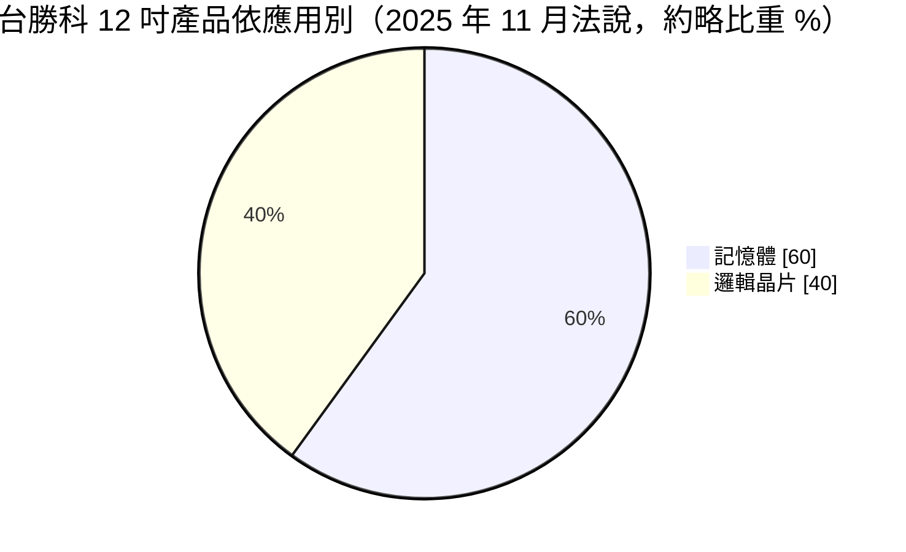
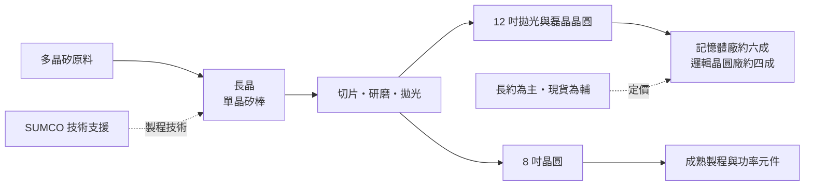
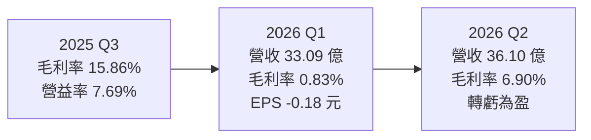
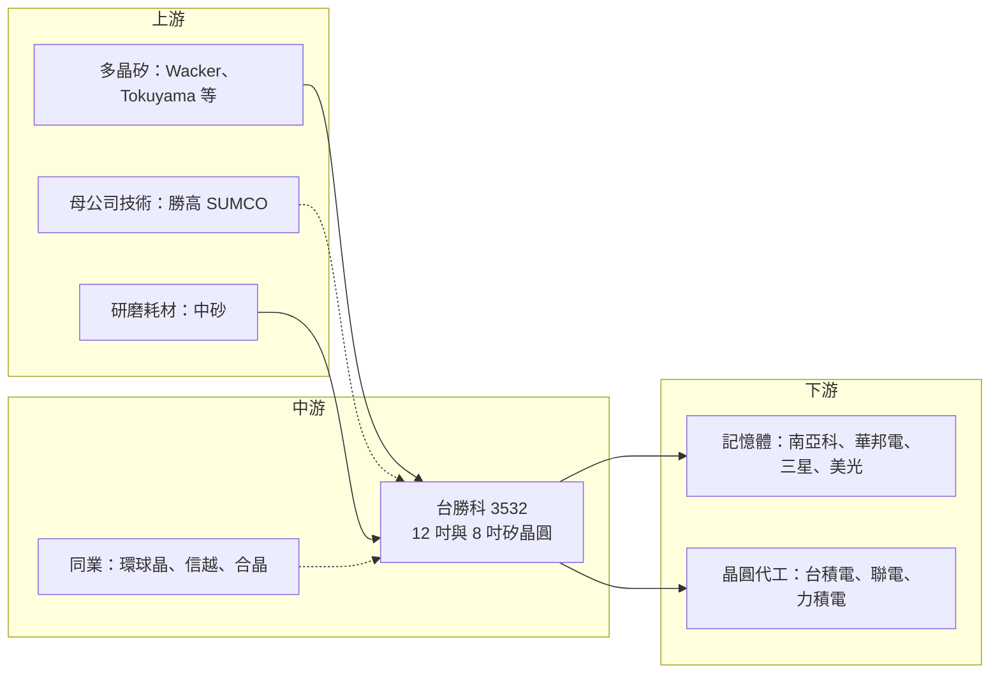

# 3532 台勝科

> 上市｜[[產業索引-半導體業|半導體業]]｜上市（櫃）日期 2007/12/10

# 第一章：企業模式與商業藍圖

> [!info] 撰寫說明
> 本文由 Claude 依公開資料整理，架構比照 [[2330台積電]] 的四章研究，資料截至 2026-10-07。財務數字來源：旺得富（工商時報）2025 年財報公告報導、經濟日報 2026 年 7 月報導、理財周刊、winvest 月營收快訊、富果研究 2025 年 11 月法說會筆記、nstock 公司基本資料；產業描述為整理性內容，尚未逐條比對原始文件。#待校對

在評估單一個股的長期投資價值時，首要步驟是拆解企業的底層獲利邏輯。本章針對台灣勝高科技（股票代號：3532，以下簡稱台勝科）的商業模式進行定性分析，說明這家台日合資的矽晶圓廠如何在寡占市場中定位，以及新廠折舊與景氣循環如何左右它的獲利。

## 一、核心定位：台日合資的矽晶圓廠

台勝科 1995 年 11 月於雲林縣設立，2007 年 12 月在台灣證券交易所掛牌。公司由台塑集團與日本矽晶圓大廠勝高（SUMCO）合資，截至 2026 年 6 月 30 日，SUMCO 旗下的 SUMCO TECHXIV 持有約 40.67% 普通股，最終控制者為 [[3436勝高]]，台塑集團則是另一大股東。這種結構讓台勝科同時具備日本母公司的長晶技術與台塑集團在台灣的土地、公用設施與管理資源。

台勝科的業務單純：把[[多晶矽]]長成單晶矽棒（[[長晶]]），再切片、研磨、拋光，做成晶圓廠用來製造晶片的「[[矽晶圓]]」。它是台灣少數具備 12 吋[[拋光晶圓]]量產能力的廠商，與 [[6488環球晶]] 並列台灣矽晶圓雙雄，但規模小於環球晶。這個定位有兩個商業意義：

* **身處寡占結構：** 全球 12 吋矽晶圓由少數幾家廠商主導，台勝科作為勝高體系的一員，分享寡占市場的定價秩序。
* **承受最上游的波動：** 矽晶圓位於半導體供應鏈最上游，景氣下行時客戶先消化庫存，拉貨降幅往往大於終端需求。

## 二、產品板塊：12 吋為主、記憶體為最大應用

* **12 吋矽晶圓（營收占比超過七成）：** 包括拋光晶圓（鏡面晶圓）與[[磊晶晶圓]]。富果研究的法說筆記指出，12 吋產品應用於記憶體與邏輯晶片的比重約 6:4。

* **AI 帶動的 12 吋需求：** AI 伺服器所需的 [[HBM]] 與 DRAM、先進製程邏輯晶片都需要高品質 12 吋晶圓，這是台勝科近年成長的主軸。
* **8 吋矽晶圓：** 主要供應[[成熟製程]]的電源管理、類比、功率元件等，面臨中國本土矽晶圓廠低價競爭，以及部分應用由 8 吋轉向 12 吋，前景相對承壓。
* **新應用：** 法說會提到 HBM 與 [[CoWoS]] 相關晶圓（例如矽中介層與支撐晶圓）是新的成長機會。

中國市場營收占比已降至約一成，客戶以台灣、日本、韓國與美國的記憶體與晶圓代工廠為主。

## 三、資本轉化邏輯：重資產的長約生意

* **麥寮新廠：** 主要廠區位於雲林麥寮台塑六輕園區一帶。公司近年投資興建 12 吋新廠，新廠已開始提列折舊，但部分產能仍在客戶認證中。依 2025 年 11 月法說會說法，若不計入認證中的產能，12 吋[[產能利用率]]已滿載。2026 年理財周刊報導指出，8 吋與 12 吋產能全面滿載，新廠認證進度有望提前，新增產能已被大客戶預約。
* **折舊決定獲利：** 矽晶圓廠的設備與廠房投資龐大，新廠一開始提列折舊就是固定成本；若產能仍在認證、價格尚未回升，獲利會被大幅壓縮，2026 年第一季即是如此。
* **長約與現貨：** 台勝科採長期合約（[[LTA]]）搭配部分現貨價格的銷售方式，長約提供營收穩定，現貨則在景氣回升時帶來漲價空間。

## 四、企業長期藍圖：跟著 AI 記憶體走

* **長約為主、現貨為輔：** 2026 年第二季起 8 吋現貨價啟動漲勢，客戶反應正面。
* **跟著 AI 記憶體走：** 12 吋產品約六成供應記憶體，HBM 與高容量 DRAM 擴產直接帶動台勝科的需求。
* **依託母公司技術：** 長晶與晶圓加工技術來自 SUMCO，台勝科專注於在台灣量產並就近服務台灣與亞洲客戶。

# 第二章：護城河深度與競爭優勢

在長期價值投資中，「護城河」指企業抵禦競爭、維持超額利潤的保護機制。本章分析台勝科的護城河構成、全球主要競爭對手，以及這些優勢在矽晶圓景氣循環中能守住多少。

## 一、台勝科護城河的核心組成要素

台勝科的護城河主要來自產業結構，而非公司本身的獨特技術：

* **1. 寡占市場：** 全球 12 吋矽晶圓由信越化學、勝高、環球晶、Siltronic 與 SK Siltron 五家廠商主導，市占合計超過九成。台勝科作為勝高體系的一員，身在這個寡占結構之中。
* **2. 極長的認證週期：** 晶圓廠更換矽晶圓供應商需要重新驗證製程，先進製程與記憶體的認證動輒一年以上，已打入的供應商地位穩固。
* **3. 資本密集與技術門檻：** 12 吋長晶與拋光需要大量資本與長期累積的製程經驗，新進者短期難以追上。
* **4. 母公司技術後盾：** SUMCO 在高階 12 吋晶圓的品質具全球領先地位，台勝科可直接取得相關技術。

## 二、全球主要競爭對手格局

| 對手 | 定位 | 對台勝科的威脅 |
|---|---|---|
| [[4063信越化學]] | 全球最大矽晶圓廠，技術與規模領先 | 在高階 12 吋晶圓設定品質與價格標竿 |
| [[6488環球晶]] | 台灣最大、全球前三，多國設廠 | 在台灣客戶直接競爭 |
| Siltronic（德國）、SK Siltron（韓國） | 國際主要競爭者，SK Siltron 背靠 SK 海力士 | 爭奪記憶體與邏輯客戶 |
| 滬硅產業、立昂微等 | 中國本土矽晶圓廠，政策支持大幅擴產 | 壓低 8 吋與成熟製程晶圓價格 |
| [[6182合晶]] | 台灣同業，集中 8 吋以下與功率元件用晶圓 | 在 8 吋市場重疊 |

## 三、優勢轉化：哪些市場守得住、哪些守不住

* **守得住：** 先進製程邏輯與高階記憶體用 12 吋晶圓，品質要求高，中國業者短期難以打入，台勝科受惠於 AI 帶動的需求。
* **守不住：** 8 吋與成熟製程晶圓的價格，以及矽晶圓景氣循環本身。2025 年營收約 123.34 億元、2026 年第一季毛利率一度只剩 0.83%，顯示新廠折舊加上前一波景氣下行時，台勝科的獲利保護有限。
* **觀察重點：** 新廠認證與產能利用率爬升速度、8 吋與 12 吋現貨價能否持續上漲，以及長約續約價格。這三點決定毛利率能否回到兩位數。

# 第三章：財務體質與盈利規模

資料日期：2026-10-07。數字取自旺得富（工商時報）、經濟日報、理財周刊與 winvest 月營收快訊，表格是撰寫當時的快照；最新月營收、毛利率、累計 EPS 由自動排程寫在本筆記的屬性欄位（月營收、毛利率、累計EPS 等）。#待校對

財務報表是檢驗護城河是否真實存在的最終標準。本章用三率、ROE、資本支出與資本報酬，檢視台勝科在新廠折舊高峰與景氣回升交會時的獲利品質。

## 一、獲利能力的基石：三率

| 項目 | 2025 全年 | 2025 Q3 | 2026 Q1 | 2026 Q2 |
|---|---|---|---|---|
| 營收（新台幣） | 123.34 億 | 未查得 | 33.09 億 | 36.10 億 |
| [[毛利率]] | 未查得 | 15.86% | 0.83% | 6.90% |
| [[營業利益率]] | 未查得 | 7.69% | -3.18% | 2.64% |
| EPS（元） | 1.58 | 前三季累計 0.80 | -0.18 | 0.12 至 0.13 |

* **2025 年：** 稅前淨利約 7.79 億元、稅後淨利約 6.14 億元，EPS 1.58 元。
* **2026 年第一季：** 稅後淨損約 6,800 萬元，主因麥寮新廠開始折舊、產能仍在認證，加上售價尚未回升。
* **2026 年第二季：** 營收季增 9.1%、年增 20.6%，毛利率回升至 6.90% 並轉虧為盈；上半年 EPS 累計 -0.05 元。
* **月營收：** 2026 年 6 月 12.24 億元、7 月 13.03 億元、8 月 13.32 億元（年增 29.28%，為近 32 個月新高），1 至 8 月累計 95.54 億元、年增 19.14%。管理層預期下半年獲利優於上半年，2027 年營運全面超越 2026 年。

## 二、[[ROE]]：資本效率

依理財周刊引用資料，每股淨值約 62.64 元，以近四季 EPS 約 1.28 元計算，股東權益報酬率僅約 2%（推估）。資本效率偏低的主因是新廠剛完成、折舊大增而營收尚未完全跟上；若新產能利用率拉滿、價格回升，ROE 有較大的改善空間。

## 三、資本支出與自由現金流

* **[[CapEx]]：** 近幾年集中投入麥寮 12 吋新廠，具體金額本文未查得。新廠進入折舊期後，資本支出應較高峰期下降，但折舊費用會持續壓低毛利率數年。
* **[[自由現金流]]：** 營業現金流在 2026 年隨營收回升改善，但仍需觀察新廠折舊高峰期的自由現金流。折舊屬非現金費用，帳面獲利偏低時，現金流的表現可能優於損益（推估）。
* **股利政策：** 2025 年度股利本文未查得。台勝科過去在景氣好時配息穩定，但新廠折舊與獲利下滑期間，配息能力受影響。

## 四、[[ROIC]] 與 [[WACC]]：價值創造利差

企業創造價值的條件是投入資本報酬率高於資金成本。以 ROE 約 2% 的水準推估，台勝科目前的 ROIC 很可能低於 WACC，也就是新廠投入尚未創造價值（推估，具體數值未查得）。矽晶圓是典型的「先投資、後回收」產業：利差能否轉正，取決於新廠認證完成後的產能利用率與長約、現貨價格。若 2027 年如管理層預期全面超越 2026 年，利差有機會逐步修復。

# 第四章：總體風險與地緣政治

任何企業都無法脫離宏觀環境獨立存在。本章分析台勝科未來必須面對的地緣政治、產業週期、營運與技術風險。

## 一、地緣政治風險

* **台日合資的雙重身分：** 台勝科由 SUMCO 控股，經營策略需配合日本母公司的全球布局，若 SUMCO 調整在台產能分配，台勝科會直接受影響。
* **中國產能擴張：** 中國以國家政策支持本土矽晶圓廠，除了壓低 8 吋價格，也逐步取代中國晶圓廠原本向台日韓採購的晶圓。台勝科中國營收占比已降至約一成，影響相對有限。
* **台灣集中風險：** 生產基地集中在雲林，面臨與其他台灣半導體廠相同的兩岸風險，以及供電、用水議題。

## 二、產業週期與市場結構風險

* **矽晶圓景氣循環：** 矽晶圓位於半導體供應鏈最上游，[[長鞭效應]]明顯：景氣下行時客戶先消化庫存，矽晶圓拉貨降幅往往大於終端需求，2024 至 2025 年即是例子。
* **記憶體週期：** 12 吋產品約六成供應記憶體，記憶體廠若減產或延後擴產，台勝科營收會明顯受影響。
* **匯率：** 以外幣計價的營收比重高，新台幣升值會壓縮營收與毛利。

## 三、營運環境的隱性風險

* **新廠折舊：** 新廠折舊在未來數年持續壓抑毛利率，若產能利用率或價格回升不如預期，可能再度陷入虧損。
* **認證進度：** 新產能需要客戶認證，認證延後會造成產能閒置。
* **原料與能源成本：** 多晶矽、電力與化學品成本上升，會壓縮毛利。

## 四、科技演進風險

先進製程（2 奈米以下）與 HBM 對矽晶圓的平坦度、缺陷密度要求越來越高，台勝科需要持續跟上母公司的技術升級。若未來晶背供電、混合鍵合（[[Hybrid Bonding]]）等新技術改變晶圓規格需求，供應商必須重新認證，這對技術領先的信越、勝高體系是機會，但也需要持續投資。

# 專有名詞解析

## 半導體

- **[[矽晶圓]]**：以高純度單晶矽切成的圓形薄片，是製造晶片的基礎材料，主流尺寸為 12 吋與 8 吋。
- **[[多晶矽]]**：純度極高的矽原料，經熔融與長晶後才能形成單晶矽棒。
- **[[長晶]]**：把熔融的多晶矽以晶種緩慢拉出，形成單晶矽棒的製程，決定晶圓的純度與缺陷密度。
- **[[拋光晶圓]]**：經研磨與化學機械拋光後表面如鏡面的矽晶圓，是最常見的晶圓產品。
- **[[磊晶晶圓]]**：在拋光晶圓表面再長一層特性可控的單晶矽薄膜，用於功率元件與部分邏輯、影像感測晶片。
- **[[HBM]]**：高頻寬記憶體，把多層 DRAM 垂直堆疊並以寬匯流排連接處理器，是 AI 加速器的關鍵記憶體。
- **[[CoWoS]]**：台積電的 2.5D 先進封裝技術，把 GPU 與 HBM 並排放在矽中介層上，是 AI 晶片的主流封裝方式。
- **[[成熟製程]]**：一般指 28 奈米及更大線寬的製程，技術成熟、設備多已折舊，主要用於電源、驅動、車用與物聯網晶片。
- **[[Hybrid Bonding]]**：混合鍵合，以銅對銅直接接合兩片晶圓或晶片，不需凸塊，可大幅提高連接密度。

## 金融

- **[[LTA]]**：長期供貨協議，買賣雙方預先約定數年內的數量與價格區間，矽晶圓業常用以穩定營收。
- **[[產能利用率]]**：實際投片量占總產能的比例，矽晶圓廠的毛利率高度取決於此數字。
- **[[自由現金流]]**：營業活動現金流減去資本支出，代表企業可自由用於配息、還債或併購的現金。
- **[[長鞭效應]]**：終端需求的小幅變動，沿供應鏈往上游傳遞時被逐級放大，造成上游庫存與訂單劇烈波動。

# 核心供應鏈

## 1. 上游：原料與設備
- 多晶矽：Wacker、Tokuyama 等多晶矽供應商（推估）
- 母公司技術與設備支援：[[3436勝高]]
- 化學品與研磨耗材：[[1560中砂]]（推估）

## 2. 中游：台勝科本身與同業
- 股東與管理資源：台塑集團、[[3436勝高]]
- 同業：[[6488環球晶]]、[[4063信越化學]]、[[6182合晶]]

## 3. 下游：晶圓廠客戶
- 記憶體：[[2408南亞科]]、[[2344華邦電]]、[[005930三星電子]]、美光（推估）
- 晶圓代工：[[2330台積電]]、[[2303聯電]]、[[6770力積電]]（推估）

## 4. 相關應用
- AI 記憶體與先進封裝：[[HBM]]、[[CoWoS]] 相關晶圓需求

延伸閱讀：[[台積電供應鏈]]

## 供應鏈關係
- 供應給 [[2330台積電]]：12吋高階矽晶圓製造（台積電供應鏈 › 上游：矽晶圓、再生晶圓與研磨耗材）

## 最新新聞
<!-- news:start（自動產生，請勿手動編輯此範圍） -->
- 2026-10-08 📰 媒體 10:11｜環球晶9月營收嚇壞市場觸跌停！矽晶圓族群承壓 台勝科、中美晶跌半根｜[ETtoday財經雲](https://news.google.com/rss/articles/CBMiUkFVX3lxTE51RnNKUkc4QWZJVTNtSnFhLXNsQ2NqLUYzRDZyd2w4RjlWWVFHMEZOdkUzTlBHX0o2S1FIcXEyZ3VFWmV1Z2h6ZmIwVm1WbVFrUnfSAVBBVV95cUxQUnRMOHJVMzlpckVYakZTTW5mWmVsSjFBOXJFdF9pc05ScUZyMHpHX2VGeDg4LWhMLThwT0pGTVFrbWc1Zy1YUzJ5M1B5NndlZA?oc=5)
- 2026-10-07 📰 媒體 13:55｜川湖、穎崴慘吞跌停！華新科、台勝科、台塑漲停撐不住 台股收黑跌16.18點⋯5萬大關仍攻不破｜[FTNN](https://news.google.com/rss/articles/CBMiS0FVX3lxTE95VTU3VHQxSjhwMW53TUxFWUlXYThfbzBIOGdzeVpYb2dlRWcyVGhFUnhuLURMOXFmbFlONENCa3gzbGlKbkVjRVFLRQ?oc=5)
- 2026-10-07 📰 媒體 11:49｜【11:49 即時新聞】台勝科(3532)股價走強靠攏500元關卡，矽晶圓族群成盤中焦點｜[CMoney](https://news.google.com/rss/articles/CBMiZ0FVX3lxTE0weXJEeXlQc1NuVjdkTjBCTGU5OGxNVDBNelgxTnhWdWhqTWZsMHFEdmZ1N2poZi01c29lMngxbnFxVTZGN244cHZlRHZxbzcwbkxHN1kwODVYeGQ5RFNlc2IxTEUxOXc?oc=5)
- 2026-10-06 📰 媒體 11:00｜矽晶圓重啟漲價循環，景氣全面復甦？環球晶、台勝科、合晶、嘉晶，受惠程度大不同！｜[鉅亨網](https://news.cnyes.com/news/id/6622551)
- 2026-10-05 📰 媒體 08:30｜矽晶圓強勢上攻！「這檔」週拉2根漲停噴25.5% 台勝科連6漲、合晶週漲12%｜[FTNN](https://news.google.com/rss/articles/CBMiS0FVX3lxTFBBX0toOVlYVnM2RHlrTXR5bS1DQU9aRHVXcHVhTzN6RDk3QjlUYmZwNHlQU2NPRVpRNElJcXYxZnA4VlVwTG5MaExPYw?oc=5)

完整紀錄：[[3532台勝科 新聞]]
<!-- news:end -->

## 相關連結
- [公開資訊觀測站](https://mopsov.twse.com.tw/mops/web/t05st03?step=1&firstin=1&co_id=3532)
- [Goodinfo](https://goodinfo.tw/tw/StockDetail.asp?STOCK_ID=3532)
- [Yahoo 股市](https://tw.stock.yahoo.com/quote/3532)
- [鉅亨網新聞](https://www.cnyes.com/twstock/3532/news)
