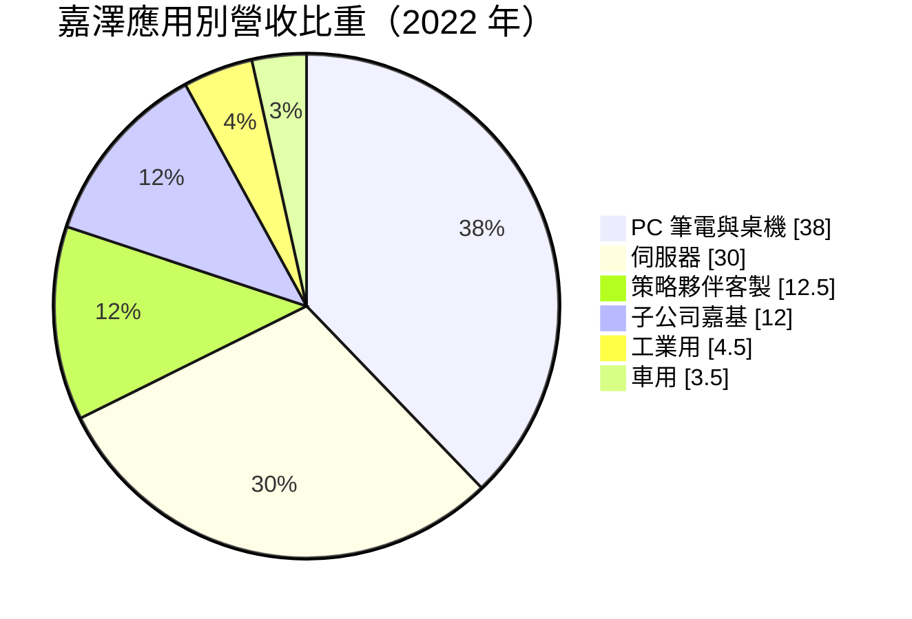
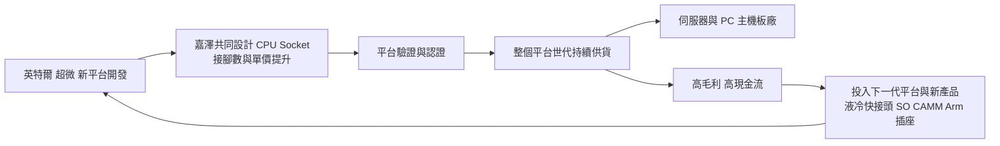
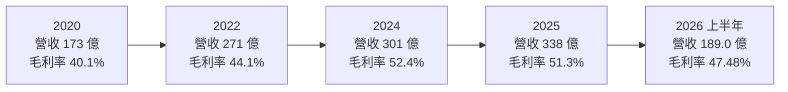
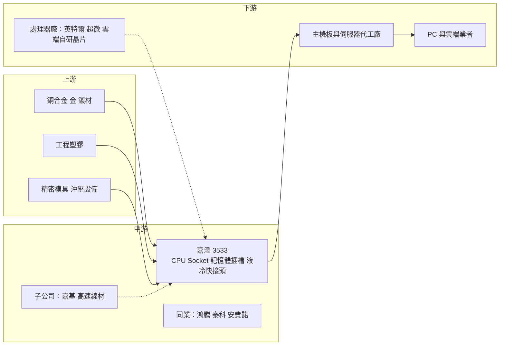

# 3533 嘉澤

> 上市｜[[產業索引-電子零組件業|電子零組件業]]｜上市（櫃）日期 2007/12/10

# 第一章：企業模式與商業藍圖

> [!info] 撰寫說明
> 本文由 Claude 依公開資料整理，架構比照 [[2330台積電]] 的四章研究，資料截至 2026-10-08。財務數字來源：Goodinfo 經營績效頁（2020 至 2025 年度）、證交所開放資料快照（2026 年上半年損益、資產負債、股利）、富果 2023 年嘉澤研究報告、理財周刊 2026 年報導；產業描述為整理性內容，尚未逐條比對原始文件。#待校對

在評估單一個股的長期投資價值時，首要步驟是拆解企業的底層獲利邏輯。本章針對嘉澤端子（股票代號：3533，以下簡稱嘉澤）的商業模式進行定性分析，說明一家連接器廠為什麼能長期維持接近 50% 的毛利率，遠高於一般電子零組件廠，以及它在 AI 伺服器時代的位置。

## 一、核心定位

嘉澤成立於 1986 年，由董事長朱德祥與總經理何德佑共同創立（富果研究稱兩人為兄弟，待校對），主要業務是[[連接器]]的設計、生產與銷售。它最具代表性的產品是 [[CPU Socket]]（處理器插座），也就是主機板上用來安裝 CPU 的插座。嘉澤是全球前三大 CPU Socket 供應商，已打入英特爾與超微的供應鏈，在超微平台的市占率穩定維持在近五成（富果研究，2023 年資料）。

CPU Socket 看似只是一個插座，技術門檻卻很高。新一代伺服器 CPU 的插座有數千到上萬根接腳，每根接腳都要在高溫、高壓下維持穩定接觸，間距細到零點幾毫米。理財周刊報導指出，嘉澤正與一家雲端服務業者共同開發 Arm 架構插座，新一代插座接腳超過 10,000 根。能做出這種產品的公司全球屈指可數。

除了 CPU Socket，嘉澤也供應 DDR 記憶體插槽、PCIe 擴充插槽、M.2 插槽等主機板連接器，並透過子公司[[6715嘉基]]生產高速傳輸線材。近年再延伸到 AI 機櫃的[[液冷]]快接頭（QD）與 SO CAMM 記憶體連接器等新產品。

## 二、終端應用／產品板塊

富果研究整理了嘉澤 2022 年較完整的營收結構，最近年度的完整比重未查得，以下圓餅圖以 2022 年資料繪製：

* **伺服器：** 2022 年占 30%，此後快速成長。理財周刊報導，伺服器營收占比從 2025 年的 39.56% 提高到 2026 年第一季的 51.02%、第二季的 55.36%，2026 年第一、二季伺服器營收分別年增 65% 與 75%。伺服器 CPU 插座的接腳數與單價遠高於 PC，是嘉澤毛利率提升的主因。
* **PC：** 2022 年占 38%，包括筆電與桌機的 CPU Socket 與記憶體插槽，隨 PC 景氣起伏。
* **策略夥伴：** 依特定夥伴需求客製化生產，2022 年約占 12% 至 13%。
* **嘉基：** 子公司嘉基的高速傳輸線材，受惠 PC 周邊規格提升，並已打入伺服器供應鏈。
* **車用與工業：** 合計不到一成，是嘉澤分散應用的長期方向。

## 三、資本轉化邏輯（營運模式）

嘉澤的獲利模式可以理解為「綁定處理器平台世代」。英特爾與超微每推出一代新的伺服器或 PC 平台，插座規格就會改變，接腳數增加、間距縮小。嘉澤在平台開發初期就參與插座設計，通過驗證後，整個平台世代的插座訂單都能持續供貨，通常長達數年。

這套模式的關鍵在於「平台換代」帶動單價上升。理財周刊指出，AI 伺服器世代轉換會提高平均售價，英特爾與超微新平台預計在 2026 年第四季至 2027 年上半年放量。每一次換代，嘉澤都有機會以更高的單價賣出更複雜的插座。

成本結構方面，原物料約占生產成本 65%，主要是銅、金與塑膠（理財周刊）。2026 年第二季毛利率從前一年的 51% 降到 45.47%，公司解釋是提前備貨的低價原料用完，以及新平台的良率學習曲線；管理層預期新平台放量與產品調價後毛利率會回升。

## 四、企業長期藍圖

嘉澤的長期方向有三條主線。第一，鞏固 CPU Socket 的領導地位，並從 x86 延伸到 Arm 架構與雲端業者自研處理器的插座。第二，擴大 AI 機櫃相關產品，包括液冷快接頭與 SO CAMM 記憶體連接器，兩者都已量產（理財周刊）。第三，提高伺服器比重，讓營收結構從 PC 轉向資料中心。

在經營風格上，嘉澤的股權相對集中，經營團隊相關投資公司合計持股約 26%（富果研究），經營層專注本業，近十年以現金增資與可轉債稀釋約 19% 股本來籌措擴產資金。

# 第二章：護城河深度與競爭優勢

本章分析嘉澤的護城河構成、全球主要競爭對手，以及這些優勢在高階連接器市場中能守住多少。

## 一、嘉澤護城河的核心組成要素

嘉澤的護城河屬於「中等到寬」，在電子零組件中相當少見，主要由以下三個要素組成：

* **1. 平台認證與技術門檻：** CPU Socket 必須通過處理器廠商的嚴格驗證，接腳數上萬、間距極細，良率與可靠度要求高。全球能量產高階伺服器插座的廠商只有少數幾家，新進者要花多年才可能取得認證。
* **2. 寡占市場結構：** CPU Socket 市場由少數幾家供應商分食，處理器廠商傾向維持兩到三家供應商以確保供貨，嘉澤是其中之一。寡占結構讓價格競爭相對溫和，這是嘉澤毛利率能長期維持在 40% 至 50% 的原因。
* **3. 與處理器平台同步的研發能力：** 每一代新平台都需要供應商提前數年投入開發。嘉澤長期參與英特爾與超微的平台開發，累積的設計經驗讓它能在新世代保持份額。

## 二、全球主要競爭對手格局

| 對手 | 定位 | 對嘉澤的威脅 |
|---|---|---|
| 鴻騰精密（FIT） | 鴻海集團連接器子公司，CPU Socket 主要供應商之一 | 在英特爾平台與伺服器插座直接競爭 |
| 泰科（TE Connectivity） | 全球連接器大廠 | 在伺服器高速連接器與部分插座競爭 |
| 安費諾（Amphenol） | 全球連接器龍頭 | 在 AI 伺服器高速連接器與線纜領先 |
| Molex | 國際連接器大廠 | 在伺服器與記憶體連接器競爭 |
| [[3665貿聯-KY]]、[[2392正崴]] | 線材與連接器 | 在高速線材與部分連接器競爭 |

## 三、優勢轉化：哪些市場守得住、哪些守不住

* **守得住：** 伺服器 CPU Socket，特別是接腳數高、需要多年共同開發的新一代平台插座。只要處理器廠商持續推出新世代平台，嘉澤就能以更高單價延續訂單。
* **守不住：** PC 端的一般連接器與記憶體插槽。這些產品技術門檻較低，價格競爭較激烈，也受 PC 景氣影響。
* **觀察重點：** 其一，Arm 架構與雲端業者自研處理器的插座能否成為新的成長來源。其二，液冷快接頭在 AI 機櫃的市占能否持續提高。其三，2026 年毛利率能否回到 50% 左右，驗證新平台良率與調價能力。如果未來處理器改以焊接方式直接固定在主機板上（BGA 封裝），插座需求會受影響，這是長期需要追蹤的技術變數。

# 第三章：財務體質與盈利規模

資料日期：2026-10-08。數字取自 Goodinfo 經營績效頁、證交所開放資料快照與理財周刊，表格是撰寫當時的快照；最新月營收、毛利率、累計 EPS 由自動排程寫在本筆記的屬性欄位（月營收、毛利率、累計EPS 等）。#待校對

財務報表是檢驗護城河是否真實存在的最終標準。本章用多年度的三率、ROE、現金流與資本報酬，檢視嘉澤的獲利品質。

## 一、獲利能力的基石：三率

| 年度 | 營收（新台幣） | [[毛利率]] | [[營業利益率]] | EPS（元） | [[ROE]] |
|---|---|---|---|---|---|
| 2020 | 173 億 | 40.1% | 21.4% | 26.41 | 21.0% |
| 2021 | 214 億 | 40.0% | 20.4% | 33.32 | 21.6% |
| 2022 | 271 億 | 44.1% | 26.8% | 58.72 | 35.5% |
| 2023 | 245 億 | 46.9% | 28.4% | 50.65 | 24.1% |
| 2024 | 301 億 | 52.4% | 34.0% | 82.77 | 27.9% |
| 2025 | 338 億 | 51.3% | 30.6% | 70.17 | 20.3% |
| 2026 上半年 | 189.0 億 | 47.48% | 25.46% | 39.04 | 未查得 |

* **營收高速成長：** 2020 至 2025 年營收年複合成長率約 14.3%（推算），從 173 億元成長到 338 億元，接近翻倍。2026 年上半年營收 189.0 億元、年增約 17%（理財周刊），成長延續。
* **毛利率持續提升：** 毛利率從 2020 年的 40.1% 升到 2024 年的 52.4%，主要來自伺服器比重提高與平台換代帶來的單價提升。2025 年與 2026 年上半年略降，反映原物料價格上漲與新平台的良率學習曲線。
* **營業利益率：** 長期在 20% 至 34% 之間，遠高於一般連接器與零組件廠的個位數水準。2026 年上半年營業利益率 25.46%（證交所資料），較 2024 年高峰回落，但仍屬高檔。

## 二、[[ROE]]：資本效率

2021 至 2025 年平均 ROE 約 25.9%（推算），Goodinfo 統計的長期平均約 19% 至 21%。嘉澤的負債比低（2026 年第二季底總負債約 150 億元、權益總計約 431 億元），高 ROE 完全來自高利潤率，而不是財務槓桿。2025 年 ROE 降到 20.3%，主因是獲利下滑與股東權益持續累積。

## 三、資本支出與[[自由現金流]]

嘉澤需要持續投資精密模具、沖壓與自動化設備，並擴充海外新廠，年度資本支出金額未查得。以 2025 年稅後淨利約 78.7 億元的規模，加上高毛利帶來的營業現金流，嘉澤的自由現金流長期應為正（推估，現金流量表數字未查得）。股利方面，2025 年度配發現金股利 35 元（證交所股利資料），以 EPS 70.17 元計算，配息率約 50%（推算），保留一半盈餘用於擴產與研發。

## 四、[[ROIC]] 與 [[WACC]]：價值創造利差

* **ROIC（推算）：** 2025 年營業利益約 103.4 億元（338 億 × 30.6%），稅後營業利益約 82.7 億元。投入資本以 2026 年第二季底權益總計約 431 億元，加上有息負債估計約 30 億元（有息負債未查得，假設約占總負債 150 億元的兩成），合計約 461 億元，ROIC 約 17.9%（推算）。2024 年營業利益率 34.0%，當年 ROIC 推估超過 20%。
* **WACC（推算）：** 以 CAPM 推估，無風險利率 1.75%，市場風險溢酬 6%，β 未查得來源，採電子零組件同業常見值 1.0，股東權益成本約 7.75%。負債成本假設 2%，稅後約 1.6%；資本結構以權益 93%、負債 7% 計算，WACC 約 7.3%（推算）。
* **結論：** 嘉澤的 ROIC 長期約為 WACC 的兩到三倍，利差超過 10 個百分點（推算），是典型具有寬護城河特徵的高價值創造企業。這個利差來自寡占的 CPU Socket 市場與平台換代帶來的定價能力。只要處理器平台持續換代、嘉澤維持供應商地位，利差就有機會延續。

# 第四章：總體風險與地緣政治

任何企業都無法脫離宏觀環境獨立存在。本章分析嘉澤未來必須面對的地緣政治、產業週期與營運風險。

## 一、地緣政治風險

* **中國產能比重：** 嘉澤的主要生產基地長期在中國（具體比重未查得，待校對），美國客戶要求「中國以外產能」的壓力，促使公司擴充海外新廠。理財周刊提到 2026 年第一季毛利率下滑部分原因是海外新廠爬坡，說明產能移轉有短期成本。
* **美中科技管制：** 伺服器 CPU 與 AI 伺服器是美國出口管制的重點領域，管制範圍若擴大到相關零組件或特定客戶，會影響嘉澤的訂單。

## 二、產業週期與市場結構風險

* **伺服器與 PC 週期：** 嘉澤的營收來自伺服器與 PC，兩者都有景氣循環。雲端業者資本支出放緩或 PC 需求下滑，都會直接影響出貨。2023 年營收從 271 億元降到 245 億元，就是一次週期性調整。
* **平台換代時程：** 嘉澤的成長高度依賴英特爾與超微新平台的推出時程，處理器廠商延後新平台，插座的換代需求也會延後。
* **客戶集中：** 營收高度集中在少數處理器平台，任何一家處理器廠商改變供應商策略，都會造成明顯影響。

## 三、營運環境的隱性風險

* **原物料價格：** 原物料約占生產成本 65%，銅、金價格上漲會直接壓縮毛利率，2026 年上半年就受到這個影響。
* **新平台良率：** 接腳數越來越多，新平台初期的良率學習曲線會拉低毛利率。
* **匯率：** 以美元計價出貨，新台幣升值會壓縮以台幣計算的獲利。

## 四、科技或法規演進風險

處理器的封裝方式是嘉澤最大的長期技術變數。如果部分處理器改用焊接在主機板上的封裝，或是 AI 加速器以模組化設計取代傳統插座，CPU Socket 的需求可能減少。另一方面，AI 伺服器的資料傳輸逐步走向[[CPO]]與高速線纜，連接器廠必須持續投入新技術。嘉澤已布局液冷快接頭與 SO CAMM 等新產品，能否在新架構中保持關鍵零件的地位，決定它的護城河能否延續到下一個十年。

# 專有名詞解析

## 半導體

- **[[SO CAMM]]**：一種新型的小型記憶體模組規格，體積比傳統記憶體條更小、傳輸效率更高。
- **[[Arm]]**：英國安謀公司授權的處理器架構，功耗較低，雲端業者常用來設計自研伺服器處理器。
- **[[CPO]]**：共同封裝光學，把光學元件與交換器晶片封裝在一起，以縮短電訊號路徑、降低耗電。

## 應用

- **[[AI伺服器]]**：搭載 GPU 或 ASIC 加速器、專門執行 AI 訓練與推論的伺服器，對零組件規格要求更高。
- **[[CSP]]**：雲端服務供應商，例如亞馬遜、微軟、谷歌，近年積極自研伺服器晶片。

## 金融

- **[[配息率]]**：現金股利占每股盈餘的比例，反映公司把多少獲利發還給股東。
- **[[ROIC]]**：投入資本報酬率，衡量公司每投入一元營運資本能賺多少稅後營業利益。
- **[[WACC]]**：加權平均資金成本，股東與債權人要求報酬率的加權平均，是企業投資的最低報酬門檻。

## 產業

- **[[連接器]]**：讓電路之間可插拔連接、傳遞電力或訊號的零件，例如 USB 接頭與伺服器內部的高速連接器。
- **[[CPU Socket]]**：主機板上安裝處理器的插座，新一代伺服器插座接腳可達上萬根，技術門檻高。
- **[[液冷]]**：用液體帶走伺服器熱量的散熱方式，AI 伺服器功耗高，液冷逐漸取代傳統氣冷。
- **[[快接頭]]**：液冷系統中可快速插拔、不漏液的管路接頭，方便伺服器維修與更換。

# 核心供應鏈

## 1. 上游：原物料與設備
- 銅合金、金與工程塑膠：國內外材料供應商（未查得具體名單）

## 2. 中游：嘉澤本身、子公司與同業
- 子公司：[[6715嘉基]]
- 同業：[[3665貿聯-KY]]、[[2392正崴]]；鴻騰精密、泰科、安費諾、Molex

## 3. 下游：處理器平台與客戶
- 處理器平台：[[INTC英特爾]]、[[AMD超微]]；Arm 架構插座與雲端業者共同開發（客戶名稱未公開），雲端業者如 [[AMZN亞馬遜]]、[[MSFT微軟]]、[[GOOGL谷歌]]（何者為合作對象未查得）
- 伺服器與主機板代工：[[2382廣達]]、[[3231緯創]]、[[6669緯穎]]、[[2376技嘉]]、[[2357華碩]]（客戶名單依產業常識整理，待校對）

## 最新新聞
<!-- news:start（自動產生，請勿手動編輯此範圍） -->
- 2026-10-06 📰 媒體 08:10｜鉅亨速報 - Factset 最新調查：嘉澤(3533-TW)EPS預估下修至81.22元，預估目標價為2450元｜[鉅亨網](https://news.cnyes.com/news/id/6622250)

完整紀錄：[[3533嘉澤 新聞]]
<!-- news:end -->

## 相關連結
- [公開資訊觀測站](https://mopsov.twse.com.tw/mops/web/t05st03?step=1&firstin=1&co_id=3533)
- [Goodinfo](https://goodinfo.tw/tw/StockDetail.asp?STOCK_ID=3533)
- [Yahoo 股市](https://tw.stock.yahoo.com/quote/3533)
- [鉅亨網新聞](https://www.cnyes.com/twstock/3533/news)
