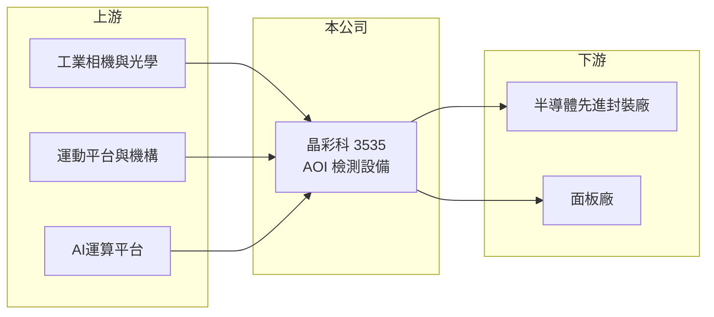

# 3535 晶彩科

> 上市｜[[產業索引-光電業|光電業]]｜上市（櫃）日期 2008/01/31

# 第一章：企業模式與商業藍圖

> [!info] 撰寫說明
> 精簡版，由 Claude 依公開資料整理，架構比照 [[2330台積電]]，資料截至 2026-10-07。來源：nstock.tw 晶彩科公司概況、旺得富（中時）2026-01-21 報導。營收比重未查到。#待校對

晶彩科是 AOI 檢測設備廠，正從面板檢測轉型到半導體先進封裝檢測，2026 年營收大幅成長並轉虧為盈。

- **核心業務：** 晶彩科成立於 2000 年，開發 AI [[AOI]]設備，原本以面板檢測為主，近年轉向半導體[[先進封裝]]製程檢測。
- **營收結構：** 本次未查到面板與半導體的比重；依報導，檢測設備已導入半導體大廠的 [[CoWoS]] 與 [[CoPoS]] 等高階封裝製程。
- **營運據點：** 營運據點本次未查到，本文不推測。
- **長期方向：** AI 晶片帶動先進封裝擴產，封裝尺寸變大、層數變多，檢測需求同步提高，晶彩科的成長取決於能否在這些製程持續擴大設備採用。

# 第二章：護城河深度與競爭優勢

晶彩科的護城河來自打進先進封裝的驗證門檻，但目前規模仍小。

- **競爭優勢：** 先進封裝設備的驗證期長，一旦被納入大廠製程，後續擴產較容易延續採用；從面板大尺寸檢測累積的經驗，可用在[[面板級封裝]]這類大尺寸載具。
- **主要對手：** 國際有 [[KLAC科磊]] 等檢測大廠，國內有 [[3455由田]] 等 AOI 設備商。
- **觀察重點：** 2026 年的成長是否來自持續性的先進封裝訂單，以及單月營收大幅波動後的接單能見度。

# 第三章：財務體質與盈利規模

資料日期：2026-10-07，以下數字是撰寫當時的快照；最新月營收、毛利率、累計 EPS 由自動排程寫在本筆記的屬性欄位（月營收、毛利率、累計EPS 等）。#待校對

晶彩科 2025 年仍虧損，2026 年前八月營收已超過 2025 全年，第二季轉為獲利。

- **營收規模：** 2025 年全年營收約 4.6 億元，年減約 31%；2026 年 1 至 8 月累計 6.09 億元，年增 373.93%；8 月營收 2,776.7 萬元，6 月則為 7,296.8 萬元，單月波動大。
- **獲利：** 2025 年全年 EPS -1.07 元，其中第三季單季虧損 1.74 元；2026 年第二季 EPS 0.13 元，[[毛利率]] 44.06%。
- **財務特色：** 資本額約 7.91 億元，市值約 73 億元，市場評價主要反映先進封裝的成長期待；報導提到股價短期波動劇烈。

# 第四章：總體風險與地緣政治

晶彩科的風險在於轉型初期的訂單集中與設備產業週期。

- **產業週期：** 先進封裝設備需求取決於大廠擴產節奏，若 AI 晶片需求放緩、擴產延後，訂單會快速減少。
- **營運風險：** 營收依設備驗收認列，單月與單季波動大；先進封裝客戶集中度高（推估），單一客戶調整影響大。
- **其他風險：** 國際檢測大廠的競爭與技術追趕；面板業務若持續萎縮，需要半導體業務完全接手成長。

# 專有名詞解析

## 半導體

- **[[AOI]]**：自動光學檢測，用相機拍攝產品並以影像演算法自動找出瑕疵，取代人工目檢。
- **[[先進封裝]]**：把多顆晶片以中介層、混合鍵合等方式高密度整合的封裝技術，例如 CoWoS、SoIC。
- **[[CoWoS]]**：台積電的 2.5D 先進封裝技術，把 GPU 與 HBM 並排放在矽中介層上，是 AI 晶片的主流封裝。
- **[[CoPoS]]**：把 CoWoS 的圓形晶圓中介層改為方形面板的封裝技術，可放進更多晶片、提高面積利用率。
- **[[面板級封裝]]**：以大型方形面板取代圓形晶圓作為封裝載具，可一次處理更多晶片、降低單位成本。

# 核心供應鏈

- 上游：工業相機與光學元件、運動平台與機構、AI 運算平台供應商
- 下游／客戶：半導體先進封裝廠（依報導為半導體大廠的 CoWoS 與 CoPoS 製程）、面板廠
- 同業：[[3455由田]]、[[KLAC科磊]]

## 最新新聞
<!-- news:start -->
<!-- news:end -->

## 相關連結
- [公開資訊觀測站](https://mopsov.twse.com.tw/mops/web/t05st03?step=1&firstin=1&co_id=3535)
- [Goodinfo](https://goodinfo.tw/tw/StockDetail.asp?STOCK_ID=3535)
- [Yahoo 股市](https://tw.stock.yahoo.com/quote/3535)
- [鉅亨網新聞](https://www.cnyes.com/twstock/3535/news)
