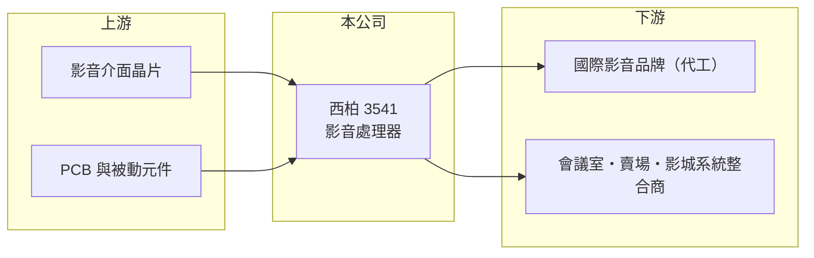

# 3541 西柏

> 上櫃｜[[產業索引-其他電子業|其他電子業]]｜上市（櫃）日期 2009/12/22

# 第一章：企業模式與商業藍圖

> [!info] 撰寫說明
> 精簡版，由 Claude 依公開資料整理，架構比照 [[2330台積電]]，資料截至 2026-10-07。來源：nstock.tw 西柏公司概況、winvest.tw 營收快訊、財報狗西柏產業分析文章（發布年份較早，產品比重僅供參考）。公開資料有限。#待校對

西柏是以影音訊號分配、切換與轉換設備為主的小型電子廠。

- **核心業務：** 西柏科技從事視聽電子系統與影像處理設備的設計製造，主力是[[影音處理器]]，包括訊號分配器、切換器、轉換器與訊號產生器，把一路影像分給多台螢幕或把多路訊號整合到同一台顯示器。
- **營收結構：** 依財報狗較早期的分析，影音處理器約占營收七至八成，代工（[[ODM]]）業務占比高；當時另有低毛利的電視主板與多媒體顯示器，已大幅減產。最新比重本次未查到。
- **營運據點：** 總部與工廠位於新北中和，並曾在英國設子公司發展自有品牌。
- **長期方向：** 從代工逐步轉向自有品牌與高解析度、DisplayPort 與 Thunderbolt 等新介面產品，提高毛利率（推估）。

# 第二章：護城河深度與競爭優勢

西柏的優勢在於影音介面設計經驗，但市場規模小、客戶集中。

- **競爭優勢：** 影音介面規格更新快，需要熟悉 HDMI、DisplayPort 等訊號相容與認證，多年代工經驗讓西柏能替國際品牌快速開發新品。
- **主要對手：** 國際影音整合品牌如 Extron、Crestron，台灣的 [[6277宏正]]，以及中國的小型影音設備廠。
- **觀察重點：** 2026 年第二季毛利率 36.03% 但營益率僅 0.63%，費用結構能否隨營收回升而改善，是轉虧為盈能否延續的關鍵。

# 第三章：財務體質與盈利規模

資料日期：2026-10-07，以下數字是撰寫當時的快照；最新月營收、毛利率、累計 EPS 由自動排程寫在本筆記的屬性欄位（月營收、毛利率、累計EPS 等）。#待校對

西柏營收規模約 10 億元，2025 年虧損，2026 年上半年小幅轉盈。

- **營收規模：** 2025 年全年營收 10.81 億元；2026 年 1 至 7 月累計 6.11 億元、年減 4.64%，7 月營收 1.09 億元、年增 30.75%。
- **獲利：** 2025 年全年 EPS 為 -0.83 元；2026 年第二季 EPS 0.1 元，上半年累計 0.13 元，第二季[[毛利率]] 36.03%、[[營業利益率]] 0.63%。
- **財務特色：** 2025 年度未配發股利；近五年平均現金股利 1.61 元，獲利恢復前配息能力受限。

# 第四章：總體風險與地緣政治

西柏的風險集中在終端需求、客戶集中與匯率。

- **產業週期：** 產品用於會議室、賣場、影城等商用顯示場域，企業資本支出與商用顯示需求放緩時，訂單會跟著縮減。
- **營運風險：** 以代工為主，大客戶訂單變動對營收影響大；營業費用相對固定，營收下滑時容易轉為虧損。
- **其他風險：** 外銷為主，新台幣升值會壓縮毛利；晶片等關鍵零件供應與中國低價競爭也是變數。

# 專有名詞解析

## 應用

- **[[影音處理器]]**：處理影像訊號分配、切換與格式轉換的設備，例如把一台電腦畫面同時送到多台螢幕。

## 金融

- **[[毛利率]]**：毛利除以營收，代表產品扣除直接成本後的獲利空間。

## 產業

- **[[ODM]]**：原廠委託設計製造，代工廠負責產品設計與生產，再以客戶品牌出貨。

# 核心供應鏈

- 上游：影音介面晶片供應商、PCB 與電子零組件廠
- 下游／客戶：國際影音設備品牌（早期資料顯示以日本品牌為主）、商用影音系統整合商
- 同業：[[6277宏正]]、Extron、Crestron

## 最新新聞
<!-- news:start -->
<!-- news:end -->

## 相關連結
- [公開資訊觀測站](https://mopsov.twse.com.tw/mops/web/t05st03?step=1&firstin=1&co_id=3541)
- [Goodinfo](https://goodinfo.tw/tw/StockDetail.asp?STOCK_ID=3541)
- [Yahoo 股市](https://tw.stock.yahoo.com/quote/3541)
- [鉅亨網新聞](https://www.cnyes.com/twstock/3541/news)
