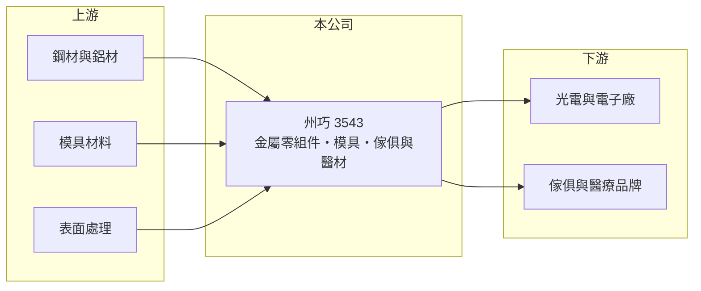

# 3543 州巧

> 上市｜[[產業索引-光電業|光電業]]｜上市（櫃）日期 2020/04/15

# 第一章：企業模式與商業藍圖

> [!info] 撰寫說明
> 精簡版，由 Claude 依公開資料整理，架構比照 [[2330台積電]]，資料截至 2026-10-07。來源：nstock.tw 州巧公司概況、winvest.tw 營收快訊。公開資料有限，營收比重、客戶與營運據點未查到。#待校對

州巧是以金屬零組件與模具為核心的製造廠，營收規模約 30 億元，近年處於虧損。

- **核心業務：** 州巧成立於 2000 年，業務包括光電電子零組件、[[精密模具]]與精密儀器製造加工，另跨足金屬傢俱與醫療用品製造。
- **營收結構：** 本次未查到各產品比重；以登記業務判斷，光電電子用的金屬[[沖壓]]件與機構件應為主要來源（推估）。
- **營運據點：** 生產據點本次未查到，本文不推測。
- **長期方向：** 從電子零組件延伸到金屬傢俱與醫療用品，目的在分散對單一電子產業的依賴；新事業能否放大仍待觀察。

# 第二章：護城河深度與競爭優勢

州巧的優勢在於模具與金屬加工的整合能力，但產品同質性高，議價力有限。

- **競爭優勢：** 自行開發模具再做量產加工，可縮短客戶的新產品導入時間，並跨用到傢俱與醫療用品等不同產品（推估）。
- **主要對手：** 國內外眾多金屬沖壓與機構件廠，中國同業以規模與價格競爭。
- **觀察重點：** 毛利率能否從一成出頭回升、何時轉虧為盈，以及醫療用品等新業務的營收貢獻。

# 第三章：財務體質與盈利規模

資料日期：2026-10-07，以下數字是撰寫當時的快照；最新月營收、毛利率、累計 EPS 由自動排程寫在本筆記的屬性欄位（月營收、毛利率、累計EPS 等）。#待校對

州巧 2026 年營收大致持平，虧損較 2025 年收斂但尚未轉正。

- **營收規模：** 2025 年全年營收 32.64 億元；2026 年 1 至 8 月累計 22.29 億元，年增 1.12%；8 月營收 2.75 億元，年增約 20%。
- **獲利：** 2025 年全年 EPS -2.24 元；2026 年第二季 EPS -0.38 元，[[毛利率]] 11.71%。
- **財務特色：** 資本額約 11.03 億元，市值約 75 億元；毛利率偏低，費用與折舊攤提壓力使本業難以獲利。

# 第四章：總體風險與地緣政治

州巧的風險在於低毛利與持續虧損。

- **產業週期：** 光電與電子零組件需求跟著面板、消費性電子出貨起伏。
- **營運風險：** 毛利率只有一成多，營收或產品組合稍有不利就難以獲利；多元業務也可能分散管理資源。
- **其他風險：** 鋼材、鋁材等金屬原物料價格波動；醫療用品須符合[[醫材法規]]，認證需要時間與成本；美國關稅與匯率也會影響外銷。

# 專有名詞解析

## 產業

- **[[精密模具]]**：用來大量複製塑膠或金屬零件的模具，精度與耐用度決定零件品質與生產成本。
- **[[沖壓]]**：以模具與沖床把金屬板材壓製成特定形狀的加工方式，適合大量生產機殼、支架等零件。
- **[[醫材法規]]**：醫療器材在上市前須取得各國主管機關的查驗登記或認證，並符合品質系統規範。

# 核心供應鏈

- 上游：鋼材與鋁材、模具材料、表面處理加工業者
- 下游／客戶：光電與電子製造廠、傢俱與醫療用品品牌（推估）
- 同業：國內外金屬沖壓與機構件廠

## 最新新聞
<!-- news:start -->
<!-- news:end -->

## 相關連結
- [公開資訊觀測站](https://mopsov.twse.com.tw/mops/web/t05st03?step=1&firstin=1&co_id=3543)
- [Goodinfo](https://goodinfo.tw/tw/StockDetail.asp?STOCK_ID=3543)
- [Yahoo 股市](https://tw.stock.yahoo.com/quote/3543)
- [鉅亨網新聞](https://www.cnyes.com/twstock/3543/news)
