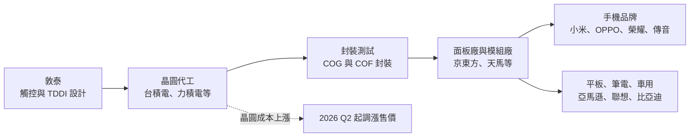
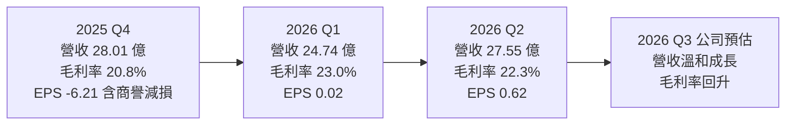
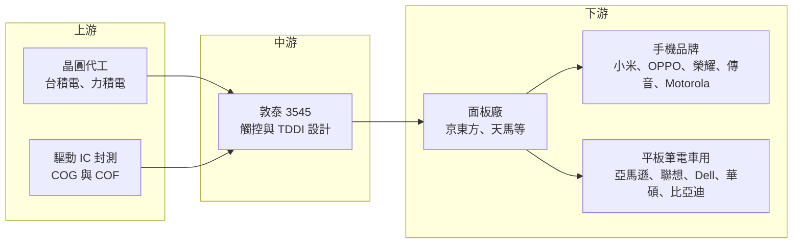

# 3545 敦泰

> 上市｜[[產業索引-半導體業|半導體業]]｜上市（櫃）日期 2007/07/03

# 第一章：企業模式與商業藍圖

> [!info] 撰寫說明
> 本文由 Claude 依公開資料整理，架構比照 [[2330台積電]] 的四章研究，資料截至 2026-10-07。財務數字來源：富果研究法說會整理（2026 年 2 月、5 月、8 月）、優分析報導、證交所開放資料（本筆記 _data 快照：2026 上半年綜合損益、資產負債、月營收、股利）；產業描述為整理性內容，尚未逐條比對原始文件。#待校對

在評估單一個股的長期投資價值時，首要步驟是拆解企業的底層獲利邏輯。本章針對敦泰電子（股票代號：3545，以下簡稱敦泰）的商業模式進行定性分析，說明這家以手機觸控起家的 IC 設計公司，如何轉型為觸控與顯示驅動整合（[[TDDI]]）供應商，以及為何近年獲利大幅波動。

## 一、核心定位：手機觸控與顯示驅動 IC 設計公司

敦泰成立於 2006 年，2007 年在台灣上市，是 [[Fabless]] IC 設計公司，產品包括觸控 IC、[[DDI]]（顯示驅動 IC）以及把兩者整合在一顆晶片上的 TDDI。2015 年敦泰透過反向合併取得旭曜科技，補齊顯示驅動技術，從單純觸控 IC 公司變成可以提供觸控加顯示整合方案的供應商。

敦泰的定位有兩個特色：

* **手機市場依賴度高：** 依 2026 年 5 月法說，手機應用約占營收 55% 至 60%，非手機（平板、筆電、車用、工控）約 40% 至 45%。客戶以中國手機品牌為主。
* **規模中型、價格競爭激烈：** 中低階手機的 TDDI 是高度競爭的市場，聯詠、天鈺、奇景與中國集創北方等都在爭取同一批客戶，敦泰必須靠產品組合調整來維持毛利率。

## 二、終端應用／產品板塊：手機為主，非手機逐步擴大

公司未揭露各產品線精確營收比重，以下依 2026 年 5 月法說提供的手機與非手機比例區間說明，不畫圓餅圖。

* **手機 TDDI 與觸控 IC：** 用於 LCD 手機的觸控顯示整合晶片，以及 [[OLED]] 手機的獨立觸控 IC。客戶包括小米 Redmi、Motorola、OPPO、realme、榮耀、傳音。
* **平板與筆電：** 平板 TDDI 與筆電觸控，客戶包括 [[AMZN亞馬遜]]（電子書與平板）、聯想、Dell、[[2357華碩]]。
* **車用與工控：** 車用顯示的觸控與驅動 IC，客戶包括比亞迪、長城、奇瑞，以及 Nissan、Tata 等車廠；另有 Garmin 導航等工控與消費性應用。
* **AMOLED 新產品：** 依 2026 年 2 月法說，公司把平板、工控與車用 AMOLED 產品列為 2026 年第二季後的復甦動能。

## 三、資本轉化邏輯（營運模式）：Fabless 的晶圓採購與價格轉嫁

* **晶圓採購是主要成本：** 顯示驅動 IC 需要[[成熟製程]]中的高壓製程，敦泰依賴晶圓代工廠產能。2026 年 8 月法說提到台積電、力積電的產能調整影響供貨，公司正積極轉廠並導入新代工廠，第三季出貨量受晶圓產能緊張限制，只能維持第二季水準。
* **價格轉嫁：** 依 2026 年 5 月法說，公司有信心把成本上漲百分之百轉嫁給客戶，第二季起調漲產品售價。不過第二季毛利率仍由 23.0% 降到 22.3%，顯示漲價追上成本需要時間。
* **存貨控制：** 2026 年第一季底存貨 17.23 億元，比前一年同期減少 48.1%，庫存去化已大致完成。

## 四、企業長期藍圖：從手機往非手機與 AMOLED 移動

* **非手機比重提升：** 平板、筆電、車用與工控的產品生命週期較長、價格競爭較緩和，敦泰持續提高這部分比重，以降低對中國手機市場的依賴。
* **AMOLED 觸控與驅動：** 手機面板持續由 LCD 轉向 OLED，LCD TDDI 的市場會逐漸縮小，敦泰需要在 OLED 觸控、平板與車用 AMOLED 上站穩，才能維持長期成長。
* **資本回饋：** 2026 年 3 月至 4 月執行庫藏股 300 萬股，並以[[資本公積]]發放每股 0.8 元現金，總額約 1.77 億元，在 2025 年虧損的情況下維持股東回饋。

# 第二章：護城河深度與競爭優勢

在長期價值投資中，「護城河」指企業抵禦競爭、維持超額利潤的保護機制。本章分析敦泰在觸控與顯示驅動 IC 市場的護城河構成、主要競爭對手，以及這些優勢在中國同業價格戰中能守住多少。

## 一、護城河的核心組成要素

敦泰的護城河偏窄，主要來自以下三點：

* **1. 觸控演算法與面板調校經驗：** 觸控 IC 需要和每一款面板一起調校，處理雜訊、防水、手套觸控等情境。敦泰長期與中國面板廠和手機品牌合作，累積大量調校經驗。
* **2. 觸控加驅動的整合能力：** 2015 年合併旭曜後同時擁有觸控與驅動技術，可以提供 TDDI 整合方案，降低客戶的物料成本與模組設計複雜度。
* **3. 客戶廣度：** 從手機、平板、筆電到車用都有客戶，產品組合可依市場景氣調整。

## 二、全球主要競爭對手格局

| 對手 | 定位 | 對敦泰的威脅 |
|---|---|---|
| [[3034聯詠]] | 全球前段 DDI 與 TDDI 廠，產品線完整 | 規模與晶圓議價力大，手機與大尺寸皆強 |
| [[4961天鈺]] | 鴻海集團 DDI 與 TDDI 設計公司 | 在中低階手機 TDDI 直接競爭 |
| 奇景光電（Himax） | 車用顯示驅動與 TDDI 領先廠商 | 車用 TDDI 市占高，與敦泰車用布局重疊 |
| 集創北方、新相微 | 中國顯示驅動 IC 廠 | 受國產替代政策支持，以價格搶中國客戶 |
| 匯頂科技 | 中國觸控與指紋 IC 廠 | 在 OLED 觸控與手機客戶重疊 |

## 三、優勢轉化：哪些市場守得住、哪些守不住

* **守得住：** 平板、筆電、車用等驗證期長、生命週期長的產品，以及需要觸控調校服務的中高階機種。
* **守不住：** 中低階 LCD 手機 TDDI。這個市場同質性高，中國同業有本土客戶與政策支持，價格壓力大。2025 年營收年減 17.8%，正反映這段市場的萎縮與競爭。
* **觀察重點：** 2026 年上半年本業仍是營業虧損 3.10 億元，獲利主要靠業外收入。觀察重點包括：漲價能否讓毛利率回到 2025 年的 24.8% 以上、轉廠與新代工廠導入是否順利、AMOLED 平板與車用產品的出貨進度。

# 第三章：財務體質與盈利規模

資料日期：2026-10-07。數字取自富果研究法說整理、優分析報導與證交所開放資料快照，表格是撰寫當時的快照；最新月營收、毛利率、累計 EPS 由自動排程寫在本筆記的屬性欄位（月營收、毛利率、累計EPS 等）。#待校對

財務報表是檢驗護城河是否真實存在的最終標準。本章用三率、ROE、現金流與資本報酬，檢視敦泰在 2025 年大幅虧損後的獲利品質。

## 一、獲利能力的基石：三率

| 項目 | 2025 全年 | 2025 Q2 | 2025 Q4 | 2026 Q1 | 2026 Q2 | 2026 上半年 |
|---|---|---|---|---|---|---|
| 營收（新台幣） | 119.52 億 | 30.47 億 | 28.01 億 | 24.74 億 | 27.55 億 | 52.29 億 |
| [[毛利率]] | 24.8% | 25.1% | 20.8% | 23.0% | 22.3% | 22.6% |
| [[營業利益率]] | 約 -1.1%（推算） | 未查得 | 未查得 | 未查得 | 未查得 | -5.9% |
| EPS（元） | -4.64 | 0.36 | -6.21 | 0.02 | 0.62 | 0.64 |

* **毛利率：** 2025 年毛利率 24.8%，比 2024 年的 22.4% 高，代表產品組合往高毛利觸控產品移動；但 2025 年第四季跌到 20.8%，2026 年上半年也只有 22.6%，晶圓成本上漲是主要壓力。
* **營業利益率：** 2026 年上半年毛利 11.83 億元，扣除營業費用後營業損失 3.10 億元，營業利益率 -5.9%。IC 設計公司的研發費用相對固定，營收規模縮小時很容易轉為營業虧損。
* **[[業外收益]]：** 2026 年上半年業外收入 3.83 億元，使稅後淨利轉正為 1.36 億元。第二季 EPS 0.62 元主要來自業外，評估本業時應以營業利益為準。
* **[[商譽]]減損：** 2025 年第四季提列 12.37 億元商譽減損，來自 2015 年反向合併旭曜時認列的商譽，屬一次性、非現金費用，但也代表當年併購的價值已被重新評估。

## 二、[[ROE]]：資本效率

依證交所資料，2026 年第二季底股東權益約 88.98 億元，上半年稅後淨利 1.36 億元，年化 ROE 約 3%（推估）；2025 年因減損虧損 9.91 億元，ROE 為負。總負債 44.88 億元、總資產 133.86 億元，負債比約 34%，財務結構穩健，ROE 低落主要是本業獲利不足。股價淨值比約 1.22 倍。

## 三、資本支出與自由現金流

* **[[CapEx]]：** Fabless 模式的資本支出以研發設備、光罩為主，金額不大，具體數字未查得。
* **[[自由現金流]]：** 2025 年至 2026 年第一季大幅降低存貨，釋放營運現金。2026 年若晶圓產能吃緊，可能需要預付或增加備貨，需觀察營運資金變化。
* **股利與庫藏股：** 2025 年度雖虧損，仍以資本公積發放每股 0.8 元現金；2026 年 3 月至 4 月買回 300 萬股[[庫藏股]]。以資本公積配發不是來自當年獲利，持續性需要觀察。

## 四、[[ROIC]] 與 [[WACC]]：價值創造利差

敦泰 2025 年與 2026 年上半年本業皆為營業虧損，ROIC 低於資金成本，目前處於價值毀損階段（推估）。利差要轉正，需要毛利率回到 25% 左右並讓營收回到 2024 年水準以上，讓研發費用能被攤提。

# 第四章：總體風險與地緣政治

任何企業都無法脫離宏觀環境獨立存在。本章分析敦泰未來必須面對的地緣政治、產業週期與營運風險。

## 一、地緣政治

* **中國客戶集中：** 主要客戶是中國手機品牌與面板廠，中國推動顯示驅動 IC 國產化時，本土 IC 設計公司會優先取得訂單。
* **晶圓產能與關稅：** 依賴台灣晶圓代工產能，若美國對半導體課徵關稅或中國對台灣晶片採取限制，都會影響成本與出貨。

## 二、產業週期與市場結構

* **手機需求循環：** 手機占營收過半，中低階手機出貨下滑或品牌庫存調整，會直接影響營收。
* **LCD 轉 OLED：** 手機面板持續轉向 OLED，LCD TDDI 市場長期萎縮，敦泰必須在 OLED 觸控與非手機市場找到替代成長。
* **價格競爭：** 中國同業以低價搶單，TDDI 單價長期有下行壓力，[[平均售價]]能否隨成本上漲調漲是 2026 年的關鍵。

## 三、營運環境的隱性風險

* **晶圓產能不足：** 2026 年第三季出貨受晶圓產能限制，轉廠需要重新驗證，可能延誤交期或增加成本。
* **本業虧損下依賴業外：** 2026 年上半年稅後獲利主要來自業外收入，若業外收益減少，獲利會再轉弱。
* **匯率：** 營收以美元計價，新台幣升值會壓縮毛利率與造成匯兌損失。

## 四、科技或法規演進

* **In-cell 與 OLED 整合：** 面板廠持續把觸控整合進面板（[[In-cell]]），OLED 也發展出觸控整合架構，IC 設計公司需要配合面板技術演進。
* **車用功能安全：** 車用顯示 IC 需要符合[[功能安全]]等規範，開發與驗證成本較高，但也提高進入門檻。

# 專有名詞解析

## 半導體

- **[[TDDI]]**：觸控與顯示驅動整合晶片，把觸控控制與面板驅動放在同一顆 IC，降低成本與模組厚度。
- **[[DDI]]**：顯示驅動 IC，負責控制面板每個像素的電壓，需要高壓製程。
- **[[COG]]**：晶粒直接貼在玻璃基板上的封裝方式，常見於手機與中小尺寸顯示驅動 IC。
- **[[COF]]**：晶粒貼在軟性薄膜上的封裝方式，可讓面板窄邊框，常見於手機與大尺寸驅動 IC。
- **[[Fabless]]**：只做晶片設計、不擁有晶圓廠的 IC 設計公司，製造委託晶圓代工廠。
- **[[成熟製程]]**：一般指 28 奈米及更大線寬的製程，顯示驅動 IC 多採用此類高壓製程。

## 應用

- **[[功能安全]]**：車用電子須符合的安全規範（如 ISO 26262），要求系統在故障時仍能維持安全狀態。

## 金融

- **[[商譽]]**：併購價格超過被併公司淨資產公允價值的部分，若併購效益不如預期須提列減損。
- **[[庫藏股]]**：公司從市場買回自家股票，可用於註銷、員工獎酬或穩定股價。
- **[[資本公積]]**：股東投入資本中超過股票面額的部分，例如溢價發行，可在一定條件下發放現金給股東。
- **[[業外收益]]**：本業以外的收入，例如利息、匯兌利益、投資收益，不代表本業競爭力。
- **[[平均售價]]**：產品營收除以出貨量，反映產品組合與議價能力的變化。

## 產業

- **[[OLED]]**：有機發光二極體顯示技術，每個像素自己發光，不需背光，手機高階機種普遍採用。
- **[[In-cell]]**：把觸控感應層直接做進面板內部的技術，可讓面板更薄，通常搭配 TDDI 使用。

# 核心供應鏈

## 1. 上游：晶圓代工與封測
- 晶圓代工：[[2330台積電]]、[[6770力積電]]，2026 年另導入新代工廠（名稱未揭露）
- 驅動 IC 封測：[[6147頎邦]]、[[8150南茂]] 等 [[COG]] 與 [[COF]] 封測廠（推估，未查得敦泰實際往來名單）

## 2. 中游：敦泰本身
- 2015 年反向合併旭曜科技，取得顯示驅動技術

## 3. 下游：面板廠與品牌客戶
- 面板與模組：京東方、天馬等中國面板廠（推估）
- 手機品牌：小米、OPPO、realme、榮耀、Motorola、傳音
- 平板與筆電：[[AMZN亞馬遜]]、聯想、Dell、[[2357華碩]]
- 車用與工控：比亞迪、長城、奇瑞、Nissan、Tata、Garmin

## 4. 同業
- 台灣：[[3034聯詠]]、[[4961天鈺]]、[[3592瑞鼎]]
- 海外：奇景光電、集創北方、新相微、匯頂科技

延伸閱讀：[[台積電供應鏈]]

## 最新新聞
<!-- news:start -->
<!-- news:end -->

## 相關連結
- [公開資訊觀測站](https://mopsov.twse.com.tw/mops/web/t05st03?step=1&firstin=1&co_id=3545)
- [Goodinfo](https://goodinfo.tw/tw/StockDetail.asp?STOCK_ID=3545)
- [Yahoo 股市](https://tw.stock.yahoo.com/quote/3545)
- [鉅亨網新聞](https://www.cnyes.com/twstock/3545/news)
