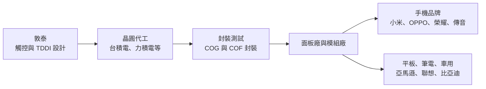
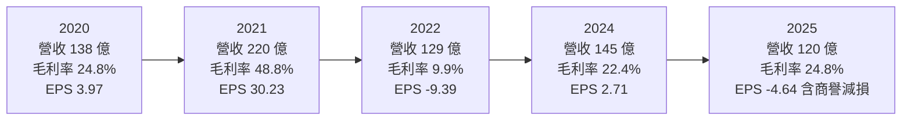
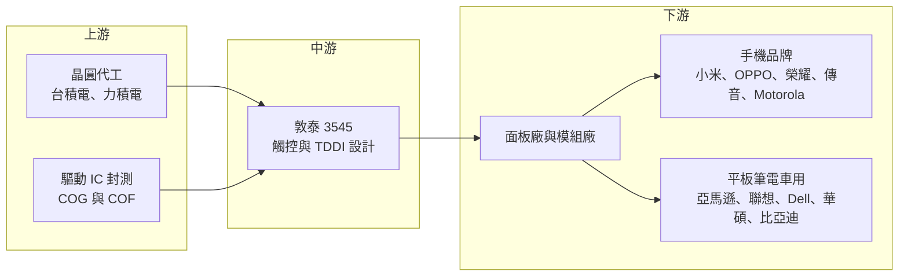

# 3545 敦泰

> 上市｜[[產業索引-半導體業|半導體業]]｜上市（櫃）日期 2007/07/03

# 第一章：企業模式與商業藍圖

> [!info] 撰寫說明
> 本文由 Claude 依公開資料整理，架構比照 [[2330台積電]] 的四章研究，資料截至 2026-10-08。財務數字來源：Goodinfo 台灣股市資訊網年度經營績效與股利政策、富果研究法說會整理（2026 年 2 月、5 月、8 月）、優分析報導、證交所開放資料（本筆記 _data 快照）；產業描述為整理性內容，尚未逐條比對原始文件。#待校對

在評估單一個股的長期投資價值時，首要步驟是拆解企業的底層獲利邏輯。本章針對敦泰電子（股票代號：3545，以下簡稱敦泰）的商業模式進行定性分析，說明這家以手機觸控起家的 IC 設計公司，如何透過併購轉型為觸控與顯示驅動整合（[[TDDI]]）供應商，以及為什麼它的獲利會出現極端的景氣循環。

## 一、核心定位：手機觸控與顯示驅動 IC 設計公司

敦泰成立於 2006 年，2007 年在台灣上市，是 [[Fabless]] IC 設計公司，產品包括觸控 IC、[[DDI]]（顯示驅動 IC），以及把兩者整合在一顆晶片上的 TDDI。2015 年敦泰透過反向合併取得旭曜科技，補齊顯示驅動技術，從單純的觸控 IC 公司變成能提供觸控加顯示整合方案的供應商。這次併購決定了敦泰之後十年的產品方向，但也留下大額商譽，直到 2025 年才全數認列減損。

敦泰的定位有兩個長期特色。第一，它高度依賴手機市場：依 2026 年 5 月法說，手機應用約占營收 55% 至 60%，非手機（平板、筆電、車用、工控）約占 40% 至 45%，客戶以中國手機品牌為主。第二，它所處的中低階手機 TDDI 是高度同質化的市場，聯詠、天鈺、奇景與中國集創北方都在爭取同一批客戶，因此敦泰的獲利主要取決於產業供需與價格，而不是獨特技術帶來的定價權。

## 二、終端應用／產品板塊：手機為主，非手機逐步擴大

公司未揭露各產品線精確營收比重，以下依法說提供的手機與非手機比例區間說明，不畫圓餅圖。

* **手機 TDDI 與觸控 IC：** 用於 LCD 手機的觸控顯示整合晶片，以及 [[OLED]] 手機的獨立觸控 IC，客戶包括小米、Motorola、OPPO、realme、榮耀、傳音等中國品牌。這是敦泰營收最大、但競爭也最激烈的板塊。
* **平板與筆電：** 平板 TDDI 與筆電觸控，客戶包括 [[AMZN亞馬遜]]（電子書與平板）、聯想、Dell、[[2357華碩]]。平板與筆電的產品週期比手機長，價格競爭相對緩和，是敦泰想要提高比重的方向。
* **車用與工控：** 車用顯示的觸控與驅動 IC，客戶包括比亞迪、長城、奇瑞，以及 Nissan、Tata 等車廠，另有 Garmin 導航等工控應用。車用驗證期長、一旦導入可穩定供貨，對平滑手機景氣波動很重要。
* **AMOLED 觸控與驅動：** 依 2026 年 2 月法說，公司把平板、工控與車用 AMOLED 產品列為新的成長動能，這是因應面板技術從 LCD 轉向 OLED 的長期布局。

## 三、資本轉化邏輯（營運模式）：Fabless 的晶圓採購與價格轉嫁

敦泰設計晶片後向晶圓代工廠購買晶圓，委託封測廠以 [[COG]] 或 [[COF]] 方式封裝，再賣給面板與模組廠，由它們把晶片裝到面板上，最後出貨給手機或平板品牌。這個流程有兩個影響獲利的關鍵。

* **晶圓產能與成本：** 顯示驅動 IC 需要[[成熟製程]]中的高壓製程，敦泰依賴台積電、力積電等代工廠的產能。產能吃緊時，晶圓價格上漲且可能拿不到足夠產能；產能寬鬆時則可以壓低成本。2021 年的超額獲利與 2022 年的虧損，都和晶圓供需直接相關。
* **價格轉嫁能力：** 敦泰面對的是議價力強的面板廠與中國手機品牌，成本上漲時能否轉嫁，取決於整個產業是否同時缺貨。2026 年公司宣稱可以百分之百轉嫁成本並調漲售價，但歷史經驗顯示，一旦供需反轉，價格也會快速回落。
* **存貨管理：** 2022 年 DDI 景氣反轉時，敦泰毛利率掉到 9.9%，主因就是高價庫存的跌價。2025 年至 2026 年初，公司大幅降低存貨，是為了避免重演同樣的情況。

## 四、企業長期藍圖：從手機往非手機與 AMOLED 移動

敦泰的長期策略方向相當清楚，就是降低對中國 LCD 手機市場的依賴。

* **提高非手機比重：** 平板、筆電、車用與工控的產品生命週期較長、價格競爭較緩和，若能把這部分比重拉高到一半以上，公司的獲利波動可以降低。
* **跟上 OLED 轉換：** 手機面板持續由 LCD 轉向 OLED，LCD TDDI 的市場長期會縮小。敦泰必須在 OLED 觸控、平板與車用 AMOLED 上站穩，才能維持長期營收規模。
* **資本配置習慣：** 經營層在景氣高峰期大方配息，2021 年度每股配發 15.84 元；在虧損年度則以[[資本公積]]配發現金並執行[[庫藏股]]，例如 2025 年度虧損仍以資本公積每股配發 0.8 元，2026 年初買回 300 萬股。這顯示經營層重視股東回饋，但也代表股利水準會隨景氣大幅波動。

# 第二章：護城河深度與競爭優勢

在長期價值投資中，「護城河」指企業抵禦競爭、維持超額利潤的保護機制。本章分析敦泰在觸控與顯示驅動 IC 市場的護城河構成、主要競爭對手，以及這些優勢在中國同業價格戰中能守住多少。

## 一、護城河的核心組成要素

敦泰的護城河偏窄，它的優勢主要來自經驗與客戶關係，而不是難以複製的技術或規模。

* **1. 觸控演算法與面板調校經驗：** 觸控 IC 需要和每一款面板一起調校，處理雜訊、防水、手套觸控等情境。敦泰長期與中國面板廠和手機品牌合作，累積大量調校案例，新進者需要時間才能追上。
* **2. 觸控加驅動的整合能力：** 合併旭曜後同時擁有觸控與驅動技術，可以提供 TDDI 整合方案，降低客戶的物料成本與模組設計複雜度。這種整合能力是 2015 年之後敦泰最重要的產品優勢。
* **3. 客戶廣度：** 從手機、平板、筆電到車用都有客戶，讓公司可以依市場景氣調整產品組合，降低單一市場崩跌的衝擊。

## 二、全球主要競爭對手格局

| 對手 | 定位 | 對敦泰的威脅 |
|---|---|---|
| [[3034聯詠]] | 全球前段 DDI 與 TDDI 廠，產品線完整 | 規模與晶圓議價力大，手機與大尺寸皆強 |
| [[4961天鈺]] | 鴻海集團 DDI 與 TDDI 設計公司 | 在中低階手機 TDDI 直接競爭 |
| 奇景光電（Himax） | 車用顯示驅動與 TDDI 領先廠商 | 車用 TDDI 市占高，與敦泰車用布局重疊 |
| 集創北方、新相微 | 中國顯示驅動 IC 廠 | 受國產替代政策支持，以價格搶中國客戶 |
| 匯頂科技 | 中國觸控與指紋 IC 廠 | 在 OLED 觸控與手機客戶重疊 |

## 三、優勢轉化：守得住／守不住／觀察重點

* **守得住：** 平板、筆電、車用等驗證期長、生命週期長的產品，以及需要觸控調校服務的中高階機種。這些市場重視技術支援與供貨穩定，是敦泰較能維持毛利的地方。
* **守不住：** 中低階 LCD 手機 TDDI。這個市場同質性高，中國同業有本土客戶與政策支持，價格壓力長期存在。敦泰 2025 年營收比 2024 年減少約 17%，正反映這段市場的萎縮與競爭。
* **觀察重點：** 長期而言，可以用三個指標檢驗敦泰的轉型成效：非手機營收比重能否持續提高、毛利率能否在非缺貨年度穩定在 25% 以上，以及本業（營業利益）能否在不依賴業外收入的情況下持續獲利。

# 第三章：財務體質與盈利規模

資料日期：2026-10-08。數字取自 Goodinfo 年度經營績效與股利政策、富果研究法說整理、優分析與證交所開放資料快照，表格是撰寫當時的快照；最新月營收、毛利率、累計 EPS 由自動排程寫在本筆記的屬性欄位（月營收、毛利率、累計EPS 等）。#待校對

財務報表是檢驗護城河是否真實存在的最終標準。本章用多年度的三率、ROE、現金流與資本報酬，檢視敦泰在顯示驅動 IC 景氣循環中的獲利品質。

## 一、獲利能力的基石：三率

| 年度 | 營收（新台幣） | [[毛利率]] | [[營業利益率]] | EPS（元） | [[ROE]] | 現金股利（元） |
|---|---|---|---|---|---|---|
| 2019 | 91.6 億 | 21.8% | -3.7% | -0.63 | -2.6% | 0.50 |
| 2020 | 138 億 | 24.8% | 7.5% | 3.97 | 12.7% | 3.23 |
| 2021 | 220 億 | 48.8% | 32.4% | 30.23 | 56.8% | 15.84 |
| 2022 | 129 億 | 9.9% | -17.7% | -9.39 | -17.2% | 0.50 |
| 2023 | 136 億 | 20.0% | 0.9% | 1.74 | 3.9% | 1.00 |
| 2024 | 145 億 | 22.4% | 1.2% | 2.71 | 5.9% | 1.74 |
| 2025 | 120 億 | 24.8% | -1.1% | -4.64 | -10.6% | 0.82 |

敦泰的財務數字是理解「IC 設計景氣循環」最好的教材之一。2021 年全球晶片缺貨，TDDI 價格大漲，敦泰毛利率衝到 48.8%、EPS 30.23 元、ROE 56.8%；但 2022 年需求反轉，毛利率跌到 9.9%，EPS 轉為虧損 9.39 元。兩年之間毛利率差距接近 40 個百分點，說明敦泰在缺貨期的超額獲利來自產業供需，而不是長期可持續的定價權。

* **[[毛利率]]：** 排除 2021 年缺貨高峰與 2022 年庫存跌價，敦泰的正常毛利率大約落在 20% 至 25%。這個水準對 IC 設計公司來說偏低，反映 TDDI 市場的同質化競爭。
* **[[營業利益率]]：** 研發費用占營收比重高，毛利率只要低於約 23%，營業利益就接近損益兩平。2023 至 2025 年營業利益率都在 -1% 至 1% 之間，代表本業長期處於微利狀態。
* **[[商譽]]減損：** 2025 年第四季提列 12.37 億元商譽減損，來自 2015 年合併旭曜時認列的商譽。這是非現金費用，但等於正式承認當年併購的價值沒有達到預期，也是 2025 年 EPS 為 -4.64 元的主因。
* **長期指標：** 2018 至 2025 年營收從 99.2 億元成長到 120 億元，年複合成長率約 2.8%（推算）；2019 至 2025 年七年平均 ROE 約 7%（推算），但其中大部分來自 2021 年單一年度。現金股利從 0.5 元到 15.84 元不等，穩定度很低。

## 二、[[ROE]]：資本效率

敦泰的負債比約三成，多為應付帳款等營運性負債，ROE 主要由本業獲利決定。七年中有三年 ROE 為負值、兩年在 6% 以下，只有 2020 與 2021 年明顯高於資金成本。這說明敦泰並不是能長期穩定複利的公司，投資報酬高度取決於能否掌握產業缺貨週期。

## 三、資本支出與自由現金流

* **[[CapEx]]：** Fabless 模式的資本支出以研發設備、光罩為主，金額相對營收很小，具體數字未查得。
* **[[自由現金流]]：** 敦泰的自由現金流主要受存貨與應收帳款影響。景氣高峰期大量備貨會占用現金，景氣反轉時去化存貨則釋放現金。依 2026 年 5 月法說，2026 年第一季底存貨 17.23 億元，比前一年同期減少 48.1%，顯示公司已把庫存降到較安全的水位（逐年現金流數字未查得）。

## 四、[[ROIC]] 與 [[WACC]]：價值創造利差

敦泰的有息負債未查得，負債以應付帳款等營運性負債為主，以下用股東權益近似投入資本。以 2024 年為例，營業利益約 1.67 億元（營收 145 億元 × 營業利益率 1.15%），扣除 20% 稅率後約 1.33 億元；股東權益約 100 億元（依 2024 年淨利約 6 億元與 ROE 5.85% 回推），ROIC 約 1.3%（推算）。2025 年營業虧損，ROIC 為負值。相對地，2021 年營業利益約 71 億元，稅後約 57 億元，以權益約 117 億元計算，ROIC 接近 50%（推算）。

WACC 以 CAPM 推估：台灣 10 年期公債約 1.5% 至 2%，市場風險溢酬約 6%，β 未查得個股數值，考量敦泰獲利波動大，採 1.2 至 1.4（假設），股東權益成本約 8.7% 至 10.4%。有息負債比重低，WACC 約 9% 至 10%（推算）。

兩者比較，敦泰只有在缺貨高峰年度 ROIC 遠高於 WACC，其餘多數年度明顯低於資金成本。拉長十年來看，公司創造的價值集中在極少數年份，整體屬於價值創造不穩定的週期型公司。要改變這個型態，需要讓非手機與 AMOLED 產品成為主力，使正常年度的營業利益率回到 5% 以上。

# 第四章：總體風險與地緣政治

任何企業都無法脫離宏觀環境獨立存在。本章分析敦泰長期必須面對的地緣政治、產業週期與營運風險。

## 一、地緣政治

* **中國客戶集中：** 主要客戶是中國手機品牌與面板廠，中國推動顯示驅動 IC 國產化時，本土 IC 設計公司會優先取得訂單。這是一個長期、結構性的壓力，不會因單一年度景氣好轉而消失。
* **晶圓產能與關稅：** 敦泰依賴台灣晶圓代工產能，若美國對半導體課徵關稅，或中國對台灣晶片採取限制，都會影響成本與出貨。

## 二、產業週期與市場結構

* **顯示驅動 IC 的極端循環：** 2021 年缺貨與 2022 年崩跌顯示，這個產業的供需失衡會被[[長鞭效應]]放大，IC 設計公司承受的波動遠大於終端市場本身。
* **LCD 轉 OLED：** 手機面板持續轉向 OLED，LCD TDDI 市場長期萎縮，敦泰必須在 OLED 觸控與非手機市場找到替代成長。
* **價格競爭：** 中國同業以低價搶單，TDDI 的[[平均售價]]長期有下行壓力，只有在全面缺貨時才有漲價空間。

## 三、營運環境的隱性風險

* **本業微利：** 2023 至 2025 年營業利益率都在損益兩平附近，獲利常依賴業外收入。若業外收益減少，本業又無法改善，公司可能長期在微利與虧損之間徘徊。
* **併購整合風險：** 旭曜商譽的全數減損說明併購效益可能不如預期，未來若再進行併購，投資人需要檢視價格與整合成效。
* **匯率：** 營收以美元計價，新台幣升值會壓縮毛利率與造成匯兌損失。

## 四、科技或法規演進

* **In-cell 與 OLED 整合：** 面板廠持續把觸控整合進面板（[[In-cell]]），OLED 也發展出新的觸控整合架構，IC 設計公司需要配合面板技術演進，否則會被排除在新面板設計之外。
* **車用功能安全：** 車用顯示 IC 需要符合[[功能安全]]等規範，開發與驗證成本較高，但也提高進入門檻，是敦泰若能站穩可以建立較深護城河的領域。

# 專有名詞解析

## 半導體

- **[[TDDI]]**：觸控與顯示驅動整合晶片，把觸控控制與面板驅動放在同一顆 IC，降低成本與模組厚度。
- **[[DDI]]**：顯示驅動 IC，負責控制面板每個像素的電壓，需要高壓製程。
- **[[COG]]**：晶粒直接貼在玻璃基板上的封裝方式，常見於手機與中小尺寸顯示驅動 IC。
- **[[COF]]**：晶粒貼在軟性薄膜上的封裝方式，可讓面板窄邊框，常見於手機與大尺寸驅動 IC。
- **[[Fabless]]**：只做晶片設計、不擁有晶圓廠的 IC 設計公司，製造委託晶圓代工廠。
- **[[成熟製程]]**：一般指 28 奈米及更大線寬的製程，顯示驅動 IC 多採用此類高壓製程。

## 應用

- **[[功能安全]]**：車用電子須符合的安全規範（如 ISO 26262），要求系統在故障時仍能維持安全狀態。

## 金融

- **[[商譽]]**：併購價格超過被併公司淨資產公允價值的部分，若併購效益不如預期須提列減損。
- **[[庫藏股]]**：公司從市場買回自家股票，可用於註銷、員工獎酬或穩定股價。
- **[[資本公積]]**：股東投入資本中超過股票面額的部分，例如溢價發行，可在一定條件下發放現金給股東。
- **[[平均售價]]**：產品營收除以出貨量，反映產品組合與議價能力的變化。
- **[[長鞭效應]]**：終端需求的小幅變動，沿供應鏈往上游傳遞時被逐級放大，造成上游庫存與訂單劇烈波動。

## 產業

- **[[OLED]]**：有機發光二極體顯示技術，每個像素自己發光，不需背光，手機高階機種普遍採用。
- **[[In-cell]]**：把觸控感應層直接做進面板內部的技術，可讓面板更薄，通常搭配 TDDI 使用。

# 核心供應鏈

## 1. 上游：晶圓代工與封測
- 晶圓代工：[[2330台積電]]、[[6770力積電]]，另有新導入的代工廠（名稱未揭露）
- 驅動 IC 封測：[[6147頎邦]]、[[8150南茂]] 等 COG 與 COF 封測廠（推估，未查得敦泰實際往來名單）

## 2. 中游：敦泰本身
- 2015 年反向合併旭曜科技，取得顯示驅動技術

## 3. 下游：面板廠與品牌客戶
- 面板與模組：中國面板廠為主（推估，具體名單未查得）
- 手機品牌：小米、OPPO、realme、榮耀、Motorola、傳音
- 平板與筆電：[[AMZN亞馬遜]]、聯想、Dell、[[2357華碩]]
- 車用與工控：比亞迪、長城、奇瑞、Nissan、Tata、Garmin

## 4. 同業
- 台灣：[[3034聯詠]]、[[4961天鈺]]、[[3592瑞鼎]]
- 海外：奇景光電、集創北方、新相微、匯頂科技

延伸閱讀：[[台積電供應鏈]]

## 最新新聞
<!-- news:start -->
<!-- news:end -->

## 相關連結
- [公開資訊觀測站](https://mopsov.twse.com.tw/mops/web/t05st03?step=1&firstin=1&co_id=3545)
- [Goodinfo](https://goodinfo.tw/tw/StockDetail.asp?STOCK_ID=3545)
- [Yahoo 股市](https://tw.stock.yahoo.com/quote/3545)
- [鉅亨網新聞](https://www.cnyes.com/twstock/3545/news)
