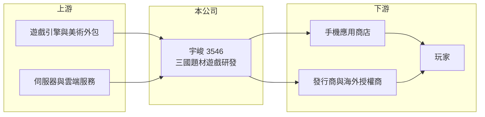

# 3546 宇峻

> 上櫃｜[[產業索引-文化創意業|文化創意業]]｜上市（櫃）日期 2008/04/18

# 第一章：企業模式與商業藍圖

> [!info] 撰寫說明
> 精簡版，由 Claude 依公開資料整理，架構比照 [[2330台積電]] 的四章研究，資料截至 2026-10-08。來源：Goodinfo 年度經營績效頁、nStock 公司簡介、櫃買中心開放資料（基本資料、2026 年第二季資產負債與綜合損益、每月營收、本益比殖利率）。產品與 IP 描述為整理性內容，尚未逐條比對原始文件。#待校對

本章拆解宇峻奧汀科技（股票代號：3546，以下簡稱宇峻）的商業模式。宇峻是台灣少數長期穩定獲利的遊戲研發商，核心資產是經營二十多年的三國題材 [[遊戲IP]]。

- **核心業務：** 宇峻成立於 1995 年，原名宇峻科技，2004 年更名為宇峻奧汀科技，2008 年上櫃，實收資本額約 6.13 億元。主要業務是電腦與手機遊戲的設計、研發及銷售，代表作為《三國群英傳》系列（IP 歸屬細節待校對），從單機遊戲一路延伸到線上與手機遊戲。
- **營收結構：** 公司未揭露各產品營收比重。[[毛利率]]長年在 88% 至 98% 之間，表示營收幾乎全部來自自研遊戲與 IP 授權，沒有實體商品成本，獲利高低主要取決於研發、行銷費用與新作表現。
- **營運據點：** 總部位於台北，研發團隊在台灣。遊戲透過手機應用商店、合作發行商與海外授權商觸及台灣、港澳與華人市場。
- **長期方向：** 宇峻的策略是讓同一個 IP 持續推出新作與改編版本，降低每款新遊戲從零建立知名度的成本。依月營收公告，2026 年有新遊戲上市，1 至 8 月累計營收約 12.98 億元，較去年同期增加約 50%，顯示 IP 仍有吸引新玩家的能力。

# 第二章：護城河深度與競爭優勢

宇峻的護城河建立在 IP 認知度與長期累積的研發能力上，屬於中小型但具體的優勢。

- **競爭優勢：** 三國題材在華人市場有廣大的受眾，而一個經營二十多年的系列名稱，本身就能降低玩家獲取成本。宇峻掌握自己的 IP 與研發團隊，不必像代理商那樣支付高額授權金或擔心代理權到期，這是它能維持九成以上毛利率與穩定配息的根本原因。
- **主要對手：** 台灣同為研發型的有 [[3083網龍]]、[[3293鈊象]]、[[3687歐買尬]]；三國題材則面對中國大陸與日本大型遊戲公司的大量作品（例如光榮特庫摩的《三國志》系列），對手的研發與行銷預算遠大於宇峻。
- **觀察重點：** 2025 年營業利益率由 18.6% 降到 10.5%，可能與新作上市前的研發與行銷投入有關（推估）。新作在 2026 年帶動營收大增後，能否維持長線營運、而不只是上市初期的高峰，是判斷 IP 價值是否延續的關鍵。

# 第三章：財務體質與盈利規模

資料日期：2026-10-08，表格是撰寫當時的快照；最新月營收、毛利率、累計 EPS 由自動排程寫在本筆記的屬性欄位（月營收、毛利率、累計EPS 等）。#待校對

本章用十年數據檢視宇峻的獲利品質與資本效率。

| 年度 | 營收（新台幣） | [[毛利率]] | [[營業利益率]] | EPS（元） | [[ROE]] |
|---|---|---|---|---|---|
| 2016 | 7.63 億 | 92.4% | 18.8% | 3.95 | 14.4% |
| 2018 | 11.3 億 | 87.9% | 18.5% | 4.62 | 17.0% |
| 2020 | 15.5 億 | 94.5% | 21.5% | 6.20 | 22.5% |
| 2021 | 17.0 億 | 95.3% | 20.4% | 6.01 | 20.8% |
| 2022 | 15.8 億 | 92.5% | 20.1% | 6.72 | 21.8% |
| 2023 | 13.7 億 | 94.9% | 15.8% | 4.24 | 14.1% |
| 2024 | 13.9 億 | 97.6% | 18.6% | 5.54 | 18.6% |
| 2025 | 14.2 億 | 93.3% | 10.5% | 1.97 | 7.31% |
| 2026 上半年 | 9.32 億 | 87.2% | 23.9% | 3.30 | 不適用（半年） |

- **營收規模：** 營收由 2016 年的 7.63 億元成長到 2025 年的 14.2 億元，九年年複合成長率約 7.1%（推算）；但 2021 年高點後連續幾年持平，成長呈階梯狀，取決於新作推出時點。
- **獲利：** 營業利益率多數年份維持在 15% 至 22%，十年中沒有出現本業虧損，在台灣遊戲研發商中相當少見。2021 至 2025 年平均 ROE 約 16.5%（推算）。2026 年上半年 EPS 3.30 元，已超過 2025 年全年。
- **財務特色：** 2026 年第二季底總資產約 25.2 億元、負債約 9.4 億元、股東權益約 15.7 億元。負債多為流動負債，應以應付分潤與預收款項為主（推估）。Goodinfo 統計歷年平均現金股利約 3.26 元，近年配息率偏高，顯示公司習慣把獲利發還股東，而非大幅擴張。

**[[ROIC]] 與 [[WACC]]：** 以 2024 年計算，營業利益約 2.59 億元（13.9 億元 × 18.6%），稅後約 2.07 億元；投入資本以股東權益約 15.7 億元加上假設的少量有息負債 0.5 億元（推估）約 16.2 億元，ROIC 約 12.8%（推算）。2025 年營業利益約 1.49 億元、稅後約 1.19 億元，ROIC 約 7.4%（推算）。WACC 假設公債 1.75%、市場風險溢酬 6%、β 取 1.0（遊戲股常見值，假設），股東權益成本約 7.75%，因借款極少，WACC 約 7.7%（推算）。正常年份 ROIC 明顯高於 WACC，代表 IP 研發模式能長期創造價值；2025 年這類新作空窗年則接近打平，說明宇峻的價值創造是「有作品才有利差」。

# 第四章：總體風險與地緣政治

宇峻的風險主要來自產品週期與單一 IP 的集中。

- **產業週期：** 遊戲營收以新作驅動，上市初期營收衝高、之後逐月遞減。2026 年新作帶動的高成長，未來幾年可能逐步回落，投資人應以多年平均而非單年數字評估。
- **營運風險：** 營收高度集中在三國題材，若玩家對該題材的興趣下降，或新作表現不如預期，公司缺乏其他主力產品支撐。研發人才流動與開發延宕也會打亂新作節奏。
- **其他風險：** 手機應用商店約三成的抽成、海外發行地的版號與內容審查政策，以及同題材大量競品帶來的行銷成本上升，都會壓縮獲利空間。

# 專有名詞解析

## 金融

- **[[營業槓桿]]**：固定費用占比高的企業，營收增加時利潤以更快速度成長，營收下滑時也會放大衰退。
- **[[ROIC]]**：投入資本報酬率，稅後營業利益除以股東權益加有息負債，衡量本業運用資本的效率。
- **[[WACC]]**：加權平均資金成本，股東與債權人要求報酬的加權平均，ROIC 高於它才代表創造價值。

## 產業

- **[[遊戲IP]]**：遊戲的智慧財產，包括角色、世界觀與名稱，可改編成續作、手機遊戲或授權給其他廠商使用。
- **[[遊戲授權]]**：遊戲開發商把遊戲內容授權給其他營運商或平台使用，收取授權金或依營收分潤。

# 核心供應鏈

- 上游：遊戲引擎、美術外包、伺服器與雲端服務商。
- 下游／客戶：Google Play 與 Apple App Store、合作發行商與海外授權營運商，最終為玩家。
- 同業：[[3083網龍]]、[[3293鈊象]]、[[3687歐買尬]]、[[6180橘子]]。

## 最新新聞
<!-- news:start（自動產生，請勿手動編輯此範圍） -->
- 2026-10-08 📰 媒體 17:23｜營收速報 - 宇峻(3546)9月營收2.14億元年增率高達109.15％｜[鉅亨網](https://news.cnyes.com/news/id/6625014)

完整紀錄：[[3546宇峻 新聞]]
<!-- news:end -->

## 相關連結
- [公開資訊觀測站](https://mopsov.twse.com.tw/mops/web/t05st03?step=1&firstin=1&co_id=3546)
- [Goodinfo](https://goodinfo.tw/tw/StockDetail.asp?STOCK_ID=3546)
- [Yahoo 股市](https://tw.stock.yahoo.com/quote/3546)
- [鉅亨網新聞](https://www.cnyes.com/twstock/3546/news)
