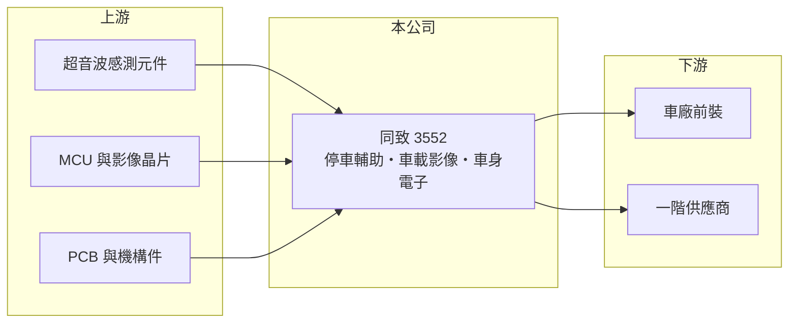

# 3552 同致

> 上櫃｜[[產業索引-其他電子業|其他電子業]]｜上市（櫃）日期 2009/01/07

# 第一章：企業模式與商業藍圖

> [!info] 撰寫說明
> 精簡版，由 Claude 依公開資料整理，架構比照 [[2330台積電]]，資料截至 2026-10-07。來源：nstock.tw 同致公司概況、winvest.tw 營收快訊。營收比重與客戶名單未查到。#待校對

同致是以停車輔助系統起家的車用電子廠，產品逐步延伸到影像與車身控制。

- **核心業務：** 同致電子主要產品為超音波停車輔助系統（倒車雷達）、車載影像系統、多功能顯示後視鏡、無線胎壓偵測（[[TPMS]]）、車門鎖作動器、防盜器與 BCM 車身電裝控制系統。
- **營收結構：** 本次未查到產品與地區比重；以產品性質看，停車輔助與影像系統屬於 [[ADAS]] 入門感測，推估仍是主要營收來源。
- **營運據點：** 本次未查到詳細據點資料。
- **長期方向：** 從單一雷達感測走向影像、感測融合與車身電子整合，爭取車廠前裝（[[OEM]]）專案（推估）。

# 第二章：護城河深度與競爭優勢

同致的護城河來自車廠前裝認證，但價格壓力與國際大廠競爭明顯。

- **競爭優勢：** 車用電子需通過車廠驗證才能量產，一旦進入車型專案，通常會供貨到該車型生命週期結束，轉換成本高。
- **主要對手：** 國際一階供應商如 Bosch、Valeo，台灣的 [[2231為升]]、[[2497怡利電]]，以及中國本土車用電子廠。
- **觀察重點：** 2026 年第二季毛利率僅 11.35%、單季虧損，需追蹤是一次性費用、產品價格下滑或車廠訂單縮減所致。

# 第三章：財務體質與盈利規模

資料日期：2026-10-07，以下數字是撰寫當時的快照；最新月營收、毛利率、累計 EPS 由自動排程寫在本筆記的屬性欄位（月營收、毛利率、累計EPS 等）。#待校對

同致年營收約 85 億元，2026 年上半年由盈轉虧。

- **營收規模：** 2025 年全年營收 84.61 億元；2026 年 1 至 8 月累計 51.69 億元、年減 3.21%，8 月營收 6.41 億元。
- **獲利：** 2026 年第二季 EPS -1.54 元、[[毛利率]] 11.35%，上半年累計 EPS -1.53 元。
- **財務特色：** 2024 年度配發現金股利 0.8 元與股票股利 0.4 元，2025 年第四季配發現金股利 0.5 元。

# 第四章：總體風險與地緣政治

同致的風險在於汽車景氣、中國市場競爭與毛利率下滑。

- **產業週期：** 營收跟著全球新車產量起伏，車市降溫或車廠減產時訂單會直接減少。
- **營運風險：** 停車輔助感測技術已普及，價格競爭使毛利率承壓；若無法以影像與整合方案提高單車價值，獲利恢復不易。
- **其他風險：** 中國車廠扶植本土供應鏈、各國關稅政策與匯率波動。

# 專有名詞解析

## 應用

- **[[ADAS]]**：先進駕駛輔助系統，以雷達、攝影機等感測器協助駕駛，例如倒車警示、車道偏移警示。
- **[[TPMS]]**：胎壓偵測系統，以輪胎內的感測器即時回報胎壓與溫度，美國與歐盟已強制新車配備。

## 金融

- **[[毛利率]]**：毛利除以營收，代表產品扣除直接成本後的獲利空間。

## 產業

- **[[OEM]]**：原廠委託製造；車用領域常指直接供貨給車廠前裝的市場，相對於售後市場。

# 核心供應鏈

- 上游：超音波感測元件、MCU 與影像晶片、PCB 與機構件供應商
- 下游／客戶：全球車廠與一階車用供應商（名單本次未查到）
- 同業：[[2231為升]]、[[2497怡利電]]、Bosch、Valeo

## 最新新聞
<!-- news:start -->
<!-- news:end -->

## 相關連結
- [公開資訊觀測站](https://mopsov.twse.com.tw/mops/web/t05st03?step=1&firstin=1&co_id=3552)
- [Goodinfo](https://goodinfo.tw/tw/StockDetail.asp?STOCK_ID=3552)
- [Yahoo 股市](https://tw.stock.yahoo.com/quote/3552)
- [鉅亨網新聞](https://www.cnyes.com/twstock/3552/news)
