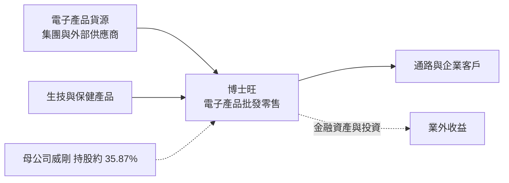
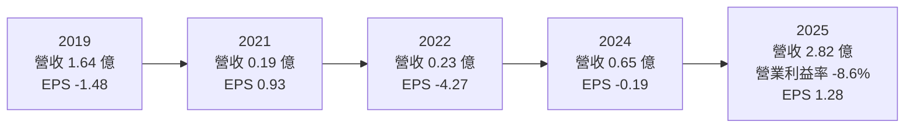
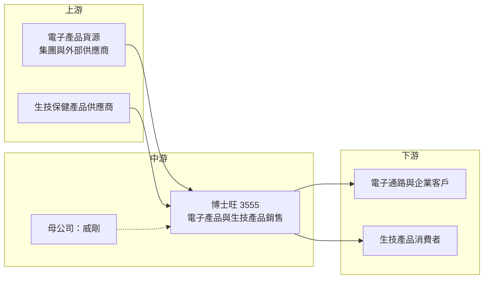

# 3555 博士旺

> 上櫃｜[[產業索引-半導體業|半導體業]]｜上市（櫃）日期 2011/11/08

# 第一章：企業模式與商業藍圖

> [!info] 撰寫說明
> 本文由 Claude 依公開資料整理，架構比照 [[2330台積電]] 的四章研究，資料截至 2026-10-08。財務數字來源：Goodinfo 台灣股市資訊網年度經營績效、nStock 公司簡介、旺得富理財網 2026 年第一季財報報導、Winvest 營收快訊、Yahoo 股市重大訊息與各季 EPS、櫃買中心開放資料（本筆記 _data 快照）；產業描述為整理性內容，尚未逐條比對原始文件。#待校對

在評估單一個股的長期投資價值時，首要步驟是拆解企業的底層獲利邏輯。本章針對博士旺創新（股票代號：3555，以下簡稱博士旺）的商業模式進行定性分析。需要先說明的是：博士旺雖然被歸在櫃買中心的半導體類股，但它早已不是 IC 設計公司，目前的實際業務是電子產品買賣與生技產品銷售。理解這一點，是避免用錯評價方法的第一步。

## 一、核心定位：威剛集團旗下、經歷多次轉型的銷售公司

博士旺成立於 2003 年，前身是 [[NAND Flash]] 控制晶片設計公司擎泰科技，2011 年在櫃買中心掛牌。依 nStock 公司簡介，公司歷經多次更名：2016 年改名鵬億極、2018 年改名重鵬生技、2023 年改為現名博士旺創新。每一次更名都代表一次業務方向的調整，從快閃記憶體控制晶片，到生技產品，再到電子產品與生技並行的銷售業務。

公司的最終母公司為[[DRAM模組]]大廠 [[3260威剛]]，持股約 35.87%，實收資本額約 4.00 億元。依 nStock 與 Winvest 的公司說明，目前營業項目包括電子零組件的批發與零售、軟體開發與生技產品銷售。

這樣的背景讓博士旺的定位與一般上市公司不同：它沒有明確的核心技術或自有品牌，而是依附集團資源、隨市場機會調整業務的平台型公司。對長期投資人來說，最重要的問題不是它的技術有多強，而是集團會如何運用這個上市平台。

## 二、終端應用／產品板塊：電子產品買賣為主，生技為輔

公司未公布各業務精確營收比重，本文不畫圓餅圖。從營收變化可以看出業務重心的轉移。

* **電子產品批發與零售：** 依 Winvest 營收快訊引述公司說明，2026 年營收大幅成長主要來自「銷售電子產品」。博士旺屬於威剛集團，電子產品銷售可能與集團的記憶體產品相關（推估，公司未揭露具體品項）。這類業務的營收規模可以快速放大，但也可能隨集團安排而快速縮小。
* **生技產品銷售：** 延續重鵬生技時期的業務，銷售[[保健食品]]與生技產品。從 2019 至 2024 年營收長期低於 2 億元、多數年份不到 1 億元來看，這塊業務規模有限，難以獨力支撐公司。
* **軟體與系統開發：** 營業項目中另列軟體與系統開發，具體營收貢獻未查得。

## 三、資本轉化邏輯（營運模式）：低資本、高周轉的買賣業務

博士旺採用典型的[[買賣模式]]：向供應商進貨、轉售給客戶，賺取進銷價差。這種模式不需要工廠與研發，資本需求主要是存貨與應收帳款。

* **價差決定毛利：** 電子產品通路業正常的毛利率只有個位數，博士旺在 2025 年毛利率約 10.6%，接近通路業水準；2026 年上半年毛利率一度接近五成，可能與記憶體價格大漲期間的存貨增值有關（推估）。這種高毛利屬於特殊市況，不宜視為常態。
* **業外收益占比高：** 博士旺多年來本業都是營業虧損，2025 年營業利益率仍為 -8.6%，但 EPS 為正值 1.28 元，代表獲利主要來自業外。業外來源未查得，可能包含金融資產評價或投資收益（推估）。
* **輕資產：** 2026 年第二季底總資產約 9.85 億元、總負債約 1.47 億元，[[負債比]]約 15%，沒有大型廠房或設備投資。

## 四、企業長期藍圖：仍在摸索的轉型

博士旺目前沒有對外提出清楚的長期策略，以下是可觀察的方向。

* **集團內的定位：** 作為威剛的子公司，博士旺可能扮演集團特定產品的銷售平台或新事業載體。集團怎麼使用這個平台，會直接決定博士旺的營收與獲利。
* **資本市場平台：** 2026 年 4 月董事會決議擬辦理普通股[[私募]]，私募的對象與資金用途，將透露公司下一階段的業務方向。
* **股利政策：** 依 Yahoo 股市重大訊息，2025 年下半年與 2026 年上半年董事會皆決議不分派股利，資金優先保留在公司內，顯示公司仍處於轉型與累積階段。

# 第二章：護城河深度與競爭優勢

在長期價值投資中，「護城河」指企業抵禦競爭、維持超額利潤的保護機制。本章分析博士旺的競爭優勢來源與限制。以公開資料來看，博士旺的業務屬於買賣型態，護城河相當有限。

## 一、護城河的核心組成要素

* **1. 集團資源：** 母公司威剛是台灣主要記憶體模組品牌之一。在記憶體缺貨或價格上漲期間，集團的貨源與通路可能讓博士旺取得銷售機會（推估）。這是博士旺最主要的優勢，但它完全依附於集團，而不是公司自己建立的能力。
* **2. 輕資產與低負債：** 沒有重資產負擔，業務可以隨市場機會快速調整，也不容易因景氣下滑而陷入財務困境。
* **3. 上市公司平台：** 作為掛牌公司，可以透過私募或增資取得資金，是集團的資本市場工具之一。

這些優勢都不是技術、品牌或規模上的長期護城河，比較接近依附集團資源與市場時機的條件，一旦集團調整安排或市場反轉，就可能消失。

## 二、全球主要競爭對手格局

| 對手類型 | 代表 | 對博士旺的威脅 |
|---|---|---|
| 記憶體模組與通路 | [[3260威剛]]本身、[[8271宇瞻]]、[[4967十銓]] | 同類產品的品牌與通路規模遠大於博士旺 |
| 電子零組件通路 | [[3702大聯大]]、[[3036文曄]] | 代理線與客戶基礎完整，規模經濟明顯 |
| 生技保健通路 | 各大保健食品品牌與電商 | 市場分散、品牌競爭激烈 |

## 三、優勢轉化：守得住／守不住／觀察重點

* **守得住：** 集團內部安排的產品銷售與特定客戶。只要集團持續支持，營收有一定基礎，但這個基礎的穩定度取決於集團，而不是市場競爭力。
* **守不住：** 一般電子產品買賣的價差。電子通路業本質上是低毛利、靠規模取勝的行業，博士旺規模小，在正常市況下很難長期維持高毛利。
* **觀察重點：** 判斷博士旺是否真正轉型成功，可以看三件事：本業（營業利益）能否連續數年為正，而不是靠業外收入；營收能否在記憶體價格回落後仍維持在 2025 年以前水準的數倍以上；以及私募引進的資金或策略夥伴能否帶來新的長期業務。

# 第三章：財務體質與盈利規模

資料日期：2026-10-08。數字取自 Goodinfo 年度經營績效、旺得富理財網、Winvest、Yahoo 股市與櫃買中心開放資料快照，表格是撰寫當時的快照；最新月營收、毛利率、累計 EPS 由自動排程寫在本筆記的屬性欄位（月營收、毛利率、累計EPS 等）。#待校對

財務報表是檢驗護城河是否真實存在的最終標準。本章用多年度的三率、ROE、現金流與資本報酬，檢視博士旺多年轉型下的獲利品質。

## 一、獲利能力的基石：三率

| 年度 | 營收（新台幣） | [[毛利率]] | [[營業利益率]] | EPS（元） | [[ROE]] |
|---|---|---|---|---|---|
| 2019 | 1.64 億 | -20.7% | -53.0% | -1.48 | -14.5% |
| 2020 | 1.52 億 | 5.6% | -20.6% | -1.78 | -20.8% |
| 2021 | 0.19 億 | 20.7% | -201% | 0.93 | 8.4% |
| 2022 | 0.23 億 | 31.5% | -140% | -4.27 | -46.0% |
| 2023 | 0.65 億 | 23.4% | -32.4% | -0.71 | -10.4% |
| 2024 | 0.65 億 | 27.5% | -41.3% | -0.19 | -2.8% |
| 2025 | 2.82 億 | 10.6% | -8.6% | 1.28 | 8.5% |

註：現金股利逐年資料未查得；2025 年下半年起董事會決議不分派。

這張表顯示，博士旺在 2019 至 2025 年的七年中，每一年的營業利益率都是負值，也就是本業從未獲利。EPS 為正的年份（2021 年與 2025 年）都是靠業外收入。2021 至 2024 年營收只有 0.2 億至 0.7 億元，公司幾乎處於休眠狀態；2025 年營收回升到 2.82 億元，2026 年上半年電子產品銷售大增，才首次出現本業獲利的跡象。

* **[[毛利率]]：** 歷年毛利率從負值到三成不等，波動極大，反映業務內容多次改變，沒有穩定的產品組合可以分析。
* **[[營業利益率]]：** 長期為負值，代表營業費用遠大於毛利。2025 年營業虧損率縮小到 -8.6%，是營收規模放大後的改善。
* **[[業外收益]]：** 業外是博士旺歷年獲利的主要來源。評估公司價值時，應把業外收益視為不穩定的[[一次性收益]]，而以本業能否轉正作為核心判斷。
* **長期指標：** 2019 至 2025 年七年平均 ROE 約 -11%（推算），營收規模在不同年份間相差十倍以上，計算年複合成長率沒有意義。

## 二、[[ROE]]：資本效率

博士旺幾乎沒有負債，ROE 完全由淨利決定。七年中有五年 ROE 為負值，正值的兩年也只有 8% 左右，且來自業外。2026 年上半年因電子產品銷售大增，單期報酬率明顯提高，但這是否能延續，取決於集團安排與記憶體市況，不能直接當作長期資本效率。

## 三、資本支出與自由現金流

* **[[CapEx]]：** 買賣與銷售業務幾乎不需要資本支出，具體數字未查得。
* **[[自由現金流]]：** 營業現金流主要受存貨與應收帳款影響，電子產品買賣若需要大量備貨，現金會被存貨占用。過去多年本業虧損，自由現金流長期為正的可能性不高（推估，逐年數字未查得）。

## 四、[[ROIC]] 與 [[WACC]]：價值創造利差

博士旺沒有明顯的有息負債，投入資本以股東權益近似，約 8 億元（依 2026 年第二季底權益 8.38 億元）。由於 2019 至 2025 年每年營業利益都是負值，以稅後營業利益計算的 ROIC 全部為負值（推算）。以 2025 年為例，營業利益約 -0.24 億元（營收 2.82 億元 × 營業利益率 -8.6%），ROIC 約為 -3%（推算，虧損年度不計稅盾）。

WACC 以 CAPM 推估：台灣 10 年期公債約 1.5% 至 2%，市場風險溢酬約 6%，β 未查得個股數值，考量公司規模小、業務變動大，採 1.3 至 1.5（假設），股東權益成本約 9.3% 至 11%。沒有有息負債，WACC 約 9.5% 至 11%（推算）。

ROIC 長期為負、遠低於約 10% 的資金成本，代表博士旺過去多年在本業上持續消耗股東價值。2026 年的業務成長是否能讓 ROIC 長期轉正並超過資金成本，是判斷這家公司轉型成敗的唯一標準。

# 第四章：總體風險與地緣政治

任何企業都無法脫離宏觀環境獨立存在。本章分析博士旺長期必須面對的地緣政治、產業週期與營運風險。

## 一、地緣政治

* **間接受記憶體供應鏈影響：** 若博士旺的電子產品銷售與記憶體相關（推估），記憶體原廠的產能分配、出口管制與美中科技限制都會間接影響貨源與價格。
* **生技產品法規：** 保健與生技產品的進出口與標示規範因國家而異，跨境銷售必須遵守各地法規，增加經營成本。

## 二、產業週期與市場結構

* **記憶體價格循環：** 記憶體是週期性極強的產品，價格上漲時模組廠與通路的營收、毛利同步放大，價格反轉時則快速縮小。博士旺若高度依賴這類產品，獲利會跟著記憶體循環大幅波動。
* **通路業低毛利常態：** 電子零組件通路業正常毛利率只有個位數，靠規模與周轉率賺錢。博士旺規模小，在正常市況下要維持獲利並不容易。

## 三、營運環境的隱性風險

* **關係人交易：** 業務若高度仰賴集團內交易，交易條件與持續性取決於集團安排，外部投資人較難評估業務的真實競爭力。
* **業務方向不穩定：** 公司二十多年來經歷多次轉型與更名，業務方向可能再度改變，投資人需要持續追蹤重大訊息。
* **私募稀釋：** 私募增資會稀釋既有股東權益，且私募股票有轉讓限制，認購對象與價格需要追蹤。

## 四、科技或法規演進

* **業務與產業分類落差：** 公司被歸類在半導體業，但實際業務與半導體技術關聯不大。若投資人用半導體公司的評價方式看待，很容易誤判公司價值。
* **資訊揭露有限：** 公司規模小、沒有定期法說會，營收結構與業外收益來源的揭露有限，是長期分析上的主要限制。

# 專有名詞解析

## 半導體

- **[[NAND Flash]]**：斷電後仍可保存資料的記憶體，用於隨身碟、記憶卡與固態硬碟。

## 金融

- **[[業外收益]]**：本業以外的收入，例如利息、匯兌利益、投資收益，不代表本業競爭力。
- **[[一次性收益]]**：不會重複發生的收益，例如處分資產或評價利益，評估長期獲利時應排除。
- **[[私募]]**：公司對特定對象發行新股，價格可低於市價，但認購者通常有三年轉讓限制。
- **[[負債比]]**：總負債除以總資產，衡量公司財務槓桿與償債壓力。
- **[[ROIC]]**：投入資本報酬率，稅後營業利益除以投入資本，衡量本業運用資金創造報酬的能力。
- **[[WACC]]**：加權平均資金成本，股東與債權人要求報酬率的加權平均，是 ROIC 要超過的門檻。

## 產業

- **[[買賣模式]]**：公司向供應商進貨後轉售給客戶，賺取進銷價差，不自行生產產品。
- **[[DRAM模組]]**：把多顆 DRAM 晶片組裝在電路板上的記憶體產品，威剛、宇瞻、十銓是台灣主要廠商。
- **[[保健食品]]**：具特定保健功能宣稱的食品，在台灣需經主管機關審核才能標示健康功效。

# 核心供應鏈

## 1. 上游：貨源
- 電子產品：可能包含威剛集團的記憶體相關產品（推估，公司未揭露品項）
- 生技保健產品：供應商未查得

## 2. 中游：博士旺本身與母公司
- 最終母公司（持股約 35.87%）：[[3260威剛]]
- 前身：擎泰科技（NAND Flash 控制晶片設計），歷經鵬億極、重鵬生技後更名為博士旺

## 3. 下游：客戶
- 電子產品：通路與企業客戶，具體名單未查得
- 生技產品：零售消費者

## 4. 同業
- 記憶體模組與通路：[[8271宇瞻]]、[[4967十銓]]
- 電子零組件通路：[[3702大聯大]]、[[3036文曄]]

## 最新新聞
<!-- news:start -->
<!-- news:end -->

## 相關連結
- [公開資訊觀測站](https://mopsov.twse.com.tw/mops/web/t05st03?step=1&firstin=1&co_id=3555)
- [Goodinfo](https://goodinfo.tw/tw/StockDetail.asp?STOCK_ID=3555)
- [Yahoo 股市](https://tw.stock.yahoo.com/quote/3555)
- [鉅亨網新聞](https://www.cnyes.com/twstock/3555/news)
