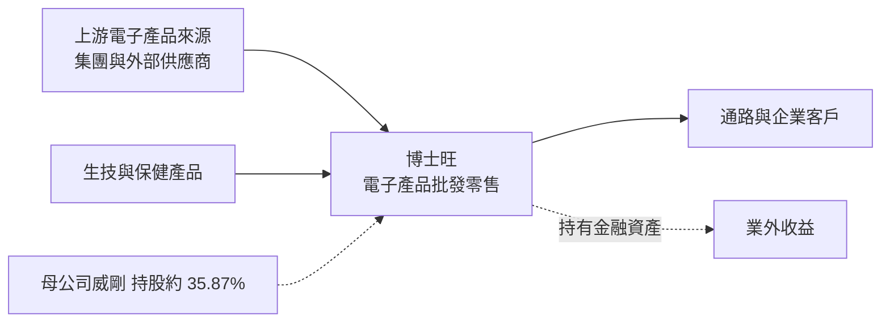
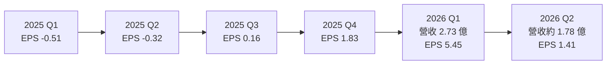
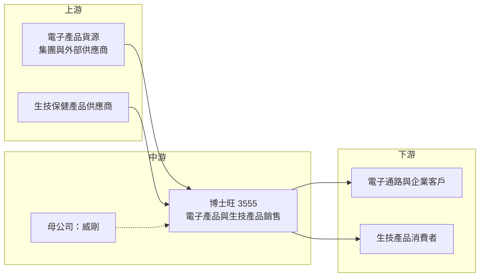

# 3555 博士旺

> 上櫃｜[[產業索引-半導體業|半導體業]]｜上市（櫃）日期 2011/11/08

# 第一章：企業模式與商業藍圖

> [!info] 撰寫說明
> 本文由 Claude 依公開資料整理，架構比照 [[2330台積電]] 的四章研究，資料截至 2026-10-07。財務數字來源：nStock 公司簡介、旺得富理財網 2026 年第一季財報報導、Winvest 營收快訊、Yahoo 股市重大訊息與各季 EPS、櫃買中心開放資料（本筆記 _data 快照：2026 上半年綜合損益、資產負債、月營收、本益比）；產業描述為整理性內容，尚未逐條比對原始文件。#待校對

在評估單一個股的長期投資價值時，首要步驟是拆解企業的底層獲利邏輯。本章針對博士旺創新（股票代號：3555，以下簡稱博士旺）的商業模式進行定性分析。需要先說明的是：博士旺雖然被歸在櫃買中心的半導體類股，但目前的實際業務是電子產品買賣與生技產品銷售，和一般 IC 設計或製造公司的商業邏輯很不一樣。

## 一、核心定位：威剛集團旗下的電子產品與生技產品銷售公司

博士旺成立於 2003 年，前身是 [[NAND Flash]] 控制晶片設計公司擎泰科技，2011 年在櫃買中心掛牌。依 nStock 公司簡介，公司歷經多次更名：2016 年改名鵬億極、2018 年改名重鵬生技、2023 年改為現名博士旺創新。最終母公司為[[DRAM模組]]大廠 [[3260威剛]]，持股約 35.87%。實收資本額約 4.00 億元。

目前的業務定位有三個重點：

* **電子零組件批發與零售：** 依 Winvest 營收快訊引述公司說明，2026 年營收成長主要來自「銷售電子產品」。博士旺屬於威剛集團，電子產品銷售可能與集團的記憶體產品相關（推估，公司未揭露具體品項）。
* **生技產品銷售：** 延續重鵬生技時期的業務，銷售[[保健食品]]與生技產品，營收規模較小。
* **消費性娛樂產品與系統開發：** 營業項目中另列軟體與系統開發，具體營收貢獻未查得。

## 二、終端應用／產品板塊：電子產品買賣為主

公司未公布各業務精確營收比重，本文不畫圓餅圖。從營收變化可以看出業務重心：

* **2025 年以前：** 月營收多在數百萬元到一兩千萬元，業務規模很小，2024 年上半年與 2025 年上半年都是虧損。
* **2026 年起：** 1 月至 3 月月營收分別為 0.70 億、1.00 億、1.03 億元，年增幅高達 37 倍至 47 倍；4 月至 8 月回落到 0.47 億至 0.79 億元之間。1 至 8 月累計營收 5.77 億元，年增 346.7%。

這種營收型態比較像集團內貿易或[[買賣模式]]的電子產品銷售，而不是自有技術產品的穩定出貨（推估）。

## 三、資本轉化邏輯（營運模式）：低資本、高周轉的買賣業務

* **買賣價差：** 電子產品批發的毛利來自進貨與售價的差額。2026 年上半年[[毛利率]] 48.6%，對一般電子通路來說非常高，可能與記憶體價格大漲期間的庫存增值有關（推估）。
* **業外收益占比高：** 2026 年上半年營業利益 1.15 億元，業外收入 1.63 億元，業外大於本業。業外來源未查得，可能包含金融資產評價或投資收益（推估）。
* **輕資產：** 2026 年第二季底總資產 9.85 億元、總負債 1.47 億元，[[負債比]]約 15%，沒有大型廠房或設備投資。

## 四、企業長期藍圖：仍在摸索的轉型

* **私募增資：** 依 Yahoo 股市重大訊息，2026 年 4 月董事會決議擬辦理普通股[[私募]]，引進的對象與用途需持續追蹤。
* **集團定位：** 作為威剛的子公司，博士旺未來可能扮演集團內特定產品的銷售平台或新事業載體，但公司尚未提出清楚的長期策略。
* **股利：** 2025 年下半年與 2026 年上半年董事會皆決議不分派股利，資金優先保留在公司內。

# 第二章：護城河深度與競爭優勢

在長期價值投資中，「護城河」指企業抵禦競爭、維持超額利潤的保護機制。本章分析博士旺的競爭優勢來源與限制。需要先說明，以目前公開資料來看，博士旺的業務屬於買賣型態，護城河相當有限。

## 一、護城河的核心組成要素

* **1. 集團資源：** 母公司威剛是台灣主要記憶體模組品牌之一，在記憶體缺貨與漲價期間，集團的貨源與通路可能讓博士旺取得銷售機會（推估）。
* **2. 輕資產與低負債：** 沒有重資產負擔，業務可以隨市場機會快速調整。
* **3. 上市公司平台：** 作為櫃買中心掛牌公司，可透過私募或增資取得資金，是集團的資本市場平台之一。

這些優勢都不是技術或品牌上的長期護城河，比較像是依附集團資源與市場時機的短期優勢。

## 二、全球主要競爭對手格局

| 對手類型 | 代表 | 對博士旺的威脅 |
|---|---|---|
| 記憶體模組與通路 | [[3260威剛]]本身、[[8271宇瞻]]、[[4967十銓]] | 同類產品的品牌與通路規模遠大於博士旺 |
| 電子零組件通路 | [[3702大聯大]]、[[3036文曄]] | 電子零組件代理規模與客戶基礎完整 |
| 生技保健通路 | 各大保健食品品牌與電商 | 市場分散、品牌競爭激烈 |

## 三、優勢轉化：哪些市場守得住、哪些守不住

* **守得住：** 集團內部安排的產品銷售與特定客戶，只要集團持續支持，營收有一定基礎。
* **守不住：** 一般電子產品買賣的價差。記憶體價格回落或集團調整銷售安排時，2026 年的高營收與高毛利可能無法延續。
* **觀察重點：** 4 月以後月營收已明顯低於第一季、8 月營收月減 40.6%；第二季 EPS 1.41 元，比第一季的 5.45 元大幅下降。觀察重點包括：營收能否維持在每月 0.5 億元以上、毛利率是否回落、業外收益的來源與持續性，以及私募案的進度。

# 第三章：財務體質與盈利規模

資料日期：2026-10-07。數字取自旺得富理財網、Winvest、Yahoo 股市與櫃買中心開放資料快照，表格是撰寫當時的快照；最新月營收、毛利率、累計 EPS 由自動排程寫在本筆記的屬性欄位（月營收、毛利率、累計EPS 等）。#待校對

財務報表是檢驗護城河是否真實存在的最終標準。本章用三率、ROE、現金流與資本報酬，檢視博士旺 2026 年獲利暴增的成分與持續性。

## 一、獲利能力的基石：三率

| 項目 | 2025 全年 | 2026 Q1 | 2026 Q2 | 2026 上半年 |
|---|---|---|---|---|
| 營收（新台幣） | 未查得（1 至 8 月 1.29 億） | 2.73 億 | 1.78 億（推算） | 4.51 億 |
| [[毛利率]] | 未查得 | 未查得 | 未查得 | 48.6% |
| [[營業利益率]] | 未查得 | 未查得 | 未查得 | 25.5% |
| EPS（元） | 約 1.16 至 1.28 | 5.45 | 1.41 | 6.87 |

註：2025 全年 EPS 依 Yahoo 各季加總約 1.16 元，Winvest 列為 1.28 元，兩來源不一致；2026 Q2 營收由上半年減第一季推算。

* **毛利率與營業利益率：** 2026 年上半年毛利 2.19 億元、營業利益 1.15 億元，營業利益率 25.5%。以電子產品買賣來說，這是極不尋常的高水準，持續性需要保守看待。
* **[[業外收益]]：** 上半年業外收入 1.63 億元，比營業利益還多，稅後淨利 2.78 億元，淨利率 61.5%。第一季稅前淨利 2.21 億元，單季就超過過去多年的累計獲利。
* **[[一次性收益]]的可能性：** 營收高峰集中在第一季、業外比重高，2026 年上半年的獲利可能包含較多一次性成分（推估）。

## 二、[[ROE]]：資本效率

依櫃買中心資料，2026 年第二季底歸屬母公司權益約 8.27 億元，上半年歸屬母公司淨利 2.75 億元，單看上半年的報酬率已超過三成（推估）。但這是單一年度的異常高點，2024 年與 2025 年上半年都是虧損，不能用來推估長期資本效率。股價淨值比約 7.90 倍，市場已給予相當高的評價。

## 三、資本支出與自由現金流

* **[[CapEx]]：** 買賣業務幾乎不需要資本支出，具體數字未查得。
* **[[自由現金流]]：** 營業現金流會受存貨與應收帳款影響，電子產品買賣若需要備貨，現金會被存貨占用；具體現金流數字未查得。
* **股利：** 2025 年下半年與 2026 年上半年皆不分派，未來股利政策未查得。

## 四、[[ROIC]] 與 [[WACC]]：價值創造利差

博士旺的投入資本小，若 2026 年的獲利水準能維持，ROIC 會遠高於資金成本；但過去多年虧損、獲利來源集中在單季與業外，長期 ROIC 很難判斷（推估，具體數值未查得）。投資人應把 2026 年上半年視為特殊時期的結果，而不是穩態獲利。

# 第四章：總體風險與地緣政治

任何企業都無法脫離宏觀環境獨立存在。本章分析博士旺未來必須面對的地緣政治、產業週期與營運風險。

## 一、地緣政治

* **間接受記憶體供應鏈影響：** 若博士旺的電子產品銷售與記憶體相關（推估），記憶體原廠的產能與出口管制、美中科技限制都會間接影響貨源與價格。
* **生技產品法規：** 生技保健產品的進出口與標示規範因國家而異，跨境銷售需遵守各地法規。

## 二、產業週期與市場結構

* **記憶體價格循環：** 2026 年記憶體價格大漲帶動威剛等模組廠營收創新高，若價格反轉，相關電子產品銷售的營收與毛利會同步下滑。
* **通路業低毛利常態：** 電子零組件通路業正常毛利率通常只有個位數，博士旺目前的高毛利率若回歸常態，獲利會大幅縮小。

## 三、營運環境的隱性風險

* **關係人交易：** 業務若高度仰賴集團內交易，交易條件與持續性取決於集團安排，外部投資人較難評估。
* **股價波動：** 股價淨值比約 7.9 倍，且多次因股價波動被公告為[[注意股]]，籌碼面風險高。
* **私募稀釋：** 私募增資會稀釋既有股東權益，且私募股票有轉讓限制，認購對象與價格需要追蹤。

## 四、科技或法規演進

* **業務與產業分類落差：** 公司被歸類在半導體業，但實際業務與半導體技術關聯不大，投資人以半導體類股評價方式看待時容易誤判。
* **資訊揭露有限：** 公司規模小、沒有定期法說，營收結構與業外來源的資訊揭露有限，是分析上的主要限制。

# 專有名詞解析

## 半導體

- **[[NAND Flash]]**：斷電後仍可保存資料的記憶體，用於隨身碟、記憶卡與固態硬碟。

## 金融

- **[[業外收益]]**：本業以外的收入，例如利息、匯兌利益、投資收益，不代表本業競爭力。
- **[[一次性收益]]**：不會重複發生的收益，例如處分資產或評價利益，評估長期獲利時應排除。
- **[[注意股]]**：股價或成交量異常、達到交易所標準時被公告的股票，提醒投資人注意風險。
- **[[私募]]**：公司對特定對象發行新股，價格可低於市價，但認購者通常有三年轉讓限制。
- **[[ROE]]**：股東權益報酬率，稅後淨利除以股東權益，衡量公司運用股東資金賺錢的效率。
- **[[負債比]]**：總負債除以總資產，衡量公司財務槓桿與償債壓力。

## 產業

- **[[買賣模式]]**：公司向供應商進貨後轉售給客戶，賺取進銷價差，不自行生產產品。
- **[[DRAM模組]]**：把多顆 DRAM 晶片組裝在電路板上的記憶體產品，威剛、宇瞻、十銓是台灣主要廠商。
- **[[保健食品]]**：具特定保健功能宣稱的食品，在台灣需經主管機關審核才能標示健康功效。

# 核心供應鏈

## 1. 上游：貨源
- 電子產品：可能包含威剛集團的記憶體相關產品（推估，公司未揭露品項）
- 生技保健產品：供應商未查得

## 2. 中游：博士旺本身與母公司
- 最終母公司（持股約 35.87%）：[[3260威剛]]
- 前身：擎泰科技（NAND Flash 控制晶片設計），歷經鵬億極、重鵬生技後更名為博士旺

## 3. 下游：客戶
- 電子產品：通路與企業客戶，具體名單未查得
- 生技產品：零售消費者

## 4. 同業
- 記憶體模組與通路：[[8271宇瞻]]、[[4967十銓]]
- 電子零組件通路：[[3702大聯大]]、[[3036文曄]]

## 最新新聞
<!-- news:start -->
<!-- news:end -->

## 相關連結
- [公開資訊觀測站](https://mopsov.twse.com.tw/mops/web/t05st03?step=1&firstin=1&co_id=3555)
- [Goodinfo](https://goodinfo.tw/tw/StockDetail.asp?STOCK_ID=3555)
- [Yahoo 股市](https://tw.stock.yahoo.com/quote/3555)
- [鉅亨網新聞](https://www.cnyes.com/twstock/3555/news)
