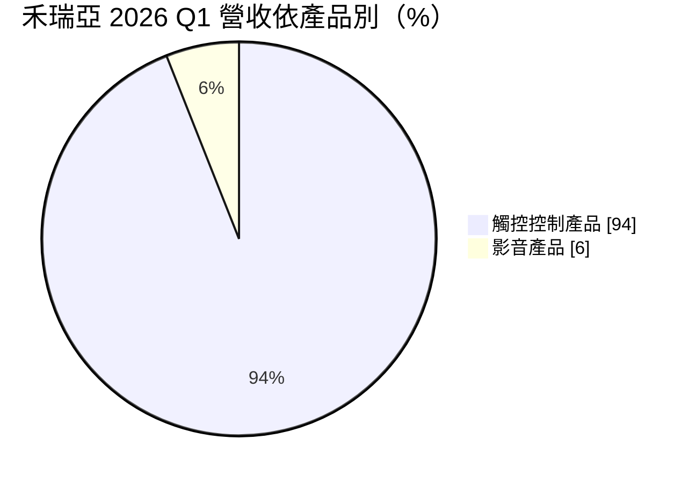
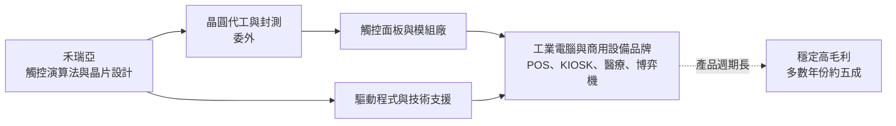
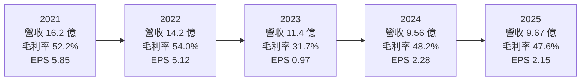
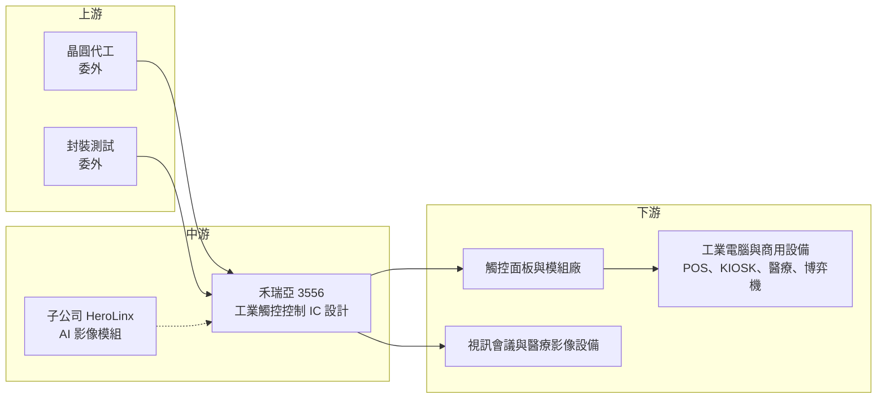

# 3556 禾瑞亞

> 上櫃｜[[產業索引-半導體業|半導體業]]｜上市（櫃）日期 2008/04/15

# 第一章：企業模式與商業藍圖

> [!info] 撰寫說明
> 本文由 Claude 依公開資料整理，架構比照 [[2330台積電]] 的四章研究，資料截至 2026-10-08。財務數字來源：Goodinfo 台灣股市資訊網年度經營績效與股利政策、HiStock 歷年每股盈餘、富果研究法說會整理（2025 年 11 月、2026 年 5 月）、nStock 公司簡介、櫃買中心開放資料（本筆記 _data 快照）；產業描述為整理性內容，尚未逐條比對原始文件。#待校對

在評估單一個股的長期投資價值時，首要步驟是拆解企業的底層獲利邏輯。本章針對禾瑞亞科技（股票代號：3556，以下簡稱禾瑞亞）的商業模式進行定性分析，說明一家年營收約 10 億元的觸控 IC 設計公司，為何能在大多數年份維持接近五成的毛利率，以及這種利基型生意的成長限制。

## 一、核心定位：工業用觸控控制晶片的利基型設計公司

禾瑞亞成立於 2002 年，2008 年在櫃買中心掛牌，總部位於台北內湖，實收資本額約 6.37 億元。公司以 eGalax 品牌的觸控控制器在工業與商用觸控市場建立知名度，屬於 [[Fabless]] IC 設計公司。

禾瑞亞的關鍵選擇，是避開手機與筆電這類出貨量大、但價格競爭激烈的消費性市場，把重心放在[[工業電腦]]、POS 收銀機、自助服務機台、醫療設備與博弈機台等工業與商用觸控。這些市場出貨量不大、機種分散，大型 IC 公司投入意願低，反而讓專注的小公司有長期生存空間。

工業市場的另一個特點是多種觸控技術並存：電阻式、表面電容式（[[電容式觸控]]的一種）與[[投射電容式觸控]]，各自對應不同年代與用途的設備。禾瑞亞三種控制器都有，能一次滿足客戶不同機型的需求，這是它在工控觸控市場的基本定位。

## 二、終端應用／產品板塊：觸控控制器占九成以上

依 2026 年 5 月法說，2026 年第一季營收結構如下：

* **觸控控制產品：** 包含電阻式、表面電容式與投射電容式觸控控制器，其中投射電容式在工控應用中已成主流。觸控產品長期占營收九成以上，是公司的獲利核心；它的需求跟著工業電腦與商用設備的出貨走，而不是跟著手機或筆電走。
* **影音產品：** USB 影像控制晶片，用於視訊會議、醫療影像與工業應用。規模不大，但代表公司把介面晶片技術延伸到影像領域的嘗試。
* **研發中的 AI 影像模組：** 子公司 HeroLinx 開發 AI 影像處理模組，方向是 [[Edge AI]] 與視覺語言模型應用，公司表示最快 2027 年推出。這是禾瑞亞嘗試跳出觸控單一產品線的長期布局。

## 三、資本轉化邏輯（營運模式）：少量多樣、高毛利的工控 IC

禾瑞亞的獲利邏輯可以用三個特點說明。

* **[[少量多樣]]：** 工控設備的出貨量不大，但機種多、規格分散，每一款設備都需要觸控控制器搭配驅動程式與調校。對大型 IC 公司來說，這樣的市場服務成本高、單一訂單小，不值得投入；對禾瑞亞來說，正好是可以收取較高價格的利基。
* **軟體與服務是附加價值：** 工業設備使用多種作業系統與舊型介面，禾瑞亞提供跨平台驅動程式與技術支援。客戶買的不只是晶片，而是一套「保證能在自家設備上穩定運作」的方案，這是毛利率能維持在 45% 至 55% 的原因。
* **輕資產與高現金：** 公司沒有晶圓廠，資本支出很低，獲利大部分轉為現金。依 2026 年 5 月法說，2026 年第一季底現金約 7.80 億元，占總資產四成以上。

## 四、企業長期藍圖：新一代觸控 IC 與 AI 影像模組

* **新一代觸控 IC：** 依 2026 年 5 月法說，新一代觸控 IC 預計 2026 年下半年推出、2027 年上半年量產。工控產品週期長，一代產品往往可以銷售多年，新一代產品的成敗會影響公司未來五年的競爭力。
* **AI 影像模組：** 子公司開發的 AI 影像處理模組，是把影音產品線從 USB 影像晶片延伸到邊緣 AI 視覺的嘗試。這是全新領域，需要演算法與系統能力，成效仍有不確定性。
* **資本配置習慣：** 經營層長期採取高配息政策，依 Goodinfo，2016 至 2025 年每年都發放現金股利，多數年份配發率在九成左右，並曾多次配發股票股利。公司較少進行大型併購或擴張，資金多以股利回饋股東。

# 第二章：護城河深度與競爭優勢

在長期價值投資中，「護城河」指企業抵禦競爭、維持超額利潤的保護機制。本章分析禾瑞亞的護城河構成、主要競爭對手，以及這些優勢能否長期維持約五成的毛利率。

## 一、護城河的核心組成要素

禾瑞亞的護城河屬於「窄而深」：它守的市場不大，但在這個市場裡不容易被取代。

* **1. 工控客戶的轉換成本：** 工業設備的生命週期通常長達 5 至 10 年，觸控控制器一旦設計進整機，更換需要重新驗證硬體、驅動程式與長期可靠度。對客戶來說，為了省一點晶片成本而冒整機出錯的風險並不划算，因此很少轉單。
* **2. 多技術、多平台的支援能力：** 同時支援三種觸控技術，並提供跨作業系統的驅動程式。對工業客戶來說，一家供應商就能解決多種機型的需求，能降低採購與維護的複雜度。
* **3. 品牌與相容性資料：** eGalax 觸控控制器在工控與商用觸控市場長期使用，累積大量設計案例與相容性資料。新進者即使晶片性能相近，也需要多年時間才能建立同樣的信任。

## 二、全球主要競爭對手格局

| 對手 | 定位 | 對禾瑞亞的威脅 |
|---|---|---|
| Microchip | 美國 MCU 大廠，提供工業觸控控制器 | 產品線完整、可與 MCU 綁售 |
| [[2458義隆]] | 台灣觸控與觸控板 IC 大廠 | 以筆電觸控為主，部分產品可延伸到工控 |
| 奕力 | 台灣觸控與顯示驅動 IC 公司 | 在中大尺寸觸控有布局 |
| [[3545敦泰]] | 手機與平板觸控 IC 廠 | 主要在消費性市場，工控重疊較少 |
| 中國觸控 IC 廠 | 匯頂等 | 以價格切入中低階工控與商用觸控 |

## 三、優勢轉化：守得住／守不住／觀察重點

* **守得住：** 需要長期供貨與驅動程式支援的工業電腦、醫療與博弈設備。這些客戶重視穩定與相容性，價格敏感度低，是禾瑞亞毛利率在多數年份維持在 47% 至 57% 的原因。
* **守不住：** 規格標準化、出貨量大的商用觸控，例如低階自助機台。中國觸控 IC 廠以價格切入時，禾瑞亞較難以價格回應。此外，工控市場本身成長緩慢，禾瑞亞的營收從 2016 年的 12.3 億元降到 2025 年的 9.67 億元，說明守住市場不等於能成長。
* **觀察重點：** 長期可以觀察三件事：毛利率能否在非庫存調整年度維持在 45% 以上；新一代觸控 IC 能否如期量產並延續產品競爭力；以及 AI 影像模組能否成為觸控以外的第二條成長曲線。

# 第三章：財務體質與盈利規模

資料日期：2026-10-08。數字取自 Goodinfo 年度經營績效與股利政策、HiStock 歷年每股盈餘、富果研究法說整理與櫃買中心開放資料快照，表格是撰寫當時的快照；最新月營收、毛利率、累計 EPS 由自動排程寫在本筆記的屬性欄位（月營收、毛利率、累計EPS 等）。#待校對

財務報表是檢驗護城河是否真實存在的最終標準。本章用多年度的三率、ROE、現金流與資本報酬，檢視禾瑞亞在工控景氣循環中的獲利品質。

## 一、獲利能力的基石：三率

| 年度 | 營收（新台幣） | [[毛利率]] | [[營業利益率]] | EPS（元） | [[ROE]] | 現金股利（元） |
|---|---|---|---|---|---|---|
| 2019 | 11.5 億 | 57.2% | 22.6% | 未查得 | 14.9% | 3.30 |
| 2020 | 12.2 億 | 52.6% | 22.0% | 3.77 | 19.9% | 3.15 |
| 2021 | 16.2 億 | 52.2% | 26.9% | 5.85 | 29.3% | 5.00 |
| 2022 | 14.2 億 | 54.0% | 26.0% | 5.12 | 23.7% | 4.70 |
| 2023 | 11.4 億 | 31.7% | 4.2% | 0.97 | 4.6% | 0.90 |
| 2024 | 9.56 億 | 48.2% | 13.2% | 2.28 | 11.6% | 2.08 |
| 2025 | 9.67 億 | 47.6% | 11.5% | 2.15 | 9.9% | 1.95 |

註：EPS 取 HiStock 歷年每股盈餘（未經股票股利追溯調整）；Goodinfo 年度表的 EPS 經過追溯調整，數字較低，兩者不可混用。2020、2021 年另配發股票股利 0.3 元與 0.4 元。

禾瑞亞的財務特徵是「高毛利、低成長」。除了 2023 年因庫存調整與跌價使毛利率降到 31.7%，其餘年份毛利率都在 47% 以上，證明工控觸控的定價權確實存在。但營收在 2021 年達到 16.2 億元高峰後，連續數年下滑到 10 億元以下，營業利益率也從 26% 左右降到 11% 至 13%。

* **[[毛利率]]：** 長期在 47% 至 57% 之間，是護城河最直接的證據。2023 年的低點來自工控產業的庫存調整與[[存貨跌價損失]]，屬於循環性因素。
* **[[營業利益率]]：** 研發與管理費用相對固定，營收從 16 億元降到 10 億元時，營業利益率幾乎腰斬，顯示[[營運槓桿]]在向下時同樣明顯。營收規模是禾瑞亞獲利能否回到高峰的關鍵。
* **長期指標：** 2016 至 2025 年營收從 12.3 億元降到 9.67 億元，年複合成長率約 -2.6%（推算）；2021 至 2025 年五年平均 ROE 約 15.8%（推算）。現金股利十年未曾中斷，但金額隨獲利波動，從 0.9 元到 5 元不等。

## 二、[[ROE]]：資本效率

禾瑞亞沒有明顯負債，ROE 主要由獲利率決定。2020 至 2022 年 ROE 在 20% 至 29% 之間，2024 至 2025 年降到 10% 至 12%。值得注意的是，公司帳上長期保有大量現金，現金本身報酬率低，會拉低 ROE；若扣除現金，本業的資本報酬率明顯更高。高配息政策則讓股東權益不會無限累積，有助於維持 ROE。

## 三、資本支出與自由現金流

* **[[CapEx]]：** Fabless 模式的資本支出以研發設備與光罩為主，金額相對營收很小，具體數字未查得。
* **[[自由現金流]]：** 高毛利、低資本支出的組合，使禾瑞亞的營業現金流大部分可以轉為自由現金流。從十年來每年都能配發現金股利、帳上現金持續維持在數億元來看，自由現金流長期為正（推估，逐年數字未查得）。

## 四、[[ROIC]] 與 [[WACC]]：價值創造利差

禾瑞亞沒有有息負債，投入資本以股東權益近似。以 2025 年為例，營業利益約 1.11 億元（營收 9.67 億元 × 營業利益率 11.5%），扣除 20% 稅率後約 0.89 億元；股東權益約 12 億元，ROIC 約 7.4%（推算）。若扣除約 7.8 億元的現金，以約 4.2 億元的營運資本計算，本業 ROIC 約 21%（推算）。2021 至 2022 年營業利益率在 26% 左右，ROIC 與 ROE 相近，約 24% 至 29%（推算）。

WACC 以 CAPM 推估：台灣 10 年期公債約 1.5% 至 2%，市場風險溢酬約 6%，β 未查得個股數值，採中小型 IC 設計股常見的 1.0 至 1.2（假設），股東權益成本約 7.5% 至 9.2%。沒有有息負債，WACC 約 8% 至 9%（推算）。

比較兩者，禾瑞亞的本業 ROIC（扣除現金）長期高於資金成本，代表工控觸控這門生意本身是創造價值的；但含現金計算的 ROIC 在近兩年已接近 WACC，主因是營收規模縮小。長期價值能否維持，取決於營收能否重回成長，以及新產品能否延續高毛利。

# 第四章：總體風險與地緣政治

任何企業都無法脫離宏觀環境獨立存在。本章分析禾瑞亞長期必須面對的地緣政治、產業週期與營運風險。

## 一、地緣政治

* **美國關稅與 232 調查：** 依 2025 年 11 月法說，公司把美台關稅談判與美國 232 條款調查列為影響客戶下單的主要變數。工業電腦與商用設備若被課徵關稅，終端需求與供應鏈布局都可能改變。
* **中國供應鏈：** 觸控面板與模組廠多在中國，若兩岸或美中關係惡化，客戶供應鏈調整會影響出貨，也可能讓中國本土觸控 IC 取代進口晶片。

## 二、產業週期與市場結構

* **工控庫存循環：** 工控產業同樣有庫存循環，2023 年禾瑞亞毛利率與營收同步下滑，就是客戶去化庫存的結果。這種循環會被[[長鞭效應]]放大，雖然幅度小於消費性電子，但仍會造成獲利波動。
* **市場規模有限：** 工控觸控是利基市場，總需求成長緩慢。禾瑞亞的營收長期在 10 億至 16 億元之間，若沒有新產品或新應用，很難突破這個天花板。

## 三、營運環境的隱性風險

* **成本上漲：** 晶圓與封測成本上升時，禾瑞亞為維持客戶關係可能選擇暫不漲價，短期毛利率會受壓。
* **新產品時程：** 新一代觸控 IC 若延後量產，產品競爭力可能落後同業，影響未來數年的營收。
* **匯率：** 營收以外幣計價為主，新台幣升值會影響毛利率與業外收益。

## 四、科技或法規演進

* **觸控技術整合：** 面板廠把觸控整合進面板（[[In-cell]]）或由驅動 IC 整合觸控（[[TDDI]]）的趨勢若擴散到工控面板，獨立觸控控制器的需求會被侵蝕。這是禾瑞亞長期最大的技術風險。
* **AI 影像新業務：** AI 影像模組需要演算法、軟體與系統能力，與既有觸控業務差異大，投入成效仍有不確定性。

# 專有名詞解析

## 半導體

- **[[投射電容式觸控]]**：以電極陣列偵測手指造成的電容變化，可支援多點觸控，是目前智慧手機與工控面板的主流觸控技術。
- **[[電容式觸控]]**：利用人體導電改變電容來偵測觸控位置的技術，包含表面電容式與投射電容式。
- **[[Edge AI]]**：在終端裝置上直接執行 AI 運算，而不把資料傳回雲端，可降低延遲與頻寬需求。
- **[[TDDI]]**：觸控與顯示驅動整合晶片，把觸控控制與面板驅動放在同一顆 IC，降低成本與模組厚度。
- **[[Fabless]]**：只做晶片設計、不擁有晶圓廠的 IC 設計公司，製造委託晶圓代工廠。

## 金融

- **[[存貨跌價損失]]**：存貨的市價低於帳面成本時須提列的損失，會直接壓低毛利率。
- **[[營運槓桿]]**：費用固定比例高時，營收小幅變動會造成獲利大幅變動的現象。
- **[[ROIC]]**：投入資本報酬率，稅後營業利益除以投入資本，衡量本業運用資金創造報酬的能力。
- **[[WACC]]**：加權平均資金成本，股東與債權人要求報酬率的加權平均，是 ROIC 要超過的門檻。
- **[[長鞭效應]]**：終端需求的小幅變動，沿供應鏈往上游傳遞時被逐級放大，造成上游庫存與訂單劇烈波動。

## 產業

- **[[工業電腦]]**：用於工廠、醫療、交通、零售等場域的電腦，強調耐用、長期供貨與客製化。
- **[[觸控面板]]**：在顯示器上加裝觸控感應層的面板，由觸控控制 IC 判讀觸控位置。
- **[[少量多樣]]**：產品種類多、單一產品出貨量小的生產型態，常見於工控與醫療產品。
- **[[In-cell]]**：把觸控感應層直接做進面板內部的技術，可讓面板更薄，通常搭配 TDDI 使用。

# 核心供應鏈

## 1. 上游：晶圓代工與封測
- 晶圓代工與封裝測試皆委外，具體合作廠商未查得

## 2. 中游：禾瑞亞本身
- 觸控控制器（eGalax 品牌）與 USB 影像控制晶片
- 子公司 HeroLinx：AI 影像處理模組研發

## 3. 下游：主要應用客戶
- 工業電腦品牌：[[2395研華]] 等工控大廠為潛在客戶群（推估，未查得公司揭露的客戶名單）
- [[觸控面板]]與模組廠、POS 與自助服務機台、醫療與博弈設備廠

## 4. 同業
- 國際：Microchip
- 台灣：[[2458義隆]]、[[3545敦泰]]、奕力

## 最新新聞
<!-- news:start -->
<!-- news:end -->

## 相關連結
- [公開資訊觀測站](https://mopsov.twse.com.tw/mops/web/t05st03?step=1&firstin=1&co_id=3556)
- [Goodinfo](https://goodinfo.tw/tw/StockDetail.asp?STOCK_ID=3556)
- [Yahoo 股市](https://tw.stock.yahoo.com/quote/3556)
- [鉅亨網新聞](https://www.cnyes.com/twstock/3556/news)
