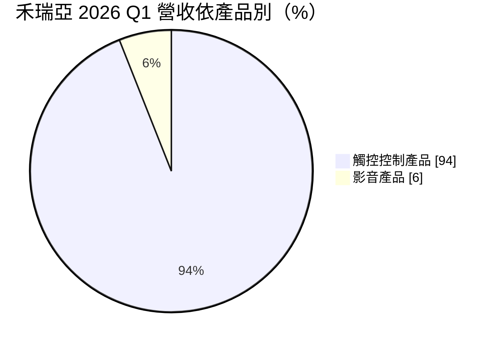
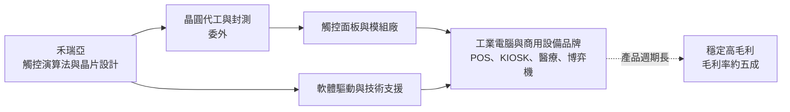
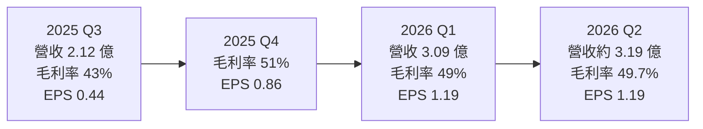
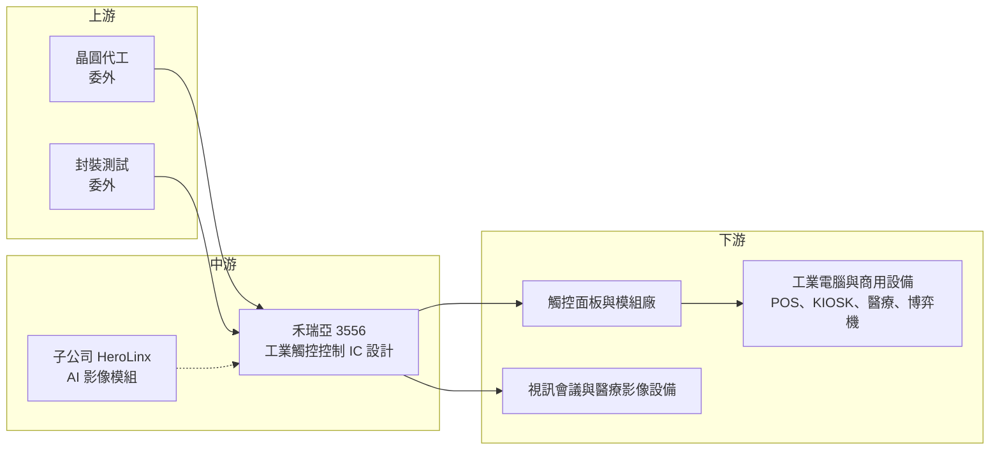

# 3556 禾瑞亞

> 上櫃｜[[產業索引-半導體業|半導體業]]｜上市（櫃）日期 2008/04/15

# 第一章：企業模式與商業藍圖

> [!info] 撰寫說明
> 本文由 Claude 依公開資料整理，架構比照 [[2330台積電]] 的四章研究，資料截至 2026-10-07。財務數字來源：富果研究法說會整理（2025 年 11 月、2026 年 5 月）、nStock 公司簡介、Yahoo 股市各季 EPS 與月營收、科技新報月營收報導、櫃買中心開放資料（本筆記 _data 快照：2026 上半年綜合損益、資產負債、本益比）；產業描述為整理性內容，尚未逐條比對原始文件。#待校對

在評估單一個股的長期投資價值時，首要步驟是拆解企業的底層獲利邏輯。本章針對禾瑞亞科技（股票代號：3556，以下簡稱禾瑞亞）的商業模式進行定性分析，說明一家年營收不到 10 億元的觸控 IC 設計公司，為何能長期維持接近五成的毛利率。

## 一、核心定位：工業用觸控控制晶片的利基型設計公司

禾瑞亞成立於 2002 年，2008 年在櫃買中心掛牌，實收資本額約 6.37 億元，總部位於台北內湖。公司以 eGalax 品牌的觸控控制器聞名，屬於 [[Fabless]] IC 設計公司。

禾瑞亞和手機觸控 IC 公司最大的不同在於市場選擇：

* **避開消費性大量市場：** 手機與筆電觸控 IC 出貨量大，但價格競爭激烈、產品週期短。禾瑞亞把重心放在 [[工業電腦]]、POS 收銀機、自助服務機台、醫療與博弈機台等工業與商用觸控。
* **多種觸控技術並存：** 工業市場同時存在電阻式、表面電容式與[[投射電容式觸控]]，禾瑞亞三種控制器都有，能服務不同年代、不同規格的設備。

## 二、終端應用／產品板塊：觸控控制器占九成以上

依 2026 年 5 月法說，2026 年第一季營收結構如下：

* **觸控控制產品：** 電阻式、表面電容式與投射電容式觸控控制器，投射電容式在工控應用中占主導。2025 年第三季時觸控產品占營收 97%。
* **影音產品：** USB 影像控制晶片，用於視訊會議、醫療影像與工業應用。
* **研發中專案：** 子公司 HeroLinx 開發 AI 影像處理模組，最快 2027 年推出，方向是 [[Edge AI]] 與視覺語言模型應用。

## 三、資本轉化邏輯（營運模式）：少量多樣、高毛利的工控 IC

* **[[少量多樣]]：** 工控設備的出貨量不大，但機種多、規格分散，每一款設備都需要觸控控制器搭配驅動程式與調校。這類市場不吸引大型 IC 公司投入，讓小型公司有生存空間。
* **軟體與服務是附加價值：** 工業設備使用多種作業系統與舊型介面，禾瑞亞提供跨平台驅動程式與技術支援，客戶換供應商需要重新驗證整機。
* **輕資產與高現金：** 2026 年第一季底現金 7.80 億元，比 2025 年第四季增加 0.91 億元；存貨持續去化，減少 0.51 億元。

## 四、企業長期藍圖：新一代觸控 IC 與 AI 影像模組

* **新一代觸控 IC：** 依 2026 年 5 月法說，新一代觸控 IC 預計 2026 年第三至第四季推出，2027 年上半年量產，是維持產品競爭力的主要計畫。
* **AI 影像模組：** 子公司開發的 AI 影像處理模組最快 2027 年推出，試圖把影音產品線從 USB 影像晶片延伸到邊緣 AI 視覺應用。
* **價格策略：** 2026 年在面板驅動 IC 普遍漲價的環境下，公司表示未宣布漲價，以維持客戶關係為優先。

# 第二章：護城河深度與競爭優勢

在長期價值投資中，「護城河」指企業抵禦競爭、維持超額利潤的保護機制。本章分析禾瑞亞的護城河構成、主要競爭對手，以及這些優勢能否長期維持約五成的毛利率。

## 一、護城河的核心組成要素

禾瑞亞的護城河屬於「窄而深」，市場小但不易被取代：

* **1. 工控客戶的轉換成本：** 工業設備的生命週期通常長達 5 至 10 年，觸控控制器一旦設計進整機，更換需要重新驗證硬體與軟體，客戶很少因小幅價差轉單。
* **2. 多技術、多平台的支援能力：** 同時支援電阻式、表面電容式與投射電容式，並提供跨作業系統的驅動程式。對工業客戶來說，一家供應商就能解決多種機型的需求。
* **3. 品牌累積：** eGalax 觸控控制器在工控與商用觸控市場長期使用，累積的設計案例與相容性資料是新進者難以快速複製的。

## 二、全球主要競爭對手格局

| 對手 | 定位 | 對禾瑞亞的威脅 |
|---|---|---|
| Microchip | 美國 MCU 大廠，提供工業觸控控制器 | 產品線完整、可與 MCU 綁售 |
| [[2458義隆]] | 台灣觸控與觸控板 IC 大廠 | 以筆電觸控為主，部分產品可延伸到工控 |
| 奕力 | 台灣觸控與顯示驅動 IC 公司 | 在中大尺寸觸控有布局 |
| [[3545敦泰]] | 手機與平板觸控 IC 廠 | 主要在消費性市場，工控重疊較少 |
| 中國觸控 IC 廠 | 匯頂等 | 以價格切入中低階工控與商用觸控 |

## 三、優勢轉化：哪些市場守得住、哪些守不住

* **守得住：** 需要長期供貨與驅動程式支援的工業電腦、醫療與博弈設備。這些客戶重視穩定與相容性，價格敏感度低，是禾瑞亞毛利率能維持在 45% 至 50% 的原因。
* **守不住：** 規格標準化、出貨量大的商用觸控（例如低階自助機台），中國觸控 IC 廠以價格切入時，禾瑞亞較難以價格回應。
* **觀察重點：** 2026 年 1 至 9 月營收 9.45 億元，已接近 2025 年全年的 9.67 億元。觀察重點包括：營收成長是補庫存還是終端需求回升、新一代觸控 IC 能否如期在 2027 年量產、毛利率能否維持在公司目標的 50% 左右。

# 第三章：財務體質與盈利規模

資料日期：2026-10-07。數字取自富果研究法說整理、Yahoo 股市、nStock 與櫃買中心開放資料快照，表格是撰寫當時的快照；最新月營收、毛利率、累計 EPS 由自動排程寫在本筆記的屬性欄位（月營收、毛利率、累計EPS 等）。#待校對

財務報表是檢驗護城河是否真實存在的最終標準。本章用三率、ROE、現金流與資本報酬，檢視禾瑞亞在工控景氣循環中的獲利品質。

## 一、獲利能力的基石：三率

| 項目 | 2025 全年 | 2025 Q3 | 2025 Q4 | 2026 Q1 | 2026 Q2 | 2026 上半年 |
|---|---|---|---|---|---|---|
| 營收（新台幣） | 9.67 億 | 2.12 億 | 未查得 | 3.09 億 | 3.19 億（推算） | 6.28 億 |
| [[毛利率]] | 未查得 | 43% | 51% | 49% | 49.7% | 49.5% |
| [[營業利益率]] | 未查得 | 未查得 | 未查得 | 未查得 | 18.3% | 17.5% |
| EPS（元） | 2.14 | 0.44 | 0.86 | 1.19 | 1.19 | 2.38 |

* **毛利率：** 長期在 45% 至 50% 之間，2025 年第三季因提列約 200 萬元存貨跌價而降到 43%，屬一次性影響。公司目標毛利率約 50%。
* **營業利益率：** 2026 年上半年營業利益 1.10 億元，營業利益率 17.5%。研發與管理費用相對固定，營收回升時[[營運槓桿]]明顯，2026 年上半年 EPS 已超過 2025 年全年。
* **[[業外收益]]：** 上半年業外收入約 0.67 億元，占稅前淨利三成以上，主要可能來自利息與匯兌（推估）。
* **長期趨勢：** 2024 年 EPS 2.28 元、2025 年 2.14 元，2026 年上半年 2.38 元，獲利回升主要來自工控客戶庫存去化結束後的補貨需求。

## 二、[[ROE]]：資本效率

依櫃買中心資料，2026 年第二季底歸屬母公司權益約 12.07 億元，上半年歸屬母公司淨利 1.51 億元，年化 ROE 約 25%（推估）；2025 年以 EPS 2.14 元估算，ROE 約在 11% 至 12% 之間（推估）。總負債 4.69 億元、總資產 17.18 億元，負債比約 27%，沒有明顯財務槓桿。股價淨值比約 3.39 倍。

## 三、資本支出與自由現金流

* **[[CapEx]]：** Fabless 模式的資本支出以研發設備與光罩為主，金額不大，具體數字未查得。
* **[[自由現金流]]：** 2026 年第一季現金增加 0.91 億元、存貨減少 0.51 億元，營運現金流良好；應收帳款增加 0.40 億元，反映營收成長。
* **股利：** 2025 年度現金股利 1.95 元，以 EPS 2.14 元計算[[配發率]]約 91%；依 nStock 整理，近五年平均現金股利 2.93 元，屬高配息政策。

## 四、[[ROIC]] 與 [[WACC]]：價值創造利差

禾瑞亞投入資本小、毛利率高，在獲利正常年度 ROIC 應高於資金成本（推估，具體數值未查得）。高現金部位會拉低帳面 ROE，但扣除現金後的營運資本報酬率更高。利差的關鍵是新產品能否延續高毛利，以及工控需求是否穩定。

# 第四章：總體風險與地緣政治

任何企業都無法脫離宏觀環境獨立存在。本章分析禾瑞亞未來必須面對的地緣政治、產業週期與營運風險。

## 一、地緣政治

* **美國關稅與 232 調查：** 2025 年 11 月法說，公司把美台關稅談判與美國 232 條款調查列為影響客戶下單的主要變數。工業電腦與商用設備若被課徵關稅，終端需求可能受影響。
* **中國供應鏈：** 觸控面板與模組廠多在中國，若兩岸或美中關係惡化，客戶供應鏈調整會影響出貨。

## 二、產業週期與市場結構

* **工控庫存循環：** 2024 至 2025 年工控產業庫存去化，禾瑞亞營收持平；2026 年進入回補，營收大幅成長。若補庫存結束，營收可能回落，屬典型[[長鞭效應]]。
* **市場規模有限：** 工控觸控是利基市場，總需求成長有限，營收要大幅擴張需要新產品或新應用。

## 三、營運環境的隱性風險

* **晶圓與封測成本上漲：** 2026 年面板驅動 IC 普遍漲價，成熟製程成本上升，禾瑞亞選擇暫不漲價，若成本持續上升，毛利率可能受壓。
* **新產品時程：** 新一代觸控 IC 若延後量產，產品競爭力可能落後同業。
* **匯率：** 營收以外幣計價為主，新台幣升值會影響毛利率與業外收益。

## 四、科技或法規演進

* **觸控技術整合：** 面板廠把觸控整合進面板（[[In-cell]]）或由驅動 IC 整合觸控（[[TDDI]]）的趨勢若擴散到工控面板，獨立觸控控制器的需求會被侵蝕。
* **AI 影像新業務：** AI 影像模組是全新領域，需要演算法、軟體與系統能力，投入成效仍有不確定性。

# 專有名詞解析

## 半導體

- **[[投射電容式觸控]]**：以電極陣列偵測手指造成的電容變化，可支援多點觸控，是目前智慧手機與工控面板的主流觸控技術。
- **[[電容式觸控]]**：利用人體導電改變電容來偵測觸控位置的技術，包含表面電容式與投射電容式。
- **[[Edge AI]]**：在終端裝置上直接執行 AI 運算，而不把資料傳回雲端，可降低延遲與頻寬需求。
- **[[TDDI]]**：觸控與顯示驅動整合晶片，把觸控控制與面板驅動放在同一顆 IC，降低成本與模組厚度。
- **[[Fabless]]**：只做晶片設計、不擁有晶圓廠的 IC 設計公司，製造委託晶圓代工廠。

## 金融

- **[[存貨跌價損失]]**：存貨的市價低於帳面成本時須提列的損失，會直接壓低毛利率。
- **[[營運槓桿]]**：費用固定比例高時，營收小幅變動會造成獲利大幅變動的現象。
- **[[配發率]]**：現金股利占每股盈餘的比例，用來衡量公司把多少獲利發給股東。
- **[[業外收益]]**：本業以外的收入，例如利息、匯兌利益、投資收益，不代表本業競爭力。
- **[[長鞭效應]]**：終端需求的小幅變動，沿供應鏈往上游傳遞時被逐級放大，造成上游庫存與訂單劇烈波動。

## 產業

- **[[工業電腦]]**：用於工廠、醫療、交通、零售等場域的電腦，強調耐用、長期供貨與客製化。
- **[[觸控面板]]**：在顯示器上加裝觸控感應層的面板，由觸控控制 IC 判讀觸控位置。
- **[[少量多樣]]**：產品種類多、單一產品出貨量小的生產型態，常見於工控與醫療產品。
- **[[In-cell]]**：把觸控感應層直接做進面板內部的技術，可讓面板更薄，通常搭配 TDDI 使用。

# 核心供應鏈

## 1. 上游：晶圓代工與封測
- 晶圓代工與封裝測試皆委外，具體合作廠商未查得

## 2. 中游：禾瑞亞本身
- 觸控控制器（eGalax 品牌）與 USB 影像控制晶片
- 子公司 HeroLinx：AI 影像處理模組研發

## 3. 下游：主要應用客戶
- 工業電腦品牌：[[2395研華]] 等工控大廠為潛在客戶群（推估，未查得公司揭露的客戶名單）
- 觸控面板與模組廠、POS 與自助服務機台、醫療與博弈設備廠

## 4. 同業
- 國際：Microchip
- 台灣：[[2458義隆]]、[[3545敦泰]]、奕力

## 最新新聞
<!-- news:start -->
<!-- news:end -->

## 相關連結
- [公開資訊觀測站](https://mopsov.twse.com.tw/mops/web/t05st03?step=1&firstin=1&co_id=3556)
- [Goodinfo](https://goodinfo.tw/tw/StockDetail.asp?STOCK_ID=3556)
- [Yahoo 股市](https://tw.stock.yahoo.com/quote/3556)
- [鉅亨網新聞](https://www.cnyes.com/twstock/3556/news)
