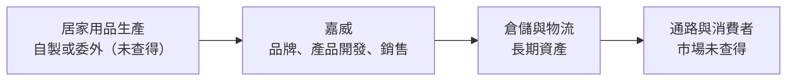
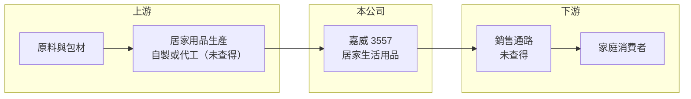

# 3557 嘉威

> 上市｜[[產業索引-居家生活|居家生活]]｜上市（櫃）日期 2008/02/27

# 第一章：企業模式與商業藍圖

> [!info] 撰寫說明
> 本文由 Claude 依公開資料整理，架構比照 [[2330台積電]] 的四章研究，資料截至 2026-10-08。財務數字來源：Goodinfo 台灣股市資訊網年度經營績效、MoneyDJ 公司基本資料（富邦證券版）、證交所開放資料（本筆記 _data 快照）、聯合報與工商時報新聞標題。公開資料有限：本次查得的來源未能清楚說明主要產品、銷售市場與營收比重，第一、二章的業務描述多為依產業別、公司名稱與財務走勢所做的推估，須人工對照年報確認。#待校對

在評估單一個股的長期投資價值時，首要步驟是拆解企業的底層獲利邏輯。本章說明嘉威（股票代號：3557）這家歸類於居家生活產業的上市公司，從財務數字看出的商業模式輪廓，以及它在 2019 年後經歷的業務轉變。

## 一、核心定位：業務轉換後的居家生活公司

嘉威成立於 2005 年，2008 年在證交所上市，目前公司全名為嘉威生活股份有限公司，總部位於台北大安區，在證交所的產業分類為居家生活類。依 MoneyDJ 資料，公司名稱曾經變更。

從財務數字可以看出，嘉威在 2019 年前後經歷了根本性的業務轉換：2018 年營收僅約 0.29 億元，2019 年增加到 16.9 億元，2020 年再跳升到 44.3 億元，之後五年都維持在 43 億至 57 億元之間。這種規模的躍升，通常來自新事業注入或併購，而不是原有業務的自然成長（推估）。公司實收資本額約 8.43 億元，其中私募股數約 1,232 萬股，顯示轉型過程中曾以私募引進資金。

## 二、產品板塊：居家生活用品（推估）

MoneyDJ 列示的 2025 年營收比重為單一項目占 100%，但項目名稱在本次取得的資料中無法辨識。以下依產業分類與財務特徵做定性推估：

* **居家生活用品：** 公司名稱與產業別都指向居家生活用品，推估產品以家具、家飾或家居用品為主。毛利率長期在 34% 至 40%，高於一般製造業，符合品牌或自營通路銷售的特徵。
* **需求受疫情與居家消費帶動：** 2020 年營收年增約 1.6 倍、EPS 達 10.01 元，與全球疫情期間居家用品需求暴增的時點一致，推估銷售市場與居家消費高度相關。
* **2025 年獲利驟降：** 2025 年營收從 57.2 億元降到 43.2 億元，EPS 僅 0.01 元。依新聞標題，2026 年 6 月營收年增近五成，公司對下半年展望樂觀，顯示 2025 年的衰退可能與外部環境（例如關稅或市場需求變化）有關，具體原因未查得。

## 三、資本轉化邏輯：重資產的居家用品事業

* **長期資產比重高：** 2026 年第二季總資產約 63.6 億元，其中非流動資產約 45.0 億元，占七成。一般的居家用品品牌多為輕資產，嘉威的長期資產比重偏高，推估包含廠房、倉庫或長期租約（使用權資產），需對照財報確認。
* **營業利益率的高度波動：** 營業利益率在 2020 年達 17.6%，2021 至 2024 年在 10.8% 至 12.8%，2025 年降到 3.7%。高固定資產帶來明顯的 [[營運槓桿]]，營收下滑時獲利縮水的速度遠快於營收。

## 四、企業長期藍圖：待確認

由於業務描述的公開資料有限，公司的長期策略未能在本次來源中確認。以資本配置來看，2020 至 2025 年度現金股利分別為 6.00、6.00、8.00、3.00、2.50、0.30 元，獲利好的年份配息率在 60% 至 110% 之間，2024 年度後明顯降低，推估與獲利下滑及資金需求有關。

# 第二章：護城河深度與競爭優勢

在長期價值投資中，「護城河」指企業抵禦競爭、維持超額利潤的保護機制。本章依有限的公開資料，分析嘉威可能的競爭優勢與限制。

## 一、護城河的核心組成要素

在主要產品與市場尚未確認的情況下，只能從財務數字推估嘉威的競爭特性。

* **1. 中高毛利率：** 毛利率長期維持在 34% 至 40%，即使 2025 年獲利大幅下滑，毛利率仍有 33.9%。這代表產品本身有一定的定價能力，或公司掌握了部分通路利潤。
* **2. 規模與資產：** 營收規模 43 億至 57 億元，在台灣居家生活類公司中屬於中大型，並擁有大量長期資產，可能形成倉儲或供應鏈上的規模優勢（推估）。
* **3. 景氣敏感度高：** 2025 年營業利益率大幅下滑，代表公司對外部需求或成本變化的抵抗力有限，護城河推估較淺。

## 二、主要競爭對手格局

| 對手 | 定位 | 對嘉威的威脅 |
|---|---|---|
| 國際居家用品品牌與大型零售商 | 品牌與通路規模大 | 在居家用品市場直接競爭（推估） |
| 中國與東南亞居家用品製造商 | 低價大量生產 | 壓低產品價格（推估） |
| 電商平台自有品牌 | 平台流量與數據優勢 | 搶占標準化居家用品（推估） |

## 三、優勢轉化：守得住／守不住／觀察重點

* **守得住：** 若公司確實擁有品牌與倉儲物流能力，可以在需求回升時快速恢復獲利，2026 年營收回升即是一例。
* **守不住：** 對外部需求與成本衝擊的抵抗力，2025 年獲利幾乎歸零就是例證。
* **觀察重點：** 長期可以觀察三件事：營業利益率能否回到 10% 以上；長期資產的使用效率，也就是營收除以總資產的比率；以及公司揭露的主要市場與產品結構。

# 第三章：財務體質與盈利規模

資料日期：2026-10-08。數字取自 Goodinfo 年度經營績效、MoneyDJ 與證交所開放資料快照，表格是撰寫當時的快照；最新月營收、毛利率、累計 EPS 由自動排程寫在本筆記的屬性欄位（月營收、毛利率、累計EPS 等）。#待校對

財務報表是檢驗護城河是否真實存在的最終標準。本章用多年度的三率、ROE 與資本報酬，檢視嘉威轉型後的獲利品質。

## 一、獲利能力的基石：三率

| 年度 | 營收（新台幣） | [[毛利率]] | [[營業利益率]] | EPS（元） | [[ROE]] |
|---|---|---|---|---|---|
| 2018 | 0.29 億 | -43.8% | -213% | 0.01 | 0.06% |
| 2019 | 16.9 億 | 37.9% | 8.7% | 3.25 | 26.8% |
| 2020 | 44.3 億 | 40.4% | 17.6% | 10.01 | 54.2% |
| 2021 | 53.0 億 | 35.3% | 11.8% | 7.74 | 30.1% |
| 2022 | 56.2 億 | 35.9% | 11.9% | 7.03 | 24.2% |
| 2023 | 47.5 億 | 38.6% | 10.8% | 4.81 | 16.2% |
| 2024 | 57.2 億 | 37.1% | 12.8% | 6.84 | 21.5% |
| 2025 | 43.2 億 | 33.9% | 3.7% | 0.01 | 0.03% |

* **[[毛利率]]：** 2019 年後在 34% 至 40% 之間，相對穩定，2025 年降到 33.9% 為最低。
* **[[營業利益率]]：** 2020 年達到 17.6% 的高峰，2021 至 2024 年在 11% 至 13%，2025 年驟降到 3.7%，顯示費用與固定成本在營收下滑時無法同步縮減。
* **淨利與業外：** 2025 年營業利益約 1.6 億元，淨利卻只有約 0.01 億元，代表業外損失或財務成本吃掉了大部分本業獲利（推估），原因未查得。
* **長期指標：** 2020 至 2025 年營收年複合成長率約 -0.5%（推算），2020 年後營收規模大致持平。2021 至 2025 年五年平均 ROE 約 18.4%（推算），但 2025 年幾乎為零，波動很大。

## 二、[[ROE]]：資本效率

ROE 從 2020 年的 54.2% 一路下滑到 2025 年的接近零。依 2026 年第二季資產負債表，總資產約 63.6 億元、總負債約 38.1 億元、股東權益約 25.5 億元，負債比約 60%，其中非流動負債約 14.8 億元。高負債與高長期資產比重，讓 ROE 在景氣好時放大、景氣差時快速縮水。

## 三、資本支出與自由現金流

* **[[CapEx]]：** 非流動資產占總資產七成，推估過去幾年有大量的長期資產投入，具體金額與項目未查得。
* **[[自由現金流]]：** 2020 至 2024 年獲利豐厚、每年配發 2.5 至 8 元現金股利，推估當時自由現金流為正；2025 年獲利驟降，自由現金流狀況未查得。

## 四、[[ROIC]] 與 [[WACC]]：價值創造利差

有息負債金額未查得，以股東權益與非流動負債兩種口徑估算。以 2025 年為例，營業利益約 1.60 億元（營收 43.2 億元 × 營業利益率 3.7%），扣除 20% 稅率後約 1.28 億元。以股東權益約 25.5 億元計算，ROIC 約 5.0%；若加計非流動負債 14.8 億元，ROIC 約 3.2%（皆為推算）。2024 年稅後營業利益約 5.86 億元，股東權益約 25.6 億元（淨利 5.5 億元 ÷ ROE 21.5% 回推），ROIC 約 23%（推算）。

WACC 以 CAPM 推估：台灣 10 年期公債約 1.5% 至 2%，市場風險溢酬約 6%，β 未查得，以居家消費股與景氣敏感度較高的 0.8 至 1.0 假設，股東權益成本約 6.3% 至 8%。考量負債比約六成、負債成本假設約 3%（稅後 2.4%），WACC 約 4.5% 至 6%（推算）。

2020 至 2024 年 ROIC 明顯高於 WACC，嘉威在那段期間創造了可觀的價值；2025 年 ROIC 降到 WACC 附近或以下。2026 年營收回升後，若營業利益率能回到 10% 以上，利差就有機會恢復。

# 第四章：總體風險與地緣政治

任何企業都無法脫離宏觀環境獨立存在。本章分析嘉威長期必須面對的需求、成本與財務風險。

## 一、地緣政治與貿易

* **關稅與貿易政策：** 居家用品多為跨國生產與銷售，主要市場的關稅政策變化，會直接影響成本與售價（推估，主要市場未查得）。
* **生產地風險：** 若產品來自中國或東南亞，生產地的政策與匯率變化會影響供應穩定。

## 二、產業週期與市場結構

* **居家消費循環：** 2020 年疫情帶來的居家用品需求屬於一次性高峰，之後需求回落，是嘉威獲利從高峰下滑的背景。
* **房市與利率：** 家具與家居用品需求與房屋交易、搬遷與裝修相關，利率上升時需求會放緩。

## 三、營運環境的隱性風險

* **營運槓桿與財務槓桿：** 長期資產比重高、負債比約六成，營收下滑時，固定成本與利息會快速侵蝕獲利，2025 年就是例子。
* **業外損失：** 2025 年本業仍有營業利益，但淨利接近零，業外項目的波動需要持續追蹤。
* **資訊揭露：** 本次查得的公開資料對主要產品與市場描述有限，投資人應以年報與法說會資料為準。

## 四、科技或法規演進

* **通路數位化：** 居家用品的銷售持續往電商移動，品牌需要投資數位行銷與物流。
* **環保與產品安全：** 家具與家居用品的材料安全、阻燃與環保規範趨嚴，會增加產品認證成本。

# 專有名詞解析

## 金融

- **[[營運槓桿]]**：固定成本占比高的企業，營收變動時營業利益變動幅度更大的現象。
- **[[ROIC]]**：投入資本報酬率，稅後營業利益除以投入資本，衡量本業運用資金創造報酬的能力。
- **[[WACC]]**：加權平均資金成本，股東與債權人要求報酬率的加權平均，是 ROIC 要超過的門檻。

# 核心供應鏈

## 1. 上游：生產與原料
- 生產方式與供應商未查得

## 2. 本公司：嘉威
- 嘉威生活股份有限公司，居家生活類上市公司，總部台北

## 3. 下游：通路與客戶
- 銷售市場與通路未查得，須對照年報確認

## 4. 同業
- 國際居家用品品牌與零售商、電商自有品牌（推估）

## 最新新聞
<!-- news:start -->
<!-- news:end -->

## 相關連結
- [公開資訊觀測站](https://mopsov.twse.com.tw/mops/web/t05st03?step=1&firstin=1&co_id=3557)
- [Goodinfo](https://goodinfo.tw/tw/StockDetail.asp?STOCK_ID=3557)
- [Yahoo 股市](https://tw.stock.yahoo.com/quote/3557)
- [鉅亨網新聞](https://www.cnyes.com/twstock/3557/news)
