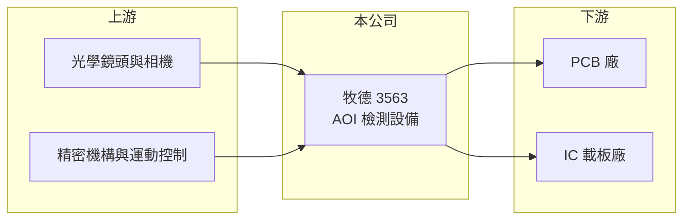

# 3563 牧德

> 上市｜[[產業索引-光電業|光電業]]｜上市（櫃）日期 2019/04/02

# 第一章：企業模式與商業藍圖

> [!info] 撰寫說明
> 精簡版，由 Claude 依公開資料整理，架構比照 [[2330台積電]]，資料截至 2026-10-07。來源：nstock.tw 牧德公司概況、科技新報月營收快訊。營收比重未查到。#待校對

牧德是台灣的光學檢測設備廠，主要替電路板產業提供自動化檢測機台。

- **核心業務：** 牧德科技成立於 1998 年，總部在新竹科學園區，從事 [[AOI]] 光學檢測設備與儀器的製造、維修與銷售。
- **營收結構：** 本次未查到產品別比重；主力為 [[PCB]] 與 [[ABF載板]]的外觀與線路檢測設備（推估）。
- **營運據點：** 總部與主要生產據點位於新竹科學園區，其他海外服務據點本次未查到。
- **長期方向：** AI 伺服器帶動高層數板與高階載板擴產，線路更細、檢測要求更高，是牧德設備需求的主要成長來源（推估）。

# 第二章：護城河深度與競爭優勢

牧德的護城河來自影像演算法與客戶製程的長期磨合，毛利率長期維持在高檔。

- **競爭優勢：** 2026 年第二季[[毛利率]]約 60%，顯示產品具備技術門檻與議價能力；設備導入客戶產線後，換供應商需要重新驗證，轉換成本高。
- **主要對手：** 國際檢測設備大廠如 [[KLAC科磊]]（旗下 Orbotech），以及中國本土 AOI 設備業者（推估）。
- **觀察重點：** 載板與高階 PCB 廠的擴產時程，以及 9 月創新高的月營收能否延續。

# 第三章：財務體質與盈利規模

資料日期：2026-10-07，以下數字是撰寫當時的快照；最新月營收、毛利率、累計 EPS 由自動排程寫在本筆記的屬性欄位（月營收、毛利率、累計EPS 等）。#待校對

牧德 2026 年營收創新高，獲利率在設備業中屬於高水準。

- **營收規模：** 2025 年全年營收 31.92 億元、年增 108.3%；2026 年 1 至 9 月累計 30.05 億元，9 月單月 3.73 億元、年增 63.2%，創歷史新高。
- **獲利：** 2026 年第二季 EPS 5.19 元，上半年累計 9.8 元；第二季毛利率 60.41%、淨利率 32.11%。
- **財務特色：** 資本額約 6.4 億元，股本小、獲利高；2025 年現金股利 13 元，近五年平均約 9.6 元。

# 第四章：總體風險與地緣政治

牧德的風險主要來自下游擴產週期與客戶集中。

- **產業週期：** 設備需求取決於 PCB 與載板廠的資本支出，擴產高峰過後訂單可能明顯下滑。
- **營運風險：** 營收高成長後基期墊高，若 AI 相關擴產放緩，年增率將面臨壓力；客戶集中度本次未查到。
- **其他風險：** 中國客戶比重若高，將受兩岸關係與出口管制影響；外銷以外幣計價，有匯率風險。

# 專有名詞解析

## 半導體

- **[[AOI]]**：自動光學檢測，以攝影機與影像演算法自動檢查外觀瑕疵。
- **[[ABF載板]]**：以味之素增層膜（ABF）製作的高階 IC 載板，線路細、層數多，用於 CPU、GPU 與 AI 加速器。

## 產業

- **[[PCB]]**：印刷電路板，承載並連接電子零件的基板，AI伺服器使用層數更多的高階板。

# 核心供應鏈

- 上游：工業相機、光學鏡頭、運動控制與精密機構零件供應商
- 下游／客戶：PCB 與 IC 載板廠，例如 [[3037欣興]]、[[4958臻鼎-KY]]（推估）
- 同業：[[KLAC科磊]]（Orbotech）、中國 AOI 設備業者

## 最新新聞
<!-- news:start -->
<!-- news:end -->

## 相關連結
- [公開資訊觀測站](https://mopsov.twse.com.tw/mops/web/t05st03?step=1&firstin=1&co_id=3563)
- [Goodinfo](https://goodinfo.tw/tw/StockDetail.asp?STOCK_ID=3563)
- [Yahoo 股市](https://tw.stock.yahoo.com/quote/3563)
- [鉅亨網新聞](https://www.cnyes.com/twstock/3563/news)
