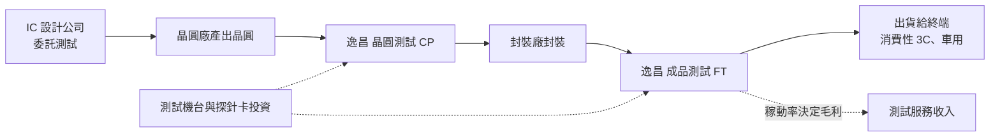
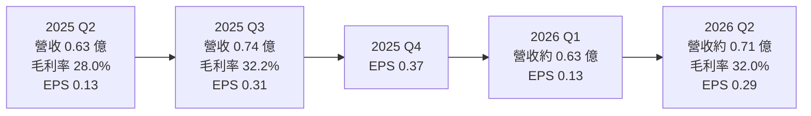
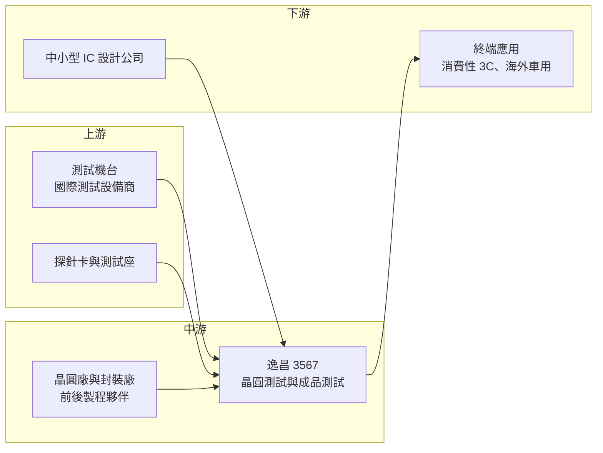

# 3567 逸昌

> 上櫃｜[[產業索引-半導體業|半導體業]]｜上市（櫃）日期 2010/11/22

# 第一章：企業模式與商業藍圖

> [!info] 撰寫說明
> 本文由 Claude 依公開資料整理，架構比照 [[2330台積電]] 的四章研究，資料截至 2026-10-07。財務數字來源：富果研究法說會整理（2025 年 11 月）、nStock 公司簡介、HiStock 月營收、Yahoo 股市各季 EPS、櫃買中心開放資料（本筆記 _data 快照：2026 上半年綜合損益、資產負債、月營收、本益比）；產業描述為整理性內容，尚未逐條比對原始文件。#待校對

在評估單一個股的長期投資價值時，首要步驟是拆解企業的底層獲利邏輯。本章針對逸昌科技（股票代號：3567，以下簡稱逸昌）的商業模式進行定性分析，說明一家年營收不到 3 億元的小型測試廠，如何在京元電子、欣銓等大廠主導的測試市場中找到生存空間。

## 一、核心定位：小型專業半導體測試代工廠

逸昌成立於 2000 年，2010 年在櫃買中心掛牌，總部位於新竹縣竹北，實收資本額約 3.40 億元。依 nStock 公司簡介，主要業務為電子零組件的測試加工；依 2025 年 11 月法說，公司提供兩類半導體測試服務：

* **晶圓測試（[[CP]]）：** 晶圓切割前，用[[探針卡]]接觸每顆晶粒，篩選出不良品，避免後段封裝浪費成本。
* **成品測試（[[FT]]）：** 晶片封裝完成後的最終功能與電性測試，確認出貨品質。

逸昌在產業中的定位是「小量、彈性」：大型測試廠服務大客戶的大量訂單，逸昌則承接中小型 IC 設計公司或特定產品的測試需求，以彈性排程與客製化服務爭取客戶。

## 二、終端應用／產品板塊：消費性 3C 與海外車用

公司未公布晶圓測試與成品測試的精確營收比重，本文不畫圓餅圖。依 2025 年 11 月法說：

* **消費性 3C：** 終端應用以消費性電子為主，與手機、PC 周邊與消費性產品的景氣高度連動。
* **海外汽車市場：** 部分測試訂單的終端應用為海外車用產品，驗證期較長、訂單較穩定。
* **晶圓測試：** 2025 年受客戶庫存偏高影響，訂單低迷。
* **成品測試：** 與景氣連動性高，2025 年受消費需求疲軟影響；公司把擴產重點放在成品測試。

## 三、資本轉化邏輯（營運模式）：設備投資換取測試時數

* **以機台時數計價：** 測試廠的收入大致取決於機台運轉時數與每小時費率，成本以設備折舊與人力為主，屬於[[資本密集度]]中等的服務業。
* **稼動率是關鍵：** 依 2025 年 11 月法說，設備[[稼動率]]約五到六成。稼動率提高時，增加的營收大部分轉為利潤；稼動率偏低時，折舊與人力成本會壓縮毛利率。
* **擴產節奏保守：** 2025 年資本支出約 0.5 億元，2026 年計畫再投入約 0.5 億元，兩年合計約 1 億元，主要用於擴充成品測試產能。

## 四、企業長期藍圖：導入新客戶與新產品

* **新客戶與新產品：** 公司表示正導入數家新客戶與新產品，若市場反應良好可帶動成長，但對 2026 年整體營運態度保守。
* **測試平台更新：** 部分客戶為降低成本已轉移到較新的測試平台生產，逸昌需要跟進投資新平台，才能留住客戶。
* **高配息維持股東回饋：** 依 nStock 整理，近五年平均現金股利約 2.04 元，公司長期以高配息回饋股東。

# 第二章：護城河深度與競爭優勢

在長期價值投資中，「護城河」指企業抵禦競爭、維持超額利潤的保護機制。本章分析逸昌在半導體測試市場的護城河構成、主要競爭對手，以及小型測試廠的優勢能守住多少。

## 一、護城河的核心組成要素

逸昌規模小，護城河屬於「窄護城河」，主要來自以下三點：

* **1. 測試程式與客戶綁定：** 每一顆晶片的測試程式需要依客戶產品開發與調整，測試流程經客戶驗證後，轉單需要重新開發程式與驗證，有一定轉換成本。
* **2. 服務彈性：** 小型測試廠可以接受小量、急單與客製化需求，對中小型 IC 設計公司有吸引力。
* **3. 財務穩健：** 2026 年第二季底總負債僅 0.73 億元、總資產 6.30 億元，[[負債比]]約 12%，可以在景氣低迷時維持營運，不必被迫降價求現。

## 二、全球主要競爭對手格局

| 對手 | 定位 | 對逸昌的威脅 |
|---|---|---|
| [[2449京元電子]] | 台灣最大專業測試廠，AI 與高階測試領先 | 規模、設備與客戶基礎遠大於逸昌 |
| [[3264欣銓]] | 晶圓測試為主，車用與通訊客戶多 | 在晶圓測試直接競爭 |
| [[6257矽格]] | 成品測試與封裝，客戶以 IC 設計公司為主 | 在中小型 IC 設計客戶重疊 |
| [[2441超豐]] | 封裝加測試一條龍 | 可提供封測整合服務 |
| 中國測試廠 | 受國產化政策支持 | 以價格搶中國客戶訂單 |

## 三、優勢轉化：哪些市場守得住、哪些守不住

* **守得住：** 已長期合作、測試程式已驗證的中小型客戶，以及需要彈性排程的小量訂單。
* **守不住：** 需要大量高階測試機台的大客戶訂單，例如 AI 晶片與高階處理器測試，逸昌在設備規模上難以競爭。依 2025 年 11 月法說，2021 至 2022 年後段供應鏈過度擴充造成產能過剩，也讓新客戶開發更困難。
* **觀察重點：** 2026 年 1 至 8 月營收 1.86 億元，年增 4.2%，成長溫和。觀察重點包括：稼動率能否從五到六成往上提升、新客戶導入進度、以及成品測試擴產後能否帶來營收成長。

# 第三章：財務體質與盈利規模

資料日期：2026-10-07。數字取自富果研究法說整理、HiStock、Yahoo 股市、nStock 與櫃買中心開放資料快照，表格是撰寫當時的快照；最新月營收、毛利率、累計 EPS 由自動排程寫在本筆記的屬性欄位（月營收、毛利率、累計EPS 等）。#待校對

財務報表是檢驗護城河是否真實存在的最終標準。本章用三率、ROE、現金流與資本報酬，檢視逸昌在測試景氣循環中的獲利品質。

## 一、獲利能力的基石：三率

| 項目 | 2025 全年 | 2025 Q2 | 2025 Q3 | 2026 Q1 | 2026 Q2 | 2026 上半年 |
|---|---|---|---|---|---|---|
| 營收（新台幣） | 2.81 億 | 0.63 億 | 0.74 億 | 0.63 億（推算） | 0.71 億（推算） | 1.33 億 |
| [[毛利率]] | 前三季 30.2% | 28.0% | 32.2% | 約 25%（推算） | 32.0% | 28.8% |
| [[營業利益率]] | 未查得 | 未查得 | 未查得 | 未查得 | 15.4% | 11.7% |
| EPS（元） | 1.06 | 0.13 | 0.31 | 0.13 | 0.29 | 0.42 |

註：2026 Q1 與 Q2 營收由月營收加總推算；2026 Q1 毛利率由上半年毛利減第二季毛利推算。

* **毛利率：** 測試廠的毛利率主要由稼動率決定。2025 年第二季營收 0.63 億元時毛利率 28.0%，第三季營收升到 0.74 億元、毛利率就升到 32.2%，呈現明顯的[[營運槓桿]]。
* **營業利益率：** 2026 年上半年營業利益 0.16 億元，營業利益率 11.7%；第二季回升到 15.4%。
* **獲利趨勢：** 2024 年 EPS 1.86 元、2025 年降到 1.06 元，2025 年前三季稅後淨利年減 52%。2026 年上半年 EPS 0.42 元，仍低於 2024 年同期的 1.00 元。

## 二、[[ROE]]：資本效率

依櫃買中心資料，2026 年第二季底股東權益約 5.56 億元，上半年稅後淨利 0.14 億元，年化 ROE 約 5%（推估）；2025 年以 EPS 1.06 元估算，ROE 約 6% 至 7%（推估）；2024 年獲利較好時約在 10% 以上（推估）。逸昌幾乎沒有負債，ROE 偏低主要是稼動率不足、資產周轉率低。股價淨值比約 1.59 倍。

## 三、資本支出與自由現金流

* **[[CapEx]]：** 2025 年約 0.5 億元、2026 年計畫約 0.5 億元，主要用於成品測試產能。以年營收不到 3 億元來看，資本支出約占營收 18%，屬於測試業常見水準。
* **[[自由現金流]]：** 測試業的營業現金流包含大量折舊回補，在資本支出維持約 0.5 億元的情況下，自由現金流可支應配息（推估，具體數字未查得）。
* **股利：** 2024 年度配息 1.8 元，2025 年度配息 1.0 元，以 EPS 1.06 元計算[[配發率]]約 94%，殖利率約 3.8%。

## 四、[[ROIC]] 與 [[WACC]]：價值創造利差

逸昌的投入資本以測試設備為主，稼動率只有五到六成時，ROIC 約與 ROE 相近，落在個位數，可能低於一般股權資金成本（推估，具體數值未查得）。要讓利差擴大，需要稼動率提升到七成以上，或導入毛利較高的車用與新產品測試。

# 第四章：總體風險與地緣政治

任何企業都無法脫離宏觀環境獨立存在。本章分析逸昌未來必須面對的地緣政治、產業週期與營運風險。

## 一、地緣政治

* **客戶在地化要求：** 國際客戶推動「台灣加一」或在地測試，若客戶要求在台灣以外地區測試，小型測試廠沒有海外據點，可能失去訂單。
* **美國關稅：** 美國半導體關稅若擴及消費性電子，終端需求下滑會傳導到測試訂單。

## 二、產業週期與市場結構

* **後段產能過剩：** 2021 至 2022 年後段供應鏈過度擴充，造成測試產能過剩、價格競爭激烈，至 2025 年仍影響新客戶開發。
* **消費性電子循環：** 終端以消費性 3C 為主，客戶庫存調整時晶圓測試訂單會先下滑，屬典型[[長鞭效應]]。

## 三、營運環境的隱性風險

* **客戶轉移平台：** 部分客戶為降低成本轉到較新的測試平台，若逸昌設備更新跟不上，可能流失訂單。
* **規模劣勢：** 年營收不到 3 億元，與大型測試廠相比在設備採購、客戶議價上處於劣勢。
* **人力與折舊：** 測試業需要工程與操作人力，人力成本上升與新設備折舊會壓縮毛利率。

## 四、科技或法規演進

* **高階測試門檻提高：** AI 晶片與先進封裝晶片需要更高階的測試機台與[[燒機測試]]，投資金額大，小型測試廠難以跟進。
* **車用品質規範：** 車用晶片測試要求零缺陷與完整追溯，投入品質系統的成本高，但也是小廠提高附加價值的方向。

# 專有名詞解析

## 半導體

- **[[CP]]**：晶圓測試，在晶圓切割封裝前用探針卡測試每顆晶粒的電性，篩選不良品。
- **[[FT]]**：成品測試，晶片封裝完成後的最終功能與電性測試，確認出貨品質。
- **[[探針卡]]**：晶圓測試時接觸晶粒電極的耗材，針數與精度依晶片設計客製。
- **[[燒機測試]]**：在高溫、高電壓下長時間運作晶片，提前篩出早期失效產品，AI 與車用晶片常要求全數執行。
- **[[封裝測試]]**：晶圓製造完成後的封裝與測試流程，屬半導體後段製程。

## 金融

- **[[資本密集度]]**：資本支出或固定資產占營收的比例，數值越高代表營運越依賴設備投資。
- **[[營運槓桿]]**：費用固定比例高時，營收小幅變動會造成獲利大幅變動的現象。
- **[[配發率]]**：現金股利占每股盈餘的比例，用來衡量公司把多少獲利發給股東。
- **[[負債比]]**：總負債除以總資產，衡量公司財務槓桿與償債壓力。
- **[[自由現金流]]**：營業活動現金流減去資本支出，代表企業可自由用於配息、還債或併購的現金。
- **[[長鞭效應]]**：終端需求的小幅變動，沿供應鏈往上游傳遞時被逐級放大，造成上游庫存與訂單劇烈波動。

## 產業

- **[[稼動率]]**：設備實際運轉時間占可運轉時間的比例，是測試與製造業毛利率的關鍵指標。

# 核心供應鏈

## 1. 上游：測試設備與耗材
- 測試機台：愛德萬（Advantest）、泰瑞達（Teradyne）等國際測試設備商（推估，公司未揭露機台品牌）
- 探針卡與測試座：[[6223旺矽]]、[[6515穎崴]] 等（推估）

## 2. 中游：逸昌本身與前後製程夥伴
- 晶圓測試與成品測試服務，屬半導體[[封裝測試]]後段
- 晶圓來自客戶委託的晶圓代工廠，封裝由客戶指定的封裝廠完成

## 3. 下游：客戶
- 中小型 IC 設計公司（具體名單未查得）
- 終端應用：消費性 3C、海外車用

## 4. 同業
- [[2449京元電子]]、[[3264欣銓]]、[[6257矽格]]、[[2441超豐]]

## 最新新聞
<!-- news:start -->
<!-- news:end -->

## 相關連結
- [公開資訊觀測站](https://mopsov.twse.com.tw/mops/web/t05st03?step=1&firstin=1&co_id=3567)
- [Goodinfo](https://goodinfo.tw/tw/StockDetail.asp?STOCK_ID=3567)
- [Yahoo 股市](https://tw.stock.yahoo.com/quote/3567)
- [鉅亨網新聞](https://www.cnyes.com/twstock/3567/news)
