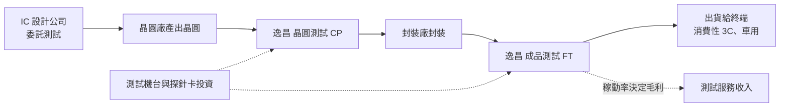
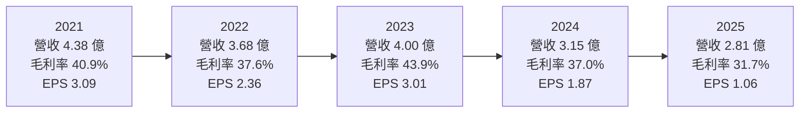
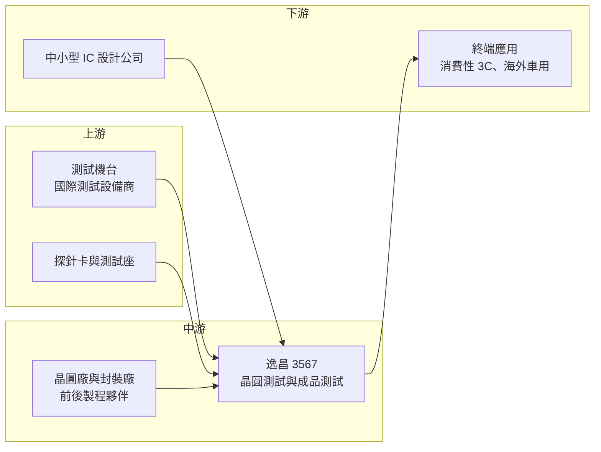

# 3567 逸昌

> 上櫃｜[[產業索引-半導體業|半導體業]]｜上市（櫃）日期 2010/11/22

# 第一章：企業模式與商業藍圖

> [!info] 撰寫說明
> 本文由 Claude 依公開資料整理，架構比照 [[2330台積電]] 的四章研究，資料截至 2026-10-08。財務數字來源：Goodinfo 台灣股市資訊網年度經營績效與股利政策、富果研究法說會整理（2025 年 11 月）、nStock 公司簡介、HiStock 月營收、Yahoo 股市各季 EPS、櫃買中心開放資料（本筆記 _data 快照）；產業描述為整理性內容，尚未逐條比對原始文件。#待校對

在評估單一個股的長期投資價值時，首要步驟是拆解企業的底層獲利邏輯。本章針對逸昌科技（股票代號：3567，以下簡稱逸昌）的商業模式進行定性分析，說明一家年營收約 3 至 4 億元的小型測試廠，如何在京元電子、欣銓等大廠主導的半導體測試市場中維持獲利與高配息，以及它面對的規模限制。

## 一、核心定位：小型專業半導體測試代工廠

逸昌成立於 2000 年，2010 年在櫃買中心掛牌，總部位於新竹縣竹北，實收資本額約 3.40 億元。依 nStock 公司簡介，主要業務為電子零組件的測試加工；依 2025 年 11 月法說，公司提供兩類半導體測試服務：

* **晶圓測試（[[CP]]）：** 在晶圓切割與封裝之前，用[[探針卡]]接觸每顆晶粒，篩選出不良品。這一步的價值在於避免把壞的晶粒送去封裝，浪費後段成本。
* **成品測試（[[FT]]）：** 晶片封裝完成後的最終功能與電性測試，確認出貨品質。這是晶片交到客戶手上前的最後一道關卡。

逸昌在產業中的定位是「小量、彈性」。半導體測試是一個規模經濟明顯的行業，大型測試廠擁有數千台機台，服務大型 IC 設計公司與晶圓廠的大量訂單；逸昌則承接中小型 IC 設計公司或特定產品的測試需求，以彈性排程、客製化測試程式與在地服務爭取客戶。這種定位讓它可以避開與大廠的正面競爭，但也決定了它的營收天花板。

## 二、終端應用／產品板塊：消費性 3C 為主，車用為輔

公司未公布晶圓測試與成品測試的精確營收比重，本文不畫圓餅圖。依 2025 年 11 月法說，終端應用以消費性 3C 產品為主，另有部分訂單的終端為海外車用市場。

* **消費性 3C：** 手機周邊、PC 周邊與消費性電子產品的晶片，是逸昌最主要的訂單來源。這類產品的需求跟著消費景氣波動，客戶庫存偏高時，晶圓測試訂單會最先減少。
* **海外車用：** 部分測試訂單的終端應用為海外車用產品。車用晶片的驗證期長、品質要求高，一旦導入，訂單相對穩定，是平滑消費性波動的重要來源。
* **晶圓測試與成品測試的分工：** 晶圓測試受客戶庫存影響較大，成品測試則與終端出貨連動。公司近年把擴產重點放在成品測試，反映這塊業務的需求較穩定。

## 三、資本轉化邏輯（營運模式）：設備投資換取測試時數

測試廠的生意邏輯很直接：先投資測試機台，再把機台的運轉時間賣給客戶。收入大致等於「機台運轉時數 × 每小時費率」，成本則以設備折舊與人力為主，屬於[[資本密集度]]中等的服務業。

* **稼動率是獲利的關鍵：** 折舊與人力是固定成本，不會因為訂單減少而下降，所以設備[[稼動率]]越高，每一台機台分攤的固定成本越低，毛利率就越高。依 2025 年 11 月法說，逸昌的稼動率約五到六成，這也是 2025 年毛利率降到 31.7% 的主因。
* **擴產節奏保守：** 2025 年資本支出約 0.5 億元，2026 年計畫再投入約 0.5 億元，主要擴充成品測試產能。逸昌不會在景氣高峰大舉擴產，這讓它避開了 2021 至 2022 年後段產業過度擴充的後遺症，但也意味著成長有限。
* **財務保守：** 2026 年第二季底總負債約 0.73 億元、總資產約 6.30 億元，[[負債比]]約 12%，幾乎沒有借款。

## 四、企業長期藍圖：導入新客戶、更新測試平台

* **新客戶與新產品：** 公司表示正導入數家新客戶與新產品。對小型測試廠來說，客戶數量與產品組合決定稼動率，新客戶是突破營收停滯的主要途徑。
* **測試平台更新：** 部分客戶為降低成本已轉移到較新的測試平台生產。測試業的技術門檻在於機台與測試程式，逸昌需要持續投資新平台，才能留住既有客戶。
* **資本配置習慣：** 逸昌長期採取高配息政策。依 Goodinfo，2016 至 2025 年每年都發放現金股利（1.0 元至 2.7 元），多數年份配發率接近或超過八成，公司把大部分獲利回饋給股東，而不是用於大規模擴張。

# 第二章：護城河深度與競爭優勢

在長期價值投資中，「護城河」指企業抵禦競爭、維持超額利潤的保護機制。本章分析逸昌在半導體測試市場的護城河構成、主要競爭對手，以及小型測試廠的優勢能守住多少。

## 一、護城河的核心組成要素

逸昌規模小，護城河屬於「窄護城河」，它的優勢主要來自客戶關係與服務彈性。

* **1. 測試程式與客戶綁定：** 每一顆晶片的測試程式需要依客戶產品開發與調整，測試流程經客戶驗證後，轉單就要重新開發程式與驗證良率。對中小型客戶來說，換測試廠的時間與風險成本不低，因此合作關係通常可以維持多年。
* **2. 服務彈性：** 小型測試廠可以接受小量、急單與客製化需求，對中小型 IC 設計公司有吸引力。大型測試廠的產能多被大客戶占用，未必願意為小客戶調整排程。
* **3. 財務穩健：** 幾乎沒有負債，可以在景氣低迷時維持營運與配息，不必為了現金流被迫降價搶單。

## 二、全球主要競爭對手格局

| 對手 | 定位 | 對逸昌的威脅 |
|---|---|---|
| [[2449京元電子]] | 台灣最大專業測試廠，AI 與高階測試領先 | 規模、設備與客戶基礎遠大於逸昌 |
| [[3264欣銓]] | 晶圓測試為主，車用與通訊客戶多 | 在晶圓測試直接競爭 |
| [[6257矽格]] | 成品測試與封裝，客戶以 IC 設計公司為主 | 在中小型 IC 設計客戶重疊 |
| [[2441超豐]] | 封裝加測試一條龍 | 可提供封測整合服務 |
| 中國測試廠 | 受國產化政策支持 | 以價格搶中國客戶訂單 |

## 三、優勢轉化：守得住／守不住／觀察重點

* **守得住：** 已長期合作、測試程式已驗證的中小型客戶，以及需要彈性排程的小量訂單。這些客戶看重服務與穩定，是逸昌毛利率在多數年份能維持在 35% 至 44% 的基礎。
* **守不住：** 需要大量高階測試機台的大客戶訂單，例如 AI 晶片與高階處理器測試，逸昌在設備規模上無法競爭。依 2025 年 11 月法說，2021 至 2022 年後段供應鏈過度擴充造成產能過剩，也讓小型測試廠開發新客戶更加困難。
* **觀察重點：** 長期可以觀察三個指標：稼動率能否回到七成以上，讓毛利率回到 40% 左右；新客戶與車用訂單占比是否提高；以及營收能否擺脫 2023 年以來的下滑趨勢，回到 4 億元以上的水準。

# 第三章：財務體質與盈利規模

資料日期：2026-10-08。數字取自 Goodinfo 年度經營績效與股利政策、富果研究法說整理、Yahoo 股市與櫃買中心開放資料快照，表格是撰寫當時的快照；最新月營收、毛利率、累計 EPS 由自動排程寫在本筆記的屬性欄位（月營收、毛利率、累計EPS 等）。#待校對

財務報表是檢驗護城河是否真實存在的最終標準。本章用多年度的三率、ROE、現金流與資本報酬，檢視逸昌在測試景氣循環中的獲利品質。

## 一、獲利能力的基石：三率

| 年度 | 營收（新台幣） | [[毛利率]] | [[營業利益率]] | EPS（元） | [[ROE]] | 現金股利（元） |
|---|---|---|---|---|---|---|
| 2019 | 3.60 億 | 35.3% | 21.4% | 1.80 | 11.5% | 1.71 |
| 2020 | 3.87 億 | 39.1% | 25.9% | 2.35 | 14.7% | 2.00 |
| 2021 | 4.38 億 | 40.9% | 28.0% | 3.09 | 18.3% | 2.60 |
| 2022 | 3.68 億 | 37.6% | 24.7% | 2.36 | 13.5% | 2.10 |
| 2023 | 4.00 億 | 43.9% | 31.0% | 3.01 | 16.6% | 2.70 |
| 2024 | 3.15 億 | 37.0% | 21.8% | 1.87 | 10.3% | 1.80 |
| 2025 | 2.81 億 | 31.7% | 15.1% | 1.06 | 6.1% | 1.00 |

逸昌的財務數字呈現「高獲利率、小規模、近年下滑」的特徵。2019 至 2023 年營業利益率長期在 21% 至 31% 之間，以一家小型測試廠來說相當亮眼；但 2024 至 2025 年營收從 4 億元降到 2.81 億元，營業利益率也降到 15.1%，ROE 跌到 6.1%。

* **[[毛利率]]：** 測試廠的毛利率主要由稼動率決定。營收較高的 2021 與 2023 年毛利率都在 40% 以上，營收最低的 2025 年則降到 31.7%，清楚呈現[[營運槓桿]]：營收每少一成，毛利率就被固定的折舊與人力成本侵蝕數個百分點。
* **[[營業利益率]]：** 逸昌的營業費用很精簡，毛利與營業利益的差距長期只有 13 至 17 個百分點，這是小型測試廠能維持高營業利益率的原因。
* **長期指標：** 2016 至 2025 年營收從 4.01 億元降到 2.81 億元，年複合成長率約 -3.9%（推算）；2021 至 2025 年五年平均 ROE 約 13%（推算）。現金股利十年未中斷，2016 至 2024 年多在 1.7 元至 2.7 元之間，2025 年隨獲利下滑降到 1.0 元，配息穩定度高但金額跟著獲利調整。

## 二、[[ROE]]：資本效率

逸昌幾乎沒有負債，ROE 完全來自本業獲利。2019 至 2023 年 ROE 在 11% 至 18% 之間，代表在正常景氣下，這門小生意可以為股東創造不錯的報酬；2024 至 2025 年 ROE 降到 6% 至 10%，主因是稼動率下滑。由於公司把大部分盈餘配發出去，股東權益不會快速膨脹，這有助於 ROE 在景氣回升時重新拉高。

## 三、資本支出與自由現金流

* **[[CapEx]]：** 2025 年約 0.5 億元，2026 年計畫約 0.5 億元，約占年營收的 15% 至 18%，屬於測試業常見水準。公司的資本支出以維持與小幅擴充產能為主，沒有大規模擴廠。
* **[[自由現金流]]：** 測試業的營業現金流包含大量折舊回補，在資本支出維持穩定的情況下，自由現金流可支應高配息。從十年來每年都能配發現金股利、負債始終很低來看，自由現金流長期為正（推估，逐年數字未查得）。

## 四、[[ROIC]] 與 [[WACC]]：價值創造利差

逸昌沒有有息負債，投入資本以股東權益近似。以 2025 年為例，營業利益約 0.42 億元（營收 2.81 億元 × 營業利益率 15.1%），扣除 20% 稅率後約 0.34 億元；股東權益約 5.6 億元，ROIC 約 6.1%（推算）。以 2023 年為例，營業利益約 1.24 億元，稅後約 0.99 億元，股東權益約 6.2 億元（依淨利約 1.02 億元與 ROE 16.6% 回推），ROIC 約 16%（推算）。

WACC 以 CAPM 推估：台灣 10 年期公債約 1.5% 至 2%，市場風險溢酬約 6%，β 未查得個股數值，考量測試服務業獲利較 IC 設計穩定，採 0.9 至 1.1（假設），股東權益成本約 6.9% 至 8.6%。沒有有息負債，WACC 約 7% 至 8.5%（推算）。

比較兩者，逸昌在 2019 至 2024 年的 ROIC 大致高於資金成本，代表這門生意長期是創造價值的；但 2025 年 ROIC 已降到資金成本以下。未來能否重新創造價值，取決於稼動率能否回升，也就是新客戶與新產品的導入成效。

# 第四章：總體風險與地緣政治

任何企業都無法脫離宏觀環境獨立存在。本章分析逸昌長期必須面對的地緣政治、產業週期與營運風險。

## 一、地緣政治

* **客戶在地化要求：** 國際客戶推動「台灣加一」或在地生產與測試，若客戶要求在台灣以外地區測試，沒有海外據點的小型測試廠可能失去訂單。
* **美國關稅：** 美國半導體關稅若擴及消費性電子，終端需求下滑會傳導到測試訂單，而逸昌的終端應用以消費性 3C 為主，受影響程度較高。

## 二、產業週期與市場結構

* **後段產能過剩：** 2021 至 2022 年晶片缺貨期間，後段封測產業大幅擴產，景氣反轉後出現產能過剩與價格競爭，影響延續到 2025 年。產能過剩期間，小型廠的議價力最弱。
* **消費性電子循環：** 客戶庫存調整時，晶圓測試訂單會先下滑，屬於典型的[[長鞭效應]]，小型測試廠的稼動率會因此劇烈波動。

## 三、營運環境的隱性風險

* **規模劣勢：** 年營收約 3 億元，與動輒數百億元的大型測試廠相比，在設備採購、客戶議價與技術投資上都處於劣勢。
* **客戶轉移平台：** 部分客戶為降低成本轉到較新的測試平台，若逸昌的設備更新跟不上，可能流失訂單。
* **人力與折舊：** 測試業需要工程與操作人力，人力成本上升與新設備折舊會壓縮毛利率。

## 四、科技或法規演進

* **高階測試門檻提高：** AI 晶片與先進封裝晶片需要更高階的測試機台與[[燒機測試]]，單台設備投資金額大，小型測試廠難以跟進。長期來看，逸昌可能被限制在中低階測試市場。
* **車用品質規範：** 車用晶片測試要求零缺陷與完整追溯，品質系統的投入成本高，但也是小廠提高附加價值、擺脫價格競爭的方向。

# 專有名詞解析

## 半導體

- **[[CP]]**：晶圓測試，在晶圓切割封裝前用探針卡測試每顆晶粒的電性，篩選不良品。
- **[[FT]]**：成品測試，晶片封裝完成後的最終功能與電性測試，確認出貨品質。
- **[[探針卡]]**：晶圓測試時接觸晶粒電極的耗材，針數與精度依晶片設計客製。
- **[[燒機測試]]**：在高溫、高電壓下長時間運作晶片，提前篩出早期失效產品，AI 與車用晶片常要求全數執行。
- **[[封裝測試]]**：晶圓製造完成後的封裝與測試流程，屬半導體後段製程。

## 金融

- **[[資本密集度]]**：資本支出或固定資產占營收的比例，數值越高代表營運越依賴設備投資。
- **[[營運槓桿]]**：費用固定比例高時，營收小幅變動會造成獲利大幅變動的現象。
- **[[負債比]]**：總負債除以總資產，衡量公司財務槓桿與償債壓力。
- **[[ROIC]]**：投入資本報酬率，稅後營業利益除以投入資本，衡量本業運用資金創造報酬的能力。
- **[[WACC]]**：加權平均資金成本，股東與債權人要求報酬率的加權平均，是 ROIC 要超過的門檻。
- **[[長鞭效應]]**：終端需求的小幅變動，沿供應鏈往上游傳遞時被逐級放大，造成上游庫存與訂單劇烈波動。

## 產業

- **[[稼動率]]**：設備實際運轉時間占可運轉時間的比例，是測試與製造業毛利率的關鍵指標。

# 核心供應鏈

## 1. 上游：測試設備與耗材
- 測試機台：愛德萬（Advantest）、泰瑞達（Teradyne）等國際測試設備商（推估，公司未揭露機台品牌）
- 探針卡與測試座：[[6223旺矽]]、[[6515穎崴]] 等（推估）

## 2. 中游：逸昌本身與前後製程夥伴
- 晶圓測試與成品測試服務，屬半導體[[封裝測試]]後段
- 晶圓來自客戶委託的晶圓代工廠，封裝由客戶指定的封裝廠完成

## 3. 下游：客戶
- 中小型 IC 設計公司（具體名單未查得）
- 終端應用：消費性 3C、海外車用

## 4. 同業
- [[2449京元電子]]、[[3264欣銓]]、[[6257矽格]]、[[2441超豐]]

## 最新新聞
<!-- news:start -->
<!-- news:end -->

## 相關連結
- [公開資訊觀測站](https://mopsov.twse.com.tw/mops/web/t05st03?step=1&firstin=1&co_id=3567)
- [Goodinfo](https://goodinfo.tw/tw/StockDetail.asp?STOCK_ID=3567)
- [Yahoo 股市](https://tw.stock.yahoo.com/quote/3567)
- [鉅亨網新聞](https://www.cnyes.com/twstock/3567/news)
