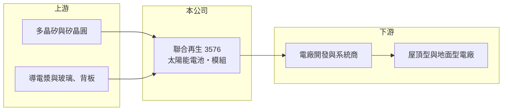

# 3576 聯合再生

> 上市｜[[產業索引-光電業|光電業]]｜上市（櫃）日期 2009/01/12

# 第一章：企業模式與商業藍圖

> [!info] 撰寫說明
> 精簡版，由 Claude 依公開資料整理，架構比照 [[2330台積電]]，資料截至 2026-10-07。來源：nstock.tw 聯合再生公司概況、winvest.tw 營收快訊。營收比重未查到。#待校對

聯合再生是台灣最大的太陽能電池與模組廠之一，目前仍處於虧損。

- **核心業務：** 聯合再生前身為新日光能源，成立於 2005 年，2018 年與昱晶能源、昇陽光電合併，從事太陽能電池、發電模組與晶圓的研發、製造及銷售。
- **營收結構：** 本次未查到產品別比重，主要產品為[[太陽能電池]]與太陽能模組。
- **營運據點：** 主要產能位於台灣，近期新聞提及與 [[5483中美晶]]合資在美國設廠，細節本次未查證。
- **長期方向：** 以[[非紅供應鏈]]為訴求，爭取美國與歐洲市場排除中國產品後的訂單（推估）。

# 第二章：護城河深度與競爭優勢

聯合再生面對中國廠商的規模與價格優勢，護城河有限。

- **競爭優勢：** 屬於台灣少數具規模的電池與模組一貫廠，能提供非中國產地的產品，符合部分歐美客戶的採購要求。
- **主要對手：** 中國的隆基綠能、晶科能源、天合光能等大型一體化廠，以及東南亞與美國本土的模組廠。
- **觀察重點：** 美國合資廠進度、毛利率何時轉正，以及台灣再生能源政策的裝機需求。

# 第三章：財務體質與盈利規模

資料日期：2026-10-07，以下數字是撰寫當時的快照；最新月營收、毛利率、累計 EPS 由自動排程寫在本筆記的屬性欄位（月營收、毛利率、累計EPS 等）。#待校對

聯合再生營收起伏大，第二季毛利率為負。

- **營收規模：** 2026 年 1 至 7 月累計營收 15.86 億元；8 月營收 2.45 億元、年減 13.03%，5 月 3.24 億元則年增 27.63%。
- **獲利：** 2026 年第二季 EPS -0.14 元，[[毛利率]] -6.83%，淨利率 -30.15%。
- **財務特色：** 資本額約 162.8 億元，股本大、每股獲利被稀釋；近五年平均現金股利僅約 0.02 元。

# 第四章：總體風險與地緣政治

聯合再生的風險集中在產業供過於求與貿易政策。

- **產業週期：** 中國太陽能產能嚴重過剩，全球電池與模組報價長期承壓。
- **營運風險：** 毛利為負代表售價不足以支應成本，若持續虧損需處分資產或調整產能。
- **其他風險：** 美國關稅與反傾銷政策變動；多晶矽與銀漿等原料價格；台灣綠電政策與匯率。

# 專有名詞解析

## 產業

- **[[太陽能電池]]**：把陽光轉成電力的半導體元件，多片串接封裝後成為太陽能模組。
- **[[非紅供應鏈]]**：不含中國大陸產地或資本的供應鏈，美國與部分國家在政府標案、關稅上給予優勢。

# 核心供應鏈

- 上游：矽晶圓（[[5483中美晶]]，推估）、[[3691碩禾]]等導電漿供應商、玻璃與背板
- 下游／客戶：太陽能電廠開發商與系統整合商
- 同業：隆基綠能、晶科能源、天合光能

## 最新新聞
<!-- news:start -->
<!-- news:end -->

## 相關連結
- [公開資訊觀測站](https://mopsov.twse.com.tw/mops/web/t05st03?step=1&firstin=1&co_id=3576)
- [Goodinfo](https://goodinfo.tw/tw/StockDetail.asp?STOCK_ID=3576)
- [Yahoo 股市](https://tw.stock.yahoo.com/quote/3576)
- [鉅亨網新聞](https://www.cnyes.com/twstock/3576/news)
