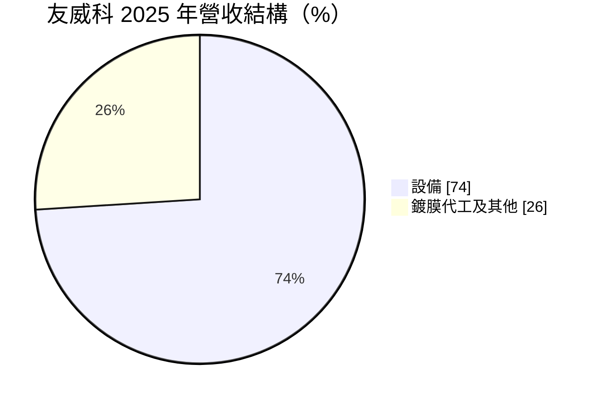
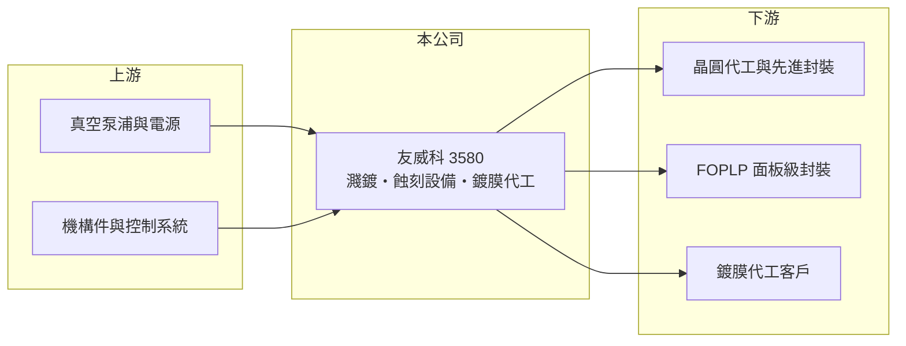

# 3580 友威科

> 上櫃｜[[產業索引-其他電子業|其他電子業]]｜上市（櫃）日期 2010/07/09

# 第一章：企業模式與商業藍圖

> [!info] 撰寫說明
> 精簡版，由 Claude 依公開資料整理，架構比照 [[2330台積電]]，資料截至 2026-10-07。來源：富果研究友威科 2025 年 12 月法說摘要、nstock.tw 友威科公司概況、winvest.tw 營收快訊。#待校對

友威科是做乾式真空製程設備的廠商，近年主力轉向先進封裝。

- **核心業務：** 友威科製造銷售真空[[濺鍍]]與電漿[[蝕刻]]設備，並提供真空鍍膜代工，整合成乾式真空製程解決方案。
- **營收結構：** 依 2025 年法說，設備營收約占 74%，其中半導體設備為主要動能（法說稱占 65%，口徑待確認）；其餘為鍍膜代工等業務。

- **營運據點：** 總部在台灣，另有深圳、重慶子公司與馬來西亞服務據點，並透過合作聯盟開拓日本與美國。
- **長期方向：** 聚焦 [[CoWoS]] 與 [[FOPLP]] 等[[先進封裝]]；新廠預計 2026 年年中完工，公司表示產能將擴增 5 倍以上。

# 第二章：護城河深度與競爭優勢

友威科的優勢是在先進封裝濺鍍與蝕刻站點取得量產實績，但規模仍小。

- **競爭優勢：** 已在關鍵客戶 CoWoS on Substrate 提供七個製程站點的整合方案，FOPLP 設備也在意法半導體與 [[3481群創]] 量產。
- **主要對手：** 國際真空設備大廠如 [[AMAT應用材料]]、Evatec，台灣的 [[6937天虹]] 等在地設備商。
- **觀察重點：** 新廠完工後產能放大能否轉化為接單，以及 2026 年營收在法說樂觀展望下為何前 8 月仍年減。

# 第三章：財務體質與盈利規模

資料日期：2026-10-07，以下數字是撰寫當時的快照；最新月營收、毛利率、累計 EPS 由自動排程寫在本筆記的屬性欄位（月營收、毛利率、累計EPS 等）。#待校對

友威科營收規模約 4 億元，但毛利率在五成以上。

- **營收規模：** 2025 年全年營收 4.32 億元；2026 年 1 至 8 月累計 2.66 億元、年減 6%，8 月營收 4,636 萬元、年增 26.86%。
- **獲利：** 2025 年全年 EPS 1.94 元；2026 年上半年累計 EPS 0.65 元，第二季[[毛利率]] 55.07%。
- **財務特色：** 2024 年度現金股利 3 元，2025 年第四季配發現金股利 1.2 元；設備出貨與驗收時點不同，季度營收波動大。

# 第四章：總體風險與地緣政治

友威科的風險在於客戶集中與先進封裝擴產節奏。

- **產業週期：** 設備訂單取決於客戶資本支出，AI 封裝擴產若放緩，設備需求會快速下滑。
- **營運風險：** 營收規模小，少數大客戶的訂單與驗收時點就能左右全年表現；新廠完工後折舊增加，產能利用不足會壓低獲利。
- **其他風險：** 中國子公司面臨兩岸政策風險，德威電子（昆山）已在清算中；國際設備大廠的價格與技術競爭。

# 專有名詞解析

## 半導體

- **[[濺鍍]]**：在真空中以離子撞擊靶材，把金屬原子沉積到晶圓或基板表面形成薄膜的製程。
- **[[蝕刻]]**：以化學藥液或電漿把不需要的材料去除，形成線路圖形的製程。
- **[[先進封裝]]**：把多顆晶片以中介層、混合鍵合等方式高密度整合的封裝技術，例如 CoWoS、SoIC。
- **[[CoWoS]]**：台積電的 2.5D 先進封裝技術，把 GPU 與 HBM 並排放在矽中介層上，是 AI 晶片的主流封裝方式。
- **[[FOPLP]]**：面板級扇出型封裝，以方形大面板取代圓形晶圓進行扇出封裝，可提高面積利用率、降低成本。

# 核心供應鏈

- 上游：真空泵浦、射頻電源、機構件與控制系統供應商
- 下游／客戶：先進封裝客戶（CoWoS on Substrate）、意法半導體、[[3481群創]]（FOPLP）
- 同業：[[6937天虹]]、[[AMAT應用材料]]、Evatec

## 最新新聞
<!-- news:start（自動產生，請勿手動編輯此範圍） -->
- 2026-10-08 📰 媒體 17:23｜營收速報 - 友威科(3580)9月營收7,407萬元年增率高達110.12％｜[鉅亨網](https://news.cnyes.com/news/id/6625016)

完整紀錄：[[3580友威科 新聞]]
<!-- news:end -->

## 相關連結
- [公開資訊觀測站](https://mopsov.twse.com.tw/mops/web/t05st03?step=1&firstin=1&co_id=3580)
- [Goodinfo](https://goodinfo.tw/tw/StockDetail.asp?STOCK_ID=3580)
- [Yahoo 股市](https://tw.stock.yahoo.com/quote/3580)
- [鉅亨網新聞](https://www.cnyes.com/twstock/3580/news)
