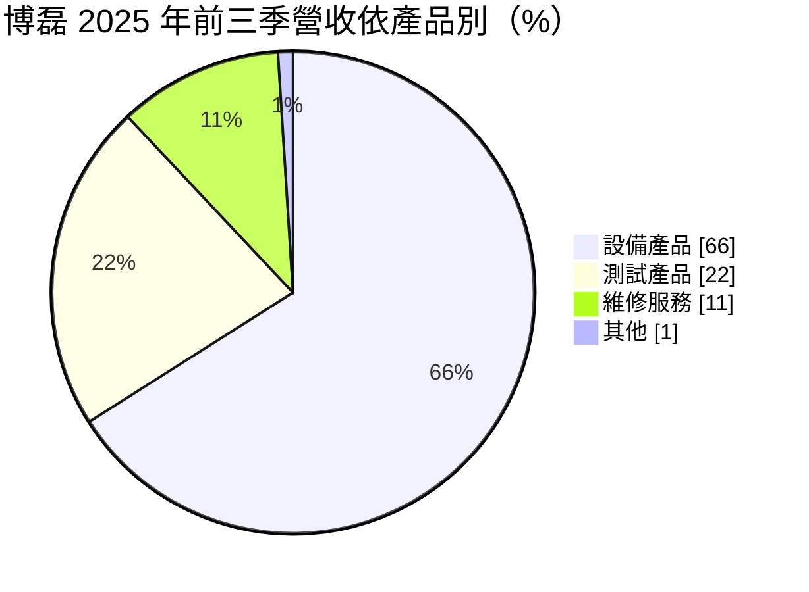
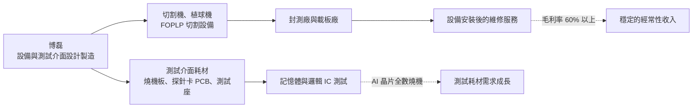
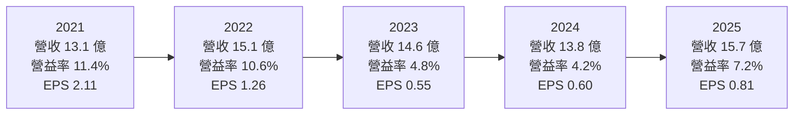
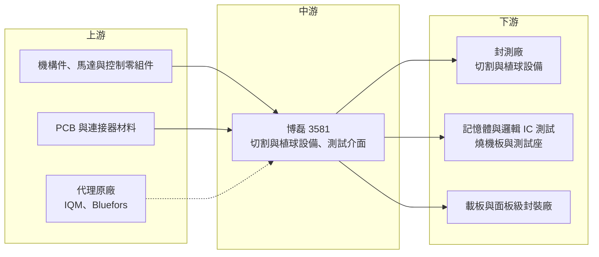

# 3581 博磊

> 上櫃｜[[產業索引-半導體業|半導體業]]｜上市（櫃）日期 2015/01/20

# 第一章：企業模式與商業藍圖

> [!info] 撰寫說明
> 本文由 Claude 依公開資料整理，架構比照 [[2330台積電]] 的四章研究，資料截至 2026-10-08。財務數字來源：Goodinfo 台灣股市資訊網年度經營績效與股利政策、富果研究法說會整理（2025 年 11 月）、工商時報 2026 年 5 月報導、nStock 公司簡介、櫃買中心開放資料（本筆記 _data 快照）；產業描述為整理性內容，尚未逐條比對原始文件。#待校對

在評估單一個股的長期投資價值時，首要步驟是拆解企業的底層獲利邏輯。本章針對博磊科技（股票代號：3581，以下簡稱博磊）的商業模式進行定性分析，說明這家同時做封裝切割設備、測試介面耗材與設備維修的後段供應商，如何在半導體後段製程中找到位置，以及 AI 晶片測試與[[面板級扇出型封裝]]對它的長期意義。

## 一、核心定位：封測後段的設備與測試介面供應商

博磊成立於 1999 年，2015 年在櫃買中心掛牌，總部位於新竹縣新豐，實收資本額約 5.10 億元。依 nStock 公司簡介，主要經營半導體封裝測試產品及設備的製造、加工、維修與進出口買賣。

博磊的業務橫跨三個領域，在台灣後段供應商中屬於「設備加耗材加服務」的混合模式。這種模式的好處是收入來源多元：設備銷售帶來大筆但不穩定的收入，耗材與維修則提供隨產量成長的經常性收入。缺點是每一塊業務的規模都不大，很難在單一領域成為龍頭。

* **測試產品：** 記憶體與邏輯 IC 的測試介面，包括[[燒機測試]]板（Burn-in Board）、[[探針卡]]用印刷電路板與[[測試座]]。
* **設備產品：** 晶圓、載板與面板的切割機，以及 IC 封裝植球機，近年開發面板級扇出型封裝（[[FOPLP]]）切割設備。
* **廠務與代理：** 子公司提供氣體偵測系統；另代理量子電腦相關設備（IQM、Bluefors）。

## 二、終端應用／產品板塊：設備占三分之二

依 2025 年 11 月法說，2025 年前三季營收結構如下：

* **設備產品（66%）：** 切割機與植球機，客戶為封測廠與載板廠。依法說，設備毛利率約 30% 至 55%，差異來自機型與客製程度。設備銷售會隨客戶的資本支出循環大幅波動，是博磊營收與獲利起伏的主要來源。
* **測試產品（22%）：** 燒機測試板、探針卡 PCB、測試座等耗材，毛利率約 40% 至 55%。耗材需求與晶片產量和測試嚴格程度連動，AI 晶片普遍要求全數燒機測試，是這塊業務的長期成長動力。
* **維修服務（11%）：** 設備維修與保養，毛利率 60% 以上，是獲利品質最好的業務。設備裝機量越大，維修收入越穩定。

依地區別，2025 年前三季台灣約占 77%、中國約占 15%，客戶以台灣封測與載板廠為主。

## 三、資本轉化邏輯（營運模式）：設備帶動耗材與維修

博磊的商業模式可以理解為「先賣設備，再賺耗材與服務」。

* **設備帶動維修：** 設備賣出後，後續的保養、零件更換與維修是經常性收入。這部分毛利率最高，也最不受景氣影響，能平滑設備出貨的波動。
* **耗材隨產量成長：** 測試介面是消耗品，會隨使用次數磨損，晶片產量越大、測試要求越嚴格，耗材需求越大。依 2025 年 11 月法說，公司預期測試產品將是成長最快的板塊。
* **產能與自動化：** 公司推動 24 小時工廠自動化以因應人力不足，並規劃蘇州廠擴產，顯示經營層在擴大產能的同時，也試圖用自動化降低人力成本。

## 四、企業長期藍圖：AI 測試介面與 FOPLP 切割

* **AI 測試介面：** AI 晶片功耗高、價值高，測試要求比一般晶片嚴格得多。依工商時報 2026 年 5 月報導，多項 AI 測試介面已進入客戶驗證，若能打入 AI 晶片測試供應鏈，將是測試產品長期成長的主要來源。
* **面板級扇出型封裝設備：** FOPLP 被視為 [[CoWoS]] 之後擴大 AI 晶片封裝面積的[[先進封裝]]技術路線之一，用方形大面板取代圓形晶圓，提高面積利用率。博磊的面板級切割設備已進入客戶驗證，若 FOPLP 成為主流技術，設備需求可能大幅成長。
* **量子電腦代理：** 代理 IQM、Bluefors 的量子電腦相關設備，規模尚小，屬於長期的探索性布局。
* **資本配置習慣：** 依 Goodinfo，2016 至 2025 年每年都發放現金股利（0.5 元至 1.0 元），配發率多在五成至九成之間，股利金額不高但沒有中斷。

# 第二章：護城河深度與競爭優勢

在長期價值投資中，「護城河」指企業抵禦競爭、維持超額利潤的保護機制。本章分析博磊的護城河構成、主要競爭對手，以及它在 AI 測試與先進封裝設備的優勢能守住多少。

## 一、護城河的核心組成要素

博磊的護城河屬於「窄護城河」，優勢主要來自在地服務與產品組合，而不是技術領先。

* **1. 設備與耗材的綜合能力：** 同時提供切割設備、植球機與測試介面，可以從封裝到測試提供多項產品。對中型封測客戶來說，一家供應商就能處理多種需求，採購與維修都比較方便。
* **2. 客製化與在地服務：** 後段設備多需依客戶產線客製，台灣在地廠商的交期、維修速度與工程支援，是相對日本、歐美設備商的明顯優勢。設備故障時能否快速到場處理，直接影響客戶產線的稼動率。
* **3. 維修服務的黏著度：** 設備裝機後的維修需要熟悉機台的工程團隊，客戶通常交由原廠處理，形成長期且毛利率高的收入來源。

## 二、全球主要競爭對手格局

| 對手 | 定位 | 對博磊的威脅 |
|---|---|---|
| DISCO | 日本切割與研磨設備龍頭 | 晶圓切割設備市占極高，技術領先 |
| [[6515穎崴]] | 測試座與探針卡，AI 測試介面領先 | 在高階 AI 測試座市場規模與技術領先 |
| [[6223旺矽]] | 探針卡與測試設備 | 探針卡市場直接競爭 |
| [[6510精測]] | 測試介面 PCB 與探針卡 | 在測試介面 PCB 直接競爭 |
| 燒機板與植球設備同業 | 台灣、日本與中國中小型廠商 | 價格競爭 |

## 三、優勢轉化：守得住／守不住／觀察重點

* **守得住：** 台灣封測與載板客戶的客製化設備、既有設備的維修服務，以及記憶體燒機測試板等需要長期合作的耗材。這些業務靠在地服務與客戶關係維持，是博磊毛利率長期在 30% 至 40% 之間的基礎。
* **守不住：** 高精度晶圓切割設備市場由 DISCO 主導，博磊難以在主流晶圓切割正面競爭；高階 AI 測試座則有穎崴等大廠，技術與規模差距明顯。博磊在這些領域較可能扮演第二供應商的角色。
* **觀察重點：** 長期可以觀察三個指標：測試產品占營收比重能否從約兩成提高到三成以上；FOPLP 切割設備能否取得量產訂單並重複接單；以及營業利益率能否回到 2020 至 2022 年 10% 以上的水準。

# 第三章：財務體質與盈利規模

資料日期：2026-10-08。數字取自 Goodinfo 年度經營績效與股利政策、富果研究法說整理、工商時報與櫃買中心開放資料快照，表格是撰寫當時的快照；最新月營收、毛利率、累計 EPS 由自動排程寫在本筆記的屬性欄位（月營收、毛利率、累計EPS 等）。#待校對

財務報表是檢驗護城河是否真實存在的最終標準。本章用多年度的三率、ROE、現金流與資本報酬，檢視博磊在設備出貨週期中的獲利品質。

## 一、獲利能力的基石：三率

| 年度 | 營收（新台幣） | [[毛利率]] | [[營業利益率]] | EPS（元） | [[ROE]] | 現金股利（元） |
|---|---|---|---|---|---|---|
| 2019 | 11.8 億 | 39.1% | 7.2% | 1.05 | 8.5% | 0.70 |
| 2020 | 12.0 億 | 39.6% | 10.4% | 1.50 | 13.4% | 0.90 |
| 2021 | 13.1 億 | 40.0% | 11.4% | 2.11 | 13.9% | 1.00 |
| 2022 | 15.1 億 | 37.5% | 10.6% | 1.26 | 9.4% | 0.80 |
| 2023 | 14.6 億 | 29.8% | 4.8% | 0.55 | 6.2% | 0.50 |
| 2024 | 13.8 億 | 33.3% | 4.2% | 0.60 | 7.3% | 0.50 |
| 2025 | 15.7 億 | 33.1% | 7.2% | 0.81 | 8.4% | 0.60 |

博磊的營收十年來穩定成長，但獲利率在 2023 年明顯下了一個台階。2019 至 2022 年毛利率在 37% 至 40% 之間、營業利益率約 7% 至 11%；2023 至 2025 年毛利率降到 30% 至 33%，營業利益率只剩 4% 至 7%。營收規模相近、利潤卻減半，反映產品組合往毛利較低的設備移動，以及費用增加。

* **[[毛利率]]：** 長期在 30% 至 40% 之間，屬於後段設備與耗材業的中等水準。毛利率高低主要取決於設備與耗材、維修的比重，耗材與維修占比越高，毛利率越好。
* **[[營業利益率]]：** 毛利與營業利益之間的差距長期超過 25 個百分點，代表研發、業務與管理費用占營收比重高。這是同時經營多條產品線的代價，也是營業利益率偏低的主因。營收若能明顯放大，[[營運槓桿]]才有發揮空間。
* **[[非控制權益]]：** 博磊有非全資子公司，合併淨利中有一部分屬於其他股東，評估每股獲利時需留意歸屬母公司的部分。
* **長期指標：** 2016 至 2025 年營收從 8.86 億元成長到 15.7 億元，年複合成長率約 6.6%（推算）；2021 至 2025 年五年平均 ROE 約 9%（推算）。現金股利十年未中斷，金額在 0.5 元至 1.0 元之間。

## 二、[[ROE]]：資本效率

博磊的 ROE 長期在 6% 至 14% 之間，景氣好時接近 14%，低谷時約 6%。與多數輕資產 IC 設計公司不同，博磊的[[負債比]]偏高，2026 年第二季底總負債約 14.02 億元、總資產約 24.70 億元，負債比約 57%，部分 ROE 來自財務槓桿（負債組成中的有息負債比重未查得）。這代表博磊的 ROE 品質不如低負債的同業，景氣下滑時風險也較高。

## 三、資本支出與自由現金流

* **[[CapEx]]：** 主要用於工廠自動化與蘇州擴產，具體金額未查得。
* **[[自由現金流]]：** 設備業務需要先備料、出貨後才收款，營收快速成長時營運資金需求會增加，自由現金流可能被壓縮。從十年來每年都能配發現金股利來看，長期營業現金流應能支應配息，但自由現金流是否每年為正未查得（推估）。

## 四、[[ROIC]] 與 [[WACC]]：價值創造利差

博磊的有息負債金額未查得，因此用兩種分母估算 ROIC 的區間。以 2025 年為例，營業利益約 1.12 億元（營收 15.7 億元 × 營業利益率 7.16%），扣除 20% 稅率後約 0.90 億元。若有息負債很少、以股東權益約 10.7 億元為分母，ROIC 約 8.4%（推算，上限）；若保守地把全部負債都視為投入資本、以總資產約 24.7 億元為分母，ROIC 約 3.6%（推算，下限）。實際值應介於兩者之間。2020 至 2021 年營業利益率約 10% 至 11%，以股東權益為分母的 ROIC 上限與當年 ROE 相近，約 13% 至 14%（推算）。

WACC 以 CAPM 推估：台灣 10 年期公債約 1.5% 至 2%，市場風險溢酬約 6%，β 未查得個股數值，採半導體設備股常見的 1.1 至 1.3（假設），股東權益成本約 8.4% 至 9.6%。若有借款，負債成本假設約 2.5%，稅後約 2%，依負債比重不同，WACC 約 7.5% 至 9.5%（推算）。

比較兩者，博磊在 2020 至 2022 年的 ROIC 大致與 WACC 相當或略高，2023 至 2025 年則多半低於資金成本。也就是說，過去十年博磊的成長主要是規模擴大，而不是資本報酬的提升。AI 測試介面與 FOPLP 設備能否把營業利益率拉回 10% 以上，是 ROIC 能否長期超過 WACC 的關鍵。

# 第四章：總體風險與地緣政治

任何企業都無法脫離宏觀環境獨立存在。本章分析博磊長期必須面對的地緣政治、產業週期與營運風險。

## 一、地緣政治

* **中國營收與蘇州廠：** 中國約占營收 15%，並規劃蘇州擴產。美中科技管制若擴及後段設備或測試介面，中國業務可能受限；反過來說，中國本土設備商在國產化政策下也可能取代博磊在中國的份額。
* **美國關稅：** 美國若對半導體設備或零組件課徵關稅，出口到美國客戶的成本會上升，也可能促使客戶在美國當地採購。

## 二、產業週期與市場結構

* **設備資本支出循環：** 封測廠與載板廠的資本支出隨景氣大幅波動，設備訂單容易出現斷層。2023 至 2024 年獲利下滑，正是後段資本支出縮減的結果。
* **AI 題材集中：** 未來的成長動能集中在 AI 測試與先進封裝，若 AI 投資放緩，新產品的放量時程可能延後。

## 三、營運環境的隱性風險

* **驗證時程：** AI 測試介面與 FOPLP 切割設備都需要經過客戶長時間驗證，若驗證延後或未通過，成長計畫將落空。
* **財務槓桿：** 負債比約 57%，高於多數後段設備同業，景氣下滑時的財務彈性較小。
* **人力短缺：** 公司推動 24 小時自動化工廠正是為了因應人力不足，自動化投資的成效需要時間驗證。

## 四、科技或法規演進

* **先進封裝路線競爭：** 面板級扇出型封裝與晶圓級封裝、玻璃基板等技術路線仍在競爭，若主流客戶選擇其他路線，FOPLP 設備需求可能不如預期。
* **測試介面規格升級：** AI 晶片功耗與腳數持續增加，測試座與燒機板需要更高的散熱與訊號能力，研發投入必須持續跟上，否則會被高階市場淘汰。

# 專有名詞解析

## 半導體

- **[[FOPLP]]**：面板級扇出型封裝，把晶片放在方形大面板上進行重佈線與封裝，可容納比圓形晶圓更多晶片。
- **[[面板級扇出型封裝]]**：FOPLP 的中文名稱，被視為擴大 AI 晶片封裝產能的技術路線之一。
- **[[燒機測試]]**：在高溫、高電壓下長時間運作晶片，提前篩出早期失效產品，AI 與車用晶片常要求全數執行。
- **[[探針卡]]**：晶圓測試時接觸晶粒電極的耗材，針數與精度依晶片設計客製。
- **[[測試座]]**：成品測試時固定晶片並連接測試機的插座，屬消耗性的測試介面。
- **[[CoWoS]]**：台積電的 2.5D 先進封裝技術，把運算晶片與 HBM 並排放在中介層上，是 AI 晶片的主流封裝。
- **[[先進封裝]]**：把多顆晶片以中介層、混合鍵合等方式高密度整合的封裝技術，例如 CoWoS、SoIC。

## 金融

- **[[非控制權益]]**：合併子公司中不屬於母公司的股權，相關獲利歸其他股東所有。
- **[[營運槓桿]]**：費用固定比例高時，營收小幅變動會造成獲利大幅變動的現象。
- **[[負債比]]**：總負債除以總資產，衡量公司財務槓桿與償債壓力。
- **[[ROIC]]**：投入資本報酬率，稅後營業利益除以投入資本，衡量本業運用資金創造報酬的能力。
- **[[WACC]]**：加權平均資金成本，股東與債權人要求報酬率的加權平均，是 ROIC 要超過的門檻。

# 核心供應鏈

## 1. 上游：零組件與代理原廠
- 機構件、馬達、控制系統與 PCB 材料供應商（具體名單未查得）
- 量子電腦設備代理：IQM、Bluefors

## 2. 中游：博磊本身
- 設備產品：晶圓、載板、面板切割機，IC 封裝植球機，FOPLP 切割設備
- 測試產品：燒機測試板、探針卡 PCB、測試座
- 子公司：氣體偵測系統

## 3. 下游：客戶
- 封測與面板級封裝：[[3711日月光投控]]、[[6239力成]] 等台灣封測廠為主要潛在客戶群（推估，公司未揭露客戶名單）
- 記憶體與邏輯 IC 測試客戶（具體名單未查得）
- 地區：台灣約 77%、中國約 15%

## 4. 同業
- 切割設備：DISCO
- 測試介面：[[6515穎崴]]、[[6223旺矽]]、[[6510精測]]

## 最新新聞
<!-- news:start -->
<!-- news:end -->

## 相關連結
- [公開資訊觀測站](https://mopsov.twse.com.tw/mops/web/t05st03?step=1&firstin=1&co_id=3581)
- [Goodinfo](https://goodinfo.tw/tw/StockDetail.asp?STOCK_ID=3581)
- [Yahoo 股市](https://tw.stock.yahoo.com/quote/3581)
- [鉅亨網新聞](https://www.cnyes.com/twstock/3581/news)
