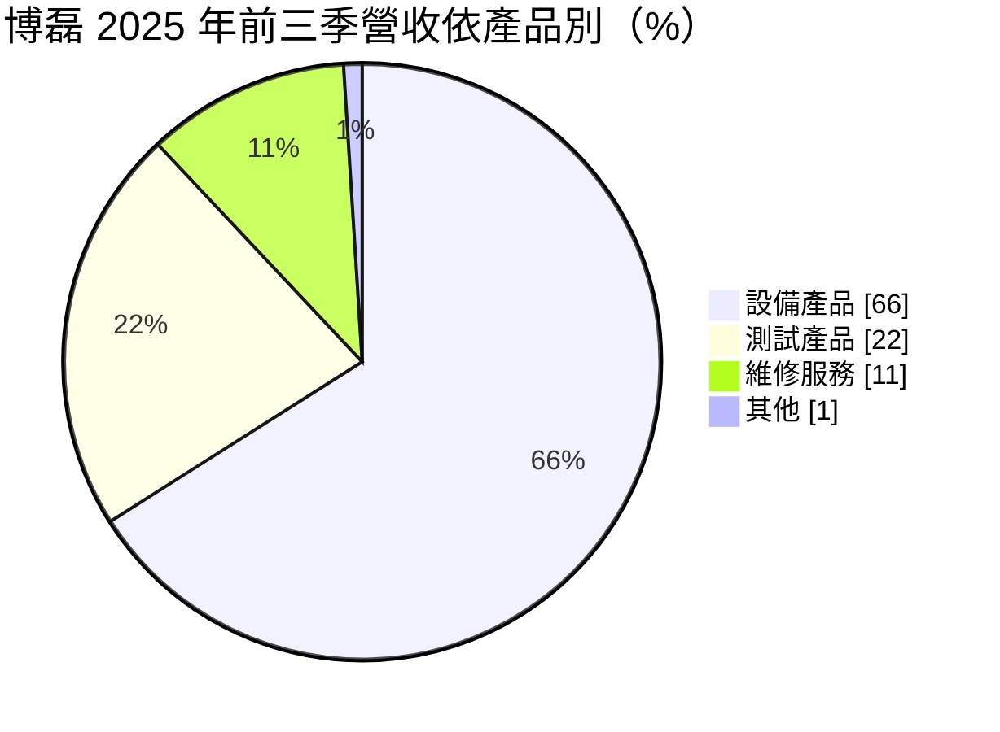
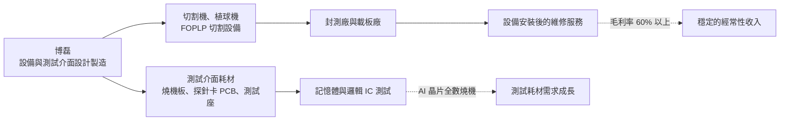
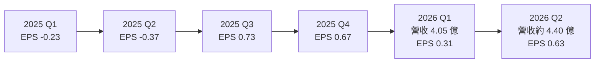
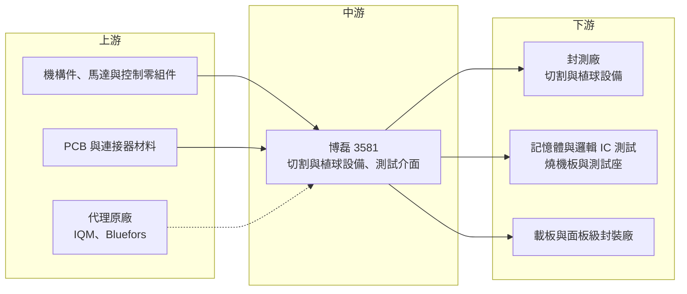

# 3581 博磊

> 上櫃｜[[產業索引-半導體業|半導體業]]｜上市（櫃）日期 2015/01/20

# 第一章：企業模式與商業藍圖

> [!info] 撰寫說明
> 本文由 Claude 依公開資料整理，架構比照 [[2330台積電]] 的四章研究，資料截至 2026-10-07。財務數字來源：富果研究法說會整理（2025 年 11 月）、工商時報 2026 年 5 月報導、nStock 公司簡介、Yahoo 股市各季 EPS、櫃買中心開放資料（本筆記 _data 快照：2026 上半年綜合損益、資產負債、月營收、本益比）；產業描述為整理性內容，尚未逐條比對原始文件。#待校對

在評估單一個股的長期投資價值時，首要步驟是拆解企業的底層獲利邏輯。本章針對博磊科技（股票代號：3581，以下簡稱博磊）的商業模式進行定性分析，說明這家同時做測試介面耗材與封裝切割設備的後段供應商，如何把握 AI 晶片測試與[[面板級扇出型封裝]]兩個新題材。

## 一、核心定位：封測後段的設備與測試介面供應商

博磊成立於 1999 年，2015 年在櫃買中心掛牌，總部位於新竹縣新豐，實收資本額約 5.10 億元。依 nStock 公司簡介，主要經營半導體封裝測試產品及設備的製造、加工、維修與進出口買賣。

博磊的業務橫跨三個領域，在台灣後段供應商中屬於「設備加耗材加代理」的混合模式：

* **測試產品：** 記憶體與邏輯 IC 的測試介面，包括[[燒機測試]]板（Burn-in Board）、[[探針卡]]用印刷電路板與[[測試座]]。
* **設備產品：** 晶圓、載板與面板的切割機，以及 IC 封裝植球機，近年開發面板級扇出型封裝（[[FOPLP]]）切割設備。
* **廠務與代理：** 子公司提供氣體偵測系統；另代理量子電腦相關設備（IQM、Bluefors）。

## 二、終端應用／產品板塊：設備占三分之二

依 2025 年 11 月法說，2025 年前三季營收結構如下：

* **設備產品（66%）：** 切割機與植球機，客戶為封測廠與載板廠，毛利率約 30% 至 55%，依機型與客製程度差異大。
* **測試產品（22%）：** 燒機測試板、探針卡 PCB、測試座等耗材，毛利率約 40% 至 55%。公司預期 2026 年測試產品將是成長最快的板塊。
* **維修服務（11%）：** 設備維修與保養，毛利率 60% 以上，是獲利品質最好的業務。

依地區別，台灣約占 77%、中國約占 15%。

## 三、資本轉化邏輯（營運模式）：設備帶動耗材與維修

* **設備帶動維修：** 設備賣出後，後續的保養與維修是經常性收入，毛利率最高，能平滑設備出貨的波動。
* **耗材隨產量成長：** 測試介面是消耗品，晶片產量越大、測試要求越嚴格，耗材需求越大。依 2025 年 11 月法說，AI 晶片需要百分之百燒機測試，是測試產品成長的主要原因。
* **產能與自動化：** 公司推動 24 小時工廠自動化以因應人力不足，並規劃蘇州廠擴產。

## 四、企業長期藍圖：AI 測試介面與 FOPLP 切割

* **AI 測試介面：** 依工商時報 2026 年 5 月報導，多項 AI 測試介面已進入客戶驗證，預計 2026 年第三季開始放量出貨。
* **面板級扇出型封裝設備：** FOPLP 被視為 [[CoWoS]] 之後擴大 AI 晶片封裝面積的[[先進封裝]]技術路線之一，博磊的面板級切割設備已進入客戶驗證，2025 年法說預期驗證在 2026 年第一季完成、2026 年下半年起量產。
* **量子電腦代理：** 代理 IQM、Bluefors 的量子電腦相關設備，規模尚小，屬長期布局。

# 第二章：護城河深度與競爭優勢

在長期價值投資中，「護城河」指企業抵禦競爭、維持超額利潤的保護機制。本章分析博磊的護城河構成、主要競爭對手，以及它在 AI 測試與先進封裝設備的優勢能守住多少。

## 一、護城河的核心組成要素

博磊的護城河屬於「窄護城河」，主要來自以下三點：

* **1. 設備與耗材的綜合能力：** 同時提供切割設備、植球機與測試介面，可以從封裝到測試提供多項產品，對中型封測客戶有一站式採購的便利。
* **2. 客製化與在地服務：** 後段設備多需依客戶產線客製，台灣在地廠商的交期、維修速度與工程支援，是相對日本、歐美設備商的優勢。
* **3. 維修服務的黏著度：** 設備裝機後的維修服務需要熟悉機台的工程團隊，客戶通常交由原廠維修，形成長期收入。

## 二、全球主要競爭對手格局

| 對手 | 定位 | 對博磊的威脅 |
|---|---|---|
| DISCO | 日本切割與研磨設備龍頭 | 晶圓切割設備市占極高，技術領先 |
| [[6515穎崴]] | 測試座與探針卡，AI 測試介面領先 | 在高階 AI 測試座市場規模與技術領先 |
| [[6223旺矽]] | 探針卡與測試設備 | 探針卡市場直接競爭 |
| [[6510精測]] | 測試介面 PCB 與探針卡 | 在測試介面 PCB 直接競爭 |
| 燒機板與植球設備同業 | 台灣、日本與中國中小型廠商 | 價格競爭 |

## 三、優勢轉化：哪些市場守得住、哪些守不住

* **守得住：** 台灣封測與載板客戶的客製化設備、既有設備的維修服務，以及記憶體燒機測試板等需要長期合作的耗材。
* **守不住：** 高精度晶圓切割設備市場由 DISCO 主導，博磊難以在主流晶圓切割正面競爭；高階 AI 測試座則有穎崴等大廠，競爭激烈。
* **觀察重點：** 2026 年 1 至 8 月營收 11.36 億元，年增 24.4%，但 8 月營收年減 27.7%，設備出貨有明顯起伏。觀察重點包括：AI 測試介面能否在第三季如期放量、FOPLP 切割設備是否取得量產訂單，以及股價在 2026 年 5 月一個月內上漲約兩倍後，獲利能否跟上評價。

# 第三章：財務體質與盈利規模

資料日期：2026-10-07。數字取自富果研究法說整理、工商時報、Yahoo 股市與櫃買中心開放資料快照，表格是撰寫當時的快照；最新月營收、毛利率、累計 EPS 由自動排程寫在本筆記的屬性欄位（月營收、毛利率、累計EPS 等）。#待校對

財務報表是檢驗護城河是否真實存在的最終標準。本章用三率、ROE、現金流與資本報酬，檢視博磊在設備出貨週期中的獲利品質。

## 一、獲利能力的基石：三率

| 項目 | 2025 全年 | 2025 前三季 | 2026 Q1 | 2026 Q2 | 2026 上半年 |
|---|---|---|---|---|---|
| 營收（新台幣） | 15.69 億 | 10.69 億 | 4.05 億 | 4.40 億（推算） | 8.45 億 |
| [[毛利率]] | 未查得 | 34% | 未查得 | 未查得 | 32.7% |
| [[營業利益率]] | 未查得 | 未查得 | 未查得 | 未查得 | 6.2% |
| EPS（元） | 0.81 | 0.13 | 0.31 | 0.63 | 0.94 |

* **毛利率：** 2025 年前三季毛利率 34%、2026 年上半年 32.7%，大致穩定。設備業務毛利率區間大，產品組合是主要變數。
* **營業利益率：** 2026 年上半年毛利 2.76 億元，營業利益只有 0.52 億元，營業利益率 6.2%，代表研發、業務與管理費用占營收比重高。營收規模擴大後，[[營運槓桿]]才會明顯。
* **獲利波動：** 2025 年上半年連續兩季虧損、下半年轉為大幅獲利，顯示設備出貨認列時點對單季獲利影響很大。
* **[[非控制權益]]：** 2026 年上半年合併稅後淨利 0.70 億元，歸屬母公司只有 0.48 億元，代表部分獲利來自非全資子公司，屬於其他股東。

## 二、[[ROE]]：資本效率

依櫃買中心資料，2026 年第二季底歸屬母公司權益約 9.05 億元，上半年歸屬母公司淨利 0.48 億元，年化 ROE 約 10.5%（推估）；2025 年以淨利 0.41 億元估算，ROE 約 4% 至 5%（推估）。總負債 14.02 億元、總資產 24.70 億元，[[負債比]]約 57%，在後段設備業中偏高。市場評價方面，[[本益比]]約 48.5 倍、股價淨值比約 6.39 倍，已反映相當程度的成長預期。

## 三、資本支出與自由現金流

* **[[CapEx]]：** 主要用於工廠自動化與蘇州擴產，具體金額未查得。
* **[[自由現金流]]：** 設備業務需要先備料、出貨後才收款，營收快速成長時營運資金需求會增加，自由現金流可能被壓縮（推估，具體數字未查得）。
* **股利：** 2025 年度擬配發現金股利 0.6 元，創近 3 年新高，以 EPS 0.81 元計算[[配發率]]約 74%。

## 四、[[ROIC]] 與 [[WACC]]：價值創造利差

博磊過去幾年 ROE 多在個位數，加上負債比偏高，ROIC 可能低於或接近資金成本（推估，具體數值未查得）。2026 年若 AI 測試介面與 FOPLP 設備放量，營收規模擴大、費用率下降，ROIC 有機會明顯改善；這也是目前高評價所押注的方向。

# 第四章：總體風險與地緣政治

任何企業都無法脫離宏觀環境獨立存在。本章分析博磊未來必須面對的地緣政治、產業週期與營運風險。

## 一、地緣政治

* **中國營收與蘇州廠：** 中國約占營收 15%，並規劃蘇州擴產。美中科技管制若擴及後段設備或測試介面，中國業務可能受限。
* **美國關稅：** 美國若對半導體設備或零組件課徵關稅，出口到美國客戶的成本會上升。

## 二、產業週期與市場結構

* **設備資本支出循環：** 封測廠與載板廠的資本支出隨景氣大幅波動，設備訂單容易出現斷層，2025 年上半年的虧損就是例子。
* **AI 題材集中：** 成長動能集中在 AI 測試與先進封裝，若 AI 投資放緩，新產品的放量時程可能延後。

## 三、營運環境的隱性風險

* **驗證時程：** AI 測試介面與 FOPLP 切割設備都還在客戶驗證階段，若驗證延後或未通過，2026 年下半年的成長預期將落空。
* **評價風險：** 股價在 2026 年 5 月一個月內上漲約兩倍，本益比接近 50 倍，若獲利成長不如預期，股價修正幅度可能很大。
* **人力短缺：** 公司推動 24 小時自動化工廠正是為了因應人力不足，自動化投資的成效需要時間驗證。

## 四、科技或法規演進

* **先進封裝路線競爭：** 面板級扇出型封裝與晶圓級封裝、玻璃基板等技術路線仍在競爭，若主流客戶選擇其他路線，FOPLP 設備需求可能不如預期。
* **測試介面規格升級：** AI 晶片功耗與腳數持續增加，測試座與燒機板需要更高的散熱與訊號能力，研發投入需要持續跟上。

# 專有名詞解析

## 半導體

- **[[FOPLP]]**：面板級扇出型封裝，把晶片放在方形大面板上進行重佈線與封裝，可容納比圓形晶圓更多晶片。
- **[[面板級扇出型封裝]]**：FOPLP 的中文名稱，被視為擴大 AI 晶片封裝產能的技術路線之一。
- **[[燒機測試]]**：在高溫、高電壓下長時間運作晶片，提前篩出早期失效產品，AI 與車用晶片常要求全數執行。
- **[[探針卡]]**：晶圓測試時接觸晶粒電極的耗材，針數與精度依晶片設計客製。
- **[[測試座]]**：成品測試時固定晶片並連接測試機的插座，屬消耗性的測試介面。
- **[[CoWoS]]**：台積電的 2.5D 先進封裝技術，把運算晶片與 HBM 並排放在中介層上，是 AI 晶片的主流封裝。
- **[[先進封裝]]**：把多顆晶片以中介層、混合鍵合等方式高密度整合的封裝技術，例如 CoWoS、SoIC。

## 金融

- **[[非控制權益]]**：合併子公司中不屬於母公司的股權，相關獲利歸其他股東所有。
- **[[營運槓桿]]**：費用固定比例高時，營收小幅變動會造成獲利大幅變動的現象。
- **[[負債比]]**：總負債除以總資產，衡量公司財務槓桿與償債壓力。
- **[[配發率]]**：現金股利占每股盈餘的比例，用來衡量公司把多少獲利發給股東。
- **[[本益比]]**：股價除以每股盈餘，衡量市場願意為每一元獲利支付多少價格。

# 核心供應鏈

## 1. 上游：零組件與代理原廠
- 機構件、馬達、控制系統與 PCB 材料供應商（具體名單未查得）
- 量子電腦設備代理：IQM、Bluefors

## 2. 中游：博磊本身
- 設備產品：晶圓、載板、面板切割機，IC 封裝植球機，FOPLP 切割設備
- 測試產品：燒機測試板、探針卡 PCB、測試座
- 子公司：氣體偵測系統

## 3. 下游：客戶
- 封測與面板級封裝：[[3711日月光投控]]、[[6239力成]] 等台灣封測廠為主要潛在客戶群（推估，公司未揭露客戶名單）
- 記憶體與邏輯 IC 測試客戶（具體名單未查得）
- 地區：台灣約 77%、中國約 15%

## 4. 同業
- 切割設備：DISCO
- 測試介面：[[6515穎崴]]、[[6223旺矽]]、[[6510精測]]

## 最新新聞
<!-- news:start -->
<!-- news:end -->

## 相關連結
- [公開資訊觀測站](https://mopsov.twse.com.tw/mops/web/t05st03?step=1&firstin=1&co_id=3581)
- [Goodinfo](https://goodinfo.tw/tw/StockDetail.asp?STOCK_ID=3581)
- [Yahoo 股市](https://tw.stock.yahoo.com/quote/3581)
- [鉅亨網新聞](https://www.cnyes.com/twstock/3581/news)
