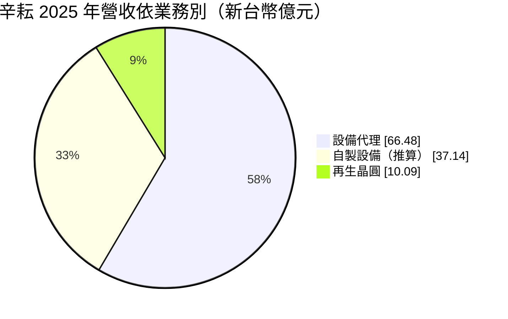
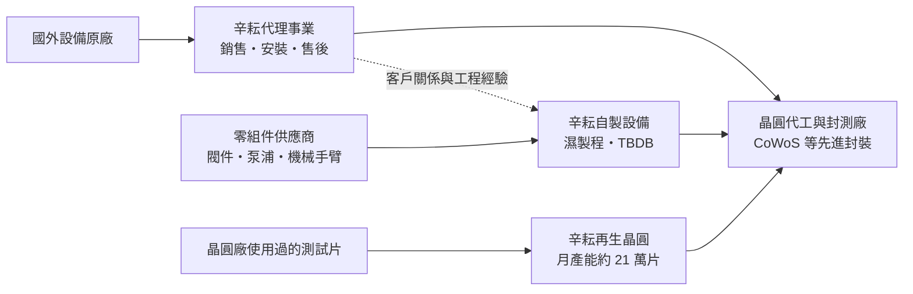
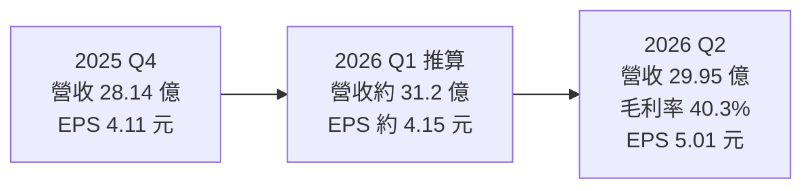
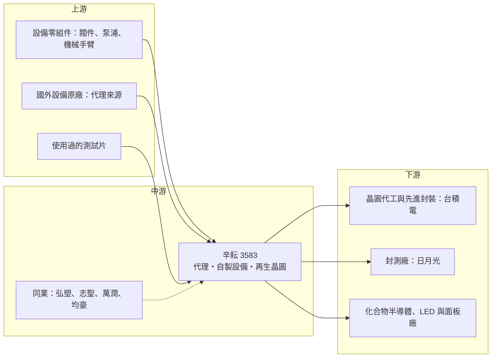

# 3583 辛耘

> 上市｜[[產業索引-半導體業|半導體業]]｜上市（櫃）日期 2013/03/12

# 第一章：企業模式與商業藍圖

> [!info] 撰寫說明
> 本文由 Claude 依公開資料整理，架構比照 [[2330台積電]] 的四章研究，資料截至 2026-10-07。財務數字來源：旺得富／中時（2025 年財報報導）、工商時報（2026 年 6 月）、科技新報（2026 年 9 月第二季財報報導）、股感（公司簡介與營收結構）；產業描述為整理性內容，尚未逐條比對原始文件。#待校對

在評估單一個股的長期投資價值時，首要步驟是拆解企業的底層獲利邏輯。本章針對辛耘企業（股票代號：3583，以下簡稱辛耘）的商業模式進行定性分析，說明一家設備代理商如何轉型為自有設備製造商，以及先進封裝擴產如何改變它的營收結構與毛利率。

## 一、核心定位：從設備代理商轉型為設備製造商

辛耘成立於 1979 年，2013 年上市，是台灣少數同時經營「設備代理」、「自製設備」與「[[再生晶圓]]」三種業務的半導體供應鏈公司。辛耘早年以代理國外半導體與光電設備起家，替國際設備廠在台灣銷售機台並提供安裝與售後服務；後來逐步發展自有的[[濕製程]]設備與晶圓再生業務，轉型為兼具代理與製造能力的設備商。

2026 年是辛耘轉型的重要分水嶺：依科技新報 2026 年 9 月報導，自製設備與再生晶圓這兩個高毛利的「製造」業務，營收比重首度超過 50%，超越傳統的代理業務。這個定位有兩個商業意義：

* **代理提供現金流與客戶關係：** 代理業務營收規模大、資本需求低，數十年累積的客戶關係是自製設備切入的通路。
* **製造拉高毛利率：** 自製設備與再生晶圓的毛利率明顯高於代理，比重提高後，整體獲利成長速度快於營收。

## 二、產品板塊：代理、自製設備與再生晶圓

依股感整理，2025 年代理事業營收 66.48 億元，自製設備（含再生晶圓）約 42%，其中晶圓再生營收約 10.09 億元。以全年營收 113.71 億元拆分如下（自製設備金額由總營收扣除代理與再生晶圓推算）：

到 2026 年第一季，代理與製造的比重已接近各半（51% 比 49%）。

* **設備代理：** 代理國外半導體前段、[[先進封裝]]與光電設備，並提供技術服務。代理業務營收規模大但毛利率較低，是辛耘的現金流基礎。
* **自製設備：** 以濕製程設備為主，包括晶圓清洗、蝕刻與表面處理機台；以及暫時性貼合與剝離（[[TBDB]]）系統，用於[[晶圓薄化]]與先進封裝中的玻璃載板貼合流程。TBDB 系列機台 2026 年已開始出貨，另有[[面板級封裝]]相關設備。這類設備直接受惠於 [[CoWoS]] 等 AI 先進封裝擴產。
* **再生晶圓：** 晶圓廠在製程監控、機台測試時會使用大量[[測試片]]（控片、擋片），用過之後經過研磨、拋光、清洗，可以重複使用，這就是再生晶圓。辛耘 2026 年月產能約 21 萬片，規劃 2026 年第四季擴增到約 25 萬片，2027 年再增加約 5 萬片。

辛耘服務的應用範圍包括半導體前段、先進封裝、化合物半導體、LED／Mini LED／Micro LED 與平面顯示器。個別客戶名單本次未查得，但以業務性質與先進封裝的產業結構來看，主要客戶推估為台灣的晶圓代工與封測大廠。

## 三、資本轉化邏輯：代理養製造、製造拉毛利

辛耘的主要生產據點在新竹湖口與台南：

* **湖口二廠：** 約 2,700 坪（約 9,000 平方公尺），預計 2026 年第四季完工。
* **台南新廠：** 約 6,600 坪（約 22,000 平方公尺），預計 2027 年第四季完工、2028 年第一季啟用。
* **人力：** 設備部門人力擴增到約 450 人，其中約 300 人為近期招募，反映產能吃緊的狀況。
* **資本支出：** 2026 年資本支出規劃為 17.5 億元。依報導，公司的自製設備年產能目標是擴增到約 250 台。

## 四、企業長期藍圖：押注先進封裝與高毛利製造

辛耘的長期策略很明確：把營收重心從低毛利的代理，移往高毛利的自製設備與再生晶圓。自製設備訂單能見度已看到 2027 年，部分客戶甚至給出到 2028 年的需求預測。先進封裝（尤其是 CoWoS 與未來的面板級封裝）需要大量濕製程與貼合剝離設備，辛耘希望藉由在地服務、快速客製化與價格優勢，取代部分日本與歐美進口設備，搭上[[設備國產化]]的趨勢。

# 第二章：護城河深度與競爭優勢

在長期價值投資中，「護城河」指企業抵禦競爭、維持超額利潤的保護機制。本章分析辛耘的護城河構成、國內外主要競爭對手，以及這些優勢在先進封裝設備的擴產競賽中能守住多少。

## 一、辛耘護城河的核心組成要素

辛耘的護城河屬於「窄但正在加深」，主要來自：

* **1. 在地化與客製化能力：** 先進封裝製程變化快，客戶需要設備商能快速修改機台、就近支援。辛耘作為台灣在地設備商，工程師能進駐客戶產線，反應速度比國外設備商快。
* **2. 代理業務累積的客戶關係：** 數十年代理經驗讓辛耘熟悉台灣晶圓廠與封測廠的採購流程與工程需求，自製設備能沿著既有關係切入。
* **3. 再生晶圓的規模與品質認證：** 再生晶圓需要通過晶圓廠的品質認證，且對潔淨度與平坦度要求高，月產能 20 萬片以上的規模在台灣具有一定地位。
* **4. 製造業務毛利較高：** 2026 年第二季毛利率 40.3%，明顯高於以代理為主時期的水準，顯示自製產品具有一定定價能力。

## 二、全球主要競爭對手格局

| 對手 | 定位 | 對辛耘的威脅 |
|---|---|---|
| [[3131弘塑]] | 台灣 CoWoS 濕製程設備主要廠商 | 在先進封裝濕製程直接競爭，同樣積極擴產 |
| SCREEN、[[8035東京威力科創]]、盛美半導體 | 國際濕製程與清洗設備大廠 | 技術與規模領先，產品線完整 |
| [[2467志聖]]、[[6187萬潤]]、[[5443均豪]] | 台灣先進封裝設備廠 | 在不同製程站點部分重疊 |
| [[8028昇陽半導體]]、[[1560中砂]]、RS Technologies | 再生晶圓業者 | 在測試片再生市場競爭 |
| 國際設備代理商與原廠子公司 | 代理通路 | 原廠可能收回代理權自設據點 |

## 三、優勢轉化：哪些市場守得住、哪些守不住

* **守得住：** 先進封裝的濕製程與貼合剝離設備，在台灣設備國產化的趨勢下，在地設備商受惠明顯；再生晶圓需求跟著晶圓廠擴產穩定成長。
* **守不住：** 弘塑等同業同樣在擴產，客戶通常會維持兩家以上供應商；代理業務則面臨原廠收回代理權、自設據點的風險。
* **觀察重點：** 湖口二廠與台南新廠能否如期投產、自製設備產能能否跟上訂單；製造業務比重持續高於 50% 後，毛利率能否維持在 40% 上下；以及先進封裝擴產週期是否延續到 2028 年。

# 第三章：財務體質與盈利規模

資料日期：2026-10-07。數字取自旺得富／中時、工商時報、科技新報等財經媒體整理，表格是撰寫當時的快照；最新月營收、毛利率、累計 EPS 由自動排程寫在本筆記的屬性欄位（月營收、毛利率、累計EPS 等）。#待校對

財務報表是檢驗護城河是否真實存在的最終標準。本章用三率、ROE、資本支出與資本報酬，檢視辛耘在代理轉製造過程中的獲利品質。

## 一、獲利能力的基石：三率

| 項目 | 2025 全年 | 2025 Q4 | 2026 Q1 | 2026 Q2 |
|---|---|---|---|---|
| 營收（新台幣） | 113.71 億 | 28.14 億 | 約 31.2 億（推算） | 29.95 億 |
| [[毛利率]] | 33.54% | 未查得 | 未查得 | 40.3% |
| [[營業利益率]] | 13.86% | 未查得 | 未查得 | 約 16.8%（推算） |
| EPS（元） | 13.82 | 4.11 | 約 4.15（推算） | 5.01 |

* **2025 年：** 營收年增 17.37%，歸屬母公司淨利 11.09 億元，年增 19.72%，EPS 連續五年創新高；毛利率創近三年新高、營業利益率創歷史新高。
* **2026 年上半年：** 營收 61.15 億元，淨利 7.39 億元，年增 52%，EPS 9.16 元（2025 年上半年為 6.05 元）。第一季數字為上半年減去第二季推算而得。
* **2026 年第二季：** 營業利益 5.03 億元，營業利益率依此推算約 16.8%；營收年增僅 2.81%，但因高毛利製造業務比重提升，EPS 5.01 元創單季新高。這是產品組合改善帶動獲利的典型例子：營收持平，獲利大增。

## 二、[[ROE]]：資本效率

辛耘過去以代理為主，屬於輕資產模式，資本支出不高。轉型為製造商後，需要投入廠房、設備與人力，資本密集度上升。但由於製造業務的毛利率顯著高於代理，獲利成長快於營收成長，整體資本效率仍在改善中（推估）。確切 ROE 數字本次未查得。

## 三、資本支出與自由現金流

* **[[CapEx]]：** 2026 年資本支出規劃 17.5 億元，主要用於湖口二廠、台南新廠與再生晶圓擴產。
* **營運資金與[[自由現金流]]：** 設備業通常會向客戶收取訂金或分期款，訂單熱絡時[[合約負債]]增加，有助於營業現金流；但自製設備從投料到驗收認列營收的週期較長，存貨也會同步增加。
* **股利政策：** 辛耘 2025 年度配發現金股利 6 元，連續第四年提高，配發率約 43.4%。配發率不到五成，保留較多盈餘支應擴產。

## 四、[[ROIC]] 與 [[WACC]]：價值創造利差

企業創造價值的條件是投入資本報酬率高於資金成本。辛耘過去的代理模式投入資本少，ROIC 應高於 WACC；轉型製造後，廠房、設備與存貨增加，投入資本基數擴大（推估，具體數值未查得）。2026 至 2028 年是關鍵檢驗期：湖口二廠與台南新廠的新增資本，若能以 40% 上下的毛利率滿載運轉，利差可望維持甚至擴大；若先進封裝擴產放緩，新廠的固定成本會壓低資本報酬。

# 第四章：總體風險與地緣政治

任何企業都無法脫離宏觀環境獨立存在。本章分析辛耘未來必須面對的地緣政治、產業週期、營運與技術風險。

## 一、地緣政治風險

* **台灣集中：** 辛耘的生產據點與主要客戶都集中在台灣，與台灣先進封裝產能高度連動，面臨兩岸風險。
* **客戶海外設廠：** 若台灣晶圓代工與封測大廠加速在美國、日本設立先進封裝產能，辛耘需要跟著到海外提供服務，成本與管理難度都會提高。
* **進口設備與零組件：** 自製設備的部分關鍵零組件可能仰賴日本、歐美供應，國際貿易限制或關稅可能影響成本。

## 二、產業週期與市場結構風險

* **先進封裝擴產週期：** 辛耘的自製設備成長高度依賴 CoWoS 等先進封裝擴產，若 AI 投資放緩或客戶調整擴產節奏，訂單可能快速下滑；設備業位於供應鏈上游，[[長鞭效應]]會放大需求波動。
* **客戶集中：** 先進封裝產能集中在少數大廠，辛耘的設備訂單推估也高度集中，大客戶的資本支出決策影響極大。
* **再生晶圓價格：** 晶圓廠稼動率下降時，測試片需求與再生價格都會受壓。

## 三、營運環境的隱性風險

* **產能吃緊與交期：** 公司面臨前所未有的產能限制，若新廠延誤，可能錯失訂單或交期延後。
* **人才招募：** 設備部門短期內大量招募新人，人員訓練與品質管理是挑戰。
* **代理權變動：** 代理業務仍占約一半營收，原廠若收回代理權或調整合作條件，營收會受影響。

## 四、科技演進風險

先進封裝技術演進快速，例如從晶圓級轉向面板級封裝、[[玻璃基板]]等新材料，設備規格會跟著改變。辛耘需要持續投入研發；若押錯技術方向，或國際設備大廠推出更具優勢的整合方案，自製設備的市占可能被侵蝕。

# 專有名詞解析

## 半導體

- **[[濕製程]]**：以化學溶液進行晶圓清洗、蝕刻與表面處理的製程，先進封裝的凸塊、重布線與薄化步驟大量使用。
- **[[TBDB]]**：暫時性貼合與剝離，先把晶圓暫時黏在載板上以便薄化或加工，完成後再剝離的製程與設備。
- **[[晶圓薄化]]**：把晶圓背面研磨到極薄厚度的製程，是 3D 堆疊與先進封裝的必要步驟。
- **[[再生晶圓]]**：把晶圓廠用過的測試片經研磨、拋光、清洗後重新供應使用的晶圓，可降低晶圓廠成本。
- **[[測試片]]**：晶圓廠用於監控製程與機台狀態的非產品晶圓，包括控片與擋片，消耗量大。
- **[[先進封裝]]**：把多顆晶片以中介層、混合鍵合等方式高密度整合的封裝技術，例如 CoWoS、SoIC。
- **[[CoWoS]]**：台積電的 2.5D 先進封裝技術，把 GPU 與 HBM 並排放在矽中介層上，是 AI 晶片的主流封裝方式。
- **[[面板級封裝]]**：以方形大面板取代圓形晶圓進行封裝，可一次處理更多晶片、降低成本，是先進封裝的發展方向之一。
- **[[玻璃基板]]**：以玻璃取代有機樹脂作為載板核心材料，平整度與耐熱性較好，被視為下一代大尺寸 AI 晶片載板的候選技術。

## 金融

- **[[合約負債]]**：企業已向客戶收款、但尚未交貨認列營收的金額，設備業訂單熱絡時通常明顯增加。
- **[[自由現金流]]**：營業活動現金流減去資本支出，代表企業可自由用於配息、還債或併購的現金。
- **[[長鞭效應]]**：終端需求的小幅變動，沿供應鏈往上游傳遞時被逐級放大，造成上游庫存與訂單劇烈波動。

## 產業

- **[[設備國產化]]**：晶圓廠與封測廠提高台灣本土設備採購比重的趨勢，目的是降低成本、縮短交期並分散供應風險。

# 核心供應鏈

## 1. 上游：零組件與原料
- 設備零組件：閥件、泵浦、化學品供應系統、機械手臂等供應商
- 再生晶圓原料：晶圓廠回收的使用過測試片

## 2. 中游：辛耘本身與代理原廠
- 代理業務：國外半導體與光電設備原廠（名單本次未查得）

## 3. 下游：主要客戶類型（推估）
- 晶圓代工與先進封裝：[[2330台積電]]
- 封測廠：[[3711日月光投控]]
- 化合物半導體、LED 與面板廠

## 4. 同業
- 濕製程與先進封裝設備：[[3131弘塑]]、[[2467志聖]]、[[6187萬潤]]、[[5443均豪]]、[[8035東京威力科創]]
- 再生晶圓：[[8028昇陽半導體]]、[[1560中砂]]

延伸閱讀：[[台積電供應鏈]]

## 供應鏈關係
- 供應給 [[2330台積電]]：濕製程與自動化設備（台積電供應鏈 › 下游：先進封裝大聯盟 (CoWoS 設備與載板) › CoWoS 核心設備群）

## 最新新聞
<!-- news:start（自動產生，請勿手動編輯此範圍） -->
- 2026-10-08 📰 媒體 14:18｜《業績-半導體》辛耘9月營收為10.41億元，年增2.79%｜[富聯網](https://news.google.com/rss/articles/CBMiiAFBVV95cUxOTnVwM1pHLW9Ud0YzZlY5bmk4UXAzUzQ5V1RxcVBlTU5ucHdCcWFuYVV2OE5IbDA3Z3o1b1cyUUtvdFAyVURpZUZ6T0lIMjZvMkdGNDdLUk0tWV92V0NXLVI2VG5rbmtrNWZNSElWQ3R4OTFiQmlySE1uNzhpaFExMnVUSkhabGNE?oc=5)

完整紀錄：[[3583辛耘 新聞]]
<!-- news:end -->

## 相關連結
- [公開資訊觀測站](https://mopsov.twse.com.tw/mops/web/t05st03?step=1&firstin=1&co_id=3583)
- [Goodinfo](https://goodinfo.tw/tw/StockDetail.asp?STOCK_ID=3583)
- [Yahoo 股市](https://tw.stock.yahoo.com/quote/3583)
- [鉅亨網新聞](https://www.cnyes.com/twstock/3583/news)
