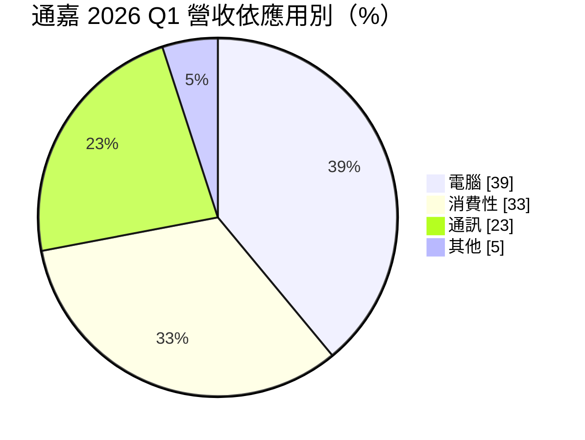
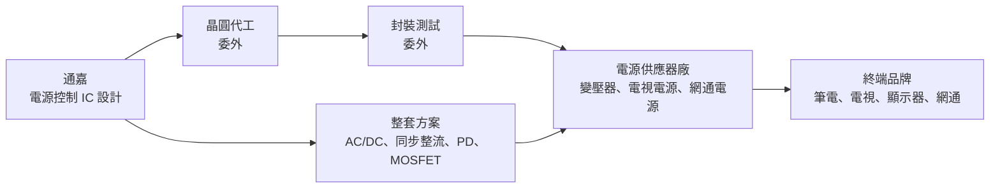
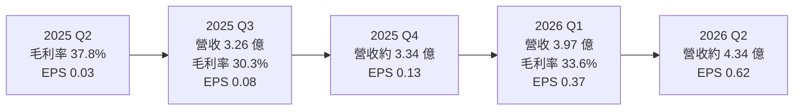
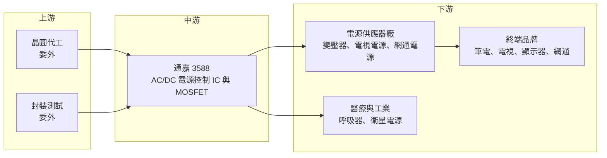

# 3588 通嘉

> 上市｜[[產業索引-半導體業|半導體業]]｜上市（櫃）日期 2009/08/14

# 第一章：企業模式與商業藍圖

> [!info] 撰寫說明
> 本文由 Claude 依公開資料整理，架構比照 [[2330台積電]] 的四章研究，資料截至 2026-10-07。財務數字來源：富果研究法說會整理（2025 年 12 月、2026 年 6 月）、Yahoo 股市各季 EPS 與月營收、證交所開放資料（本筆記 _data 快照：2026 上半年綜合損益、資產負債、月營收、股利、本益比）；產業描述為整理性內容，尚未逐條比對原始文件。#待校對

在評估單一個股的長期投資價值時，首要步驟是拆解企業的底層獲利邏輯。本章針對通嘉科技（股票代號：3588，以下簡稱通嘉）的商業模式進行定性分析，說明這家專做交流轉直流（AC/DC）電源控制晶片的設計公司，如何在中國同業低價競爭與歐美大廠轉向之間尋找成長機會。

## 一、核心定位：AC/DC 電源管理 IC 的專業設計公司

通嘉成立於 2002 年，2009 年在證交所上市，實收資本額約 6.20 億元，屬於 [[Fabless]] IC 設計公司。公司專注於[[電源管理IC]]中的 AC/DC 轉換領域，也就是把插座的交流電轉成電子產品可用的直流電，主要產品包括：

* **PWM 與 [[PFC]] 控制 IC：** 控制電源供應器開關頻率與功率因數，是變壓器、充電器的核心晶片。
* **[[同步整流]] IC：** 取代傳統二極體整流，提高電源轉換效率。
* **[[PD]] 控制 IC：** USB 快充協定晶片，用於筆電與手機充電器。
* **[[MOSFET]]：** 與控制 IC 搭配出貨的功率開關元件，讓通嘉能提供完整方案。

通嘉的定位是「中大功率、整套方案」：不和中國同業在低價手機充電器上硬拼，而是把重心放在筆電變壓器、電視、顯示器、網通設備等需要較高效率與穩定度的中大功率應用。

## 二、終端應用／產品板塊：電腦已成最大應用

依 2026 年 6 月法說，2026 年第一季營收結構如下：

* **電腦（39%）：** 筆電變壓器整合方案，包含 AC/DC 控制、同步整流、PD 控制 IC 與 MOSFET，是最大成長動能。
* **消費性（33%）：** 電視與顯示器電源，2026 年受世界盃足球賽電視換機潮與中國 618 購物節提前備貨帶動。
* **通訊（23%）：** 網通設備與電信電源。上游成本上漲後，中國同業低價競爭趨緩，營收回升。
* **其他（5%）：** 工業用標準電源、醫療設備（已打入全球最大呼吸器製造商供應鏈），以及[[低軌衛星]]電源等新應用。

## 三、資本轉化邏輯（營運模式）：一站式方案綁定電源廠

* **一站式解決方案：** 依 2026 年 6 月法說，通嘉在筆電市場推動「一站式」方案，把控制 IC、同步整流、PD 協定與 MOSFET 一起提供，讓電源廠減少設計時間與料件數，也提高通嘉在每一台變壓器中的內容價值。
* **設計導入週期：** 電源晶片需要通過電源廠與品牌的安規、效率與可靠度驗證，一旦設計導入，通常會跟著產品出貨一到數年。
* **成本壓力轉嫁：** 依法說，上游晶圓代工與封測成本因 AI 產能排擠而有上漲壓力，通嘉需要靠產品組合與漲價維持毛利率。

## 四、企業長期藍圖：數位電源、能效法規與轉單機會

* **數位控制 IC：** PFC 加 [[LLC]] 的數位 Combo 控制 IC 已量產，用於大尺寸電視與網通；數位式交錯 PFC 控制 IC 已導入多家電源大廠，是往中大功率、高效率市場移動的關鍵產品。
* **能效法規帶動：** 公司表示 2027 年新能效法規將上路，客戶在 2026 年提前導入高效率方案，有利筆電與電源產品升級。
* **歐美大廠轉單：** 依 2026 年 6 月法說，TI、NXP、Infineon 等歐美大廠因 AI 產能排擠調漲電源晶片價格，並把資源轉向高階伺服器與車用，給通嘉在電視、顯示器、筆電、網通等中大功率應用的轉單機會。
* **新應用：** 低軌衛星電源已完成關鍵技術驗證，戶外 [[Mini LED]] 與高瓦數通訊基站電源也在布局中。

# 第二章：護城河深度與競爭優勢

在長期價值投資中，「護城河」指企業抵禦競爭、維持超額利潤的保護機制。本章分析通嘉在 AC/DC 電源管理 IC 市場的護城河構成、主要競爭對手，以及它能否在中國同業低價競爭下維持毛利率。

## 一、護城河的核心組成要素

通嘉的護城河屬於「窄護城河」，主要來自以下三點：

* **1. 電源設計的驗證門檻：** 電源晶片關係到產品安全，必須通過安規與長期可靠度測試。電源廠一旦採用某家控制 IC，改版需要重新驗證，有一定轉換成本。
* **2. 整套方案的綁定效果：** 控制 IC、同步整流、PD 與 MOSFET 一起供應，客戶更換其中一顆晶片就要重新調校整個電源，綁定效果比單顆晶片更強。
* **3. 中大功率與數位控制技術：** 數位 PFC 與 LLC 控制需要較深的電源演算法經驗，比低階手機充電器晶片有更高的進入門檻。

## 二、全球主要競爭對手格局

| 對手 | 定位 | 對通嘉的威脅 |
|---|---|---|
| Power Integrations | 美國 AC/DC 電源 IC 大廠，整合度高 | 在高效率充電器與家電電源技術領先 |
| TI、NXP、Infineon、onsemi | 歐美類比與功率半導體大廠 | 產品線完整，但近年資源轉向伺服器與車用 |
| 昂寶、芯朋微、矽力杰 | 中國與台資電源 IC 廠 | 以低價搶中國充電器與網通電源市場 |
| [[2436偉詮電]] | 台灣電源與 USB PD 控制 IC | 在 PD 與充電器市場直接競爭 |

## 三、優勢轉化：哪些市場守得住、哪些守不住

* **守得住：** 筆電變壓器整套方案、電視與顯示器的中大功率電源、網通與工業電源。這些產品重視效率與穩定度，客戶較不會只因價格轉單。
* **守不住：** 低階手機與小家電充電器。中國同業成本低、價格競爭激烈，2025 年第三季毛利率從 37.8% 降到 30.3%，主因就是全球需求疲弱與中國同業競爭。
* **觀察重點：** 2026 年 1 至 8 月營收 11.41 億元，年增 26.3%。觀察重點包括：歐美大廠轉單能否持續、數位控制 IC 的出貨占比，以及上游晶圓與封測漲價下毛利率能否守在 35% 左右。

# 第三章：財務體質與盈利規模

資料日期：2026-10-07。數字取自富果研究法說整理、Yahoo 股市與證交所開放資料快照，表格是撰寫當時的快照；最新月營收、毛利率、累計 EPS 由自動排程寫在本筆記的屬性欄位（月營收、毛利率、累計EPS 等）。#待校對

財務報表是檢驗護城河是否真實存在的最終標準。本章用三率、ROE、現金流與資本報酬，檢視通嘉在電源 IC 價格競爭下的獲利品質。

## 一、獲利能力的基石：三率

| 項目 | 2025 全年 | 2025 Q3 | 2025 Q4 | 2026 Q1 | 2026 Q2 | 2026 上半年 |
|---|---|---|---|---|---|---|
| 營收（新台幣） | 13.49 億 | 3.26 億 | 3.34 億（推算） | 3.97 億 | 4.34 億（推算） | 8.31 億 |
| [[毛利率]] | 未查得 | 30.3% | 約 31.6%（推算） | 33.6% | 約 36.6%（推算） | 35.2% |
| [[營業利益率]] | 未查得 | 未查得 | 未查得 | 未查得 | 未查得 | 7.5% |
| EPS（元） | 0.51 | 0.08 | 0.13 | 0.37 | 0.62 | 1.00 |

註：2025 Q4 與 2026 Q2 營收由月營收加總推算；2026 Q2 毛利率由上半年毛利減第一季毛利推算；2025 全年 EPS 為各季加總。

* **毛利率：** 2025 年第二季 37.8%、第三季跌到 30.3%，2026 年回升到 35% 左右，顯示中國同業競爭趨緩與產品組合改善的效果。
* **營業利益率：** 2026 年上半年毛利 2.93 億元，營業利益只有 0.63 億元，營業利益率 7.5%。IC 設計公司研發費用占比高，營收規模在 13 至 17 億元之間時，營業利益率很難大幅提升，但營收成長的[[營運槓桿]]明顯：2026 年第二季 EPS 已超過 2025 年全年。
* **獲利波動：** 2024 年 EPS 約 1.89 元，2025 年降到 0.51 元，2026 年上半年回到 1.00 元。

## 二、[[ROE]]：資本效率

依證交所資料，2026 年第二季底股東權益約 18.14 億元，上半年稅後淨利 0.61 億元，年化 ROE 約 6.7%（推估）；2025 年淨利約 0.31 億元，ROE 不到 2%（推估）。總負債 3.62 億元、總資產 21.76 億元，[[負債比]]約 17%，財務保守。ROE 偏低主要是營業利益率不高，股價淨值比約 1.90 倍，[[本益比]]約 46.8 倍，市場已反映獲利回升的預期。

## 三、資本支出與自由現金流

* **[[CapEx]]：** Fabless 模式的資本支出以研發設備、光罩為主，金額不大，具體數字未查得。
* **[[自由現金流]]：** 營收成長時應收帳款與存貨會增加，2025 年第四季公司提到客戶策略性「最後下單」備貨，存貨水位需要觀察（具體現金流數字未查得）。
* **股利：** 2025 年度擬配發現金 0.5 元，其中盈餘分配 0.3 元、[[資本公積]]發放 0.2 元。以 EPS 0.51 元計算，配發率接近百分之百，部分來自資本公積。

## 四、[[ROIC]] 與 [[WACC]]：價值創造利差

通嘉投入資本以營運資金與研發為主，2025 年獲利低迷時 ROIC 明顯低於資金成本；2026 年獲利回升，但年化 ROE 仍不到 7%，ROIC 可能仍低於一般股權資金成本（推估，具體數值未查得）。要讓利差轉正，需要營收規模擴大到足以攤提研發費用，並讓數位控制等高毛利產品占比上升。

# 第四章：總體風險與地緣政治

任何企業都無法脫離宏觀環境獨立存在。本章分析通嘉未來必須面對的地緣政治、產業週期與營運風險。

## 一、地緣政治

* **中國電源廠集中：** 電源供應器的生產基地多在中國，中國推動國產晶片替代時，本土電源 IC 廠會優先取得訂單。
* **美國關稅：** 筆電、電視與網通設備若被課徵關稅，終端需求與供應鏈遷移都會影響電源晶片訂單。
* **供應鏈轉移：** 電源廠往東南亞、印度、墨西哥移動，通嘉需要跟著客戶建立當地支援能力。

## 二、產業週期與市場結構

* **消費性電子循環：** 電腦與消費性合計占營收七成以上，PC 與電視需求轉弱時，電源 IC 訂單會先受影響，屬典型[[長鞭效應]]。
* **提前備貨的回吐：** 2026 年部分需求來自世界盃電視換機、618 提前備貨與能效法規前的提前導入，若這些需求是提前消化，2027 年可能出現需求空窗。
* **價格競爭：** 中國電源 IC 廠產能大、價格低，若上游成本壓力緩解，低價競爭可能再度加劇。

## 三、營運環境的隱性風險

* **晶圓與封測成本上漲：** AI 產能排擠造成成熟製程與封測成本上漲，若無法完全轉嫁，毛利率會被壓縮。
* **轉單的持續性：** 歐美大廠轉向伺服器與車用帶來的轉單，可能隨大廠產能釋出而減少。
* **匯率：** 營收以美元計價為主，新台幣升值會影響毛利率。

## 四、科技或法規演進

* **[[GaN]] 與高頻化：** 氮化鎵功率元件讓充電器更小、效率更高，控制 IC 需要配合高頻驅動設計，若在 GaN 方案落後，可能失去高階充電器市場。
* **能效法規升級：** 各國能效標準持續提高，對擁有高效率方案的廠商有利，但也要求持續研發投入。
* **AI 伺服器電源：** AI 伺服器電源功率大幅提升，但目前由歐美大廠與台灣電源大廠主導，通嘉能否切入仍未查得具體進展。

# 專有名詞解析

## 半導體

- **[[電源管理IC]]**：負責電壓轉換、穩壓與電源分配的晶片，幾乎所有電子產品都需要。
- **[[PD]]**：USB Power Delivery 快充協定，讓充電器與裝置協商電壓電流，可支援筆電等大功率充電。
- **[[MOSFET]]**：金屬氧化物半導體場效電晶體，電源轉換中負責開關電流的功率元件。
- **[[PFC]]**：功率因數修正，讓電源從電網取電時更有效率，中大功率電源依法規須具備。
- **[[LLC]]**：一種諧振式電源轉換架構，轉換效率高，常用於電視、伺服器等中大功率電源。
- **[[同步整流]]**：以 MOSFET 取代二極體進行整流，降低導通損耗、提高電源效率。
- **[[GaN]]**：氮化鎵，一種化合物半導體，用於功率元件可讓充電器更小、效率更高。
- **[[Fabless]]**：只做晶片設計、不擁有晶圓廠的 IC 設計公司，製造委託晶圓代工廠。

## 應用

- **[[低軌衛星]]**：在約 2,000 公里以下軌道運行的通訊衛星，用於全球寬頻網路，需要大量地面與衛星電源設備。

## 金融

- **[[營運槓桿]]**：費用固定比例高時，營收小幅變動會造成獲利大幅變動的現象。
- **[[資本公積]]**：股東投入資本中超過股票面額的部分，例如溢價發行，可在一定條件下發放現金給股東。
- **[[負債比]]**：總負債除以總資產，衡量公司財務槓桿與償債壓力。
- **[[本益比]]**：股價除以每股盈餘，衡量市場願意為每一元獲利支付多少價格。
- **[[長鞭效應]]**：終端需求的小幅變動，沿供應鏈往上游傳遞時被逐級放大，造成上游庫存與訂單劇烈波動。

## 產業

- **[[Mini LED]]**：以大量微小 LED 作為顯示或背光的技術，可提高亮度與對比。

# 核心供應鏈

## 1. 上游：晶圓代工與封測
- 晶圓代工與封裝測試皆委外，具體合作廠商公司未揭露

## 2. 中游：通嘉本身
- 產品：PWM 與 PFC 控制 IC、同步整流 IC、PD 控制 IC、MOSFET、數位 Combo 控制 IC

## 3. 下游：客戶
- 電源供應器廠：[[2308台達電]]、[[2301光寶科]]、[[3015全漢]]、[[6412群電]] 等台灣電源大廠為潛在客戶群（推估，公司未揭露客戶名單）
- 終端：筆電、電視、顯示器、網通設備品牌
- 醫療：全球最大呼吸器製造商（名稱未揭露）

## 4. 同業
- 國際：Power Integrations、TI、NXP、Infineon、onsemi
- 中國：昂寶、芯朋微、矽力杰
- 台灣：[[2436偉詮電]]

## 最新新聞
<!-- news:start -->
<!-- news:end -->

## 相關連結
- [公開資訊觀測站](https://mopsov.twse.com.tw/mops/web/t05st03?step=1&firstin=1&co_id=3588)
- [Goodinfo](https://goodinfo.tw/tw/StockDetail.asp?STOCK_ID=3588)
- [Yahoo 股市](https://tw.stock.yahoo.com/quote/3588)
- [鉅亨網新聞](https://www.cnyes.com/twstock/3588/news)
