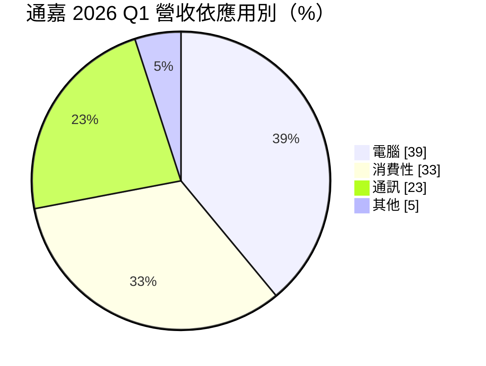
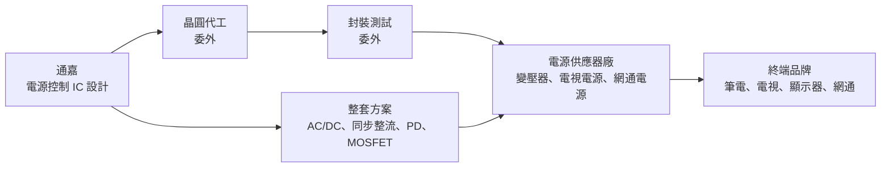
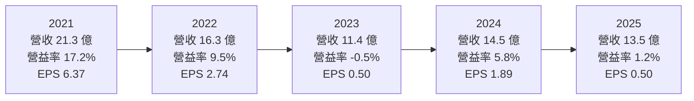
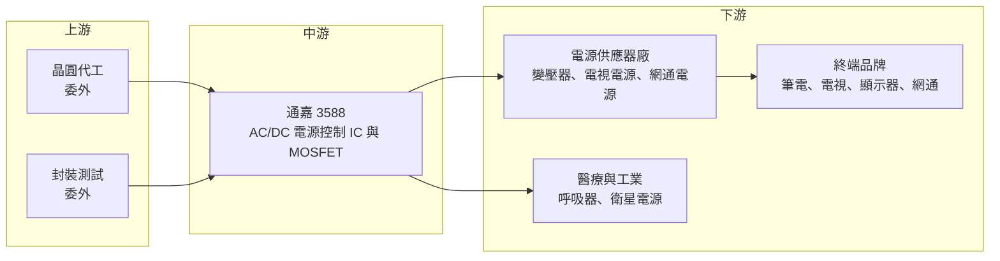

# 3588 通嘉

> 上市｜[[產業索引-半導體業|半導體業]]｜上市（櫃）日期 2009/08/14

# 第一章：企業模式與商業藍圖

> [!info] 撰寫說明
> 本文由 Claude 依公開資料整理，架構比照 [[2330台積電]] 的四章研究，資料截至 2026-10-08。財務數字來源：Goodinfo 台灣股市資訊網年度經營績效與股利政策、富果研究法說會整理（2025 年 12 月、2026 年 6 月）、Yahoo 股市各季 EPS、證交所開放資料（本筆記 _data 快照）；產業描述為整理性內容，尚未逐條比對原始文件。#待校對

在評估單一個股的長期投資價值時，首要步驟是拆解企業的底層獲利邏輯。本章針對通嘉科技（股票代號：3588，以下簡稱通嘉）的商業模式進行定性分析，說明這家專做交流轉直流（AC/DC）電源控制晶片的設計公司，如何在中國同業低價競爭與歐美大廠之間找到生存空間，以及它為什麼長期難以擴大獲利。

## 一、核心定位：AC/DC 電源管理 IC 的專業設計公司

通嘉成立於 2002 年，2009 年在證交所上市，實收資本額約 6.20 億元，屬於 [[Fabless]] IC 設計公司。公司專注於[[電源管理IC]]中的 AC/DC 轉換領域，也就是把插座的交流電轉成電子產品可用的直流電。幾乎每一台筆電變壓器、電視、顯示器、網通設備都需要這類晶片，市場需求廣泛而穩定。

通嘉的主要產品可以分成四類，彼此搭配成完整的電源方案：

* **PWM 與 [[PFC]] 控制 IC：** 控制電源供應器的開關頻率與功率因數，是變壓器、電源板的核心晶片，決定電源的效率與穩定度。
* **[[同步整流]] IC：** 以電晶體取代傳統二極體整流，降低能量損耗。隨著各國能效法規提高，同步整流已從高階產品逐漸普及到中階產品。
* **[[PD]] 控制 IC：** USB 快充協定晶片，讓充電器與筆電、手機協商電壓電流，是 USB-C 充電普及後的必備元件。
* **[[MOSFET]]：** 與控制 IC 搭配出貨的功率開關元件，讓通嘉能提供完整方案，而不只是單顆控制晶片。

通嘉的長期定位是「中大功率、整套方案」：不和中國同業在低價手機充電器上硬拼，而是把重心放在筆電變壓器、電視、顯示器、網通設備等需要較高效率與穩定度的應用。

## 二、終端應用／產品板塊：電腦已成最大應用

依 2026 年 6 月法說，2026 年第一季營收結構如下：

* **電腦（39%）：** 筆電變壓器的整合方案，包含 AC/DC 控制、同步整流、PD 控制 IC 與 MOSFET，是通嘉近年最大的成長來源。筆電品牌對變壓器的效率與體積要求高，有利於能提供整套方案的供應商。
* **消費性（33%）：** 電視與顯示器電源。這塊業務跟著電視換機週期與大型促銷檔期起伏，波動較大。
* **通訊（23%）：** 網通設備與電信電源，是中國同業低價競爭最激烈的市場之一，毛利率受價格戰影響明顯。
* **其他（5%）：** 工業用標準電源、醫療設備（依 2025 年 12 月法說，已打入全球最大呼吸器製造商供應鏈），以及[[低軌衛星]]電源等新應用。這些市場規模小，但產品週期長、毛利率較好。

## 三、資本轉化邏輯（營運模式）：一站式方案綁定電源廠

通嘉的直接客戶是電源供應器廠，而不是終端品牌。電源廠設計變壓器或電源板時，會選擇一組控制晶片並通過品牌的安規與效率驗證，之後就跟著產品量產出貨。

* **一站式解決方案：** 通嘉在筆電市場推動「一站式」方案，把控制 IC、同步整流、PD 協定與 MOSFET 一起提供。這讓電源廠減少設計時間與料件數，也提高通嘉在每一台變壓器中的內容價值，是它從賣單顆晶片轉向賣方案的關鍵策略。
* **設計導入週期：** 電源晶片需要通過電源廠與品牌的安規、效率與可靠度驗證，一旦導入，通常會跟著產品出貨一到數年，形成一定的訂單能見度。
* **成本與價格：** 電源控制 IC 多採用[[成熟製程]]，晶圓與封測成本上漲時，通嘉需要靠產品組合與調價維持毛利率。但面對議價力強的電源廠與中國同業，轉嫁能力有限。

## 四、企業長期藍圖：數位電源、能效法規與轉單機會

* **數位控制 IC：** 依 2026 年 6 月法說，PFC 加 [[LLC]] 的數位 Combo 控制 IC 已量產，用於大尺寸電視與網通；數位式交錯 PFC 控制 IC 已導入多家電源大廠。數位控制是往中大功率、高效率市場移動的關鍵技術，也是與中國低價同業拉開差距的方向。
* **能效法規帶動升級：** 各國能效法規持續提高，例如公司提到 2027 年將上路的新能效規範，會迫使電源廠導入更高效率的方案，對擁有同步整流與數位控制技術的通嘉有利。
* **歐美大廠轉向：** 依 2026 年 6 月法說，TI、NXP、Infineon 等歐美大廠把資源轉向高階伺服器與車用，並調漲部分電源晶片價格，給通嘉在電視、顯示器、筆電、網通等中大功率應用爭取轉單的機會。這是一個可能持續數年的結構性變化。
* **資本配置習慣：** 依 Goodinfo，通嘉每年都配發現金股利，2020 至 2024 年另配發股票股利，現金股利金額隨獲利在 0.4 元至 3.3 元之間變動。

# 第二章：護城河深度與競爭優勢

在長期價值投資中，「護城河」指企業抵禦競爭、維持超額利潤的保護機制。本章分析通嘉在 AC/DC 電源管理 IC 市場的護城河構成、主要競爭對手，以及它能否在中國同業低價競爭下維持毛利率。

## 一、護城河的核心組成要素

通嘉的護城河屬於「窄護城河」，優勢主要來自驗證門檻與整套方案。

* **1. 電源設計的驗證門檻：** 電源晶片關係到產品安全，必須通過安規與長期可靠度測試。電源廠一旦採用某家控制 IC，改版就要重新驗證，有一定轉換成本。這讓已經導入的供應商可以穩定供貨，但也讓新進者需要時間才能打進客戶。
* **2. 整套方案的綁定效果：** 控制 IC、同步整流、PD 與 MOSFET 一起供應，客戶若更換其中一顆，就要重新調校整個電源。綁定效果比單顆晶片更強，是通嘉近年最重要的競爭手段。
* **3. 中大功率與數位控制技術：** 數位 PFC 與 LLC 控制需要較深的電源演算法經驗，進入門檻比低階手機充電器晶片高，是通嘉與中國低價同業區隔的主要技術。

## 二、全球主要競爭對手格局

| 對手 | 定位 | 對通嘉的威脅 |
|---|---|---|
| Power Integrations | 美國 AC/DC 電源 IC 大廠，整合度高 | 在高效率充電器與家電電源技術領先 |
| TI、NXP、Infineon、onsemi | 歐美類比與功率半導體大廠 | 產品線完整，但近年資源轉向伺服器與車用 |
| 昂寶、芯朋微、矽力杰 | 中國與台資電源 IC 廠 | 以低價搶中國充電器與網通電源市場 |
| [[2436偉詮電]] | 台灣電源與 USB PD 控制 IC | 在 PD 與充電器市場直接競爭 |

## 三、優勢轉化：守得住／守不住／觀察重點

* **守得住：** 筆電變壓器整套方案、電視與顯示器的中大功率電源、醫療與工業電源。這些產品重視效率、安規與穩定度，客戶不會只因價格轉單，是通嘉毛利率長期維持在 32% 至 41% 的基礎。
* **守不住：** 低階手機與小家電充電器、部分網通電源。中國同業成本低、價格競爭激烈，這些市場的毛利率會被持續壓縮。2023 年通嘉營業利益率轉為負值，部分原因就是低價競爭與需求疲弱同時發生。
* **觀察重點：** 長期可以觀察三個指標：數位控制 IC 與整套方案占營收的比重；營業利益率能否在非高峰年度穩定在 5% 以上；以及歐美大廠轉向後釋出的中大功率市場，通嘉能否真正接下來。

# 第三章：財務體質與盈利規模

資料日期：2026-10-08。數字取自 Goodinfo 年度經營績效與股利政策、富果研究法說整理、Yahoo 股市與證交所開放資料快照，表格是撰寫當時的快照；最新月營收、毛利率、累計 EPS 由自動排程寫在本筆記的屬性欄位（月營收、毛利率、累計EPS 等）。#待校對

財務報表是檢驗護城河是否真實存在的最終標準。本章用多年度的三率、ROE、現金流與資本報酬，檢視通嘉在電源 IC 價格競爭下的獲利品質。

## 一、獲利能力的基石：三率

| 年度 | 營收（新台幣） | [[毛利率]] | [[營業利益率]] | EPS（元） | [[ROE]] | 現金股利（元） |
|---|---|---|---|---|---|---|
| 2019 | 10.5 億 | 34.7% | 2.7% | 0.50 | 1.8% | 1.00 |
| 2020 | 14.5 億 | 32.2% | 5.4% | 1.30 | 4.6% | 0.60 |
| 2021 | 21.3 億 | 41.3% | 17.2% | 6.37 | 22.1% | 3.30 |
| 2022 | 16.3 億 | 40.6% | 9.5% | 2.74 | 9.2% | 0.91 |
| 2023 | 11.4 億 | 37.6% | -0.5% | 0.50 | 1.8% | 0.40 |
| 2024 | 14.5 億 | 38.0% | 5.8% | 1.89 | 6.6% | 1.20 |
| 2025 | 13.5 億 | 34.0% | 1.2% | 0.50 | 1.7% | 0.50 |

註：EPS 取 Goodinfo 年度資料；公司 2020 至 2024 年曾配發股票股利，較早年度的 EPS 可能經過追溯調整，與當年公告數字略有差異。

通嘉的財務數字顯示一個清楚的型態：毛利率相當穩定，但營業利益率波動很大。七年中毛利率都在 32% 至 41% 之間，代表產品本身的定價有一定支撐；但營業利益率從 -0.5% 到 17.2% 不等，主因是營收規模的變化。

* **[[毛利率]]：** 長期約 32% 至 41%，在電源 IC 設計公司中屬於中等水準。2021 年缺貨期毛利率最高，2025 年受中國同業競爭與需求疲弱影響降到 34%。
* **[[營業利益率]]：** 研發與管理費用每年大約固定，營收在 11 億至 15 億元時，營業利益率只有 0% 至 6%；營收衝到 21 億元的 2021 年，營業利益率就跳到 17.2%。這是典型的[[營運槓桿]]：通嘉需要營收規模明顯擴大，獲利才能真正改善。
* **長期指標：** 2016 至 2025 年營收從 12.2 億元到 13.5 億元，年複合成長率約 1.1%（推算），十年幾乎沒有成長；2021 至 2025 年五年平均 ROE 約 8.3%（推算），其中大部分來自 2021 年。現金股利每年都有發放，但金額隨獲利大幅變動。

## 二、[[ROE]]：資本效率

通嘉幾乎沒有負債，2026 年第二季底[[負債比]]約 17%，ROE 完全由本業獲利決定。七年中只有 2021 年 ROE 超過 20%，2022 年約 9%，其餘年份都在 7% 以下。這說明通嘉在正常年度的資本效率偏低，只有在缺貨或需求高峰時才能為股東創造明顯的報酬。

## 三、資本支出與自由現金流

* **[[CapEx]]：** Fabless 模式的資本支出以研發設備、光罩為主，金額相對營收很小，具體數字未查得。
* **[[自由現金流]]：** 低資本支出讓營業現金流大部分可以轉為自由現金流，但營收成長時應收帳款與存貨會增加，占用部分現金。從每年都能配發現金股利、負債始終很低來看，自由現金流長期大致為正（推估，逐年數字未查得）。

## 四、[[ROIC]] 與 [[WACC]]：價值創造利差

通嘉沒有明顯的有息負債，投入資本以股東權益近似。以 2025 年為例，營業利益約 0.16 億元（營收 13.5 億元 × 營業利益率 1.22%），扣除 20% 稅率後約 0.13 億元；股東權益約 18 億元，ROIC 約 0.7%（推算）。2024 年營業利益約 0.85 億元，稅後約 0.68 億元，ROIC 約 3.8%（推算）。2021 年營業利益約 3.66 億元，稅後約 2.93 億元，ROIC 與當年 ROE 相近，約 20%（推算）。

WACC 以 CAPM 推估：台灣 10 年期公債約 1.5% 至 2%，市場風險溢酬約 6%，β 未查得個股數值，採中小型 IC 設計股常見的 1.1 至 1.3（假設），股東權益成本約 8.4% 至 9.6%。沒有有息負債，WACC 約 8.5% 至 9.5%（推算）。

比較兩者，通嘉在過去十年中只有 2021 年前後 ROIC 明顯高於 WACC，其餘多數年份低於資金成本。這代表通嘉的技術與客戶基礎雖然穩定，但規模不足以讓研發投入產生足夠的報酬。整套方案與數位電源能否帶動營收突破 20 億元，是 ROIC 能否長期超過 WACC 的關鍵。

# 第四章：總體風險與地緣政治

任何企業都無法脫離宏觀環境獨立存在。本章分析通嘉長期必須面對的地緣政治、產業週期與營運風險。

## 一、地緣政治

* **中國電源廠集中：** 電源供應器的生產基地多在中國，中國推動國產晶片替代時，本土電源 IC 廠會優先取得訂單。這是長期的結構性壓力。
* **供應鏈轉移：** 電源廠因關稅與地緣政治往東南亞、印度、墨西哥移動，通嘉需要跟著客戶建立當地的技術支援能力，否則可能錯過新產線的設計導入。

## 二、產業週期與市場結構

* **消費性電子循環：** 電腦與消費性合計占營收七成以上，PC 與電視需求轉弱時，電源 IC 訂單會先受影響，屬典型[[長鞭效應]]。2023 年營收下滑三成、營業利益轉為虧損，就是這種循環的結果。
* **價格競爭：** 中國電源 IC 廠產能大、價格低，只要上游成本壓力緩解，低價競爭就可能再度加劇，壓縮通嘉在通訊與消費性市場的毛利率。

## 三、營運環境的隱性風險

* **規模不足：** 年營收在 11 億至 21 億元之間，研發費用占比高，營收稍有下滑就會侵蝕獲利。這是通嘉長期 ROE 偏低的根本原因。
* **成本上漲：** 晶圓代工與封測成本上漲時，若無法完全轉嫁，毛利率會被壓縮。
* **匯率：** 營收以美元計價為主，新台幣升值會影響毛利率。

## 四、科技或法規演進

* **[[GaN]] 與高頻化：** 氮化鎵功率元件讓充電器更小、效率更高，控制 IC 需要配合高頻驅動設計。若通嘉在 GaN 方案上落後，可能失去高階充電器與筆電變壓器市場。
* **能效法規升級：** 各國能效標準持續提高，長期對擁有高效率方案的廠商有利，但也要求持續的研發投入。
* **AI 伺服器電源：** AI 伺服器電源功率大幅提升，目前由歐美大廠與台灣電源大廠主導，通嘉能否切入仍未查得具體進展。若無法參與，通嘉可能錯過電源產業未來十年最大的成長市場。

# 專有名詞解析

## 半導體

- **[[電源管理IC]]**：負責電壓轉換、穩壓與電源分配的晶片，幾乎所有電子產品都需要。
- **[[PD]]**：USB Power Delivery 快充協定，讓充電器與裝置協商電壓電流，可支援筆電等大功率充電。
- **[[MOSFET]]**：金屬氧化物半導體場效電晶體，電源轉換中負責開關電流的功率元件。
- **[[PFC]]**：功率因數修正，讓電源從電網取電時更有效率，中大功率電源依法規須具備。
- **[[LLC]]**：一種諧振式電源轉換架構，轉換效率高，常用於電視、伺服器等中大功率電源。
- **[[同步整流]]**：以 MOSFET 取代二極體進行整流，降低導通損耗、提高電源效率。
- **[[GaN]]**：氮化鎵，一種化合物半導體，用於功率元件可讓充電器更小、效率更高。
- **[[成熟製程]]**：一般指 28 奈米及更大線寬的製程，電源管理 IC 多採用此類製程。
- **[[Fabless]]**：只做晶片設計、不擁有晶圓廠的 IC 設計公司，製造委託晶圓代工廠。

## 應用

- **[[低軌衛星]]**：在約 2,000 公里以下軌道運行的通訊衛星，用於全球寬頻網路，需要大量地面與衛星電源設備。

## 金融

- **[[營運槓桿]]**：費用固定比例高時，營收小幅變動會造成獲利大幅變動的現象。
- **[[負債比]]**：總負債除以總資產，衡量公司財務槓桿與償債壓力。
- **[[ROIC]]**：投入資本報酬率，稅後營業利益除以投入資本，衡量本業運用資金創造報酬的能力。
- **[[WACC]]**：加權平均資金成本，股東與債權人要求報酬率的加權平均，是 ROIC 要超過的門檻。
- **[[長鞭效應]]**：終端需求的小幅變動，沿供應鏈往上游傳遞時被逐級放大，造成上游庫存與訂單劇烈波動。

# 核心供應鏈

## 1. 上游：晶圓代工與封測
- 晶圓代工與封裝測試皆委外，具體合作廠商公司未揭露

## 2. 中游：通嘉本身
- 產品：PWM 與 PFC 控制 IC、同步整流 IC、PD 控制 IC、MOSFET、數位 Combo 控制 IC

## 3. 下游：客戶
- 電源供應器廠：[[2308台達電]]、[[2301光寶科]]、[[3015全漢]]、[[6412群電]] 等台灣電源大廠為潛在客戶群（推估，公司未揭露客戶名單）
- 終端：筆電、電視、顯示器、網通設備品牌
- 醫療：全球最大呼吸器製造商（名稱未揭露）

## 4. 同業
- 國際：Power Integrations、TI、NXP、Infineon、onsemi
- 中國：昂寶、芯朋微、矽力杰
- 台灣：[[2436偉詮電]]

## 最新新聞
<!-- news:start（自動產生，請勿手動編輯此範圍） -->
- 2026-10-08 🏛️ 重訊 20:33｜公告本公司發言人、財務主管、會計主管及公司治理主管異動｜[觀測站](https://mops.twse.com.tw/mops/#/web/t05st01)
- 2026-10-08 🏛️ 重訊 20:33｜公告本公司永續發展委員會委員異動｜[觀測站](https://mops.twse.com.tw/mops/#/web/t05st01)

完整紀錄：[[3588通嘉 新聞]]
<!-- news:end -->

## 相關連結
- [公開資訊觀測站](https://mopsov.twse.com.tw/mops/web/t05st03?step=1&firstin=1&co_id=3588)
- [Goodinfo](https://goodinfo.tw/tw/StockDetail.asp?STOCK_ID=3588)
- [Yahoo 股市](https://tw.stock.yahoo.com/quote/3588)
- [鉅亨網新聞](https://www.cnyes.com/twstock/3588/news)
