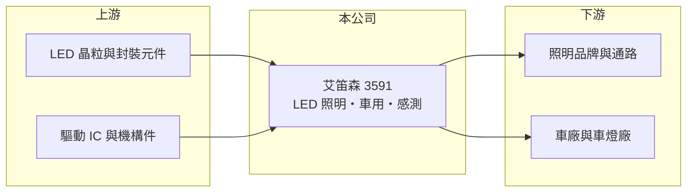

# 3591 艾笛森

> 上市｜[[產業索引-光電業|光電業]]｜上市（櫃）日期 2010/11/12

# 第一章：企業模式與商業藍圖

> [!info] 撰寫說明
> 精簡版，由 Claude 依公開資料整理，架構比照 [[2330台積電]]，資料截至 2026-10-07。來源：poorstock.com 艾笛森資料、winvest.tw 營收快訊。公開資料有限，營收比重未查到。#待校對

艾笛森是 LED 照明與車用光源廠，2026 年營收明顯成長。

- **核心業務：** 艾笛森總部位於新北市中和區，專營 LED 照明產品、LED 車用產品與感測元件的研發、製造及銷售。
- **營收結構：** 本次未查到各產品比重，主要分為 LED 照明、車用 LED 與感測元件三類，屬於 [[LED封裝]]下游的應用模組廠。
- **營運據點：** 總部在新北中和，生產據點本次未查到，推估以中國廠區為主。
- **長期方向：** 從一般照明轉向車用照明與感測元件等較高附加價值領域（推估）。

# 第二章：護城河深度與競爭優勢

艾笛森規模不大，競爭優勢主要在車用與特殊照明的客製能力。

- **競爭優勢：** 車用 LED 須通過[[車規驗證]]，一旦導入車款通常可供貨數年，客戶黏著度高於一般照明。
- **主要對手：** [[2393億光]]、[[3714富采]]旗下隆達，以及中國 LED 封裝與照明廠。
- **觀察重點：** 2026 年下半年月營收年增 40% 以上能否延續，以及成長來源是哪一條產品線。

# 第三章：財務體質與盈利規模

資料日期：2026-10-07，以下數字是撰寫當時的快照；最新月營收、毛利率、累計 EPS 由自動排程寫在本筆記的屬性欄位（月營收、毛利率、累計EPS 等）。#待校對

艾笛森營收連續數月高成長，但獲利仍薄。

- **營收規模：** 2026 年 8 月營收 2.71 億元、年增 44.13%，9 月約 2.39 億元、年增 40.55%；6、7 月也分別年增 34.83% 與 28.53%。
- **獲利：** 2026 年第二季 EPS 0.16 元；[[毛利率]]本次未查到。
- **財務特色：** 每股淨值約 20.45 元（2026 年第二季），獲利占股本比例偏低。

# 第四章：總體風險與地緣政治

艾笛森的風險在於 LED 照明商品化與車用市場景氣。

- **產業週期：** 一般照明 LED 價格長期下滑，車用需求則隨全球汽車銷量起伏。
- **營運風險：** 規模小、毛利空間有限，營收成長若主要來自低毛利產品，對獲利幫助不大。
- **其他風險：** 中國生產據點的地緣政治與關稅風險（推估），以及匯率與原料價格波動。

# 專有名詞解析

## 半導體

- **[[LED封裝]]**：把 LED 晶粒固定、打線並封上螢光粉與膠體，做成可直接上板使用的發光元件。

## 應用

- **[[車規驗證]]**：車用零件須通過 AEC-Q 系列可靠度測試與車廠認證，流程常需 2 至 3 年，因此轉換成本高。

# 核心供應鏈

- 上游：LED 晶粒（如 [[3714富采]]，推估）、LED 封裝元件、驅動 IC 與散熱機構
- 下游／客戶：照明品牌、車燈廠與車廠
- 同業：[[2393億光]]、[[3714富采]]（隆達）

## 最新新聞
<!-- news:start（自動產生，請勿手動編輯此範圍） -->
- 2026-10-05 📰 媒體 08:20｜營收速報 - 艾笛森(3591)9月營收2.39億元年增率高達40.55％｜[鉅亨網](https://news.cnyes.com/news/id/6621437)

完整紀錄：[[3591艾笛森 新聞]]
<!-- news:end -->

## 相關連結
- [公開資訊觀測站](https://mopsov.twse.com.tw/mops/web/t05st03?step=1&firstin=1&co_id=3591)
- [Goodinfo](https://goodinfo.tw/tw/StockDetail.asp?STOCK_ID=3591)
- [Yahoo 股市](https://tw.stock.yahoo.com/quote/3591)
- [鉅亨網新聞](https://www.cnyes.com/twstock/3591/news)
