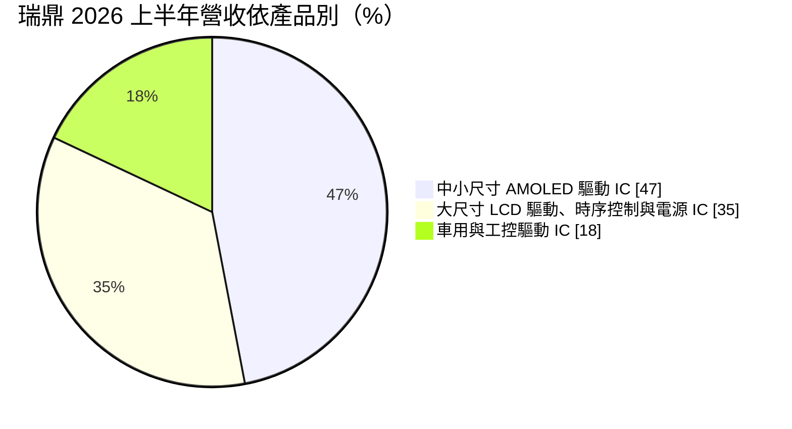
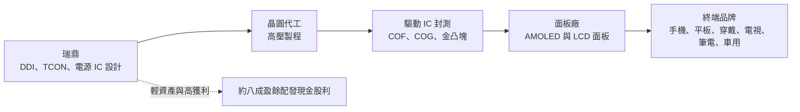
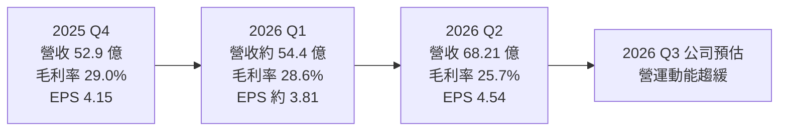
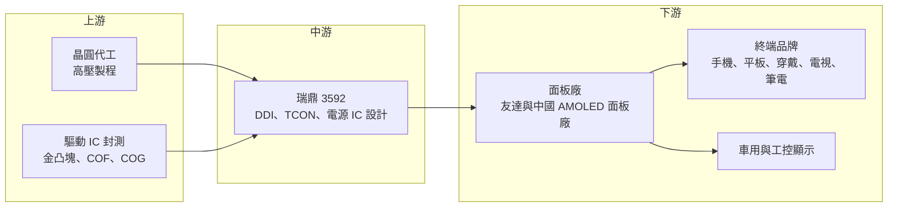

# 3592 瑞鼎

> 上市｜[[產業索引-半導體業|半導體業]]｜上市（櫃）日期 2022/01/07

# 第一章：企業模式與商業藍圖

> [!info] 撰寫說明
> 本文由 Claude 依公開資料整理，架構比照 [[2330台積電]] 的四章研究，資料截至 2026-10-07。財務數字來源：富果研究法說會整理（2026 年 8 月）、工商時報 2026 年 8 月報導、優分析 2025 年財報報導、遠見雜誌公司報導、nStock 公司簡介、證交所開放資料（本筆記 _data 快照：2026 上半年綜合損益、資產負債、月營收、股利、本益比）；產業描述為整理性內容，尚未逐條比對原始文件。#待校對

在評估單一個股的長期投資價值時，首要步驟是拆解企業的底層獲利邏輯。本章針對瑞鼎科技（股票代號：3592，以下簡稱瑞鼎）的商業模式進行定性分析，說明這家原本依附面板母公司的驅動 IC 設計公司，如何轉型為以中小尺寸 [[AMOLED]] 驅動 IC 為主力的供應商。

## 一、核心定位：從面板集團子公司走向 AMOLED 驅動 IC 專業廠

瑞鼎成立於 2003 年，依遠見雜誌報導，由 [[2409友達]] 與 [[2352佳世達]] 合資成立，總部位於新竹科學園區。2019 年與達宙科技合併，瑞鼎為存續公司；2022 年 1 月從興櫃轉上市，實收資本額約 7.59 億元。

瑞鼎屬於 [[Fabless]] IC 設計公司，主營業務是顯示器驅動 IC（[[DDI]]）、時序控制 IC（[[TCON]]）與面板用電源管理 IC 的設計與銷售。它的定位轉變可以分成兩個階段：

* **早期：大尺寸面板驅動 IC，客戶集中在母集團。** 電視、顯示器、筆電面板的驅動 IC 是公司起家業務，與友達的面板出貨高度連動。
* **近年：中小尺寸 AMOLED 驅動 IC 成為主力。** 依遠見雜誌報導，2021 年 AMOLED 驅動晶片已占營收三成以上，並以摺疊手機面板驅動技術見長；到 2026 年上半年，AMOLED 已占營收 47%。

## 二、終端應用／產品板塊：AMOLED 近半，大尺寸與車用分居其次

依 2026 年 8 月法說，2026 年上半年營收結構如下：

* **中小尺寸 AMOLED 驅動 IC（47%）：** 用於智慧手機、平板與穿戴裝置，客戶以中國 AMOLED 面板廠為主（推估，公司未揭露具體名單）。2026 年第二季受新機發表與品牌提前備貨帶動，成長最明顯。
* **大尺寸 LCD 驅動、時序控制與電源 IC（35%）：** 電視、顯示器與筆電面板用，第二季季增；2025 年底記憶體漲價帶動 IT 產品提前備貨，也挹注了這塊業務。
* **車用與工控驅動 IC（18%）：** 車用顯示與工業控制面板，公司預期維持穩定成長，是生命週期最長、波動最小的板塊。

## 三、資本轉化邏輯（營運模式）：晶圓採購、面板廠綁定與高配息

* **面板廠是直接客戶：** 驅動 IC 必須和面板一起設計，面板廠決定採用哪家驅動 IC。瑞鼎與友達的長期關係，以及與中國 AMOLED 面板廠的合作，是接單的基礎。
* **晶圓與封測成本是主要變數：** 驅動 IC 需要高壓製程與金凸塊、COF 封裝。依工商時報 2026 年 8 月報導，晶圓代工、封裝與貴金屬成本壓力未能完全轉嫁，是第二季毛利率下滑的主因。
* **高配息政策：** 輕資產模式讓瑞鼎能把大部分獲利發給股東。2025 年度每股配發 14.6 元，[[配發率]]約 80%。
* **庫存與現金：** 2026 年第二季存貨周轉天數 48.4 天，比第一季的 56.3 天改善；帳上現金約 36.24 億元。

## 四、企業長期藍圖：OLED TCON、Micro LED 與車用

* **OLED 時序控制 IC：** 依 2026 年 8 月法說，OLED TCON 有機會在 2026 年底進入量產，讓瑞鼎從驅動 IC 延伸到 OLED 面板的時序控制，提高單一面板中的內容價值。
* **[[Micro LED]] TDDI：** Micro LED 用觸控顯示整合驅動 IC 同樣有機會在 2026 年底量產，屬於新顯示技術的早期布局。
* **車用顯示：** 車內螢幕越來越大、越來越多，車用驅動 IC 是公司明確要加強的方向，生命週期長、認證門檻高。

# 第二章：護城河深度與競爭優勢

在長期價值投資中，「護城河」指企業抵禦競爭、維持超額利潤的保護機制。本章分析瑞鼎的護城河構成、主要競爭對手，以及這些優勢在韓國大廠與中國同業競爭下能守住多少。

## 一、護城河的核心組成要素

瑞鼎的護城河屬於「中等偏窄」，主要來自以下三點：

* **1. AMOLED 與摺疊面板驅動技術：** AMOLED 驅動需要像素補償、低功耗與高解析度控制，摺疊螢幕更增加設計難度。瑞鼎在這個領域累積多年經驗，是少數能與韓國大廠競爭的台灣廠商之一。
* **2. 面板廠合作關係：** 驅動 IC 需要和面板同步開發，從面板設計初期就要參與。與友達的長期合作，以及與中國 AMOLED 面板廠的合作，是新進者難以短期建立的。
* **3. 產品線橫跨驅動、時序與電源：** 同一塊面板上可以提供多顆晶片，提高客戶黏著度，也讓公司在大尺寸與中小尺寸之間調整產品組合。

## 二、全球主要競爭對手格局

| 對手 | 定位 | 對瑞鼎的威脅 |
|---|---|---|
| [[005930三星電子]]（System LSI） | 全球 AMOLED 驅動 IC 龍頭，綁定三星顯示器 | 在高階 AMOLED 市占與技術領先 |
| LX Semicon、Magnachip | 韓國驅動 IC 廠，前者綁定 LG Display | 在 AMOLED 與大尺寸驅動 IC 競爭 |
| [[3034聯詠]] | 全球前段驅動 IC 廠，產品線完整 | 規模與晶圓議價力大，AMOLED 也積極布局 |
| 奇景光電（Himax） | 車用驅動與 TDDI 強 | 在車用顯示驅動直接競爭 |
| [[4961天鈺]]、[[3545敦泰]] | 台灣 TDDI 與驅動 IC 廠 | 在中小尺寸與部分大尺寸重疊 |
| 集創北方、雲英谷等中國廠 | 中國驅動 IC 廠 | 受國產化政策支持，搶中國 AMOLED 面板廠訂單 |

## 三、優勢轉化：哪些市場守得住、哪些守不住

* **守得住：** 已長期合作的 AMOLED 面板客戶、摺疊與高階機種，以及車用驅動 IC。這些市場重視技術與驗證，價格不是唯一考量。
* **守不住：** 中低階 AMOLED 與大尺寸 LCD 驅動 IC 的報價。中國面板廠有國產化政策誘因，中國驅動 IC 廠以價格切入，加上晶圓成本上漲，毛利率承壓。2025 年毛利率由前一年的約 30% 降到 28.5%，2026 年第二季再降到 25.7%。
* **觀察重點：** 2026 年第三季公司預估營運動能較第二季趨緩、手機需求明顯下滑。觀察重點包括：成本上漲能否轉嫁、OLED TCON 與 Micro LED TDDI 能否如期在年底量產、以及車用與工控的成長能否抵銷手機的波動。

# 第三章：財務體質與盈利規模

資料日期：2026-10-07。數字取自富果研究法說整理、工商時報、優分析與證交所開放資料快照，表格是撰寫當時的快照；最新月營收、毛利率、累計 EPS 由自動排程寫在本筆記的屬性欄位（月營收、毛利率、累計EPS 等）。#待校對

財務報表是檢驗護城河是否真實存在的最終標準。本章用三率、ROE、現金流與資本報酬，檢視瑞鼎在驅動 IC 價格與成本壓力下的獲利品質。

## 一、獲利能力的基石：三率

| 項目 | 2025 全年 | 2025 Q4 | 2026 Q1 | 2026 Q2 | 2026 上半年 |
|---|---|---|---|---|---|
| 營收（新台幣） | 224 億 | 52.9 億 | 54.37 億（推算） | 68.21 億 | 122.58 億 |
| [[毛利率]] | 28.5% | 29.0% | 28.6% | 25.7% | 27.0% |
| [[營業利益率]] | 約 6.8%（推算） | 未查得 | 未查得 | 未查得 | 5.2% |
| EPS（元） | 18.24 | 4.15 | 3.81（推算） | 4.54 | 8.35 |

註：2026 Q1 營收與 EPS 由上半年減第二季推算；2025 營業利益率由營業利益 15.2 億元除以營收推算。

* **毛利率：** 2026 年第二季營收季增 25.4%，但毛利率反而下降 2.9 個百分點到 25.7%，代表營收成長來自毛利較低的產品或成本漲幅超過售價調整。這是「營收成長、獲利未同步」的典型例子：上半年營收年增 5.0%，稅後淨利卻年減 12.6%。
* **營業利益率：** 公司預估全年營業費用率約 21% 至 22%。以 27% 左右的毛利率扣除費用，營業利益率只剩約 5% 至 6%，毛利率每下降 1 個百分點，營業利益就會減少約五分之一（推估）。
* **長期趨勢：** 依優分析報導，2025 年營收 224 億元、年減 8.1%，稅後淨利 13.8 億元、年減 34.1%，EPS 18.24 元為近 5 年新低；2026 年上半年 EPS 8.35 元，也低於前一年同期的 9.56 元。

## 二、[[ROE]]：資本效率

依證交所資料，2026 年第二季底股東權益約 113.89 億元，上半年稅後淨利 6.34 億元，年化 ROE 約 11%（推估）；2025 年以淨利 13.8 億元估算，ROE 約 12% 左右（推估）。總負債 102.34 億元、總資產 216.22 億元，負債比約 47%，負債多為應付帳款與應付股利等營運性負債（推估）。股價淨值比約 1.59 倍、[[本益比]]約 14 倍。

## 三、資本支出與自由現金流

* **[[CapEx]]：** Fabless 模式的資本支出以研發設備與光罩為主，先進驅動 IC 的光罩費用逐年上升，具體金額未查得。
* **[[自由現金流]]：** 獲利大部分轉為營業現金流，足以支應高配息；第二季存貨周轉天數改善到 48.4 天，營運資金壓力不大。
* **股利：** 2025 年度現金股利 14.6 元，配發率約 80%，以撰寫時股價計算[[殖利率]]約 6%。依 nStock 整理，近五年平均現金股利約 27.6 元，反映 2021 至 2022 年高峰期的高配息；股利隨獲利下滑而減少。

## 四、[[ROIC]] 與 [[WACC]]：價值創造利差

瑞鼎輕資產、投入資本以營運資金與研發為主，在 2021 至 2022 年驅動 IC 缺貨高峰期 ROIC 遠高於資金成本；2025 至 2026 年獲利下滑後，ROE 回到 11% 至 12%，ROIC 仍可能略高於資金成本，但利差已大幅收窄（推估，具體數值未查得）。成本轉嫁能力與新產品量產，是利差能否回升的關鍵。

# 第四章：總體風險與地緣政治

任何企業都無法脫離宏觀環境獨立存在。本章分析瑞鼎未來必須面對的地緣政治、產業週期與營運風險。

## 一、地緣政治

* **中國面板廠國產化：** AMOLED 面板產能大量集中在中國，中國推動驅動 IC 國產化時，本土 IC 設計公司會優先取得訂單，瑞鼎在中國客戶的份額面臨壓力。
* **美國關稅：** 手機、電視與筆電等終端產品若被美國課徵關稅，需求與供應鏈轉移都會影響驅動 IC 訂單。
* **台灣晶圓產能：** 依賴台灣晶圓代工高壓製程，兩岸風險與產能分配都會影響供貨。

## 二、產業週期與市場結構

* **提前備貨後的庫存消化：** 2026 年第二季成長來自新機發表與品牌提前備貨，工商時報報導指出下半年需要面對備貨後的庫存消化，第三季營運動能將趨緩，屬典型[[長鞭效應]]。
* **面板產業循環：** 大尺寸業務與電視、顯示器面板景氣連動，面板廠稼動率調整會直接影響驅動 IC 訂單。
* **AMOLED 價格競爭：** 中國驅動 IC 廠加入 AMOLED 市場後，中低階機種報價下滑。

## 三、營運環境的隱性風險

* **成本轉嫁不足：** 晶圓代工、封裝與金凸塊等貴金屬成本上漲，若無法完全轉嫁，毛利率將持續承壓。
* **客戶集中：** 驅動 IC 的客戶是少數面板廠，單一面板廠調整供應商就會造成明顯營收變動。
* **匯率：** 營收以美元計價為主，新台幣升值會壓縮毛利率。

## 四、科技或法規演進

* **顯示技術轉換：** 面板由 LCD 轉向 AMOLED、再到 Micro LED，驅動 IC 必須跟著重新設計。若新技術量產時程落後，可能錯過面板廠的設計導入時機。
* **製程微縮：** 高解析度 AMOLED 驅動 IC 往 28 奈米以下製程移動，光罩與研發成本大幅上升，規模較小的廠商負擔較重。
* **車用規範：** 車用顯示 IC 需要通過[[車規驗證]]，投入時間長，但也提高進入門檻。

# 專有名詞解析

## 半導體

- **[[DDI]]**：顯示驅動 IC，負責控制面板每個像素的電壓，需要高壓製程。
- **[[TCON]]**：時序控制 IC，負責把影像訊號依時序分配給各顆驅動 IC，是面板的影像排程中樞。
- **[[TDDI]]**：觸控與顯示驅動整合晶片，把觸控控制與面板驅動放在同一顆 IC。
- **[[COF]]**：晶粒貼在軟性薄膜上的封裝方式，可讓面板窄邊框，常見於手機與大尺寸驅動 IC。
- **[[金凸塊]]**：在晶片接點上製作的金質凸點，用於驅動 IC 與面板或薄膜的連接，金價上漲會推升成本。
- **[[Fabless]]**：只做晶片設計、不擁有晶圓廠的 IC 設計公司，製造委託晶圓代工廠。

## 應用

- **[[車規驗證]]**：車用晶片須通過 AEC-Q100 等可靠度測試與車廠認證，流程常需 2 至 3 年，因此轉換成本高。

## 金融

- **[[配發率]]**：現金股利占每股盈餘的比例，用來衡量公司把多少獲利發給股東。
- **[[殖利率]]**：每股現金股利除以股價，衡量以現價買入可取得的現金報酬率。
- **[[本益比]]**：股價除以每股盈餘，衡量市場願意為每一元獲利支付多少價格。
- **[[長鞭效應]]**：終端需求的小幅變動，沿供應鏈往上游傳遞時被逐級放大，造成上游庫存與訂單劇烈波動。

## 產業

- **[[AMOLED]]**：主動矩陣有機發光二極體顯示技術，每個像素自己發光，手機、穿戴裝置與摺疊螢幕普遍採用。
- **[[Micro LED]]**：以微米級 LED 作為每個像素的顯示技術，亮度高、壽命長，被視為 OLED 之後的新世代顯示技術。

# 核心供應鏈

## 1. 上游：晶圓代工與封測
- 晶圓代工：高壓製程晶圓代工廠，具體合作對象公司未揭露
- 驅動 IC 封測：[[6147頎邦]]、[[8150南茂]] 等金凸塊與 COF 封測廠（推估，未查得公司揭露名單）

## 2. 中游：瑞鼎本身
- 2003 年由友達與佳世達合資成立，2019 年合併達宙科技

## 3. 下游：面板廠與終端
- 面板廠：[[2409友達]]，以及中國 AMOLED 面板廠（推估，具體名單未查得）
- 終端：智慧手機、平板、穿戴裝置、電視、顯示器、筆電、車用顯示

## 4. 同業
- 台灣：[[3034聯詠]]、[[4961天鈺]]、[[3545敦泰]]
- 韓國：[[005930三星電子]]（System LSI）、LX Semicon、Magnachip
- 其他：奇景光電、集創北方

## 最新新聞
<!-- news:start -->
<!-- news:end -->

## 相關連結
- [公開資訊觀測站](https://mopsov.twse.com.tw/mops/web/t05st03?step=1&firstin=1&co_id=3592)
- [Goodinfo](https://goodinfo.tw/tw/StockDetail.asp?STOCK_ID=3592)
- [Yahoo 股市](https://tw.stock.yahoo.com/quote/3592)
- [鉅亨網新聞](https://www.cnyes.com/twstock/3592/news)
