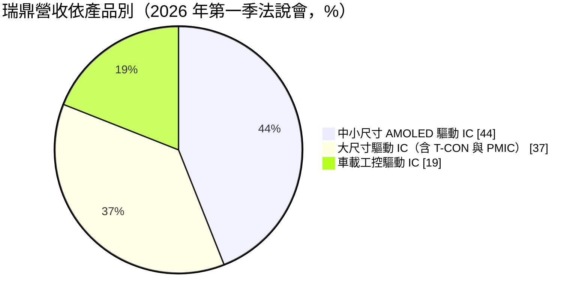
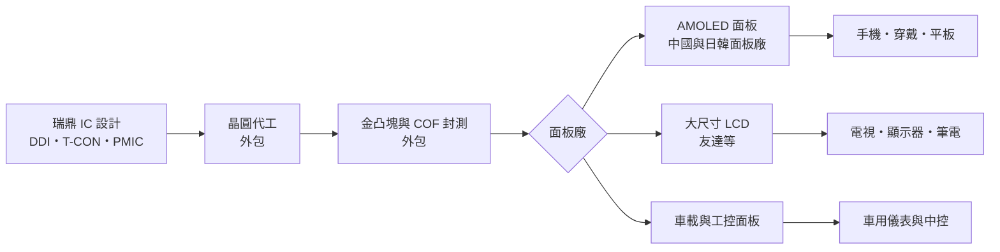
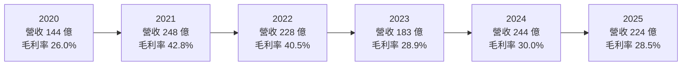
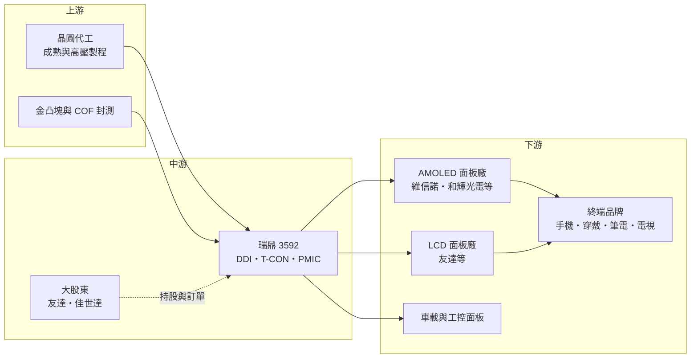

# 3592 瑞鼎

> 上市｜[[產業索引-半導體業|半導體業]]｜上市（櫃）日期 2022/01/07

# 第一章：企業模式與商業藍圖

> [!info] 撰寫說明
> 本文由 Claude 依公開資料整理，架構比照 [[2330台積電]] 的四章研究，資料截至 2026-10-08。財務數字來源：Goodinfo 年度獲利指標、資產負債結構與股利政策頁、富果研究 2026 年 5 月法說會整理、優分析 2025 年第三季財報報導、聯合新聞網 2025 年財報報導、鏡週刊 2021 年公司專題、Yahoo 股市公司基本資料；產業描述為整理性內容，尚未逐條比對原始文件。#待校對

在評估單一個股的長期投資價值時，首要步驟是拆解企業的底層獲利邏輯。本章針對瑞鼎科技（股票代號：3592，以下簡稱瑞鼎）的商業模式進行定性分析，說明這家由面板集團孕育出來的驅動 IC 設計公司，如何從依賴母公司訂單，轉型為以 AMOLED 驅動 IC 為主力、客戶遍及兩岸與日韓的獨立供應商。

## 一、核心定位：面板集團出身的顯示驅動 IC 設計公司

瑞鼎成立於 2003 年，由 [[2409友達]] 與 [[2352佳世達]] 共同投資設立，總部位於新竹科學園區。公司成立的原始目的，是替台灣面板產業取代從日本進口的液晶驅動 IC，並供應集團內部需求。瑞鼎是 [[Fabless]] IC 設計公司，主要產品是顯示驅動 IC（[[DDI]]），另有時序控制器（[[T-CON]]）、觸控 IC 與面板用電源管理 IC（[[PMIC]]）。董事長黃裕國原任佳世達總經理，由明基友達集團指派來主導公司轉型。

驅動 IC 是面板中負責把影像訊號轉換成每一個像素電壓的晶片。一片電視面板需要多顆驅動 IC，一支手機的 [[AMOLED]] 面板則通常需要一顆高度整合的驅動 IC。由於面板廠在設計面板時就要決定驅動 IC 的規格，驅動 IC 公司和面板廠之間的合作關係極為緊密，這也是瑞鼎早年能借助友達快速起步的原因。

不過，這個出身也曾是瑞鼎最大的弱點。依鏡週刊 2021 年的報導，友達一度貢獻瑞鼎約七成營收，營收在 2013 年突破百億元後，隔年就大幅滑落，反映的正是單一客戶與單一面板循環的風險。黃裕國接手後的主軸，是把客戶擴展到中國、日本與韓國的面板廠，降低對友達的依賴。依同一篇報導，瑞鼎當時已是全球第三大顯示驅動 IC 供應商，僅次於 [[3034聯詠]] 與奇景光電。

## 二、終端應用／產品板塊

依富果研究整理的 2026 年第一季法說會，瑞鼎的產品可以分成三大板塊：

**中小尺寸 AMOLED 驅動 IC** 是瑞鼎目前最大的營收來源，應用於智慧型手機、穿戴裝置、平板與筆電。2010 年後公司把資源從中小尺寸液晶驅動 IC 移轉到 AMOLED，依鏡週刊 2021 年的報導，當時 AMOLED 驅動 IC 已占營收三成以上，客戶包括維信諾、和輝光電等中國面板廠，穿戴裝置則打入小米、Garmin、Fitbit 等品牌。這個板塊的重要性在於，AMOLED 正逐步從手機擴散到平板、筆電與車用，每一次面板技術的世代轉換，都是驅動 IC 公司重新分配市占的機會。

**大尺寸驅動 IC** 是瑞鼎的起家業務，應用於電視、桌上型顯示器與筆電。這個市場技術成熟、競爭激烈，但出貨量大，是穩定的營收基礎。瑞鼎把 T-CON 與 PMIC 一起賣給面板廠，提高每一片面板的晶片含量，也讓客戶更難以單一顆晶片的價格比較來替換供應商。

**車載工控驅動 IC** 是近年成長最穩定的板塊，應用於車用儀表板、中控螢幕與工業顯示器。車用面板一旦通過車廠驗證，產品生命週期可長達數年，價格波動也小於消費性產品，因此這個板塊的比重提高，有助於降低瑞鼎整體營收的波動。

## 三、資本轉化邏輯（營運模式）：輕資產設計公司綁定面板廠

瑞鼎採用 [[Fabless]] 模式，不擁有晶圓廠與封測廠，晶圓與後段的金凸塊、[[COF]] 封裝都委外處理。這種模式的資本支出很低，依 Goodinfo 的資產結構，2025 年固定資產只占總資產約 2.9%，公司把大部分資源投入研發人力與客戶支援。

輕資產的代價是成本受制於上游。驅動 IC 多使用成熟與特殊製程，當晶圓代工、封測產能吃緊或漲價時，瑞鼎必須與面板廠協商轉嫁。2026 年第一季法說會中，公司就指出上游晶圓代工與封測成本上升是毛利率的主要壓力。另一方面，驅動 IC 的設計必須與面板廠同步開發，從送樣到量產往往需要一年以上，一旦被選入某個面板型號，通常可以供貨到該面板停產為止。這種「設計導入」的特性，使瑞鼎的營收具有一定的延續性。

## 四、企業長期藍圖：擴大 OLED 版圖並延伸到新型顯示

瑞鼎的長期藍圖可以歸納為三個方向。第一是 AMOLED 從手機延伸到 IT 產品。依 2026 年第一季法說會，公司規劃的 OLED IT 用 T-CON 預計 2026 年下半年量產，筆電與平板採用 OLED 面板的比例提高後，每台裝置需要的驅動與時序控制晶片價值也會提高。

第二是新型顯示技術。公司正在推進 Micro LED 第二代 [[TDDI]]（觸控與驅動整合晶片），以及膽固醇液晶的第二代顯示方案。這些技術目前規模不大，但代表瑞鼎試圖在下一代顯示技術成形時，提早取得設計位置。

第三是車用與工控。這個板塊雖然成長不像手機那樣快，但驗證週期長、價格穩定，是降低公司營運波動的關鍵。公司也看好不需外掛記憶體的 RAM-less 驅動 IC，在記憶體價格上漲時更具成本優勢。整體而言，瑞鼎的策略是從「跟著面板循環起伏的元件供應商」，轉為「在多種顯示技術中提供整合方案的設計公司」。

# 第二章：護城河深度與競爭優勢

「護城河」指企業抵禦競爭、維持超額利潤的保護機制。本章分析瑞鼎的護城河組成、全球主要競爭對手，以及它在中國驅動 IC 業者崛起後能守住多少市場。

## 一、瑞鼎護城河的核心組成要素

瑞鼎的護城河屬於「窄護城河」，主要由三個要素構成。

第一是與面板廠的共同開發關係。驅動 IC 的電路必須依照面板的解析度、刷新率與材料特性客製化，面板廠在新型號開發初期就要找驅動 IC 夥伴一起設計。瑞鼎出身友達體系，長期累積面板端的工程經驗，能理解面板廠的製程限制，這是純 IC 設計公司不容易複製的優勢。一旦被選入某個面板型號，在該型號的生命週期內就很少更換。

第二是 AMOLED 驅動 IC 的技術累積。AMOLED 驅動比液晶複雜，需要補償每個像素的亮度差異，並支援高刷新率與低耗電。瑞鼎從 2010 年代就投入這個領域，並進入多家中國 AMOLED 面板廠與穿戴品牌的供應鏈，在韓系廠商以外的市場建立了相對領先的位置。

第三是產品組合的整合能力。瑞鼎能同時提供驅動 IC、T-CON 與 PMIC，對面板廠而言等於一次解決多顆晶片的匹配問題。整合方案提高了客戶的轉換成本，也讓瑞鼎在價格談判時不只是比單顆晶片的報價。

## 二、全球主要競爭對手格局

| 對手 | 定位 | 對瑞鼎的威脅 |
|---|---|---|
| [[3034聯詠]] | 全球最大顯示驅動 IC 設計公司之一，產品線完整 | 規模與研發資源遠大於瑞鼎，在大尺寸與 OLED 都直接競爭 |
| 奇景光電 | 驅動 IC 與 T-CON，車用面板驅動強項 | 在車用與大尺寸市場競爭 |
| [[4961天鈺]] | 鴻海集團驅動 IC 與 PMIC 公司 | 在中小尺寸與 PMIC 競爭 |
| 三星 LSI、Magnachip 等韓系廠商 | 綁定韓系 OLED 面板 | 主導高階手機 OLED 驅動 IC |
| 中國驅動 IC 業者 | 政策扶植、在地供應 | 以低價搶中國面板廠訂單，壓低報價 |

## 三、優勢轉化：守得住／守不住／觀察重點

瑞鼎守得住的，是需要長期共同開發的產品，包括車用、工控面板驅動 IC，以及中國 AMOLED 面板廠的中高階機種。這些產品重視可靠度與面板端的配合經驗，客戶不會只為了價格就更換供應商。

守不住的，是規格標準化的大尺寸液晶驅動 IC 與低階手機產品。這個市場的價格主要由供需決定，中國業者持續加入，瑞鼎的毛利率從 2021 年的 42.8% 降到 2025 年的 28.5%，正反映驅動 IC 報價回到正常水準以及競爭壓力。

長期觀察重點有三個：AMOLED 在筆電與平板的滲透速度，以及瑞鼎 OLED T-CON 能否取得品牌客戶；車載工控板塊的比重能否持續提高，降低整體營收波動；以及在晶圓代工與封測成本上升時，公司能否把成本轉嫁給面板廠，維持毛利率在三成上下。

# 第三章：財務體質與盈利規模

資料日期：2026-10-08。數字取自 Goodinfo 年度財務資料與股利政策頁、富果研究法說會整理，表格是撰寫當時的快照；最新月營收、毛利率、累計 EPS 由自動排程寫在本筆記的屬性欄位（月營收、毛利率、累計EPS 等）。#待校對

財務報表是檢驗護城河是否真實存在的最終標準。本章用六年的三率、ROE、現金流與資本報酬，檢視瑞鼎在面板景氣循環中的獲利品質。

## 一、獲利能力的基石：三率

| 年度 | 營收（新台幣） | [[毛利率]] | [[營業利益率]] | EPS（元） | [[ROE]] |
|---|---|---|---|---|---|
| 2020 | 144 億 | 26.0% | 7.65% | 13.12 | 18.9% |
| 2021 | 248 億 | 42.8% | 20.6% | 65.09 | 62.4% |
| 2022 | 228 億 | 40.5% | 15.9% | 51.23 | 35.2% |
| 2023 | 183 億 | 28.9% | 7.51% | 19.02 | 11.9% |
| 2024 | 244 億 | 30.0% | 8.73% | 27.67 | 18.0% |
| 2025 | 224 億 | 28.5% | 6.80% | 18.24 | 11.7% |

六年數字清楚呈現驅動 IC 產業的循環特性。2021 年疫情帶動電視、顯示器與筆電需求，同時晶圓代工產能嚴重短缺，驅動 IC 供不應求、報價大漲，瑞鼎的毛利率一度衝上 42.8%，EPS 達 65.09 元。2023 年需求反轉、面板廠調整庫存，營收減少約兩成，毛利率回落到 28.9%。2024 與 2025 年營收回到 220 億至 245 億元的區間，但毛利率穩定在 28% 至 30%，顯示高峰期的超額利潤已經消失，公司進入正常獲利水準。

以 2020 年的 144 億元到 2025 年的 224 億元計算，營收年複合成長率約 9.2%（推算）。這個成長主要來自 AMOLED 與車用板塊的擴張，而不是單純的景氣回升，代表產品轉型確實擴大了公司的營收規模。

營業利益率的變化幅度大於毛利率。2021 年營業利益率 20.6%，2025 年只剩 6.8%。原因是研發費用相對固定，而驅動 IC 必須持續投入新世代產品的設計，當毛利率回落時，固定費用就吃掉較大比例的毛利。這種「營運槓桿」是 IC 設計公司的共同特徵，也代表瑞鼎的獲利對報價變化相當敏感。

## 二、[[ROE]]：資本效率

2021 至 2025 年的平均 ROE 約 27.8%（推算），但這個平均值被 2021 與 2022 年的高峰拉高；若只看景氣正常化後的 2023 至 2025 年，ROE 落在 11% 至 18% 之間。瑞鼎沒有長期借款，依 Goodinfo，2025 年股東權益占總資產約 58.6%，負債多為應付帳款等營業負債，因此 ROE 幾乎完全由本業獲利能力決定，沒有財務槓桿的放大效果。

每股淨值從 2021 年的 132.32 元升到 2025 年的 151.87 元，增幅不大，原因是公司把大部分盈餘以現金股利發還股東，而不是保留在帳上。

## 三、資本支出與自由現金流

[[Fabless]] 模式不需要建廠，2025 年固定資產只占總資產約 2.9%，資本支出主要是辦公室、研發設備與光罩等，金額遠小於營業現金流（具體金額未查得）。在這種結構下，[[自由現金流]]長期為正的可能性很高（推估）。依 2026 年第一季法說會，期末現金及約當現金約 39.6 億元。

股利政策是瑞鼎資本配置最鮮明的特徵。依 Goodinfo，2021 至 2025 年度的現金股利分別為 45、41、15.2、22.2、14.6 元，對照同年度 EPS，配息率依序約為 69%、80%、80%、80%、80%（推算）。公司在 2022 年以後幾乎固定把約八成盈餘發放為現金股利，股利會隨獲利波動，但配息率非常穩定。這顯示經營層認為公司不需要保留大量資本，而是讓股東直接分享獲利。

## 四、[[ROIC]] 與 [[WACC]]：價值創造利差

**ROIC 推算：** 2025 年營業利益約 15.2 億元（224 億 × 6.8%），以稅率 20% 計算，稅後營業利益約 12.2 億元。股東權益約 115 億元（每股淨值 151.87 元 × 約 0.759 億股），公司沒有長期有息負債，以股東權益作為投入資本，ROIC 約 10.6%（推算）。以同樣方法回推 2021 年，稅後營業利益約 40.9 億元（248 億 × 20.6% × 0.8），股東權益約 87 億元（132.32 元 × 約 0.66 億股），ROIC 約 47%（推算）。由於帳上有相當比例的現金，若扣除現金，實際營運資本的報酬率會更高。

**WACC 推算：** 股東權益成本用 CAPM 估計，假設台灣 10 年期公債殖利率 1.75%、市場風險溢酬 6%、β 取 IC 設計同業常見值 1.1，股東權益成本約 8.35%。公司沒有有息負債，WACC 約 8.35%（推算）。

**結論：** 即使在 2025 年這種毛利率回落、獲利為五年低點的年度，瑞鼎的 ROIC 仍略高於 WACC；在景氣高峰期，ROIC 更是遠高於資金成本。這代表瑞鼎在整個循環中大致能創造經濟價值，但正常年度的利差只有 2 至 3 個百分點，空間並不寬。未來能否擴大利差，取決於 AMOLED 與車用等較高附加價值產品的比重，以及能否把上游成本轉嫁給面板廠。

# 第四章：總體風險與地緣政治

任何企業都無法脫離宏觀環境獨立存在。本章分析瑞鼎長期必須面對的地緣政治、產業週期、營運與技術風險。

## 一、地緣政治

全球液晶與 AMOLED 面板產能高度集中在中國，瑞鼎的 AMOLED 驅動 IC 客戶也以中國面板廠為主。中國政府推動半導體國產化，中國面板廠在政策引導下會優先採用本土驅動 IC，長期可能擠壓台灣驅動 IC 公司的市占。另一方面，美國對中國的晶片出口管制若擴大到成熟製程或顯示相關晶片，也可能影響瑞鼎出貨中國客戶的便利性。2025 年第三季，公司就把中國補貼效應減弱列為營收下滑原因之一，顯示中國市場政策對瑞鼎的影響直接而明顯。

## 二、產業週期與市場結構

驅動 IC 是典型的循環產業。面板廠的稼動率與庫存決策，會透過[[長鞭效應]]放大傳遞到驅動 IC 訂單。2021 年的供不應求與 2023 年的庫存調整，讓瑞鼎的 EPS 在兩年內從 65 元掉到 19 元。結構上，大尺寸液晶已進入成熟期，價格競爭長期存在；手機 AMOLED 雖然仍在成長，但韓系與中國業者也積極擴產，未來報價壓力不會消失。

## 三、營運環境的隱性風險

成本面是最直接的風險。驅動 IC 依賴晶圓代工的成熟與特殊製程，以及金凸塊、COF 等專門封裝，當 AI 相關需求擠壓成熟製程與封測產能時，瑞鼎可能面臨成本上升與交期拉長。匯率也是長期變數，瑞鼎營收以美元計價為主，2025 年第三季公司就把新台幣升值列為營收下滑原因之一。此外，友達仍是重要股東與客戶，與大股東之間的交易條件是否公允，是投資人長期需要留意的公司治理議題；依法說會，公司連續三年在證交所公司治理評鑑中位於第二級距。

## 四、科技或法規演進

顯示技術每隔數年就會出現世代轉換，從液晶到 AMOLED，再到 Micro LED 與新型反射式顯示。每一次轉換都會重新洗牌驅動 IC 供應商，若瑞鼎在下一代技術的研發進度落後，現有優勢可能快速流失。瑞鼎已投入 OLED T-CON、Micro LED TDDI 與膽固醇液晶方案，但這些技術的商業化時程仍有不確定性。另外，手機品牌把驅動 IC 與觸控整合、或改用更先進製程以降低耗電的趨勢，也會提高研發門檻，對規模較小的設計公司形成壓力。

# 專有名詞解析

## 半導體

- **[[DDI]]**：顯示驅動 IC，負責控制面板每個像素的電壓，需要高壓製程，聯詠、奇景為主要設計公司。
- **[[T-CON]]**：時序控制器，負責把影像訊號轉換成驅動 IC 能處理的時序與資料，是顯示器的指揮中心。
- **[[PMIC]]**：電源管理 IC，負責把電池或外部電源轉換成晶片與面板需要的各種電壓，影響耗電與穩定度。
- **[[TDDI]]**：觸控與顯示驅動整合晶片，把觸控感測與面板驅動做在同一顆 IC，可降低成本與厚度。
- **[[COF]]**：薄膜覆晶封裝，把驅動 IC 直接接合在可撓式薄膜上，再連接面板，是驅動 IC 常用的封裝方式。
- **[[Fabless]]**：只做晶片設計、把製造外包給晶圓代工廠的商業模式。

## 應用

- **[[AMOLED]]**：主動矩陣有機發光二極體面板，每個像素自行發光，不需背光，常見於手機與穿戴裝置。

## 金融

- **[[ROE]]**：股東權益報酬率，稅後淨利除以股東權益，衡量公司運用股東資金賺錢的效率。
- **[[ROIC]]**：投入資本報酬率，稅後營業利益除以股東權益加有息負債，衡量本業運用資本的效率。
- **[[WACC]]**：加權平均資金成本，股東與債權人要求報酬的加權平均，ROIC 高於它才代表創造價值。
- **[[自由現金流]]**：營業活動現金流減去資本支出，代表企業可自由用於配息、還債或併購的現金。

## 產業

- **[[長鞭效應]]**：終端需求的小幅變動，沿供應鏈往上游傳遞時被逐級放大，造成上游庫存與訂單劇烈波動。

# 核心供應鏈

## 1. 上游：晶圓代工與封測
- 驅動 IC 常用的成熟與高壓製程代工：[[2303聯電]]、[[5347世界先進]]、[[2330台積電]]（產業參考，瑞鼎各產品實際代工廠未查得）
- 金凸塊與 COF 封測：[[6147頎邦]]、[[8150南茂]]（產業參考，未確認為瑞鼎實際供應商）

## 2. 中游：瑞鼎與集團關係
- 大股東與客戶：[[2409友達]]、[[2352佳世達]]
- 驅動 IC 同業：[[3034聯詠]]、[[4961天鈺]]、奇景光電、三星 LSI、Magnachip

## 3. 下游：面板廠
- 中國 AMOLED 面板廠：維信諾、和輝光電（鏡週刊 2021 年報導）
- 液晶面板廠：[[2409友達]]、[[3481群創]]（群創為產業參考，未確認）

## 4. 下游：終端品牌
- 穿戴裝置：小米、Garmin、Fitbit（鏡週刊 2021 年報導）
- 手機、平板、筆電、電視與車用顯示品牌

## 最新新聞
<!-- news:start -->
<!-- news:end -->

## 相關連結
- [公開資訊觀測站](https://mopsov.twse.com.tw/mops/web/t05st03?step=1&firstin=1&co_id=3592)
- [Goodinfo](https://goodinfo.tw/tw/StockDetail.asp?STOCK_ID=3592)
- [Yahoo 股市](https://tw.stock.yahoo.com/quote/3592)
- [鉅亨網新聞](https://www.cnyes.com/twstock/3592/news)
