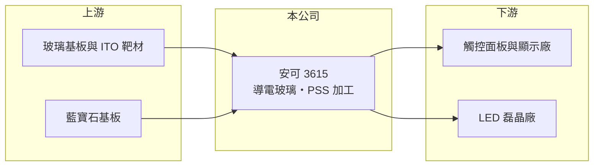

# 3615 安可

> 上櫃｜[[產業索引-光電業|光電業]]｜上市（櫃）日期 2009/04/15

# 第一章：企業模式與商業藍圖

> [!info] 撰寫說明
> 精簡版，由 Claude 依公開資料整理，架構比照 [[2330台積電]]，資料截至 2026-10-07。來源：nstock.tw 安可公司概況、winvest.tw 營收快訊。公開資料有限，營收比重未查到。#待校對

安可是錸德分割出來的材料加工廠，做導電玻璃與 LED 用藍寶石基板圖案化。

- **核心業務：** 安可光電成立於 2007 年，由 [[2349錸德]]分割而來，主要營業項目為[[ITO導電玻璃]]生產銷售，以及[[PSS]]藍寶石基板圖案化製程。
- **營收結構：** 本次未查到兩大產品的營收比重。
- **營運據點：** 總部與廠區位於新竹縣湖口鄉。
- **長期方向：** 導電玻璃用於觸控與顯示，PSS 用於 LED 磊晶，兩者都需要在成熟市場中尋找利基應用（推估）。

# 第二章：護城河深度與競爭優勢

安可屬於製程代工型的材料加工廠，規模小，護城河有限。

- **競爭優勢：** 具備鍍膜與黃光微影的製程經驗，可依客戶規格客製加工。
- **主要對手：** 導電玻璃方面有中國與日本鍍膜廠，PSS 方面有中國藍寶石基板廠（推估）。
- **觀察重點：** 2026 年營收大幅衰退下，本業何時止跌，以及第二季高 EPS 的來源是否可持續。

# 第三章：財務體質與盈利規模

資料日期：2026-10-07，以下數字是撰寫當時的快照；最新月營收、毛利率、累計 EPS 由自動排程寫在本筆記的屬性欄位（月營收、毛利率、累計EPS 等）。#待校對

安可營收年減幅度大，但第二季 EPS 明顯高於去年全年。

- **營收規模：** 2025 年全年營收 9.28 億元；2026 年 1 至 8 月累計 4.76 億元，8 月 4,306 萬元、年減 46.65%。
- **獲利：** 2026 年第二季 EPS 2.01 元、[[毛利率]] 13.49%；2025 年全年 EPS 0.82 元。第二季在營收衰退下 EPS 偏高，推估含[[業外收益]]，需查財報確認。
- **財務特色：** 資本額約 6.85 億元；2025 年第四季配發現金股利 0.7 元。

# 第四章：總體風險與地緣政治

安可的風險在於產品商品化與營收持續下滑。

- **產業週期：** 觸控與 LED 都是成熟產業，報價長期下滑，需求隨消費性電子景氣波動。
- **營運風險：** 營收規模縮小時固定成本難以攤提，本業獲利容易轉為虧損。
- **其他風險：** 銦等靶材原料價格、中國同業低價競爭與匯率波動。

# 專有名詞解析

## 半導體

- **[[PSS]]**：圖案化藍寶石基板，在藍寶石表面做出微結構，可提高 LED 的出光效率。

## 應用

- **[[ITO導電玻璃]]**：在玻璃表面鍍上透明的氧化銦錫導電膜，用於觸控面板與顯示器的電極。

## 金融

- **[[業外收益]]**：本業以外的收入，例如處分資產、投資收益或匯兌利益，通常較不穩定。

# 核心供應鏈

- 上游：玻璃基板、ITO 靶材、藍寶石基板供應商
- 下游／客戶：觸控面板廠、LED 磊晶廠（如 [[3714富采]]，推估）
- 同業：中國與日本的鍍膜及藍寶石基板加工廠

## 最新新聞
<!-- news:start -->
<!-- news:end -->

## 相關連結
- [公開資訊觀測站](https://mopsov.twse.com.tw/mops/web/t05st03?step=1&firstin=1&co_id=3615)
- [Goodinfo](https://goodinfo.tw/tw/StockDetail.asp?STOCK_ID=3615)
- [Yahoo 股市](https://tw.stock.yahoo.com/quote/3615)
- [鉅亨網新聞](https://www.cnyes.com/twstock/3615/news)
