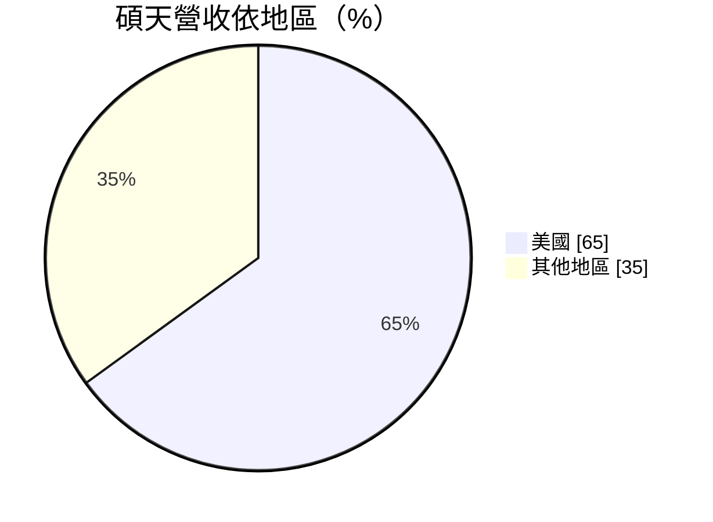
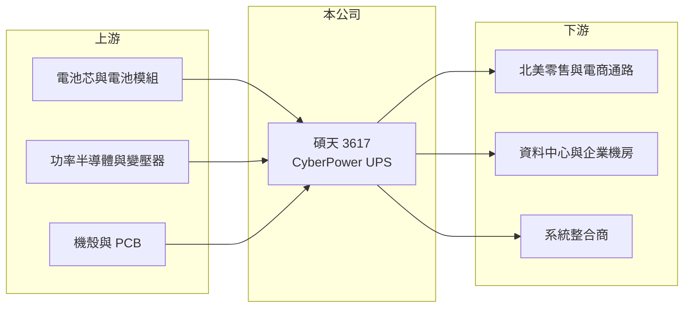

# 3617 碩天

> 上市｜[[產業索引-其他電子業|其他電子業]]｜上市（櫃）日期 2009/12/23

# 第一章：企業模式與商業藍圖

> [!info] 撰寫說明
> 精簡版，由 Claude 依公開資料整理，架構比照 [[2330台積電]]，資料截至 2026-10-07。來源：工商時報（2026 年 1 月碩天營運報導）、nstock.tw 碩天公司概況、winvest.tw 營收快訊。#待校對

碩天是以自有品牌 CyberPower 銷售不斷電系統的電源設備廠，美國是最大市場。

- **核心業務：** 碩天科技設計製造[[UPS]]不斷電系統，產品從家用、辦公室延伸到資料中心機房，並自製電池櫃等關鍵零組件。
- **營收結構：** 依工商時報報導，美國市場占營收約 65%，資料中心 UPS 占營收約 33%。

- **營運據點：** 採[[台灣加一]]布局，菲律賓廠 2025 年承擔約 55% 至 60% 的出貨，因應美國關稅持續擴充當地產能。
- **長期方向：** 擴大資料中心 UPS 與通路布局，2026 年菲律賓廠資本支出約 1,700 萬至 1,800 萬美元，新產能預計 2026 年下半年開出。

# 第二章：護城河深度與競爭優勢

碩天的護城河來自北美零售與通路品牌，以及高自製率帶來的成本控制。

- **競爭優勢：** CyberPower 在北美零售與電商通路有品牌知名度；電池櫃等零件自製率高，資料中心 UPS 毛利率報導約 54%。
- **主要對手：** 施耐德（APC）、Eaton、Vertiv 等國際電源大廠，台灣的 [[6409旭隼]]、[[2308台達電]]、[[3628盈正]]。
- **觀察重點：** 資料中心 UPS 比重能否持續提高，以及菲律賓新產能能否抵銷美國關稅對成本的影響。

# 第三章：財務體質與盈利規模

資料日期：2026-10-07，以下數字是撰寫當時的快照；最新月營收、毛利率、累計 EPS 由自動排程寫在本筆記的屬性欄位（月營收、毛利率、累計EPS 等）。#待校對

碩天年營收約 119 億元，2026 年月營收維持雙位數年增。

- **營收規模：** 2025 年全年營收 118.76 億元、年減 4.94%；2026 年 8 月營收 12.55 億元、年增 13.31%，6 月 12.32 億元、年增 25.6%。
- **獲利：** 2025 年全年 EPS 14.47 元；2026 年第二季 EPS 6.99 元、淨利率 20.15%。nstock 顯示第二季[[毛利率]] 62.89%，明顯高於報導的資料中心 UPS 毛利率，口徑待確認。
- **財務特色：** 2025 年度現金股利 9.94 元，近五年平均現金股利 7.77 元，配息率高。

# 第四章：總體風險與地緣政治

碩天的風險集中在美國市場、關稅與匯率。

- **產業週期：** 家用與辦公室 UPS 隨消費性電子與企業 IT 支出起伏，資料中心 UPS 則跟著雲端與 AI 機房投資週期。
- **營運風險：** 營收高度依賴美國，通路庫存調整或零售需求轉弱會直接影響出貨；菲律賓擴產涉及管理與良率風險。
- **其他風險：** 美國關稅政策變動、新台幣升值（2025 年獲利下滑與匯率有關）、鉛酸與鋰電池原料價格。

# 專有名詞解析

## 金融

- **[[毛利率]]**：毛利除以營收，代表產品扣除直接成本後的獲利空間。

## 產業

- **[[UPS]]**：不斷電系統，市電中斷時以電池即時供電，保護電腦、伺服器與機房設備不因斷電受損。
- **[[台灣加一]]**：台灣廠商在台灣以外另設生產據點，以分散地緣政治與關稅風險的布局方式。

# 核心供應鏈

- 上游：電池、功率半導體、變壓器、機殼與 PCB 供應商
- 下游／客戶：北美零售與電商通路、資料中心與企業機房、系統整合商
- 同業：[[6409旭隼]]、[[2308台達電]]、[[3628盈正]]、施耐德（APC）、Eaton、Vertiv

## 最新新聞
<!-- news:start -->
<!-- news:end -->

## 相關連結
- [公開資訊觀測站](https://mopsov.twse.com.tw/mops/web/t05st03?step=1&firstin=1&co_id=3617)
- [Goodinfo](https://goodinfo.tw/tw/StockDetail.asp?STOCK_ID=3617)
- [Yahoo 股市](https://tw.stock.yahoo.com/quote/3617)
- [鉅亨網新聞](https://www.cnyes.com/twstock/3617/news)
